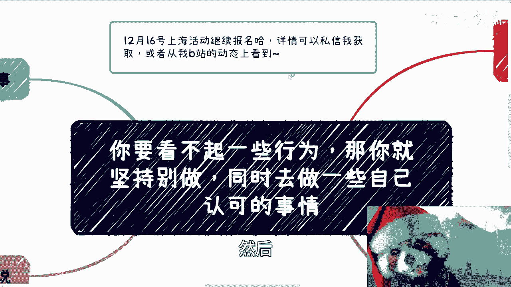
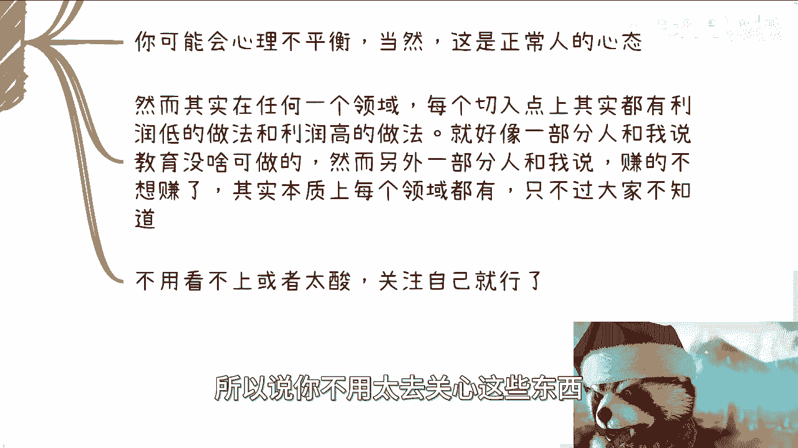
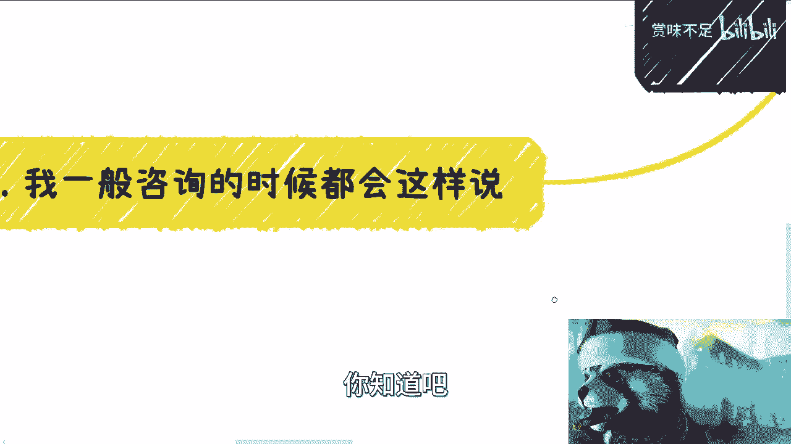
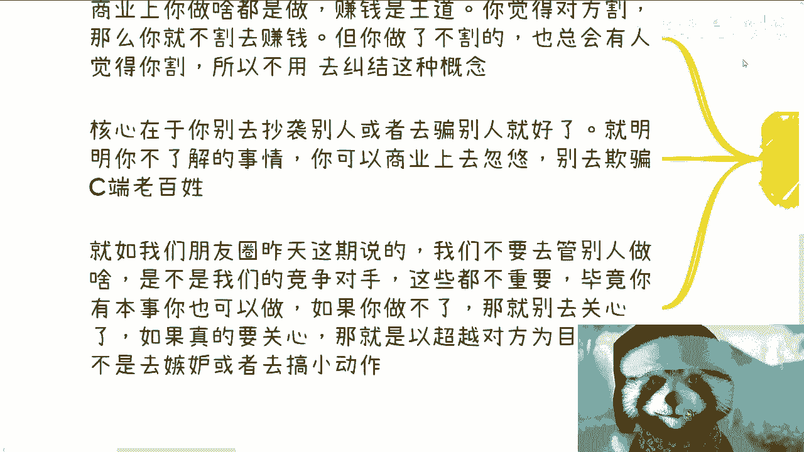
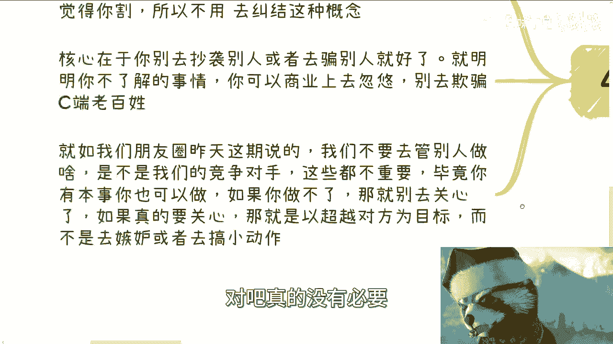
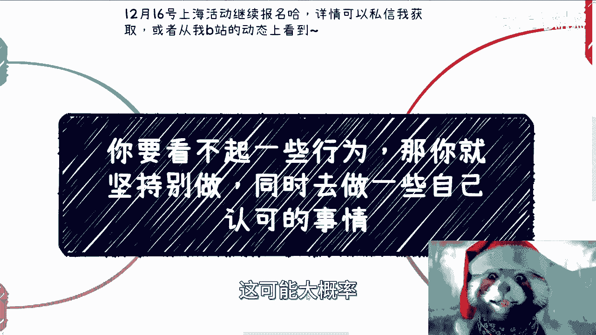
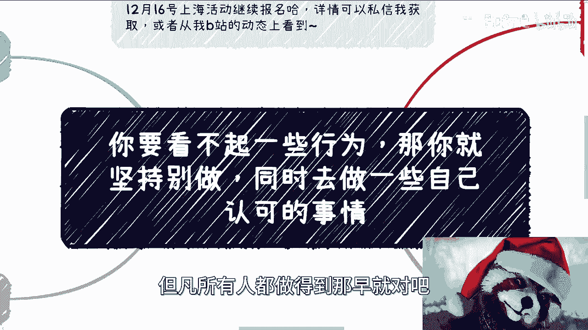

# 要是我们看不上一些行为，那就坚持别做，同时做对自己有成长的事 - P1 - 赏味不足 - BV1t64y1j7Cy

嗯好大家好啊，我后来看了一下，好像抖音上那个账号也没有消掉，他只是搜不到啊，但问题不大啊。

呃呃12月16号那个上海活动继续报名啊，详情可以私信我获取，或者说从B站的那个动态上看到啊，然后呃我们今天礼拜一啊。

我们来看一个点，因为今天有一个小伙伴跟我提到了一个事，就是他觉得有些东西呢他其实看不上呃，我觉得是这样子的，你要但凡看不上他。

你就我个人觉得大家可以参考，就我觉得你要看不上呢，我觉得你要么就坚持别做啊，同时呢你再去做一些你认可的，然后或者说是比他还高label的对吧，就high level1些的事情，呃。

我先讲个故事啊，嗯我们以前的合作方有个小伙伴，大家一起做事情，然后呢其中就有一个A啊，他特别特别特别看不惯别人做这个商业化，认为呢所有的商业化都是割韭菜，那当然这个人也比较极端啊。

他会觉得所有只要赚钱的都是割韭菜，那这个时候呢就我们团队有个B啊，这个B呢商业化其实做的不错啊，然后呢A呢就对他很有意见啊，倒不是说A跟B矛盾很大，而是说A对他很有意见，A呢还会不停的通过。

就是说啊跟别人打小报告啊，PUA别人，然后说这个BB的商业化啊，这个商业就是就或者说他的商业思维不好啊。

然后B不是个好人啊，那么过了没多久呢，B就离开了啊，紧接着呢A就开始做商业化哈哈，而且呢呃变更变本加厉，就本质上呢就是说A的整个逻辑跟B呢，其实是一样的啊，那么回过头去看了。

其实因为B妨碍了A去自己去做，所以A呢一直在DISS比。

那么这类事情呢，我觉得是本质上其实他也不少见。

哎呀这怎么说呢，人类嘛这个我真的觉得很多时候就毁灭吧，啊就是我觉得嘛咱们呢就要要真的有点骨气呢。

你要说看不上来就别做，你就像那个A对吧，我是觉得你要但凡觉得商业化，只要赚钱都是割韭菜，那你有本事别赚对吧，好那么嗯然后呢，我觉得这些事情呢。

本质上跟商业化也可能没什么太大关系，这个是一个做人的一种标准。

或者说是自己的一种三观，你要觉得一些事情你看不惯，那你就坚持别做对吧。

你就贯彻下去，因为毕竟你都看不惯了，你都看不起了，那你去做它干嘛呢。

对不对啊，那就你就比如说有很多人买我最早的时候，那个书对吧，就比如说我10年前我在书上面写的就一样，我就觉得上班上班无解，当然我说我自己啊，我没说大家啊，我就说我上班无解。

同时呢我也觉得我自己卷不过人家对吧，然而我现在也是这个理念，那十多年后我还是这个理念，对不对，而且更是这个理念啊，比如说我毕业的时候，就会觉得很多教授就是假大空对吧，来骗钱的，我现在更是如此对吧。

包括就是我之前跟大家说的，就是很多年前，比如十几年前对吧，有很多前辈对吧，四五十岁的就会跟我说，哎呀你棱角太分明对吧，等你以后年纪大了，你就你就这个要被磨平了对吧，你会变得圆圆滑对吧。

那虽然我现在年纪也不是很大，但是他妈的也不可能啊，磨平我那是不可能的对吧，为什么呢，我就不愿意啊是吧，就那句话怎么说来着的，就是说很多时候我跟你讲，很多人他不是不想做，它是酸，他是做不了。

所以他DISS你知道吗，所以我希望就是说大家不要去太关注别人，就跟我们昨天说朋友圈是一样的，你没必要去关注别人。

关注别人干嘛呢对吧，或者说你要真的看不起对吧好，那你觉得他做的不好对吧，没问题，那你就你可以跟他做一样的事情啊，你超越他，你做做好呗对吧，你你说个榜样出来良性竞争嘛对吧，但是我觉得我跟你讲，现在不是的。

现在很多老百姓他是什么，他是就是说呃这个叫什么，他他DISS你啊，说看不起你做这个东西，但但然而他也很想做，然后呢他还想造成一些舆论啊，看似呢一时很爽，但是其实本质上没有什么意义，为什么。

因为你对自己没有帮助吧对吧。

而且我跟你们讲，你们未来如果碰到这种人呢，最好的方式也不要去理睬它，为什么，因为你单凡理睬他了，对你也是一种内耗，也是一种消耗，没有任何意义的啊。

这就是我之前说的，就是说我们尽量要远离那种低级战，低级斗争。

低级战争没有用的啊，那么我觉得另外一方面呢。

就是说我们要去寻找更高端的一些方法，你比如说啊你说我们觉得这个事情很low啊，我们迪斯塔我们发表自己的观点，我觉得这没有问题啊，就是你发表观点是每个人的自由对吧，这没有问题，你可以说他做的不好对吧。

但是问题是你要么去改变他，你要么就去超越他对吧，如果你单纯的就是说他做的不好，那他妈放屁有什么区别呢，对不对，那没有意义啊，这就这就像一句废话是一样的对吧，而且很多时候你会发现这个情况。

就是你可能做的很正规啊，你可能做的很好，但你赚的不多，然后呢你看到别人做一个业务啊，然后做的可能很割韭菜啊，然后赚的也很多啊，那么大概率你可能会心里不平衡，当然我觉得这也正常，为什么。

因为这是一个正常的，这就是人类的心理嘛对吧，但是我跟你讲，你得明白一个道理，就是在任何一个领域，任何一个切入点上面，它其实都有利润低和利润高的，它不同的切入点，只不过就是说。

只不过就是说你可能现在没有知道，还有这种切入点，这就好像你知道吗，这就好像很多人会跟我说，哎呀我觉得我以前做教育的对吧，我觉得现在已经没法可做了，他可能是被这个这个双减对吧，或者别的东西所束缚的。

或者跟着各种政策，然而你知道吗，还有一部分人也是的，他也做教育，然后就跟我说，赚到不想赚，为什么，因为你要明白，无论是K12教育还是说是成人教育，还是还是比如说呃那种学历的教育啊。

还是说是就是说学历在跟那种像像落户口的，居住证积分啊这种东西挂钩的，你很多东西它都是正反面的，就是你有正面的那种做法，也有反面的那种那种做法，只不过大家不知道啊，那么本质上是什么呢，就是你不用去管。

看得上，看不上你也不用去管他哦，好像是我做的这个业务领域不行，还有他做的这个业务的领域在风口没有的，我们以前就说过，曾以前啊是30年河西，30年河东现在都不用30年，现在可能三个月就合计三个月就合同了。

所以说你不用太去关心这些东西。

你就关心自己就好了，你知道吧，然后呢。

比如说我们在很多咨询的时候，我一般会这么讲，就是商业啥，你做啥就是啥哦，就是赚钱是王道，你要觉得对方割，那么你就不割去赚钱，或者说你要觉得对方跪着赚钱，那你就站着去赚钱对吧，但是但凡如果你站不住。

那你只能跪着，那怎么办呢，对不对，而且更何况啊，更何况我们就这么说，你今天就算站着赚钱，也有很多人觉得你在跪着，因为这种东西每个人定义不一样，你怎么去说呢对吧，所以说你不用去纠结这种概念。

就有很多人就一直在那纠结，说我要站着，我要跪着，有意义吗，有意义吗对吧，没有意义呀。

然后呢我觉得做事情呢，核心在于就是说你别去完全抄别人，或者说你别去骗老百姓就好了啊，就是说就是说你明明有很多不了解事情，你可以在商业上去忽悠，当然当然你最重要帮助别人落地的啊，当然了，我也觉得在商业上。

你但凡不能帮别人落地，人家也会把你打入黑名单的，这些问题不大啊，但是呢你别去欺骗C端老百姓，因为我觉得你唯一不能去割的，就是这段老百姓啊，就如我们昨天朋友圈说的，这一期就是我们别管别人做啥。

他是不是我们的竞争对手，这些都不重要，毕竟对吧，就是他是也好，不是也好，你有本事你也可以做，如果你做不了，你就别去关心对吧，如果你真的关心啊，或者说你如果你做不了，你就别去在意，如果你真的在意。

那么你就以超越对方为目标对吧，而不是说去嫉妒或者搞一些小动作，或者搞那些有的没的，我觉得没有必要，对吧。

真的没有必要嗯。

所以说我们回到这个上面，其实就像我们我一开始说的，就是说这个东西啊，不是商业上，你在学校里面，同学之间，你在那个公司里面，同事之间其实都是这样子的，就是有很多人因为我们说啊公司也好，学校也好。

他就是个小社会，他就是一个就是缩小版的一个缩，影版的这么一个社会，你里面会看到有很多人，就是就是就大家不是说是为了好好工作的，大家就为了就是为了你争我斗，就是为了把你把你，比如说呃就是看你不爽对吧。

看你不顺眼就把你搞走或者怎么样子，有很多地方会这样子的啊，所以说呢就是你想啊，就像我们一直说的，就是但凡如果我们自己控制不了的事情，你说别人针对你控制的控制不了对吧，你可以有你的就是呃这个反抗。

但是你能控制得了他的双手，撑着他的手脚，他的嘴吗，他控制不了对吧，所以说你唯一能做的是什么，就是你要focus就是集中在你自己，你要做什么，你的目标是什么，你怎么提升你自己，你怎么更多的了解对吧。

或者来说更多的去融入到赚钱的商业当中去，或者融入到整个公司的发展当中去，这个是你要去了，你要去坚持要做的，因为在我们一路上面的这个人生当中，你碰到的事情多了，能分散，你经历的事情也多了对吧。

我们我个人觉得啊，你只要是个人，你总归会嫉妒，总归会厌恶啊，总归会怎么样的，但是就是这个情绪有就可以了，哪怕就是就是比如说花半个小时，一个小时自己消化掉，那就行了啊，不要让他去就是内耗，你。

同时也不要让他，就是造成你再去攻击别人的一种手段，这实在是没有任何的必要，好吧哎呀。

当然了，我也知道，这可能大概率也不是所有人都做得到的。

但凡所有人都做得到，那早就对吧。

太平盛世是吧啊，哎就这么着吧，我反正是希望呢就是说大家都能够有一个呃，就是就是你们就算不知道自己现在能做什么，但是通过慢慢摸索能找到自己的那个定位，然后呢就关注于比如说每个月每一天，每个季度对吧。

自己到底做什么，我应该怎么学习，我应该怎么进步，这些是你们要关心的，别的不用太去关心他，真的不用太去关心他，就是因为最近其实也有很多小伙伴做活动吗，他会关心爱这个人，做了什么，那个人做了什么。

不用太去关心你，就关心你自己，你知道吗，真的修炼好，修炼好好吧，行啊，就这么着啊啊对，然后那个反正你们有什么，就是这个呃商业上对吧，或者说职业规划啊，或者说呃这个就很多，还有很多一些海外的小伙伴啊。

他觉得比如说要要想了解国内的情况啊，包括接下来这个就手上的牌怎么打啊，你们可以整理好好吧。

