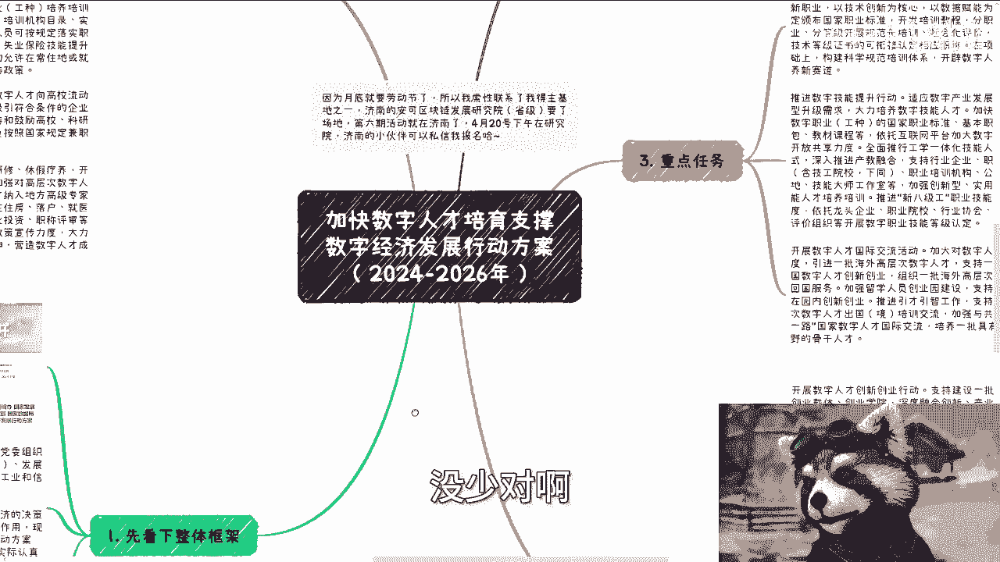

# 解析《加快数字人才培育支撑数字经济发展行动方案（2024-2026年）》 - P1 - 赏味不足 - BV1gw4m1275t

呃，前两天出了这么一个文件，好像就昨天出的吧。呃，说是九部委啊，九部委出的那个什么加快数字人才培养支撑数字经济发展行动方案啊，你们可以去看一下啊。嗯，我在这个地方给你们全部罗列一下啊。

首先看一下整体框架啊，你们可以看到是4月2号啊，前几天果然是前几天4月2号发的啊，就是人力人社部啊，然后中共中央组织部、网信办啊，发展发改委、教育部、科技部、工信部、财政部、数据局啊所联合发的。

你看啊各省自治区、直辖市及新疆生产建设兵团党委组织部、网新办、政府人力资源社会保障部啊，发展发改委。😊。

呃，发就发改委啊，我就直接简称了啊教育厅啊，科技厅、工信部啊，财政厅数据局为贯彻落实巴拉巴拉巴巴拉啊，现在将加快数字人才培育数字经济行动方案。2024年到2026年印发给你们啊，请结合实际认真贯彻落实。

这个后面呢我会一边讲一边跟你们说一下，就就是它的这个意思啊。😊，呃，第二啊总体要求总体要求我就不说了，但总体要求呢，我觉得是这样子的。呃，你们看啊这个东西啊叫做以啊习近平新时代中国特色一大堆，对吧？

然后就是说啊用3年左右的时间扎实开展数字人才呃运营流用等专项行动，一大堆，对吧？这个东西适合放在哪里啊，这个是东西就适合放在你们跟协会啊跟产业园跟生态园跟政府跟企业去聊的时候的解决方案的第一个啊。

一定要记住，你放在第一个首要位置，为什么？因为这个是中央思想，你放在那边意味着这个高度是拔高的啊，你放在不放在那边，你就是傻逼。😊，记住啊，这是第一点。😊，嗯，哎，对对，第一点啊。第二点重点任务啊。

你看啊实施数字技术工程师培育项目啊，重点围绕大数据啊，人工智能、智能制造、集成电路按数据安全等数字领域新职业，以技术创新为核心，以数据赋能为关键制定颁布国家职业标准啊。

这个东西就是我说的那个人社部的那个国家职业技能等级啊，开发培训教程分职业分专业分等级开展规范化培训。对吧？那就意味着什么呢？意味着就是说又要有新的职业技能等级出来了啊，这是第一个。第二个。

推进数字技能提升行动啊，适应。😊。

数字产业发展跟企业转型升级。那你看到吗？啊，数字产业发展企业转型升级。那我们说的数字化改造，对吧？大力培养数字技能人才，加快开发一批数字职业工种国家职业标准，看到吧？国家职业标准啊。

基本职业培训教材课程等等等。😊，啊，那么。你看到没有？推进叫新八级工啊，新八级工职业技能等级制度啊，依托龙头企业、职业院校、行业协会看到吧？企业、院校啊协会啊社会培训组织等开展技能等级培训啊。

那么第三个叫做开展。😊，数字人才国际交流活动啊，加大力度对数字人才倾斜力度啊，进引进一批海外高层次数字人才。那你看啊那这个地方就相当于就是说呃这个海外啊，包括国内外的这个交流啊。

包括加强共建一带一路等等等等等。那么这个东西呢就是说呃它落地的时候，肯定是比如说以这种会议啊，以这种交流会啊，以这种人才引进的方式，对吧？那么这这背后也都是钱啊，都是钱。😊。

那么第四啊，我们来看啊，开展数字人才创新创业行动，对吧？那这个地方就说到创业了啊，重点支持数字经济硬科技跟未来产业发展加快对吧？支持北京上海粤港澳大湾区等科技中心对，你看啊这个地方开始了啊。

建设数字人才孵化器产业园啊，人力资源服务器啊，服务员培育发展一批，那么这些东西呢也就是说各地方接下来肯定都会做。那么到底谁来做谁来这个执行，到底谁来对接，现在肯定还不知道那对于你们也好，对于我也好。

对于所有人也好，这都是个机会对吧？各行各业各个城市都有机会啊，那么开展开展数字人才赋农赋能产业，这个东西也是我一直说的赋能产业啊紧贴企业发展需求，开设订单定制定向的培训班啊，培养一批既懂产业技术。

又懂数字经济复合型人才，对吧？那这个东西就是我们说的比如说这个培训咨询啊这一块东西你看。😊，啊对吧啊那么举办数字职业技能竞赛那这个东西就是我刚你们竞赛，哎就就都收到了。对，我跟你们讲都一模一样的。

你看到吧？看到没有？就我之前充电视频里面该跟你们讲的都讲了，对吧？就就这些东西啊，这我详细不读了，你们自己看啊。😊，呃，然后第五点啊，政策保障政策保障嘛很简单吧，对吧？啊，优化培养政策啊。

健全评价体系啊，完善分配制度啊，提高投入水平，对吧？然后畅通流动渠道啊，强化激励引导，对吧？这些这些都是空话，咱就不去管它了啊，所以说啊。😊。

哎，不对呀，我好像少了一块啊。😡，啊，没啥没事没事没啥。对啊，所以说啊就是你们看到没有？就是就是这个文件是4月2号发的啊，你们再把我之前充电视频里面所提到的东西，你们你们回头仔细再看一眼。😊。

啊，就你们要明白为什么我跟你们讲这些，是因为国家每次的相关的文件出来，它没什么花头，它就这点花头没有了，你懂吗？就是要么就是融资，要么就是人才培养，要么就是成员建设，要么就是咨询培训，它就这点花头。

它没有啦。你们明白吗？啊，所以说。就是这么一些东西，你说还有什么吗？没了呀，但是你这些东西往下它每一个东西里面，每一个细分里面里每一个细分领域里面能做东西很多很多啦。你说产业园我操。

每中国各个城市能做多少产业园，对吧？你说人才培养，中国各个地区各个省市区各个政府，各个企业能做多少人才培养，能做能能能做多少人才引进啊，这他妈不都是钱嘛，对不对？冲啊，同学们。😊，好吧。

行，那这个你们我就不详细给你们读了啊，就是说你们有兴趣呢可以去看一下，现在就是这么一个宏观的东西。24年到26年好吧，然后呢，具体里面的有些哪些东西，我之前充电视频都给你们分析过了，我就不重复再分析了。

😊，好吧。啊。行，那就这么着吧啊，然后有职业规划呃，商业规划啊，然后有这个股份啊、股权啊，对吧？包括其他的各个方各个东西，你们想要了解的啊，或者说你们觉得手上有哪些牌需要我的这个视角。

我的这个切入点来给你们就做一些规划的。好吧，你们再整理好，我们再走咨询。😊。