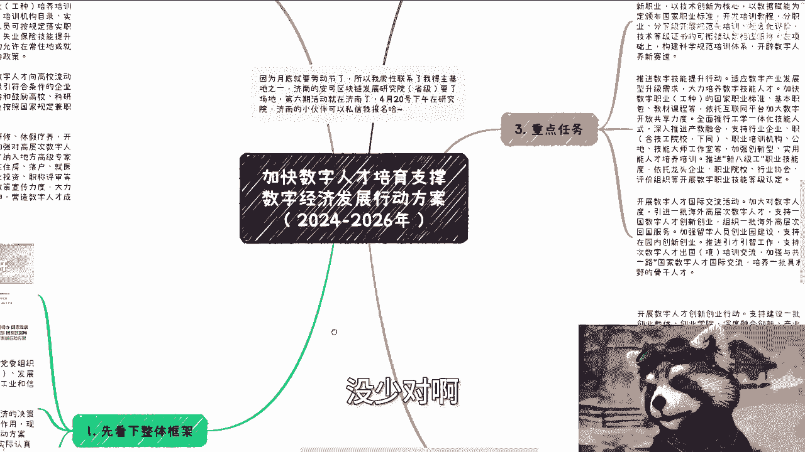
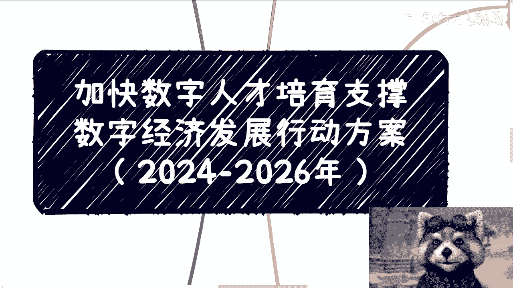

# 课程一：解析《加快数字人才培育支撑数字经济发展行动方案（2024-2026年）》📚

在本节课中，我们将一起学习并解析由九部委联合发布的《加快数字人才培育支撑数字经济发展行动方案（2024-2026年）》。我们将梳理文件的核心框架、重点任务及其背后的商业机会，帮助初学者理解国家政策导向，并思考如何将其转化为实际机遇。

## 文件发布背景与概述

该文件于2024年4月2日发布。发布单位包括人力资源和社会保障部、中共中央组织部、中央网信办、国家发展改革委、教育部、科技部、工业和信息化部、财政部、国家数据局。

文件旨在指导各省、自治区、直辖市及新疆生产建设兵团的相关部门，结合实际贯彻落实数字人才培育工作，以支撑数字经济发展。

## 总体要求：拔高思想站位

上一节我们了解了文件的发布背景，本节中我们来看看文件的总体要求部分。

总体要求部分阐述了以新时代思想为指导，计划用3年左右时间开展数字人才相关专项行动。

**核心要点**：这部分内容适合作为与协会、产业园、政府或企业洽谈合作时的解决方案开篇。将其置于首要位置，意味着方案的思想高度与国家战略保持一致，至关重要。

## 重点任务解析

理解了总体要求后，接下来我们深入分析文件提出的五项重点任务。以下是具体内容：

### 1. 实施数字技术工程师培育项目
该项目将围绕大数据、人工智能、智能制造、集成电路、数据安全等数字领域新职业展开。核心是以技术创新和数据赋能，制定并颁布国家职业标准，开发培训教程，并分职业、专业、等级开展规范化培训。

**关键信号**：这意味着将有一批新的**国家职业技能等级**认证出现。

### 2. 推进数字技能提升行动
此行动旨在适应数字产业发展和企业数字化转型需求。重点在于大力培养数字技能人才，并加快开发一批数字职业（工种）的国家职业标准、基本职业培训教材与课程。

**关键机制**：推进“新八级工”职业技能等级制度，并依托**龙头企业、职业院校、行业协会**及社会培训组织开展技能等级认定与培训。

### 3. 开展数字人才国际交流活动
此任务强调加大对数字人才的国际引进与交流力度，计划引进一批海外高层次数字人才，并加强在“一带一路”等框架下的合作。

**落地形式**：预计将通过国际会议、人才交流论坛、专项引进计划等方式实现，背后蕴含着相应的资源与资金支持。

### 4. 开展数字人才创新创业行动
行动重点支持数字经济领域的硬科技与未来产业发展。特别指出将支持北京、上海、粤港澳大湾区等科技创新中心，建设数字人才孵化器、产业园和人力资源服务基地。

**机会解读**：这对于各地政府、企业及服务机构而言是一个明确的信号和机会，相关园区和载体的建设将会在各地展开。

### 5. 开展数字人才赋能产业行动
此行动紧贴企业发展实际需求，旨在开设订单式、定制定向培训班，培养一批既懂产业技术又懂数字经济的复合型人才。

**商业关联**：这与为企业提供**数字化转型咨询与培训**服务直接相关。

### 附加任务：举办数字职业技能竞赛
文件还提及举办数字职业技能竞赛。这与之前提到的通过竞赛选拔和认证人才的路径一致。

## 政策保障与总结

上一节我们详细拆解了各项重点任务，本节我们简要浏览政策保障部分并做课程总结。

政策保障部分包括优化培养政策、健全评价体系、完善分配制度、提高投入水平、畅通流动渠道、强化激励引导等内容。这些条款为前述任务的落实提供了制度层面的支持。

**本节课中我们一起学习了**《加快数字人才培育支撑数字经济发展行动方案（2024-2026年）》的核心内容。总结来说，国家政策围绕数字人才的核心抓手可以归纳为：**融资支持、人才培养、园区建设、咨询培训**。虽然方向明确，但每一个细分领域（如各地产业园建设、各类人才培养项目）都蕴藏着巨大的市场机会。理解文件框架，有助于我们找准自身定位，在数字经济浪潮中发现并把握机遇。