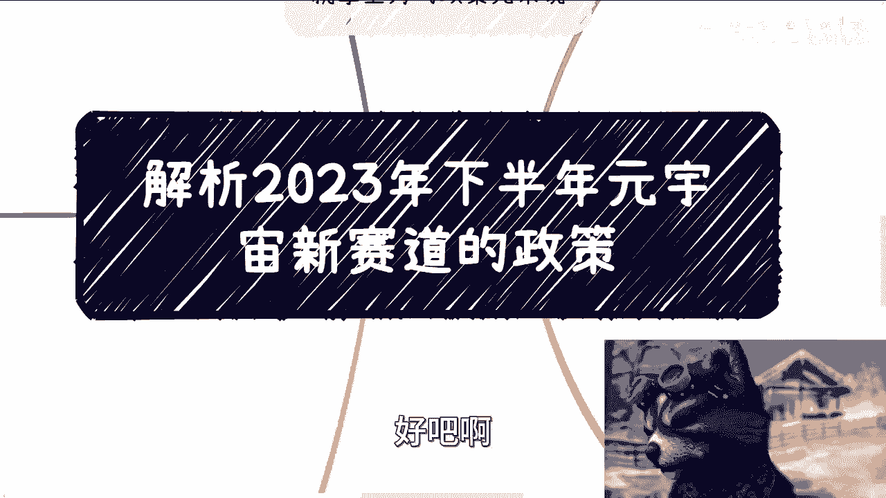

# 解析2022-2025培育-元宇宙-新赛道行动方案---P1---赏味不足---BV1Xu4y1a7

在本节课中，我们将一起学习如何解读一份重要的政府规划文件——《2022-2025培育“元宇宙”新赛道行动方案》。我们将拆解其核心原则、主要任务和培育目标，帮助你理解政策背后的真实意图和商业机会，避免陷入常见的理解误区。

## 概述：政策解读的核心思路

解读此类政策文件，关键在于抓住其战略方向，而非纠结于字面细节。政策旨在指明宏观路径，具体的“战术”和解决方案需要执行者自行思考和设计。我们的目标是理解方向，找到抓手，从而对接资源、满足相关方的关键绩效指标。

## 第一节：基本原则——把握虚实与安全 🔐

上一节我们概述了整体思路，本节中我们来看看文件开篇强调的“基本原则”。这部分内容看似官话，但提炼后核心只有两点。

1.  **虚实结合，赋能实体**：政策的核心是 **“从虚向实”** 。纯粹的虚拟概念不被鼓励，必须与实体经济结合，解决实际问题。“如何赋能”需要项目方自己构思并自圆其说。
2.  **稳定安全，防范风险**：所有发展必须建立在安全可控的基础上，注重风险防范与包容审慎监管。

**简单总结**：文件的基本原则明确要求项目必须**虚实结合**并确保**安全稳定**，其余表述均为支撑这两个核心点的展开。

## 第二节：主要任务——构建基础与明确方向 🛠️

理解了基本原则后，我们进入更具体的“主要任务”部分。这部分揭示了政府对“元宇宙”的广义定义，它不局限于狭义的虚拟空间，而是一个更宏大的数字生态系统。

以下是主要任务涵盖的四个基础方向：

*   **前沿科技突破**：关注空间计算、脑机接口等底层技术。这表明元宇宙需要坚实的技术研发支撑。
*   **基础设施建设**：发展5G/6G、卫星互联网等网络能力。这揭示了无论概念如何变化，升级数字基础设施本身即是重要目标。
*   **交互终端与数字工具**：培育VR/AR等终端，开发云端实时渲染等软件工具。这指明了硬件和软件生态的发展机会。
*   **业态升级（核心场景）**：这是最具指导性的部分，指出了重点赋能领域：
    *   **数字会展/展厅**：打造云上会展、沉浸式展示服务。
    *   **虚拟课堂/教育**：开发互动化、沉浸式的教育内容与平台。
    *   **智慧文旅**：运用数字人讲解、AR等技术升级博物馆、旅游体验。
    *   **云游戏/新娱乐**：发展云游戏，但强调需与产业结合，而非孤立发展。
    *   **工业与医疗赋能**：
        *   **工业**：打造**数字孪生工厂**，创建高精度可交互的虚拟映射空间，用于仿真、优化和创新。
        *   **医疗**：探索基于扩展现实（XR）的数字疗法、沉浸式远程康复等应用。

**过渡小结**：可见，政府的“元宇宙”布局是立体而务实的，强调 **“基础建设+场景赋能”** 。接下来，我们看看政策希望培育出怎样的产业环境。

## 第三节：培育目标——聚焦核心要素与经济形态 💰

在明确了任务方向后，我们最后来分析政策希望达成的“培育目标”。这部分关注的是支撑整个生态健康发展的关键要素。

1.  **发展创作者经济**：加强IP培育与保护，鼓励数字创意、数字品牌发展。这体现了对数字经济核心动力的重视。
2.  **促进数据流通**：培育数据商，壮大数据产业。这呼应了“数据成为关键生产要素”的国家战略，**数据**是未来商业的核心。
3.  **构建标准化体系**：完善包括接口、平台在内的各类标准（如团体标准、行业标准）。标准化是产业规模化发展的前提。

## 总结与行动指南 🎯

本节课中，我们一起学习了如何解读《2022-2025培育“元宇宙”新赛道行动方案》。我们来总结一下关键要点和行动思路：

1.  **政策核心**：抓住 **“虚实结合”** 与 **“安全”** 两个基本原则。
2.  **方向理解**：元宇宙是广义的**数字生态**，重在 **“打基础”（技术、网络、终端）** 和 **“找场景”（赋能工业、医疗、文旅、教育等）**。
3.  **机会识别**：关注**数字孪生、数据流通、标准化建设、特定场景的数字化解决方案**等领域。
4.  **正确心态**：政策提供的是**战略方向**，而非具体答案。切忌道听途说或抠字眼。应基于方向，设计能自圆其说、解决实际问题的“战术”方案，从而获取项目与资源。

记住，无论概念热度如何变化，紧跟“赋能实体”和“发展数字基础设施”的主线，就能找到可持续的发力点。

---

（后续将持续分析更多相关政策，敬请关注。）

