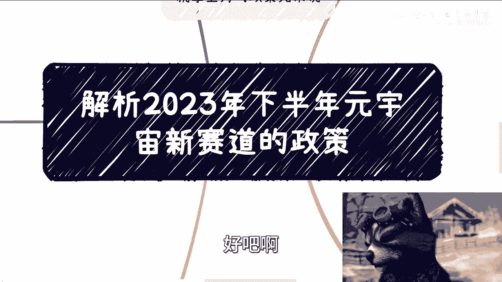

# 解析2022-2025培育“元宇宙”新赛道行动方案 - P1 - 赏味不足 - BV1Xu4y1a7BJ

好啊，那个昨天直播当中我们也说了，上海这边出了个新的城市规划对吧，那我们就根据这个城市规划来说说看啊，我不知道能不能发啊，试试看啊对吧，新的这个呃赛道政策啊，首先第一啊我们来看啊基本原则。

那就我们看这个东西，我们能在里面看出很多道道来，你知道吗，我们先看第一个啊，叫做基本原则，你看啊，基本原则里面说了什么叫做尊重规律啊，分步推进啊，把握元宇宙，叭叭叭叭叭叭叭一大堆，对吧好，你看啊。

这个重点是什么，重点我跟你们讲啊，重点是虚实啊，别的不重要，是虚实，什么意思，就是你不能虚，就是你要做，你不能纯虚，你必须赋能实体啊，当然怎么赋能就有很多人说了，哎老师怎么赋能对吧，怎么赋能。

这他妈是看你们去想的，你们我昨天直播就说的很清楚了，政府不可能给你们讲的很清楚的，这个东西重点什么就是虚实啊，虚实这里面的实是重点，虚不是重点啊，那么当然前沿科技突破啊，领域布局啊。

推动这个什么什么什么，这他妈都是官话啊，没什么好说的，集成创新联动发展啊，把握元宇宙那个全智赋能跨界融合好，你看啊你看啊，发挥什么什么什么带动数字技术，数字产业实现这个什么东西对吧好。

那这个东西核心是什么，核心也是一样的，就是你要集成，你要去创新，那这也没什么好说的啊，然后是什么呢，就是你要明白你做这个东西一定要提升价值，就我们这个地方说啊，就是说你可以将本增效，你也可以提升价值。

但是你一定要有个道道，你懂吗，就是说这个东西你得自圆其说，你说我为什么要做这个东西啊，那么好，我们往下讲啊，市场主导，政府引导，那个别说了对吧，这个东西就是结果导向啊，你不能自己YY出来一个东西啊。

你不能说啊，我今天莫名其妙做一个什么领域的，然后做一个元宇宙，那你要说清楚吧对吧，那当然你们要记住所有的这个过程当中呃，你们不要指望别人来问你，就是你自己的解决方案里面，你就得说清楚。

就是说我这个东西到底是解决了什么需求，到底是由什么市场主导的对吧，怎么样怎么样怎么样啊，那么当然这里面就是说所有的东西，一切都是稳定安全为主对吧，那么这个里面就说要有风险啊，要防范啊，要包容。

要怎么样子啊，好那这个就是最最核心的，就告诉大家呢就两点，第一呢一定要那个虚实结合，从虚向实啊，第二点就是说你要安全哎，就这么简单啊，别的都是屁话，我跟你讲啊，好然后第二个主要任务啊，我们来看啊。

好那从这个上面呢我们就能看得出来，就是说啊，政府的引导元宇宙，跟大家很多人理解它不是一个东西啊，或者说大家理解的东西过于子集，过于表面啊，你比如说第一啊，你看啊啊突破前沿科技啊，聚焦空间，计算全场啊。

全息光全息广场对吧，然后无感提升脑机接口对吧，那当然了，这些东西都是官话啊，都是官话好，但是呢他告诉我们是什么呢，就是说这个元宇宙里面对吧，里面有所谓的关键技术，大家要去突破啊，大家要去往这上面去靠啊。

那么这个元宇宙不不再是大家，所以前所知道的什么啊，纯虚的一些东西对吧好，那第二基础建设，基础建设，你想啊，你要大，你要做元宇宙，这个元宇宙是什么，是一个就不管是一个虚的还是实的，还是个整体的东西。

它需要网络吧，它需要基础建设，它需要基础的生态支持吧，对吧好，那么你看啊，这个地方有来啊，双千兆对吧，培育5G加6G卫星互联网WIFI，7IPV6对吧，反正就是能能放上去，全部放上去对吧。

那简单来讲就是说简单来讲，就是这个东西大家要明白，就是是不是元宇宙不重要啊，重要的是我们要加大基础建设的发展，就你说未来是什么的，不重要啊，你管他未来是什么，你基础建设总要发展吧，对吧好。

然后是交互终端，交互终端也一样的呀，你说就像之前说的人民币，那数字人民币，你得你得你未来说不定也得有ATM机吧，也得有一体机吧对吧，你你也得有交互终端嘛，那你交互终端到底是A2还是VR。

还是一个是一个手机，还是一个什么东西，那不知道啊，那看大家创新啊，对吧啊，然后还有什么数字工具对吧好，那看啊，发展关键基础软件啊，写的很清楚，叫软件啊，面向终端和云边和云边协同，这个叫什么设备啊。

支持开发，具备云端实时渲染，当然当然了，你最终能不能实时渲染，咱不知道啊，但不重要，重要的是我们需要这个工具，你可以往上靠对吧好，那么综合第二点，主要任务呢，我们能够知道就是说啊就是元宇宙的定位啊。

不是说我们就去做一个纯的一个所谓的matter，verse啊，或者MUNIVERSE是吧，不是的啊，而是说更宏观的更广阔的这么一个数字生态，而在这个数字生态里面，比如说啊这个脑机接口软硬件的对吧。

基础建设网络的对吧，交互终端啊，包括数字工具这些是基础对吧，基础中的基础对吧，就是说所有的工具它都得往前发展，而不是说我们今天就是打造一个啊，这个这个这个虚拟的对吧，就像以前大家看到的说啊。

我今天有一个虚拟空间，怎么样子，这个东西呢就是一个子集啊，那么第三也就是我国最最重要，最重视的就是液态升级，那液态升级你看啊，第一个虚实交互啊，虚实交互里面写的很清楚，加快推动数字会展。

鼓励打造云上会厅对吧，数字化展厅啊，无边界沉浸式展示服务，那这个东西就就来了，你到底是AR展示服务还是比R展示服务，还是说是是是是，比如说啊纯PC端的WEWEB的展示服务，OK都没说你都可以做对吧。

你只要能够自圆其说，这个东西如何的数字化，如何的能够多屏互动，如何的在线社区，你只要能够资源细说，你就可以去做对吧，好第二建设虚拟课堂，这个就别说了吧，你整个疫情3年虚拟课堂，这必然是重中之重。

而且本身教育它就是要往就是线上去扩的对吧，包括就是说我们说啊，教育这个东西更多的是什么，是一个人，就比如说线上对吧，你有一套课程，但这个课程它需要更更什么，更互动化，更沉浸式对吧，你不能单看解说啊。

你能不能有一个VR的游戏呢，让我们身临其境呢对吧，就跟cod一样的，对不对啊，这我跟你讲，你哎真的我跟你们讲，你别以为我在开玩笑啊，哎哎这我跟你们讲的都是以前出现过的。

就前两年就是就政府的这个很多项目里面，就是需要我们去做个cod的游戏，真的我不跟你们开玩笑啊，你懂吗，然后虚拟交互文旅，文旅这个东西我在说METAVERSE的时候说了很多遍，就是文旅厅啊。

那你看啊开发呃原铝对吧，就是上海新模式，这个这个这个运用数字人讲解对吧，增强现实等等等等，那那这个里面就提到了对吧，就比如说博物馆的数字化啊，这个解说人的数字化对吧等等等，那这些都可以做啊。

政策都这么写了啊，然后虚实交互新娱乐对吧，发展云游戏，支持运用云渲染啊等等等啊对吧，就是游戏，那那其实游戏本身呢是这样子的，就是这个地方我觉得游戏啊，它更多的还是要赋能产业，不是说你单纯做一个游戏出来。

就比如说你这个游戏对吧，能够加强嗯，打个比方，比如说加强更多的人流量去去去旅游对吧，或者加强大家更多的去采购对吧，去消费，那这个没问题，我跟你讲，政府一定是买单的啊，但你要说游戏，那不好意思。

不是这么个理解方式啊，就我国不是这个立足于游戏这个东西啊，那么赋能啊，赋能呢也是非常重要的，你们来看啊，虚实融合智能制造啊，打造数字孪生工厂，数字孪生呢讲了很多年了，但是到目前为止呢。

就是说也是需要再次大力发展的，包括支持建设高精度可交互的虚拟映射空间，那这个东西有什么用呢，也很简单，因为你的实体工厂啊有很多东西，比如说在创新上面，在在一些尝试上面。

那么我们做这个METAVERSE这个主要核心，包括数字完成，主要核心就是为了在达到一定程度之前，包括我们说的化学医疗，那这个下面写了就是化学医疗对吧，这一部分就是这些也是需要通过这个叫什么，就是说啊。

就是就是就是我们说的这个元宇宙的这个，这个实验对吧，去做创新啊，包括就是说你看啊，推广基于扩展现实的这个心理疾病啊，数字疗法诚信是远程康复对吧，那这些其实就是说那一样的，就是你们要去探究你说哎这个东西。

数字疗法是什么东西对吧，沉浸式远程康复又是个什么东西，那不可本人在去给你往下落了，你懂吗，就是政策，呀呀呀呀呀呀，那对吧，你别指望它再往下一层，往下一层，OK这个就是到了我们说唉。

我们要去跟具体的人再去沟通，对具体的领导再去沟通，而且每个每个省市区，每个地方你真要去做这个东西，他的理解是不一样的啊，好虚拟办公我就不说了啊，虚拟办公呃，怎么说呢，你说他有需求吧，有啊。

但是这个东西不是特别重要啊，好那么我们往下来看啊，你比如说第五个叫培育目标，培育目标，你看啊，第一创造者经济这个东西是重中之重对吧，因为你看后面啊加强AP培育啊，保护啊对吧。

这个呃做优做强啊等等等等等的，那这个没有问题啊，这些都没有问题哦，那么你可以理解为，就是说元宇宙里面这个数字经济创造的经济，一定是重中之重，但是这个东西啊写是这么写的啊。

呃你包括说你那个游戏电竞原创品牌加成，数字品牌，数字创意知识产权保护，那到底怎么保护，怎么加强，怎么样子，我跟你说，现在肯定是八字都没一撇的啊，最多就是说是整个战略方向是这个样子。

你指望说啊知道怎么保护怎么样，或者我们怎么参与，你不知道的对吧，那这是第一点，第二点是你看啊数据流通，这也是为什么就是这个深交所上交所对吧，数交所这边有非常多的这个都在做对应的，不管是培训还是标准制定。

因为数据流通就是接下来非常重要的一环对吧，你看啊壮大一批具有核心技术受伤，我跟你讲，书商这个概念是从前年12月份特别注重的，一直到现在对吧，那树上是什么，数据商业数字商业对吧，还有什么就各种各样的。

但是不管怎么样，数据是核心对吧，因为我之前跟你们说数字那个资产的时候，包括数字经济的时候也说的很清楚，就是就是你别管它叫什么，但它的核心都是数据对吧，那所以说数据是很重要的，那么最后一个就是什么。

就是标准化体系对吧，我跟你说的团标啊，航标啊对吧，因为你看啊团标航标里面就包括了接口平台哦，包括就是说代码的一些标准对吧，完善相关标准，protocol等等等，那都一样的呀，你懂吗。

就是就是今天啊我们打个比方，今天就算不是元宇宙，我跟你们说，就算是别的东西，你只要看的多了，你也会发现就是整个逻辑大差不差的，你懂吗，就是第一个就告诉你们核心的重点是什么对吧，虚实风险啊，把控啊。

好第二个是什么，就是原有元宇宙的基础建设，一定是最最重要的对吧，第三点是什么，一定要业态升级，就是赋能所谓的场景scenario对吧，第四是什么，就是所谓的赋能相关的产业对吧，那比如说智能制造啊。

医疗啊，这两个都是就说这两个是对元宇宙来讲，最最最最直接的两个东西啊，那么第五个就是我们说的周边，周边就是比如说人才培养啊对吧，数据流通啊啊标准制定啊，那当然了，就是说你们也要说对吧。

哎那为什么人才培养没有在里面啊，对吧，怎么样，你要明白啊，就是这个东西是什么，叫做2023~2025的一个，元宇宙的一个规划，在这种3年或者5年或者10年，15年的规划里面，你是不可能给你列的很清楚的。

很细的，更何况啊，我在这里面也没有全部给你们弄出来，我要全部弄出来，这个图不得了了，你懂吗啊，就是说所有东西它都是有扩展性的啊，尤其是非常通用性的东西，它没有没有必要在每一次的这个里面。

都给你全部写一遍，合并呢，对吧，你就像这个产业赋能哦，难道说你除了智能制造，除了智能医疗，生物医疗以外，别的就没有了对吧，原来这就没用了，那也不是啊对吧，他只不过就是说优先级他更看重什么东西。

懂吗啊好那么我们回过头来这里讲啊，就是回到我以前说的这个上面啊，就是说不要去道听途说啊，元宇宙量了或者怎么样子，圆柱梁不凉，跟我们有什么关系呢，没有关系对吧，这是第一点，第二点是看政策呢也是一样的。

不要去细抠啊，就是我我一直还是每一次都提醒你们，就是我们不是应试教育，我们不是说今天政府给个政策，就是给个答案，给个一套所谓的解算术题的solution，不是它只是指明一个战略方向。

而我们要做的就是说在这个战略方向上面，去制定相关的战术，从而去拿到对应的钱，我不管这个钱是政府给还是说你的乙方给，甚至甲方给无所谓，但是你朝着政策方向走，你就有个抓手，你就有一个话。

你就能够满足对方的KPI，你明白吧，否则你说你什么都不知道，你说我的，我一拍脑袋我就开始干了，你干什么玩意儿好吧，如果这个东西我能发出来的话。

嗯我后面多看看吧好吧，多看看有哪些政策，我都帮你分析分析好吧行。

