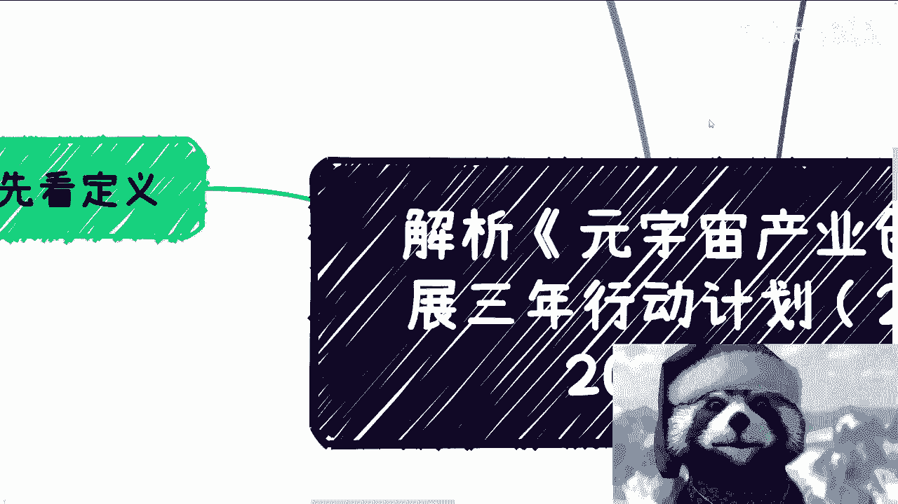
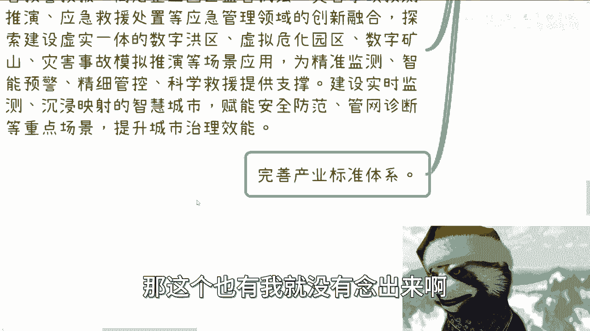

# 元宇宙政策解析课程 - P1：解读《元宇宙产业创新发展三年行动计划（2023-2025年）》 🚀

在本节课中，我们将要学习如何解读一份重要的政府文件——工业和信息化部等五部门于2023年9月8日联合发布的《元宇宙产业创新发展三年行动计划（2023-2025年）》。我们将逐段分析其核心定义、基本原则和重点任务，帮助初学者理解政策导向和其中蕴含的产业机会。

## 一、文件概述与核心定义

上一节我们介绍了课程的目标。本节中，我们来看看这份文件的发布时间、规划周期及其对元宇宙的核心定义。

该文件由科技司发布，规划期为2023年至2025年。这标志着在经历了一段时间的探索后，元宇宙产业的发展进入了有明确指导方针的新阶段。

文件对“元宇宙”给出了明确的定义：**元宇宙是数字与物理世界融通作用下的沉浸式互联空间，是新一代信息技术集成创新和应用的未来产业**。

这个定义强调了几点：
1.  核心是 **数字与物理世界的融合**，而非纯粹的虚拟世界。
2.  定位是 **新一代信息技术的集成应用** 和 **未来产业**。
3.  目标是 **通过虚实互促，引领下一代互联网发展，并加速制造业等实体经济的升级**。

理解这一定义至关重要。它告诉我们，政策关注的元宇宙并非狭义的VR游戏或社交空间，而是一个能够赋能千行百业、促进虚实结合的更广义的产业生态。其最终目的是支撑现代化产业体系和文化强国建设。

## 二、五大基本原则 ⚖️

理解了元宇宙的官方定义后，我们来看看指导其发展的五大基本原则。这些原则是所有相关项目或方案需要遵循的顶层设计。

以下是文件提出的五项基本原则，可以视为项目申报或方案设计时必须融入的核心理念：

1.  **创新驱动**：你的解决方案或产品必须包含创新点。即使创新性有限，也需要在叙事中体现出来。
2.  **场景牵引**：不能空谈技术，必须有明确、具体的落地应用场景。例如，方案是用于智慧交通、智慧文旅还是工业制造。
3.  **融合互促**：方案必须体现 **虚实结合**，不能完全是虚拟的。需要与农业、金融、教育、文化等实体产业结合。
4.  **安全可靠**：方案需考虑数据安全、隐私保护，例如采用国密算法、遵守国家网络安全法规等。
5.  **开放协作**：需要体现开放性和协作精神，无论是面向特定合作伙伴、政府，还是以开源形式面向公众。

这些原则是评估项目是否符合政策方向的源头。简单来说，无论你的具体业务是什么，在方案中体现这些原则，就是“高举高打”，顺应了政策的核心要求。

## 三、重点任务详解（上）：技术与产品 🔧

掌握了基本原则，我们就有了评估框架。接下来，我们将深入文件最核心的部分——重点任务。本节我们先聚焦于技术攻关和产品供给。

以下是关键技术整合与产品发展的核心方向：

*   **数据流通技术**：这是重中之重。政策强调要攻关区块链、隐私计算，探索 **数据资产的价值发现**，目标是实现 **从数据流通到价值流通的转变**。其核心逻辑可以概括为两步：**数据资产化 -> 资产证券化**。
*   **内容生产技术**：发展AI生成等智能内容生产工具，核心目的是 **降本增效**，提升内容创作效率，而非替代人工。
*   **数字孪生技术**：重点服务于智慧城市、工业制造等领域，通过创建物理实体的虚拟映射，实现流程优化和效率提升，同样是 **降本增效** 的重要手段。
*   **感知交互技术**：涉及手势、眼动、动作捕捉等更自然的交互方式，属于提升用户体验的前沿技术。
*   **网络与计算技术**：如5G/6G、算力网络等，是支撑所有元宇宙应用的通用基础设施，不可或缺。

在丰富产品供给方面，政策鼓励拓展VR/AR头显、裸眼3D、脑机接口等多种终端形态，并丰富基于手机、电脑等现有终端的元宇宙应用。其核心诉求是：**需要大量、多样的元宇宙应用层产品**。

## 四、重点任务详解（中）：生态与赋能 🏗️

上一节我们介绍了技术和产品层面的任务。本节中我们来看看如何构建产业生态，以及元宇宙如何赋能具体行业。

构建协同生态包含多个层面，为不同参与者提供了机会：

*   **打造标杆与举办活动**：政府将通过编制产品目录、举办专题竞赛和产业峰会来推广优秀方案。这意味着 **参与竞赛、举办或赞助峰会** 是获得曝光和支持的途径。
*   **培育企业与专家智库**：政策旨在培育“专精特新”企业。在这个过程中，能够提供 **专家智库、行业联盟、培训服务** 的机构（“卖铲子的人”）可能比最终成为标杆的企业更早看到机会。
*   **创建先导区与产业园**：鼓励地方建设元宇宙先导区或产业园，这为 **园区开发、运营及相关服务** 带来了机会。
*   **打造数字人IP**：鼓励培育知名数字人。对于企业而言，可以将品牌吉祥物升级为数字人，或创造新的数字人IP，作为品牌升级和营销的工具。

在行业赋能方面，文件特别强调了 **工业元宇宙** 和 **文旅元宇宙**：
*   **工业元宇宙**：推动工业关键流程的元宇宙化改造，利用数字孪生技术建立 **虚实结合的产线** 和 **工厂级数字孪生系统**，实现从点到面的效率提升和智能决策。
*   **文旅元宇宙**：在博物馆、景区等场景提供数字藏品、数字人讲解、云演艺等服务。这里需注意，**数字藏品** 本身只是一个中性的数字化产品概念，其价值取决于具体的应用模式和监管框架。

## 五、重点任务详解（下）：生活、治理与保障 🏥

除了工业和文旅，元宇宙的赋能范围更为广泛。本节我们看看它在生活消费、公共服务及其他关键领域的作用。

元宇宙将深入更多与民生息息相关的领域：

*   **生活与消费**：在文旅、商业等领域推广沉浸式体验。
*   **公共服务**：推动数字人客服、实景导航在政务服务中的应用，构建一体化元宇宙政务体系。
*   **教育与医疗**：这是文件中明确指出的两大重点落地场景。
    *   **教育**：构建虚拟教室、实验室，共享虚拟仿真实训资源。
    *   **医疗**：利用数字孪生等技术开展临床研究，支持元宇宙医疗应用。
*   **城市治理**：运用数字孪生等技术赋能智慧应急、灾害预测，提升城市安全治理效能。

此外，文件最后部分强调了保障措施：
*   **统筹协调**：加强跨部门、跨区域的政策协同。
*   **人才培养**：支持高校设立相关学科，深化产学研合作，建设实训基地，并加强海外高层次人才引进。
*   **国际合作**：鼓励国内元宇宙企业提升国际化水平，参与国际规则衔接与交流合作。

这些保障措施表明，人才、资金、国际资源将向该领域倾斜，为相关培训、咨询、国际合作服务提供了市场空间。

## 六、总结与行动建议 💡

本节课中，我们一起学习了《元宇宙产业创新发展三年行动计划（2023-2025年）》的核心内容。

我们来总结一下关键要点：
1.  **定义宽泛**：元宇宙是 **数实融合** 的未来产业，重在赋能实体经济。
2.  **原则为纲**：**创新、场景、融合、安全、开放** 是项目设计的核心准则。
3.  **任务明确**：技术围绕 **数据价值化** 和 **数字孪生**；产品追求 **多样化**；生态鼓励 **标杆引领** 和 **集群发展**。
4.  **赋能聚焦**：**工业、文旅、教育、医疗** 是优先落地的四大场景。
5.  **保障有力**：在人才、资金、国际合作等方面均有配套支持。

对于想要参与其中的个人或企业，行动建议如下：
*   **寻找抓手**：将你的业务与上述重点任务（如数据资产、数字孪生、工业赋能、数字人、智慧教育/医疗）进行结合。
*   **优化叙事**：无论实际业务是什么，在方案中务必体现五大基本原则，讲好与政策导向契合的“故事”。
*   **关注落地**：政策指明了方向，但 **具体执行路径需要“八仙过海，各显神通”**。可以思考如何通过申报项目、争取补贴、寻求企业合作、参与产业园建设、提供专家服务或举办行业活动等方式，将机会转化为实际业务。

这份文件规划期至2025年，意味着未来两年将是尝试落地和探索商业模式的关键窗口期。理解政策、找准定位、积极行动，是在这个新兴领域抓住机会的第一步。