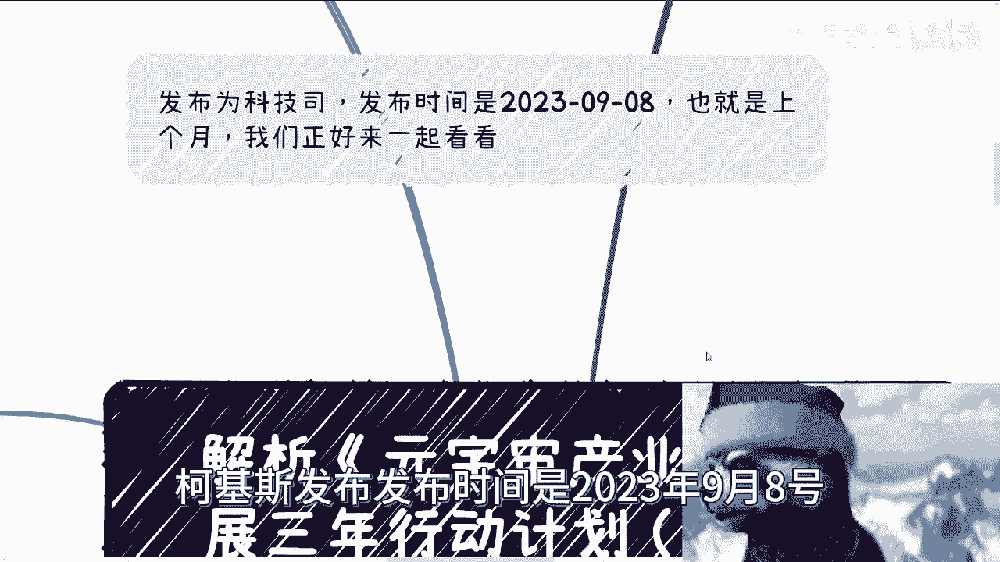
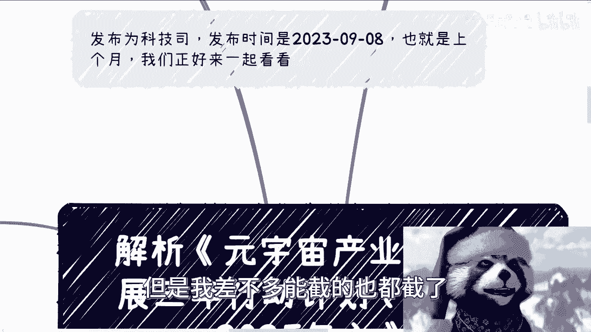
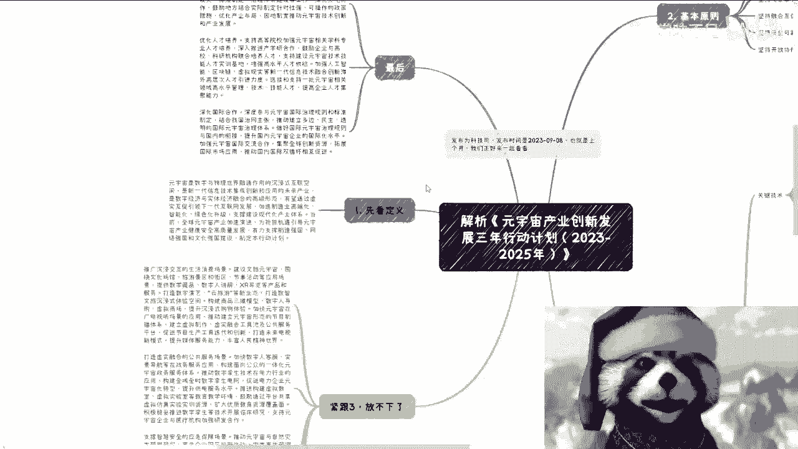
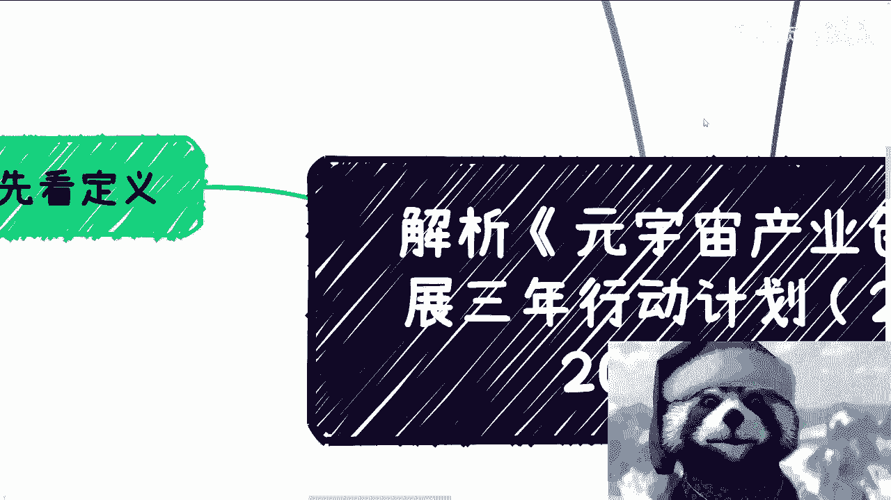
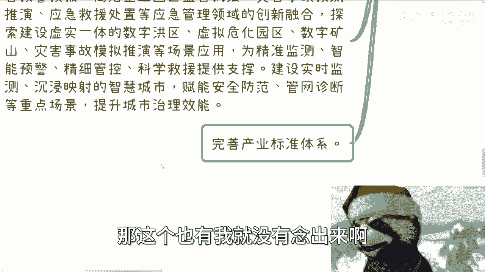
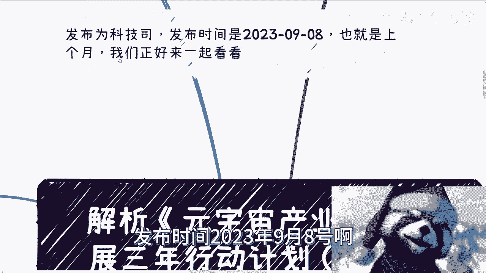

# 解析2023年9月发布的《元宇宙产业创新发展三年行动计划（2023-2025年）》 - P1 - 赏味不足 - BV1vN4y1r758

昨天我们讲的那个呢是2022年的啊，那个文件，那么今天呢我看了一下，就是有一个2023年呃，发布为科技司啊，柯基斯发布发布时间是2023年9月8号呃。

到25年的，我觉得蛮好的，因为23年基本上就我跟大家说了嘛，就基本上一年都是停摆的嘛，那么接下来就是说该做的还是要去做的，那么呃而且这个呢是科技司整个中央这边发的，那么23年到25年。

我觉得呃还是那句话嘛，就是咱不管他未来发展怎么样对吧，就是整个的现在能做的啊，我们先看一下整体大概方向，说实话啊，这个内容长呢是长了一点，我能就因为这个XMIND的，我就怕这乱七八糟里面太多了。

你知道吗，所以就是说我我觉得其实也没有截全啊，但是我差不多能截的也都结了。

好吧，你们先看一下，卧槽这真的这么长啊。

我们先看一下定义啊，大家也可以对比一下，跟22年，当年就是去年下半年发的有什么区别啊，呃首先我们在这个地方能看到，它定义写的很清楚，就是元宇宙呢是数字啊，与物理世界融合融通啊。

这么作用下的一个沉浸式互联空间好，那么是一个新一代信息技术集成，创新和应用的一个未来产业啊，那么有望通过虚实互促啊，引领下一代互联网发展啊，那么加速制造业高端化，智能化，绿色化升级。

支撑建设产业怎么样怎么样怎么样，对吧好，那么整体这段话的定义呢很简单，就是说啊我们不要去定，我们不要去死抠原宇宙是不是一个虚拟的东西，或者是就它的形态是什么，并不是很重要，你明白吧。

你说是不是AAR或VR，是不是说一个展厅啊，或者只是一个什么什么什么全息，这不重要，因为在定义里面没有把它定死，而且本身就不应该定死，定死这个逻辑就没法做了对吧，所以说我们在这段话里面。

从中央的定义上来讲很清楚，融合的一个高级形态，同时呢它不仅仅是互联网，它要加速整个制造业啊，包括就是传统的各种行业对吧，支撑现代化产业体系对吧等等等等等啊，就这么个东西，而且它的核心目标是什么。

文化强国啊，制定行动计划对吧，所以说啊就是说我们在这个当中，首先你要明白啊，就是说元宇宙不是大家所了解的啊，所所所去，就是说呃非常狭隘的去理解那么个东西，无所谓啊，不重要啊，那么首先第1。

222基本原则。

基本原则我们能看到创新驱动，我这么跟你们讲吧，这个基本原则什么意思啊，就比如说你们接下来去拿补贴拿，我不管你们是拿去补拿产业园补贴啊，拿资本还拿各种各样的东西，我们什么叫高举，我们什么叫高举高打。

高举高打的意思就是说我不管今天你是做什么，你跟我说你是做互联网，做机器人对吧，做工业互联网还是做什么AI，做什么乱鸟毛玩意儿啊，很简单，就是你的整个solution这些都要有，为什么，因为这是基本原则。

很简单就是这是所有的原则的源头，那当然了，也有很多人要说了，那我就不要我就不要我就不做，那你不要你出国啊，你别在国内做，对不对，我觉得就这么简单，就是你在什么地方遵守什么规则就结束了对吧。

那我们一个个看啊，首先创新驱动是什么，就是你的整个solution里面，整个方案里面你得有创新的地方啊，你没有你也得有，就说白了你这个故事得讲，原来啊你就算没有，你讲出来一个东西，让对方觉得有那也行啊。

明白了啊，后面这句话我就不重复了啊，首先这是第一个，第二个场景牵引，什么意思，你不能天天跟我说啊，我做了一个服务，我做了一个产品啊，这个产品多牛逼，这个服务多牛逼，OK那你要有场景，你要有用的场景对吧。

你比如说你说，你说我今天做了一个元宇宙的两个方案啊，好那么这个方案到底干嘛呢对吧，你跟我说这个方案是用在比如说智能交通，智慧交通，智慧城市还是智慧文旅对吧，还是说是智慧高校，你总得有个地方落地吧。

好那么你的整个方案里面，你得把这个场景场景写清楚啊，包括这个场景呃如何的元宇宙化对吧好，那第三融合互促，融合互促什么意思，就叫虚实结合啊，你别弄了，一些场景都是纯虚的，不行的，你必须要虚实结合。

就像我刚给你们举的例子，农业也好，金融也好，高校也好对吧，包括那个那个城智慧城市也好，文化也好，都是实体的啊，你别来，就是整个方案里面全是虚的，那不行的啊，第四个安全可靠对吧，安全可靠里面有什么。

比如说你要有国密对吧，比如说假如比方比如说你要用到该用到国密，用到国密对吧，你该用到一些这个这个国家的一些规规则，用到规则对吧，然后本身这个安全保护如何的，去这个这个这个保保障对吧等等等。

你也得写清楚对吧，然后最后一个就是开放协作，那开放协作这个东西呢也很简单，就是你有两种嘛，一种就是说内部的开放协作对吧，就比如说大家是这个针对企业，针对针对针对啊，允许的企业，针对合作方，针对政府对吧。

还有一种就是说是啊无条件的啊，比如说针对所有的open形式的开放协作，那都可以，但是你在这里面得体现出来好吧，那么所有基本原则这些东西呢就是给大家来，说白了就是给大家来掌控整个整个中心的啊。

整个这个核心就不管你你的东西是什么东西，这些东西都得有好好，那么接下来就是最复杂的一块东西啊，就是我们说的这个我靠重点任务啊，好重点任务啊，你们来看啊，哦有这么长的嘞对吧，第一个叫关键技术。

关键技术这边我们来看啊，首首当其冲，第一条什么数据流通，我昨天说的很清楚，数据很重要，因为所有东西都是数据啊，或者说我们以前的所有的大数据都做了，0~1做了去造啊，多了去重做了各种各样的。

但是啊接下来数据要用，你明白吧，就是相当于你手上有一套一大套，所有的这个武功秘籍对吧，这些数据都有了，但这数据怎么用，现在还不知道啊，或者说还没有真正用起来啊，那么我们在后面看啊。

持续攻关区块链隐私计算等技术，探索数据资产的价值发现啊，确保保护授权流通，推进以区块链为核心的数据治理，跟数据资产跨平台流通技术体系，实现数据流通到价值流通的转变，构建元宇宙基础信任的基础建设。

你看到没有，整个东西很简单，就是我跟你们说的两句话，一数据资产化，二资产证券化没了，就这两句话啊，那么所有的这些当中，都是来服务于数据资产化跟资产证券化的对吧，我之前一而再再而三的跟大家提。

就是因为国家本身政策上面，他就放的优先级很高，那我们不跟着政策走，跟着什么走，对不对啊，那这是第一点，第二点内容生产技术对吧，好你看啊，打造适用于元宇宙的智能内容生产工具对吧。

发展怎么样怎么样怎么样一大堆啊，好那么这个地方呢也很简单，就是说我们需要降本增效，就说白了就是降本增效啊，也就是说我们需要通过一些，比如说AAI解析的方式啊，或者别的一些生成式工具。

来帮助我们提升我们的效率啊，呃记住这个地方是帮助我们提升效率，不是替代人工啊，没有人说过替代人工，从来没有人这么说过啊，你们所听到的这些话，无非都是舆论所营造出来的焦虑而已，好没有任何官方的地方说哦。

AI要大力发展替代人工，没有的啊，不可能的啊，因为所有的这个这个政府，所有的这个政这个叫什么，就是规章制度，所有的这个社会它是以人为本的哦，你要是你要是说什么AI替代人工。

我先不说AI当下发展多么的low啊，这替代人工那不现实对吧，何必自己跟自己过不去呢，那么第三点就是数字孪生，数字孪生呢也是非常重要的，但数字孪生更多的呢，跟老百姓跟小企业可能关系不大啊。

它更多的还是在于什么呢，比如说我们说的比如说智慧城市啊，智慧文旅啊啊这个那个工业啊对吧，制造业啊，这些地方包括这些啊，你像这个地方写了研发模型封装对吧，资产管理和好模型互动操作对吧等等等。

那么也就是说很多的东西呢，它是需要数字孪生这个技术来做，真来做一些也是降本增效一样的，就说到底都是降本增效啊，都是能够加加快我们的这个这个这个效率啊，同时增加就是同时最终推动GDP的增长对吧。

那么下面就感知交互，那感知交互这个地方就比较怎么说呢，比较比较比较比较比较通用了啊，你比如说突破手势啊，眼动啊，头部追踪啊，动动态捕捉啊等等等啊对吧，这些就比较通用了啊，而且这些东西说实话啊。

这个东西可能就不是那么的就无关痛痒啊，你如果能做，那就是新一代的技术，如果不能做也关系不大啊，因为毕竟这不是什么很大的一个问题啊，那么同样的网络与计算技术，这个东西就不得就不要再提了，就每次里面都会有。

因为你所有的东西离不开网络对吧，你所有东西离不开5G6G，你所有东西离不开它的传输啊，啊你你就像现在你比如说大家啊，大家说呃，这个我我我我为什么能够很快的送外卖。

我为什么能很快的搭建这么一个互联网的环境，就是因为你通信上去了呀，你现在这个生态你想想看，你现在这个生态如果建立在2G上面，怎么做啊对吧，所以说这个东西跟网络跟计算。

那个计算技术所跟所有的技术跟所有的领域，它都是相辅相成的，所以这个东西不可能不提，但是呢你也别去想着说哦，因为提了怎么样怎么样怎么样啊，就通用技术啊，就是通用技术好，那么第二个叫丰富产品的这个供给对吧。

那你看啊拓展圆周路口加速X2头显，裸眼3D等等等等等，丰富基于手机，计算机，电视机等终端的圆周这个应用啊，支持脑机接口等前沿等等等等等，创新数字人啊，怎么样怎么样怎么样，那这个东西呢就是说白了是什么呢。

就是说啊我们用大白话来讲，就是我们需要有各种各样的，原宇宙的应用层的东西啊，当然这个应用层的东西到底是基于电脑，基于手机，电，基于AR还是基于VR，基于X啊，这无所谓啊，这个大家各显神通。

但是我就告诉大家，得要丰富应用层的东西就没了啊，就这么简单啊，好那么第三就是构建协同生态啊，我们来看啊，构建协同生态是什么呢，呃这段话我当时看的时候是觉得有点low啊，但是咱不管他low不low啊。

对吧啊，那个首先第一点开发原理中名品对吧，名凭什么持续完善营业周产业图谱，编制优秀产品目录啊，助力产业拓展市场合作渠道，面向细分领域打造一批标杆产品，征集发布怎么样怎么样举办，你看啊。

举办元宇宙专题竞赛对吧，产业峰会啊，推广优秀技术产品解决方案，对不对好，那这个当中呢别的我们不重要，重要的是什么呢，重要的就是说好，我知道了啊，政府要去打造标杆，那打造标杆怎么办呢。

打造标杆就得竞选对吧，那竞选怎么办呢，就得举办竞赛啊，那么举办峰会，那怎么办呢，嗯对吧懂吗，你该要钱要钱啊对吧，该要要该要扶持要扶持啊，该要资本要资本啊，对吧啊，就这么回事啊。

那么第二培育原理中民企对民企呢，这个地方我们来看啊啊培培育啊，特特新小巨人啊，单项冠军领航企业发挥越州探索这个方阵对吧，联盟等行业组织作用，你看啊，在这里面又提到了这个培育元宇宙名，起什么意思呢。

你们可以这么理解，这是一个目标对吧，但是我们就说了，0~1的这个过程当中，很多时候真正赚钱的不是挖到金子的人，而是给挖金子卖铲子的人，所以说这个当中比较重要的关键点是什么呢。

主要关键点是在于你能不能有这个培育库，我们所谓的专家智库对吧，你能你的你的联盟，你的行业组织，这是重点，你说最终能不能取出来民企，这只是个结果，明白我意思吧，好往下啊，创建元宇宙民区对吧啊。

你看啊选举产业基础好的地区，建设元宇宙先导区等等等，那这个东西就更简单了，名吃嘛对吧，产业园嘛对吧，那你想想看，杭州有非常多的这种这个烂尾产业园对吧，像人工智能小镇啊对吧，什么东西，但这不重要啊不重要。

重要的是他现在愿意做啊，那么也可以啊啊也可以啊啊，那么最终打造的名人啊，培育一批知名数字人，打造数字人标杆产品，怎么样怎么样，那这个东西呢我觉得啊，哎这个东西怎么说呢，就是它是一个很好的愿景啊。

但是这个东西呢我们接地气来讲啊，其实是这样子的，就是说啊你看啊所有的以前的那些品牌，他都有吉祥物啊，那么这个时候呢你有两种做法，第一种做法是把吉祥物去套个概念，就变成数字人了，对不对啊。

好那还有一种呢就是说你把以前的吉祥物放着，你说我做品牌升级啊，那么我做一个升级的数字人也行啊，但是不管怎么样，这个本质上的意义呢，就是说这个就是要创造这么一个东西啊，那么当然了，你看啊在这个地方呢。

你说培育一批有带动效应的领军技术，专家及优秀创作者，那么这个地方又提到了什么呢，又提到了这个叫专家智库，成立业主产业百人会，那这个就是所谓的比如说卡拉巴对吧，组组这个组织啊，联盟啊这些东西啊。

打造元宇宙产业交流平台对吧等等等等等，啊对吧，反正就这么个意思，好啊，我们来看啊，再往下，工业元宇宙，工业宇宙我没我没把它弄全，但是本质上只要大家知道就是工业元宇宙呢，呃它也是很非常重视的。

而且它下面还有专门的赋能的这一块啊，你看啊，公元宇宙探索，推动工业关键流程的元宇宙化改造，那这个就是我们说的以前的数字化改造，现在叫原宇宙改造啊，无所谓，反正就是概念换一换吧，然后加快啊重点行业。

比如说工业园宇宙布局，比如说针对家电啊，汽车啊，船舶啊对吧，然后这个这个这个航空航天重大技术，就这个东西简单来讲，就是说嗯元宇宙的整个发展是需要做啊，产业的结合，而不是说仅仅只针对，比如说移动互联网。

互联网永远在哦，好像这个东西只跟互联网有关，不是啊，或者说有很多的这个，我们说传统制造业的这些小伙伴对吧，大家就觉得哎呀这个东西很虚对吧，跟我们没关系啊，也不是啊好啊，那么工业元宇宙赋能啊，我们来看啊。

他写的很详细啊，我在这个地方也给你们看了，就说工业元宇宙加产线对吧，你比如说推动人机器数据等关键要素融合，建立虚实结合的产线，数字孪生体，那这个东西昨天也说过，对这个东西是很重要的。

整个数字孪生在试验也好，在增加效率也好，都是非常重要的啊，这是第一点，第二点你会看到整个圆柱加工厂对吧，布局建设工厂级别运输平台打造打造低延时，高保真智能决策的数字人生系统。

那简单来讲就是说这两个都是数字人生，只不过一个是产线，一个是工厂，对啊，这两个不同的东西，因为产线相当于是你有更多细节，更多应用层的东西，工厂更多是一个宏观的，包括来说是一个要可控可监控。

可管理的这么一个东西，那不一样啊，那么最后就园园区基本上就是说点到面啊，再到整个的大的面啊，其实就是一个一个一个一个从下到上的，从小到大的这么一个范围啊，大家可以看一下，我就不读了啊好吧。

然后工业学赋能啊，诶啊对，然后紧跟三啊，我放不下啊，放不下了，放到这啊，然后往下还有什么呢，叫做推广沉浸交互的啊，这个生活消费场场景啊，建立文旅原则，你看啊这个地方就写了啊，文旅元宇宙啊。

围绕围围绕文化馆，旅游景区对吧，这个各种解释活动对吧等等等，提供数字藏品，数字人讲解对吧等等等啊，怎么样，然后打造数字演绎啊，云生态怎么样怎么样啊，那么在这个地方呢，我还是那句话啊，我之前有一期视频。

我不知道大家有没有听到啊，我当时是这么说的，就是我们不要太去纠结于哎，有人就要说了，哎你看啊这个中央这个文件又提到数字藏品了，怎么样怎么样，这就是个称呼，你懂吗，就是称呼是什么并不重要。

你说数字藏品怎么了，数字藏品这四个字他妈有原罪吗，没有呀，对不对啦，就是只是怎么做的问题啊，就是你的认知很狭隘，你觉得哦可能这个东西就是你的认知，那是你的问题，但是从国家从宏观角度来讲。

这就是一个数字化的这么一个一个纪念品，或者一个一个一个一个收藏品，怎么了呢对吧，它有它的发展方向，它有它的就是红利期，或者它有它的上升空间，你你你不要就说听到这个东西就觉得卧槽，好像啊。

这个又要来了对吧，牛市要来了，怎么样了，没关系的，有什么关系呢对吧，打造虚实虚实融合的公共服务场景对吧，加快数字人客服啊，实景导航等这个政务服务应用啊，共享面向公众的一体化元宇宙政务的服务体系。

那这个东西呢就是说这只是一哎，这个都是一套空话对吧，都是一套官话啊，这个无所谓，但是从发展上面已经写的很清楚了，就是说数字人啊，你要用啊，比如说不管是商超，不管是政务，还是说不管是文旅对吧，你得用啊。

就这么简单啊，怎么用就看大家的问题啊，看大家的这个看大家这个能力了啊，那么在这个下面呢，我们也看到另外一点叫做推构建虚拟教室，虚拟实验室等教育教学环境，鼓励通过平台共享虚拟仿真实验室实训资源。

扩大优质教育资源覆盖面对吧好你看啊，下面是推动数字孪生等技术开展临床研究，支持元宇宙医疗对吧，那这两块也是写的很清楚是什么，就是医疗教育是重中之重啊，重中之重这个东西也是元宇宙，或者说这么说。

或者说医疗跟教育，是元宇宙能够先落地的两大场景，明白吧啊好，那么支撑智慧安全应急保障，哎这个就不去说了对吧，这个都是以前都做过的，就是灾灾害预测啊，预演啊，各种各样的东西啊对吧。

那这个东西真的就是需要数字孪生的啊，这个就是说啊赋能安全防范对吧，提升城市治理效能啊，然后最后一个就是完善产业标准体系，那这个也有我就没有念出来啊，这个也有一大堆啊。

但是标准体系大家明白这个东西永远都是有的，好吧好。

我们来看最后一块，最后一块你看啊强化统筹协调啊，也就是说需要加强产业创新，财政金融区域等政策协同啊，协同推进研究技术攻关啊，治理等等等，深化那个央地协作对吧等等等等等，各种各样的啊。

好这是第一个啊啊这个呢其实也是官话啊，但是要告诉大家就是大家协同啊，大家协同什么意思啊，都是要支持啊，不要就说有的没的去，就是说大家怎么什么相互分裂对吧啊，这第一个第二个呢就是说要优化人才培养。

你看到没有这块东西，你看啊，支持高等院校，加强元宇宙相关学科专业人才培养，深入推进产学研合作，鼓励企业与高校科研机构联合培养人才，支持建设元宇宙技术技能人才实训基地，增强高水平人才供给，加强人工智能。

区块链，虚拟现实等新一代技术融合创新，海外高层次人才引进力度啊，选拔和支持一批元宇宙相关的领域，高水平管理技术技能人才，提高企业人才聚集能力，什么意思，就是说白了就是说OK人才培养人才引进啊。

那个那个高人才的这种企业的，就是就是聚集对吧，包括里面的实训基地，反正这些东西各个地方都会有政策啊，大家自己去找肯定都会有，因为本身就是就是以中央为主，到各个地方往下散的嘛啊好。

那么还有一个深化国际合作，那这个是必不可缺的，因为本身元宇宙也好，包括数字经济也好，它已经不可能是在单个国家做，它一定是以全球为目标的啊，那么你说啊，做好国际援助治理规则与国内衔接啊。

提升国内元宇宙企业的国际化水平啊，加强啊元宇宙国际交流等等等等等，那这个东西里面就多了对吧，你说我可以国际化的校企合作，我可以国际化的企业合作，我可以国际化的就是就是产业园的合作对吧。

我也可以做国际化的这种大会，这种峰会对吧，这种专家的这种这种这种这种顾问的招聘对吧，我也可以做海，就是国内的到海外的各种各样的，比如说教包括企那个高校的交换生啊对吧，企业的游学啊，研学啊等等等啊。

这些都可以做，就是说所有的这些东西还是那句话啊，你们不要指望在政策里面去想，就是给你们写到执行层怎么做，执行层怎么做，看各位啊，八仙过海，各显神通啊，你们就像我以前一直说的，就是怎么往上贴。

取决于你们的故事怎么讲，而不是像应试教育一样说，哎我们来告诉你们对吧，大家怎么贴，卧槽你想想看，如果政府告诉你们怎么贴，那你们还贴个屁，轮得到你们贴吧来，对不对好，那么我们回过头来讲啊。

发布时间2023年9月8号啊。

那么其规划是2023~205，22025，那么也就意味着啊，也就意味着我们刚刚所说的这些东西，至少啊你想吧，你20239月份发的，你又写到2025，那怎么能怎么说呢，对吧。

也就意味着你2425年两年你肯定得落对吧，那当然落成什么样子，看各位对吧，包括能做能赚什么钱，OK不好意思看各位了，好吧好，那么OK那么我就讲到这啊，那么如果来说各位啊，你们有任何的想法。

比如说呃这个申报项目啊对吧，然后这个有自己的，当然因为你们可以真的是各显神通嘛，就是你不见得说一定要去问政府拿钱对吧，你说我可以做些东西往政策上靠啊，高举高打，我也可以做些东西，真的问政府要钱。

我也可以做一些东西，依靠这个东西，靠政策，我去找企业合作都可以，因为这些东西对所有人来讲，你们就是个抓手啊对吧，因为很多人就跟我说，哎我到这里找不到呃，这个找不到这个相关的内容，到那个地方找不到抓手。

你得找啊，好吧嗯，行吧，那就这么着啊，嗯行吧，就这么着吧好吧，你们有任何东西有任何想法好吧，你们整理好，如果来说不确准的啊，吃不准的，或者说你们觉得这个方案需要优化的，或者怎么样的，你们可以找我咨询吧。

我可以帮你们优化。