# 解析软件测试中测试开发的发展前景 - P1 - 赏味不足 - BV1rs4y1x7Lo

好啊大家好，我是赏味不足，那么首先呢今天是年初二啊，这个祝大家新年快乐是吧，然后呢就按照我之前说的啊，我会把之前的啊就是这么一个内容啊，就是这个相关的内容会把它拆分开来啊，那么这一次呢。

我们主要来讲的是这个测试开发啊，这是第一个大家看过我上次视频的呢，应该也能够看到啊，就测试开发我会放在第一个，这个并不重要啊，并不重要，上一期那个视频发了之后呢，就前两期视频发了之后呢。

就b站上还是有蛮多人留言的啊，然后嗯我再看了一下，哎呀其实大家这个留言呢其实没什么太大意义，为什么呢，因为这个我只是来跟大家说啊，就有怎么样的一个方式能有更好的出路对吧。

我并没有说就未来没有这么一个岗位啊，这是第一个呃，第二个呢我也没有说啊，这个一定要转行对吧，大家这个一个视频一共大概也就十几分钟啊，希望大家看完好吧，不要就是说这个看到我那个标题对吧。

大家就开始来留言了啊，那么我尽量这个讲的通俗易懂一点啊。

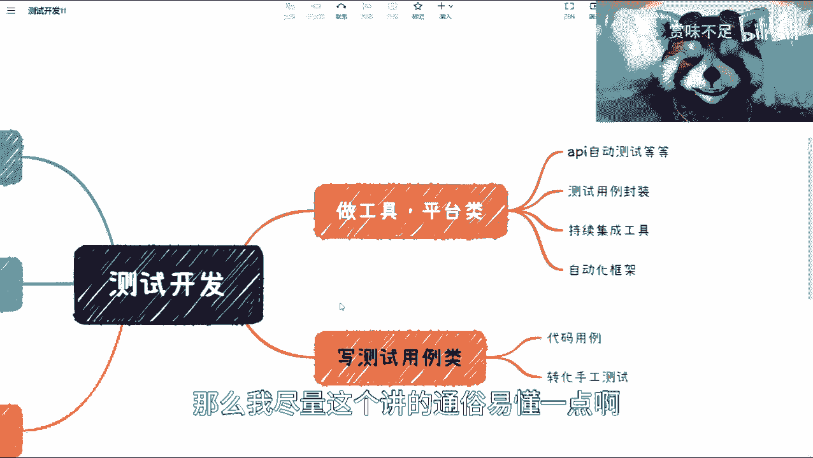

也希望能够帮助到大家啊，首先啊测试开发这边我们在以前啊。

微软这边我们叫做s d e t对吧。

s d e t啊，对这个b站上还有人来关心我对吧，关心我说啊，你这个你以前有没有在战大厂做过啊对吧，你以前有没有做过测试啊啊并不重要啊，你们不用关心我是做什么的啊。

这个病病并不妨碍你们来听我这个内容好吧，呃对我来讲呢，一呢就是能帮助到大家，那就最好了对吧，二呢我也不是我这个内容，反正也不收费是吧，也不收费对吧，你们听了也不少块肉啊。

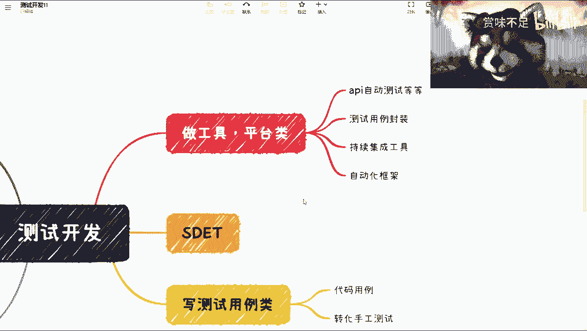

首先我们先来看啊，这个地方我写了就有第一个东西叫工具平台类，那工具平台类呢这个有很多公司也都有啊，但是这种公司呢，大部分是外企或者中大型企业啊，国企啊，为什么呢，因为首先我们来说啊，就是这个外企唉。

我觉得我还是写一下啊，嗯写在哪呢，写在这儿啊，好你比如说有的企业外企，那中大型企业国企对吧，那为什么呢，因为很简单，你比如说首先外企对吧，外企这些企业里面的，大部分对整个软件工程的这个流程。

它是比较重视的啊，那么它里面该有的环节都有对吧，就像b站上有人回复我说啊，这个这个测试呢，就是软件工程必不可少的一个环节啊，我也知道必不可少对吧，但是必不可少并不代表他不能他一定要有啊，他可以没有对吧。

因为你说你做一个产品，你没有开发行不行不行啊，你没有测试行不行，可以对吧，那呃这个外企啊，我觉得大部分做的还是比较好的，对吧，然后比如说中大型企业，那我觉得他们不缺钱啊，那么在近2年这个疫情之后呢。

我们说经济恢复起码要3~5年3年，我说3年了，很多人都说我乐观对吧，那我就说5年吧好吧，那5年啊，那么我觉得除了大型的互联网企业，剩下的一般也不太会有了，要么就开始做优化对吧，那么国企呢为什么呢。

是因为它还是会需要有很多的标准呢对吧，比如说我们说的这个这个叫什么tmm对吧，或者那个c t v b i s t v b对吧，或者那个那个我们可能评一些国标，不是国标了。

就凭一些这个项目的时候可能会要对吧，那等等等啊，这些我们觉得会有的，但是呢从广大的这个人群，就就业人群跟整个岗位基数来讲呢，就真的会拥有未来，我们说会去呃，要这些做工具平台类开发的啊。

这个测试呢我觉得就会比较少，为什么呢，因为还是那句话，就是中大型企业他不不缺这个钱啊，那么剩下的企业它就万万呃，只能捂捂住口袋了对吧，那这是第一款，那我们来看这里面有哪些呢，我大概列了一些。

我就不全部列了啊，呃因为分的太细没什么太大必要，你比如说接口的动画对吧，你比如说做兄弟的封装对吧，你比如说这个c i c d啊，你比如说automatic，automate，automatically。

对吧啊，automation这么一些，那我们说啊就是做工具做平台，那么往往说是为企业里面去做一个，持续集成的封装对吧，做封装做做做测试工具，当这个工具可能是一个带界面的，也可能不带界面。

是个脚本化工具对吧，等等等都有可能啊，但是呢在这件事情里面呢，我们来看啊，就是比较相对来讲。

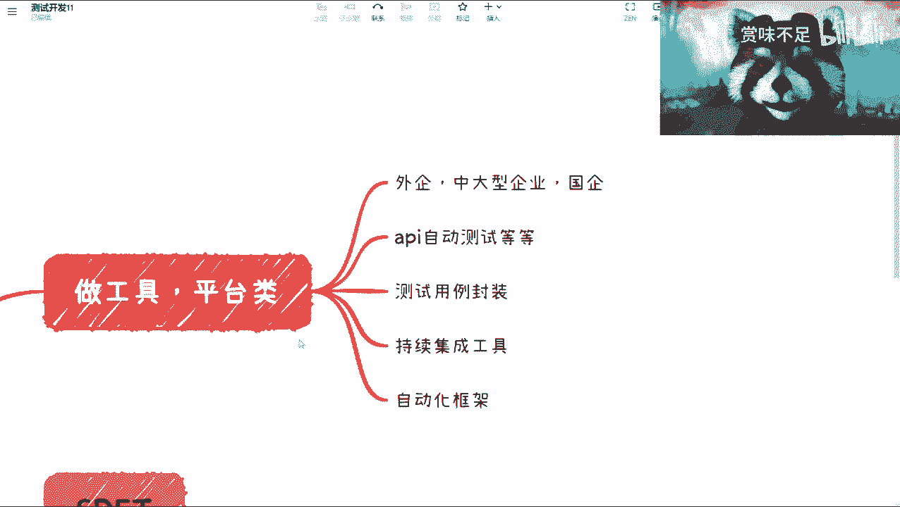

我觉得有用的是什么呢，就是在这个大前提我还得提一下。

因为我不确保所有人都看过我之前的视频啊，就我再提一下，就是安全，我们是撇出去的啊，安全我先肯定是不归在测试里面的，q a我也是撇出去的，他也是不归在q那个测试里面的，那么在这里面我觉得有价值的是什么。

是性呢，而性能一定是有价值的，因为性能这个东西它是一个就是说与线上用户，包括线上环境紧密相关的呃，你说接口的自动化，我觉得也是有有价值的啊，也是有价值的，但是这个有没有价值，取决于你怎么写啊。

取决于你怎么写，它不像性能这么的直观啊，不相信能这么直观，因为我们在很多做的时候会发现，就是那种就是说啊，你你这个测试通过率很高对吧，你说我的呃。

test kiss pass的一个一个一个percent，可能是95%或百分之百，但是虽然看着数据很高，但其实并没有检测出来毛的问题对吧，那好那这个呢可能跟test case有关啊，这个回头再说啊。

那么呃性能是有价值的啊，a p i是有价值的，那往下呢可能大部分人做的更多的呢，要么就是啊这个测试框架的编写，要么就是ui自动化好，我们在这个地方我来填局对吧，因为ui自动化。

因为ui自动的话，我会在后面单独再列一起出来，因为这一期我们讲的是s d t嘛对吧。

单独列器我就不我就不详细展开了啊，但是呢我在这个地方先给个结论啊，就这玩意儿啊，就这玩意儿它就是一个自欺欺人的东西，好吧，我觉得还是那句话，就是说呃大部分人你们如果做ui自动化，你们心里肯定清楚啊。

我又不用多说啊，我也不去点穿点穿了，你们也不要骂我，对吧啊，那么这个点不点穿也都是为你们好啊，然后这个我觉得是一块啊，往下第二款呢叫做写测试用例零啊，写测试用例零呢，就是说一种是直接写代码用例对吧。

就直接说啊，我今天开始写了啊，我封装什么test suit对吧，开始写了啊，第二个呢就是说你把menu是吧，把手工测试的用例去做一部分的转换，那这部分转换呢往往是一个矩阵型的，就比如说优先级多少高达啊。

哪些模块的哪些功能大家去做转换对吧，那现在有很多人也会做这两类的工作啊，那这两类工作有没有价值呢，我觉得你说有吧也有啊，但是取决于什么呢，就是最终到底这个这个这个东西做出来，跑出来是个什么玩意儿对吧。

因为我们说所有的东西有没有价值，得要取决于你要用数据来说话，你不能说啊，我觉得有价值，或者你觉得有价值没有用对吧，那所谓数据是什么，就是你的测试用例库，你的自动化的测试用例覆盖你的代码的覆盖，你的。

比如说冒烟，测试或其他各个方面的一些内容的覆盖对吧，就你的覆盖率能有多少，有哪些是能够真正的做到自动化的对吧，因为这个话题，其实我在以往的一些视频里面也提到过，就是回头我再单独列吧好吧。

就是就是真正做到自动化的人其实很少，或者公司很少，就是我们说啊，现在我们所说的大部分的所谓的自动化的测试，它只是一个半自动化测试啊，半自动化，因为你持续集成可能也不完整，也不完善啊，也也有很多的缺陷。

有很多bug，然后呢，你的自动化的用力，也一天到晚出现各种各样的问题，那这种你能叫做自动化吗，那肯定不能叫自动化对吧，那你总不能说啊，我这边有打个比方，我这边有100个冒烟测试对吧。

这100个冒烟测试都很简单啊，然后现在每次这个发布之前呢，或者打包之前呢，这个用例都都都能够很呃，这个叫做稳定的去跑对吧，那么你就跟我说啊，这个东西就自动化了啊，非也好，非也。

好那么第三类呢我们说呃探索新工具类。

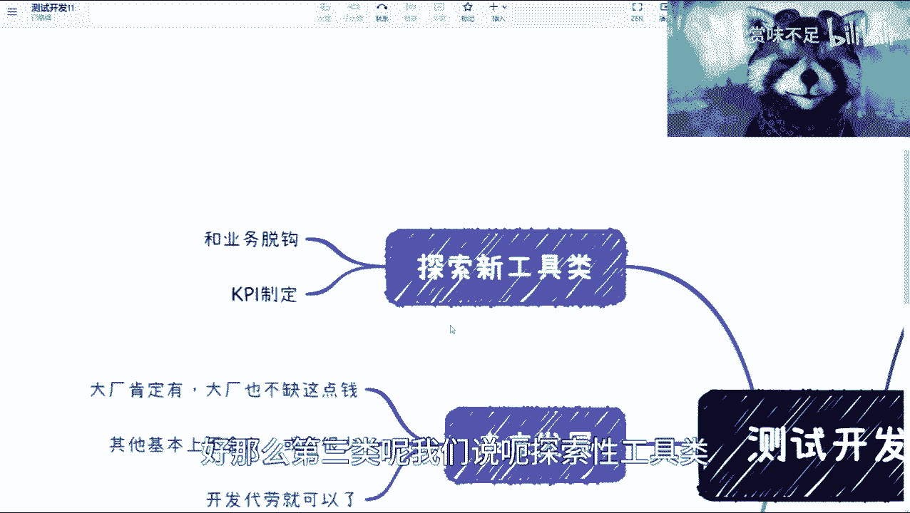

那这一类呢我觉得其实比较尴尬，为什么呢，因为呃工具呢肯定是层出不穷的啊，但是大部分的工具呢其实万变不离其宗啊，就是换汤不换药，其实你们去用了，你们也就知道对吧，不管是什么接口啊，ui啊。

什么b d d啊对吧，什么乱七八糟的，这个并不重要啊，其实它本质上其实都是说我要来提升效率的，那么我们一切从结果来导向，你到底有没有提升效率呢，对吧，你不我就是就是不要去搞那些花里胡哨的。

花里胡哨没有用对吧，那我们说啊探索新工具呢，往往目前尤其是当下这个情况啊，这个一呢它是与这个叫做业务是脱钩的，因为往往你的新工具是不可能马上用到，你的这个这个新功能上或者新的产品上面。

第二个呢就是这个kpi g定制，就是你的kpi到底怎么去划定对吧，就比如说这工具师能用了呢，算你的kpi呢，还是这工具只能找出多少bug，算你的kpi呢，还是说怎么样对吧，但是不管怎么制定。

就是从公司角度来讲，或者从我们说实际的角度来讲，你一旦与业务脱钩，那说实话你一上来就已经输在起跑线了啊。

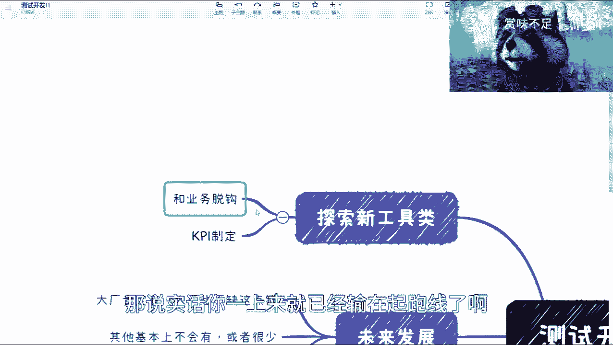

这是毫无疑问的事情啊，这点我也觉得就实话实说啊，大家也都心里清楚，那么最后一类呢。

最后一类呢就是伪开发类啊，这一类呢我觉得就非常傲慢了啊，什么意思呢，我们来看啊，你比如说啊这个看似他在写代码啊，看似他在写开发代码，其实它跟真正的开发差别很大啊，因为很简单嘛。

就比如说你今天写了一个测试框架对吧，我们叫test framework，你真的去开发一个产品，你觉得你会吗，你肯定不会啊，我敢打赌你不会啊，呃这是第一个，第二个呢就是看似在写测序列，其实跟测试关系不大。

什么意思呢，就是这一类的这个角色啊，他最后是一个上不上下不下的角色，就是你要是一个测试，你得对测试用例得对测试的本身的设计对吧，得对业务他得有强烈的认知，他得知道怎么去做设计，这可是你测试的本质。

而不是说今天你作为一个测试，你来跟别人去pk你的代码，这不是你的立足点啊，这不是你的立足点，如果你要去跟别人去pk开发，那么我k p k代码，那么ok那你可能要去跟开发pk，但是你pk不过人家对啊。

那我们实际实事求是来讲啊，当然也有很多人可能会说了啊，这个你扯淡对吧，中国根本不看这些啊，中国就看你这个技术好不好，那我跟你们讲，不好意思，格局要放大，什么意思呢，就是说中国看不看，这只是一个角度对吧。

只是说你们碰到过的公司可能是不看的，或者你们碰到过的某些mentor啊，他那个那个manager他是不看的，但是你我们要讲的是什么，就是你我们今天要讲的是一个测试，理论上应该是怎么样子的对吧。

应该是怎么样的，你不能说因为这件事情在实际发生之错了，我们就说好，将错就错，我们认为这就是对的，那不对对，那肯定不行啊，那么所以说呢本质上来讲，你测试的价值到底是什么对吧，那如果按照很多人说他好。

测试价值就是说拼谁代码写得好，对吧好，那么我就问了，那为什么他们不招开发呢，要是找你这个测试呢，啊公司是吃饱了撑的吗，是吧好，所以说呢这一类呢，它最后就会变成一个四不像啊，这个很尴尬啊，非常尴尬。

我可以告诉你们呃，你们出去找工作或者换工作的时候就会明白，就是你能想找开发吧，你肯定也得降薪，因为你没有专那个专门的这个这个经验，你想去做找测试工作吧，可能你也看不上。

因为大部分的menu test的那个薪资可能也没有，现在s d t来的高对吧，那么这个时候你到底选择怎么办呢，你说好，我换个行业，我不做了，那也行对吧，大部分人会这么做吗，我觉得不会嗯好。

那么就来说最后一个就未来发展啊，我这边提一点。

首先未来发展一定是有的啊，一定是有的，但是呢这个前提取决于，大家得要找到自己的定位啊，这个定位是什么意思呢，很简单，你比如说25岁到30岁，你们想做成什么样子，30岁到35岁，你们又做成什么样子。

你们的竞争力在什么地方对吧，你不要来跟我提你的技术怎么样，你的你的这个什么怎么样没有用对吧，因为我会告诉你们现在全球都很卷，什么叫很卷啊，卷卷什么东西，一卷年龄，二卷就卷谁的年龄是二卷，谁的工资低。

三卷谁呢，这个叫做底线底对吧，那其实大家都卷啊，但是问题是随着你年龄的增加，随着你的这个叫做可能啊，经验的增加，你不会愿意去跟这些人去卷对吧，你说你现在面临一些零零后或者零五后。

你跟他你跟老板说来我跟他们拼薪资，拼谁低会吗，不会对吧，但是你可能又会觉得哎呀，这个我们老板不懂啊对吧，这个很正常啊，这个创业的老板，你让他懂开发可能都难，你不要更不要说懂测试了，没有意义啊。

对不对啊是吧，那么我们说啊，那么这个事情就很难啊很难，那么问题在哪里呢，问题在于，既然事实是如此，我们都能想到未来是什么样子了，那么请问你们有没有想好，你们的核心竞争力到底在什么地方。

这是我们需要去考虑到未来发展啊，那么这个时候呢我觉得有几点，第一呢，外企大厂他肯定是有这个岗位的，毫无疑问啊。

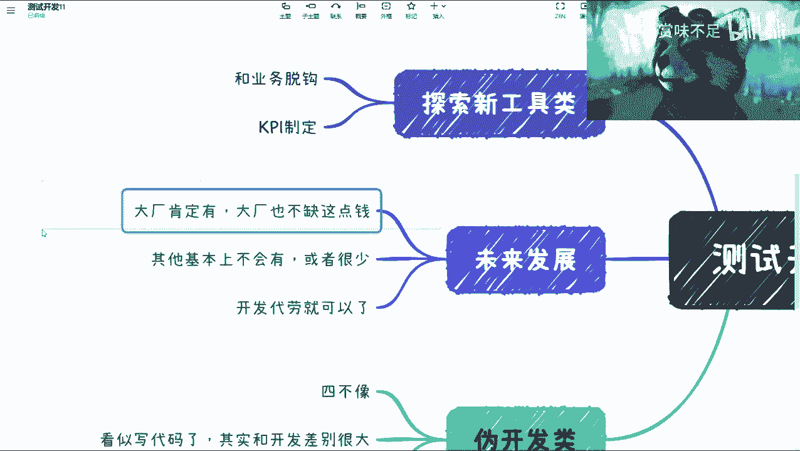

我觉得你们完全可以这个继续往下做啊，往下做没有关系的，但是呢这个坑肯定是不多的啊，因为大部分的人我们说呃可能1%的坑，或者甚至未来有1‰的坑这样子，因为测试开发只会越来越少。

我可以明确告诉你们啊，只会越来越少，那这是第一个，第二个呢就是说其他的一些公司啊，这个我漏掉了其他的公司啊，基本上就不会有或者很少，就很少的意思，就是说我可能一个团队，比如说20多20多个人对吧。

我只要一个测试，或者我半个测试，什么叫半个测试呢，就是你虽然是以测试入港的录制的，但是呢你这个你还要坚持做别的东西对吧好，那这些呢可能其他公司，那么剩下的呢我觉得开发都可以代劳对吧。

你说写单元测试会有吗，还有极少极少扯扯淡呢对吧，那么剩下的呢你说手工测试，手工测试老板数量来这个团队，你们搞搞那个团队，你们搞搞不就过来对吧，尤其是当下这么困难的情况，我觉得大家都要这个节约成本啊。

就是把一些无用的岗位把它剃掉，那哪些是无用的岗位呢，ok是吧，哎呀我还记得那个我第一篇，那个那个视频出来啊，下面有个同学评论，哎呀我真的是哎说出我的心声是吧，他说他说你说得对啊。

这个是唯一一个在互联网里面，比这个ui designer对吧，就是那个这个这个这个设计，还有地位低的岗位啊，我说虽然你这个话呢夸张了那么一点啊，这个你你你你你不能两边都开炮对吧，你这个既伤害了测试。

又伤害了设计对吧，但是呢这话糙理不糙啊，这个的确是那个那个价值低了一点，为什么呢，因为还是我刚刚那句话，你做一个产品，你缺了设计行吗，不行吧，对吧，现在设计多么重要啊，啊你们但凡去创过业。

你们但凡去做过一些产品，你们就做设计多么重要啊，啊一个好的设计多么难找啊，但测试呢可以不要啊，谁要测试啊，脑子有毛病吗啊然后一看我心在这么高，我招个开发不香吗是吧，那我招个应届生不香吗是吧。

哎呀反正就这么个情况啊。

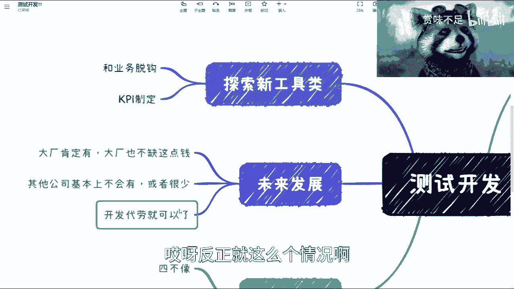

这么个情况，那个我想想啊，测试开发这边我还有什么好想说的啊，啊对啊，那个我们还是要说这个。

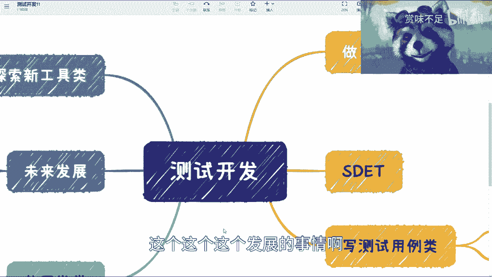

这个这个这个发展的事情啊，发展经济对吧。

那发展经济呢，我觉得第一个啊就说你说啊，我你很牛逼啊，我就在大厂之间徘徊，打错了啊，徘徊可以的啊，我觉得这个也是个不错的方式，也是不错的方式，啊那么第二类呢，我觉得唉你要从公司角度来讲呢。

我觉得第二类你可以转开发，如果你年纪还小的话啊，我觉得你我建议你可以转开发，就是你明明要去做一个这个这个扣定的事情，为什么你不去找一个政治的，一个一个一个一个岗位去做呢，你不要觉得你你你不行。

或者你不要觉得你现在这个还够不到，你够不到就去购啊，因为你觉得你够不到，你可能2年3年过去，你还是够不到，没有意义的啊，没有意义的好，那么我觉得这是第二个出路，第三个呢是你可以转一些这个趁早啊。

我都说趁早转一些这个pd啊啊marketing啊对吧，这个这个这个啊p嘛对吧，等等等啊，这类岗位我觉得也是ok的啊，也是ok的啊，我觉得我个人建议来讲呢，就是呃尽量少的啊，尽量早的去做转变啊。

尽量早的去做转变呃，如果你们不是非常顶尖的那种人才，或者这个顶尖的这种这种牛逼的人物的话，那我觉得我就是建议你们尽尽早去转，越往后你越不好转啊，越往后越不好赚，而且你越往后。

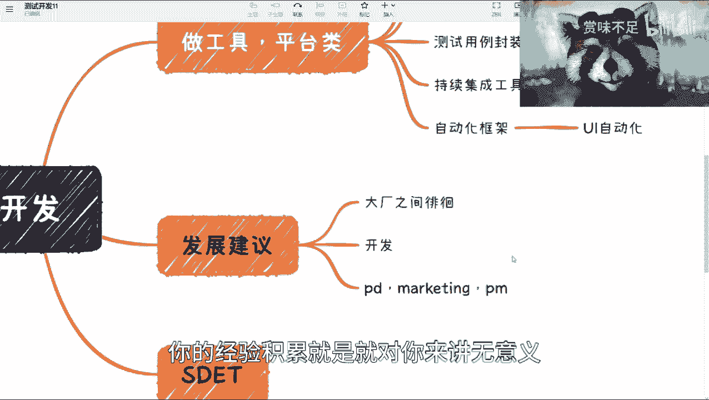

你的经验积累就是就对你来讲无意义，因为就像我们刚刚这边提到的，你的经验积累是既不属于测试类的。

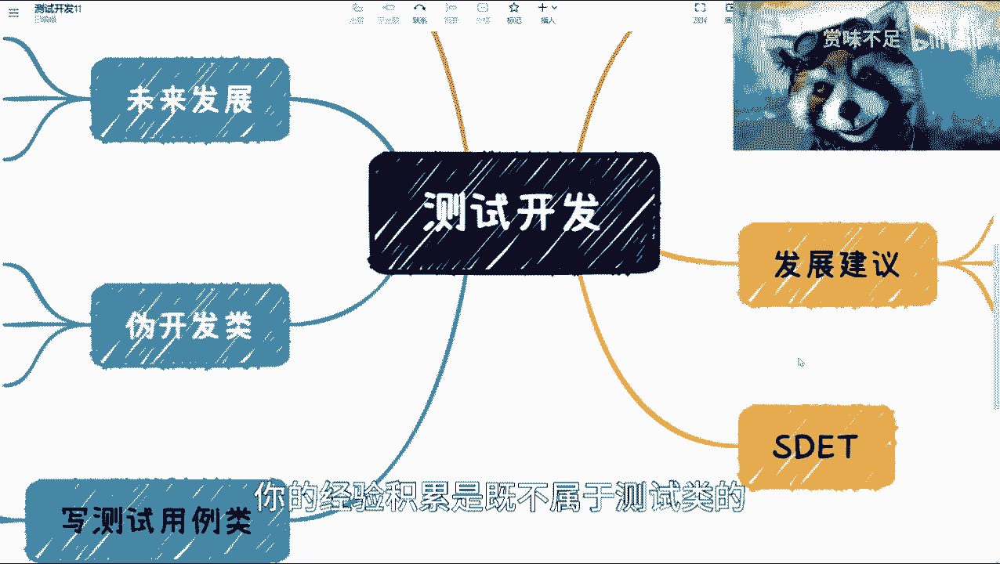

也不属于开发类的啊，这个事情是很尴尬的啊，呃唉然后呢当然已经有很多人会说了，他说呃这个我做测试开发，总归比我做测试薪资高嘛，对吧啊，这个毫无疑问啊，但是呢我还是那句话，你别拿你的个人的经历。

或者你个人的什么几几个月几年的经历来看，我所有给出的建议，我都希望你们把跨度至少拉到10年到20年，这么一个跨度去考虑这件事情，你今天可以跟我说，你做测试开发拿5万块钱一个星月，月薪没问题。

那请问你这5万能拿几个月对吧，那甚至也也也没那么高对吧，所以我觉得这个是我们要去考虑的问题好吧。

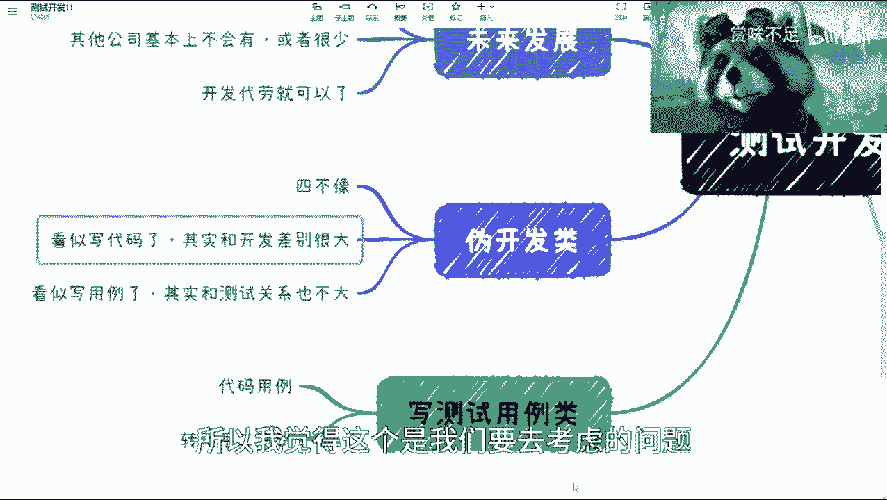

ok那我觉得这个内容我讲的差不多了好吧。

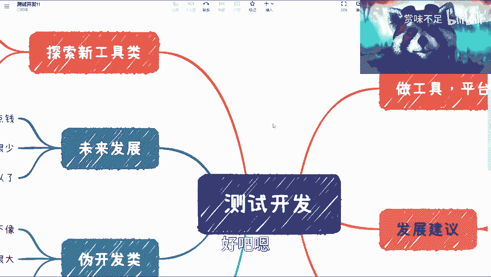

后面我再下一期，再把这个后面慢慢慢慢再展开吧好吧。

