# 解析软件测试中测试开发的发展前景---P1---赏味不足---BV1rs4y1x7Lo

在本节课中，我们将要学习软件测试领域中“测试开发”这一角色的现状与未来发展。我们将分析其核心工作内容、价值所在以及面临的挑战，帮助你理解这一岗位的真实定位。

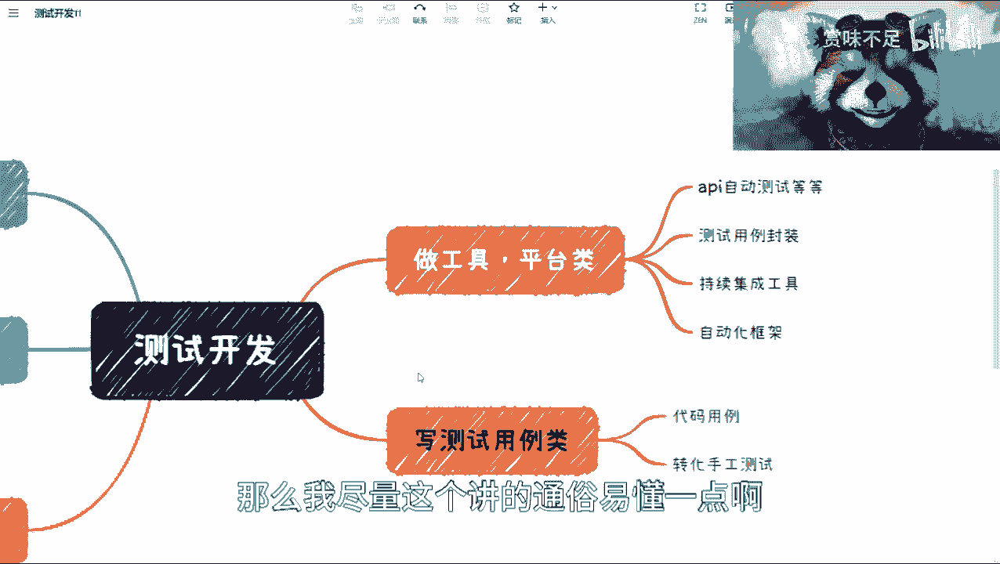

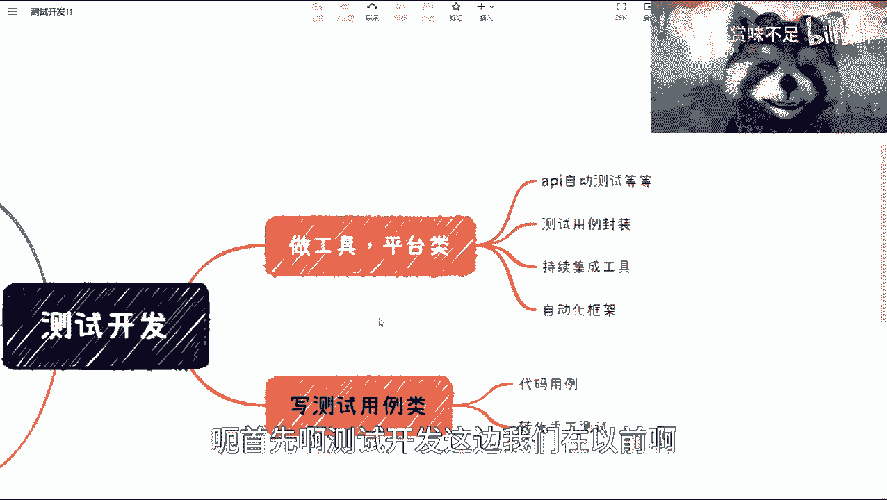

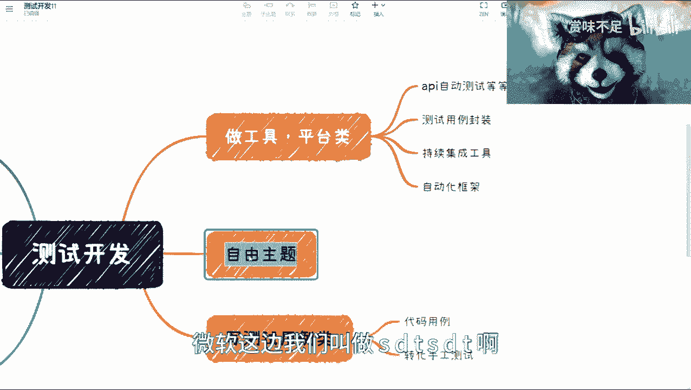

---

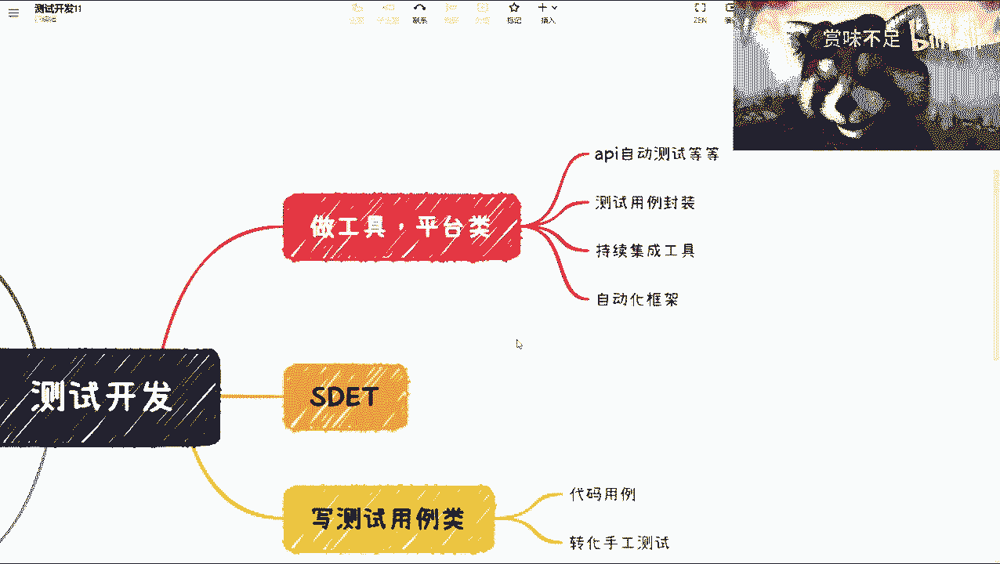

## 概述 📋

测试开发，在微软等公司常被称为 **SDET**。本节课程将深入探讨这一角色的具体工作分类，并评估其在不同类型企业中的存在价值与发展潜力。

上一节我们介绍了课程的整体框架，本节中我们来看看测试开发的具体工作内容。

## 测试开发的主要工作分类

根据当前行业实践，测试开发的工作大致可分为以下四类。

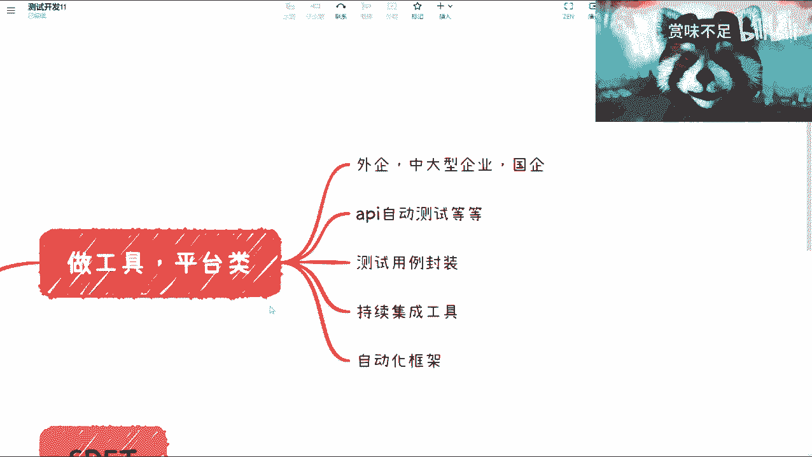

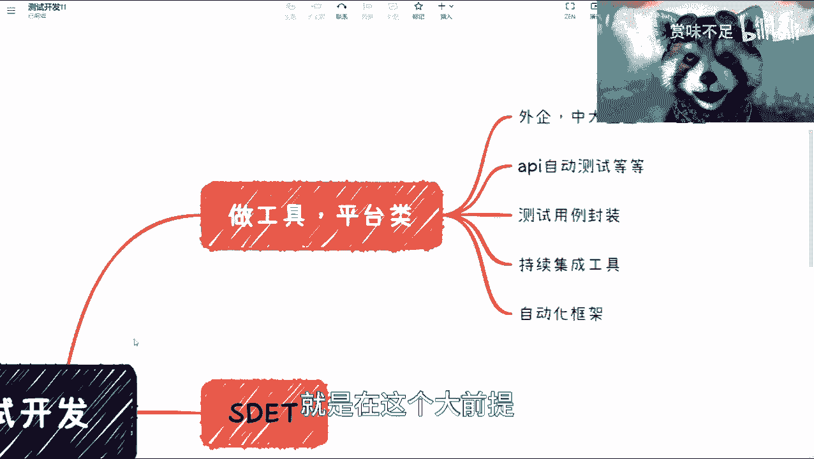

### 1. 工具平台类 🛠️

这类工作常见于外企、中大型企业或国企。这些公司通常对软件工程流程较为重视，或资金相对充裕，有能力投入资源建设内部测试工具与平台。

以下是工具平台类工作的常见方向：
*   **接口自动化**：开发用于接口测试的自动化工具或框架。
*   **测试框架封装**：对现有测试工具进行二次封装，提升团队使用效率。
*   **CI/CD 集成**：构建和维护持续集成/持续部署流水线，集成自动化测试。
*   **自动化测试平台**：开发带界面或不带界面的自动化测试脚本与平台。

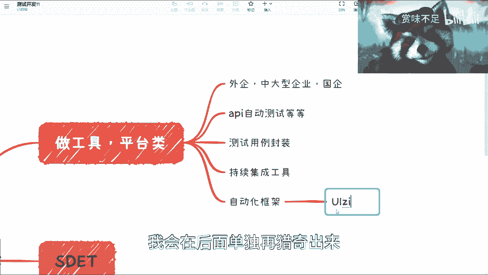

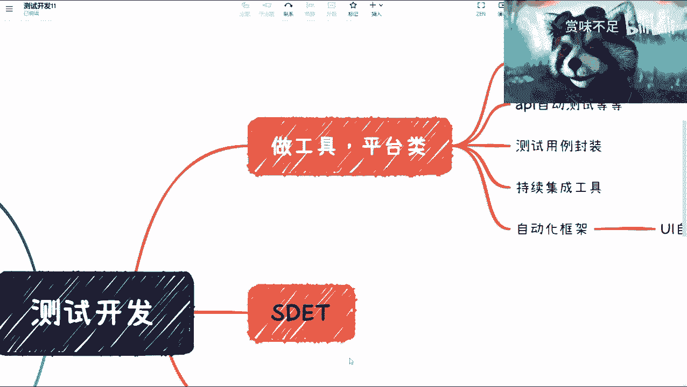

在这些工作中，**性能测试**和**有价值的接口自动化**是相对核心的部分。性能测试与线上用户体验直接相关，价值直观。而接口自动化的价值则高度依赖于其用例设计的有效性和对实际问题的检出能力。

UI自动化测试也属于此类，但关于它的详细讨论，我们将在后续章节单独展开。

### 2. 编写测试用例类 📝

这类工作主要涉及将测试用例代码化，通常有两种形式。

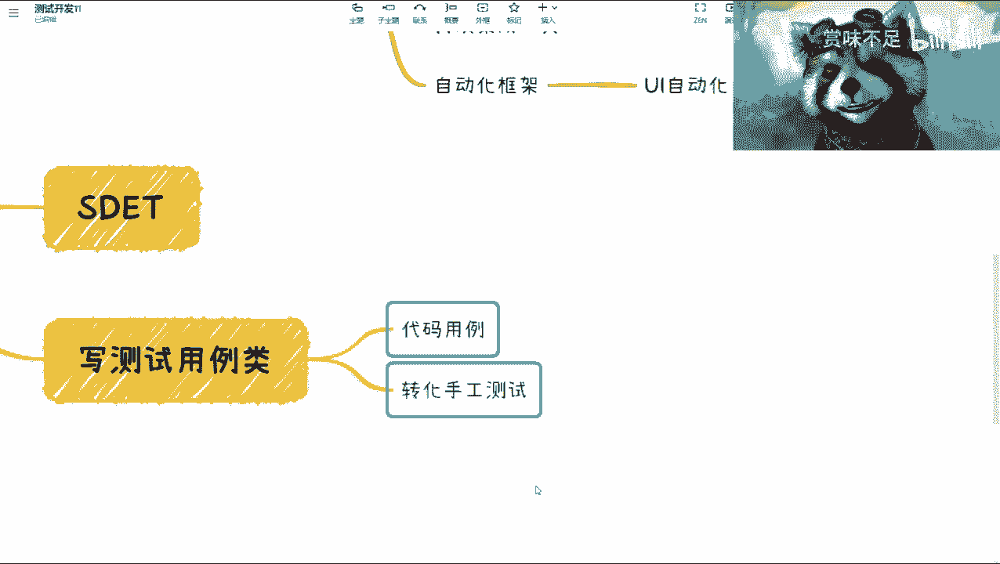

以下是编写测试用例的两种主要方式：
*   **直接编写代码用例**：使用代码直接定义和组织测试套件（Test Suite）与测试用例。
*   **转化手工用例**：将已有的手工测试用例，按照优先级、模块等维度，有选择地转化为自动化脚本。

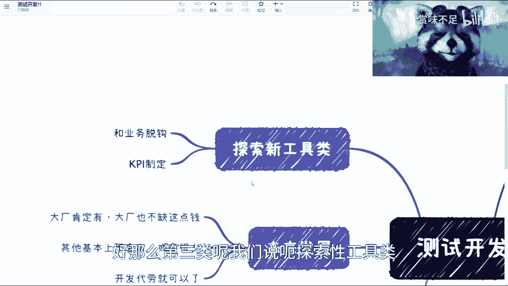

这类工作的价值取决于其产出结果。衡量标准包括**测试用例库的覆盖率**、**代码覆盖率**以及自动化流程的稳定性和完整性。现实中，许多所谓的“自动化测试”只是“半自动化”，需要大量人工干预和维护，其实际价值因此大打折扣。

### 3. 探索新工具类 🔍

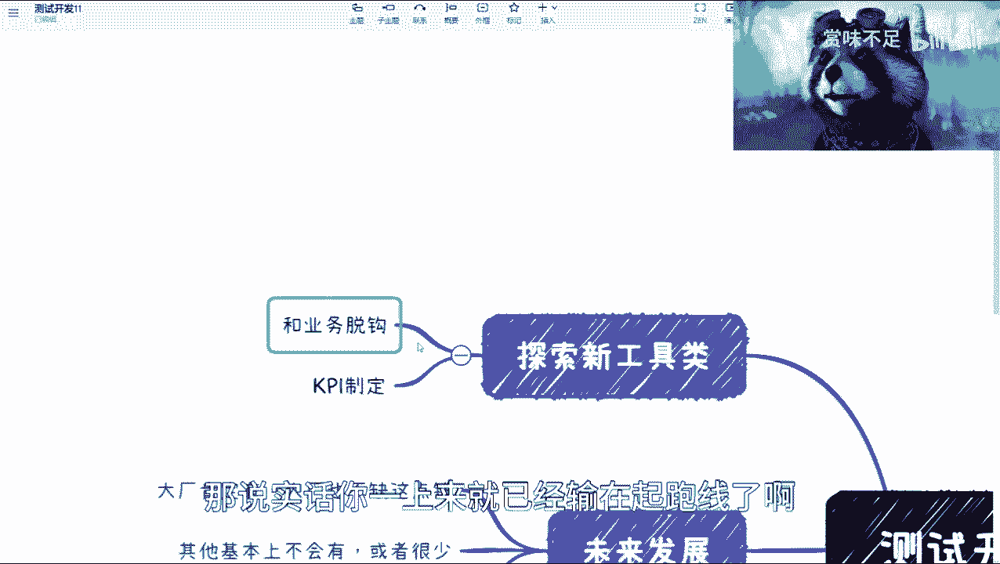

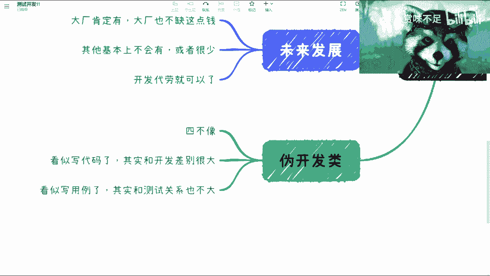

这类工作旨在研究和引入新的测试工具或框架，以期提升团队效率。

然而，这类工作往往面临挑战。新工具的探索容易与当前实际业务脱节，无法立即产生价值。同时，其绩效（KPI）也难以量化衡量（例如，是以工具可用性还是以发现的Bug数量为标准？）。一旦与业务脱钩，其价值基础就变得薄弱。

### 4. 伪开发类 ⚠️

这是指那些看似在从事开发工作，但实际上与产品开发核心相去甚远的测试开发角色。

这类角色处境尴尬，原因如下：
*   **与开发有差距**：编写测试框架与开发一个真正的产品所需的能力和经验不同。
*   **与测试本质脱节**：测试的核心价值在于对业务的理解、测试用例的设计和缺陷的敏锐洞察，而非单纯比拼代码能力。如果核心是代码能力，企业为何不直接招聘开发工程师？
*   **定位模糊**：这导致测试开发人员在职业转换时面临困境：转向开发可能因经验不足需要降薪，而转向传统测试又可能因薪资预期不匹配而不愿接受。

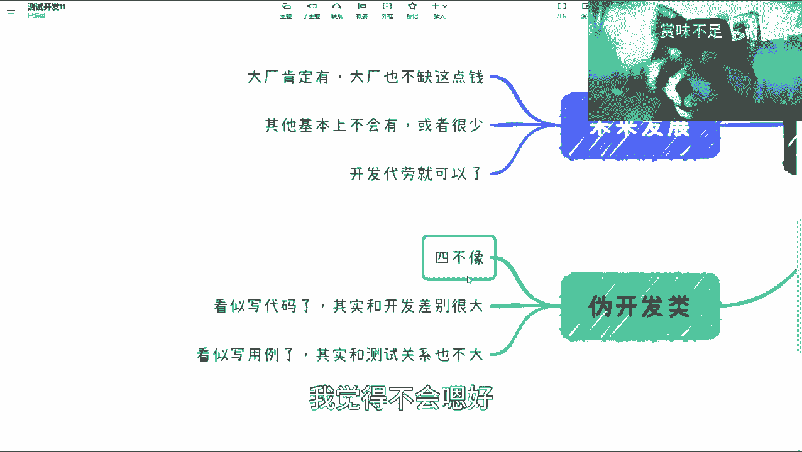

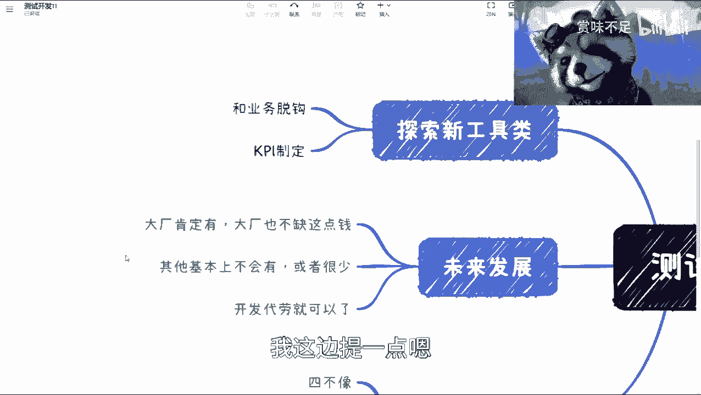

上一节我们梳理了测试开发的主要工作类型，本节中我们来看看其整体的发展前景与个人定位。

## 未来发展前景与个人定位 🧭

测试开发的岗位在未来依然会存在，但总体趋势是岗位数量**越来越少**，竞争将更加激烈。

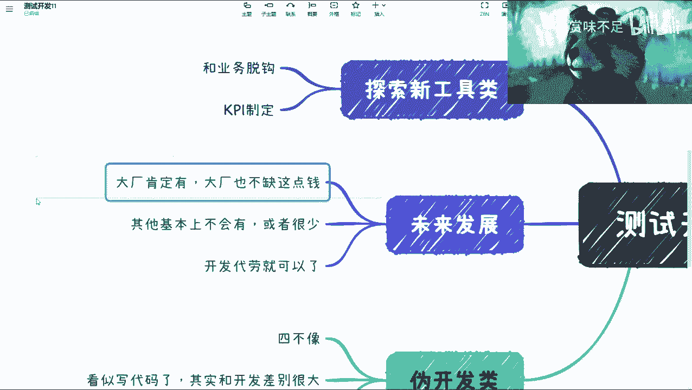

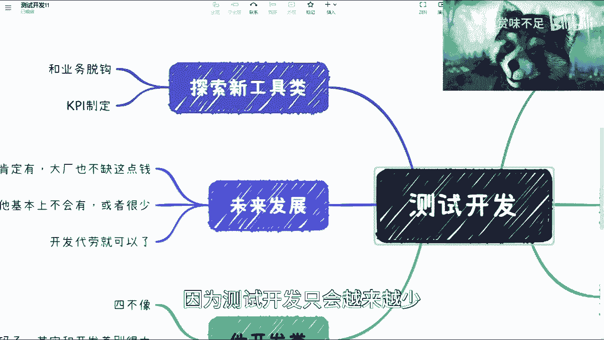

### 市场岗位分布

*   **外企与大厂**：仍会保留测试开发岗位，但坑位有限，可能只占整个技术岗位的极小比例（如1%甚至更低）。
*   **其他公司**：岗位将非常稀少。更多的情况是，一个团队可能只配备1个甚至0.5个测试人员，且需要兼任其他职责。许多测试工作（如单元测试）可能由开发人员代劳。在经济下行、成本压力增大的环境下，企业会优先削减被视为“非核心”或“价值不高”的岗位。

### 个人发展建议

面对这样的趋势，测试开发人员需要认真思考自己的核心竞争力与职业路径。

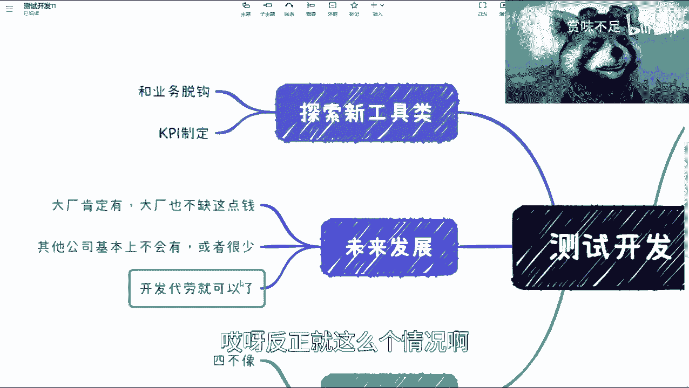

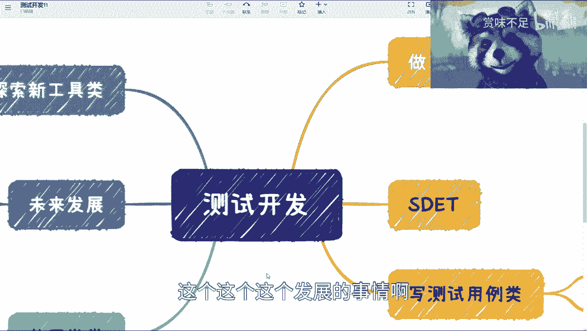

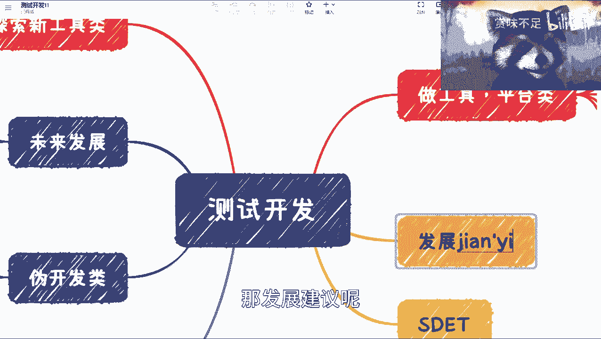

以下是几条可能的发展建议：
*   **坚守顶尖平台**：如果你能力出众，可以努力跻身并长期服务于一线大厂或外企，在这些有限的优质岗位中发展。
*   **转向开发**：如果你对编码有热情且年纪尚轻，及早转向纯粹的开发岗位是更直接的选择。开发岗位的需求更稳定，职业路径更清晰。
*   **转向其他职能**：可以考虑转向产品经理（PD）、项目经理（PM）、市场营销等与业务结合更紧密的岗位。这些岗位对业务理解的要求与测试经验有部分共通之处。
*   **尽早规划，持续积累**：最需要避免的是陷入“经验无效积累”的困境，即积累的经验既不属于测试核心，也不属于开发核心。职业转换越晚，难度越大。

评估职业选择时，应将眼光放长远，以10-20年的跨度来思考岗位的持久价值和个人的可持续发展能力，而非仅仅关注短期的薪资高低。

---

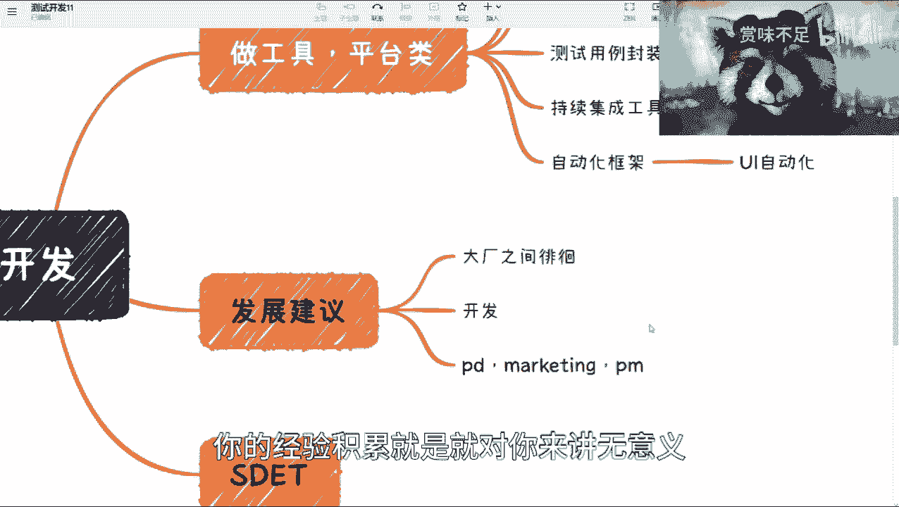

## 总结 📝

本节课中我们一起学习了测试开发（SDET）的角色内涵。我们将其工作分为工具平台、编写用例、探索工具和伪开发四类，并分析了其各自的价值与挑战。总体来看，测试开发岗位正朝着更精英化、更核心化的方向收缩。对于从业者而言，关键在于明确自身定位，是深耕于大厂的技术专家，还是果断转向开发或其他业务领域，都需要基于对行业趋势的清醒认识，尽早做出适合自己的职业规划。

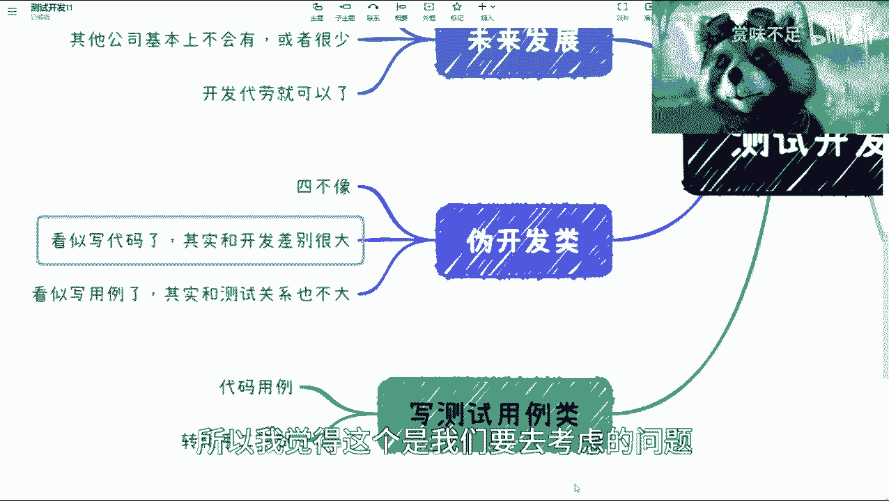

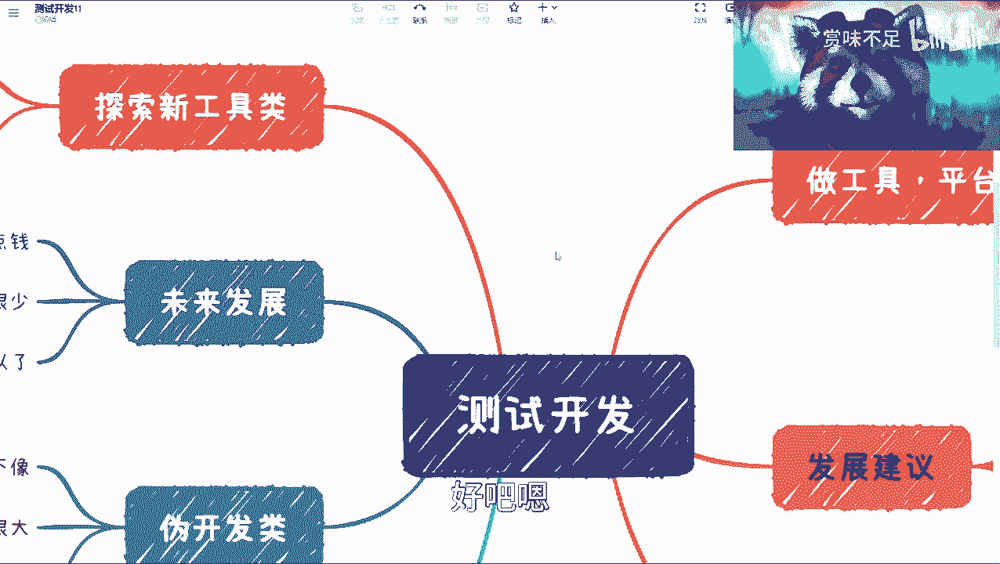

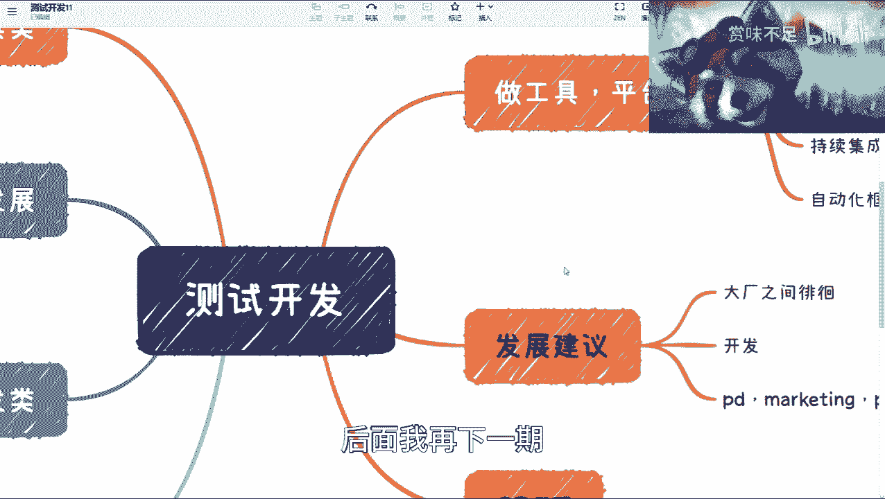

关于UI自动化测试等更具体的话题，我们将在后续课程中详细展开。