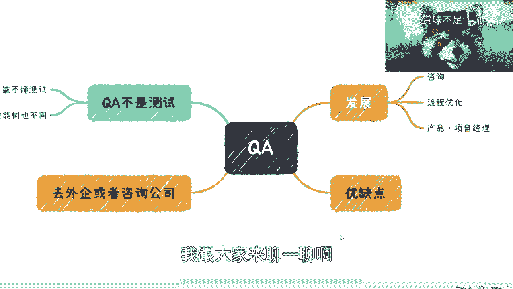
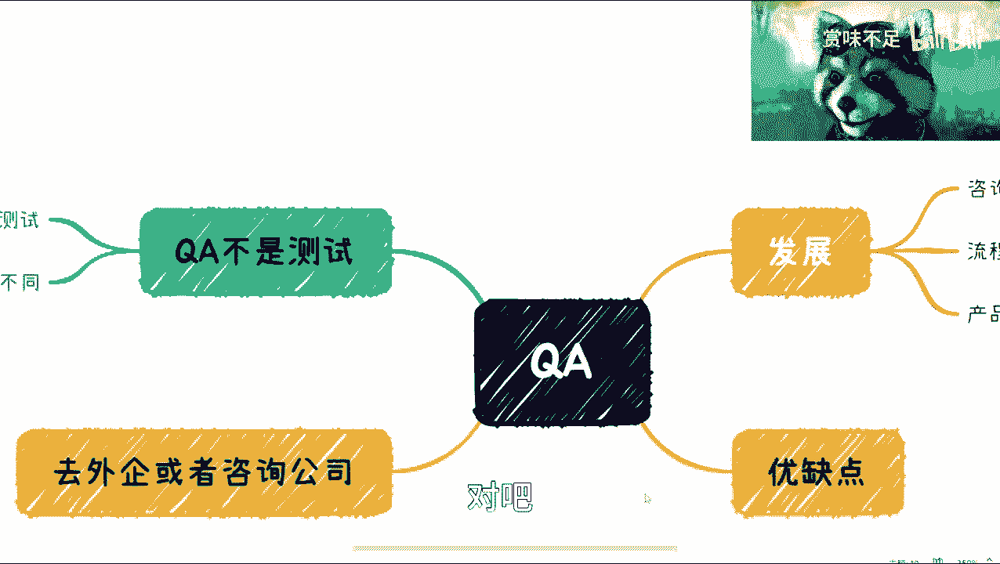
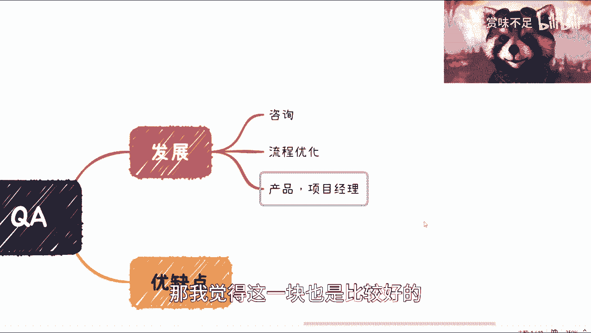
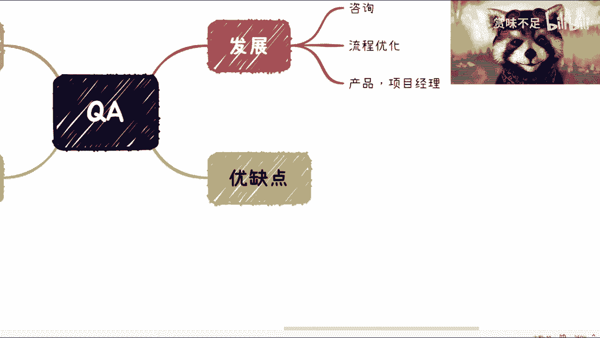

# 解析软件测试之QA这个岗位 - P1 - 赏味不足 - BV1wY411i7nc

好大家好啊，按照之前我订的那个那个大纲啊，那么我们这次讲的是这个QA，差不多是第一个标签的最后一个内容了啊，那个大家有什么想了解的也可以告诉我啊。

嗯QA这个呢我其实可能讲不了太多，因为本身我也不是说特别了解啊，但是就我浅薄的认知啊，我给大家来聊一聊啊。

首先是这样子的，就是很多人呢我觉得这个对于两者不是很清楚。

而且这个不是很清楚呢，就不是说是诶等一下啊，我把这个小浣熊呀呀呀，稍等我把，我把这个小浣熊调整一下好，就是呃我觉得很多的这个不清楚呢，他不是因为个人造成的，是因为整个市场他都不清楚呃，我举个例子来讲。

比如说比如说你今天到家公司啊，这个公司呢你会发现哦它里面有测试团队啊，软件那个开发对吧，还有QA对吧，好，那这个时候呢你比如说你比如说你你的mental啊，你会发现其实整个这个公司从上到下。

他对QA对测试，或者对这个相对于其他的一些岗位来讲，他的认知就是不足的啊，他不是这个一个人造成的，这个是整个一个环境造成的，这个就像什么呢，这个就像，怎么说呢。

啊这个就像我今天来说这个chat gbt一样的啊，就是说啊国外啊我们说也去研发很多的东西，到了国内我们不说它好或不好，但从大众和一个这个大范围基数的角度来讲，它就变成了一个叫做嗯。

叫做什么割韭菜的工具对吧，那么但是你说他割韭菜的时候呢，对这个chat gpp认知有多少呢，其实不用有认知啊，但他能割对吧。

那我觉得QA也是一样的，那QA现在我觉得最大的问题是什么，第一个就是说它不是测试啊，他跟测试从定位和这个职业发展角度来讲，它就是两个角度，而且在我的这个认知里面的QA本身，我说的直白一点。

就是它不适合国内的企业啊，它也不适合国内的这个个人的发展，我们来说为什么啊，是因为很简单，就是说目前国内的这个除非我们说啊，除非我们说是一些呃这个国有资产，你比如说核电啊对吧，航空啊对吧。

那我觉得就像我当时说说测试是一样的，那他肯定有必要对吧，但是我们排除掉这些大的企业，大部分的包括bat在内的那些企业，包括一些业务来讲，它是不需要可A的对吧，他甚至不需要测试对吧，你你你放到线上去测。

有什么区别，你放a b test有什么区别。

没有区别对吧好，那么我觉得一方面主要在于它的整个的这个，这个金字塔网上的这个岗位，它就比较少，第二方面就是说呃做了之后呢，他很难去让别人能评判到自己的价值，就是说我做的很好，但是别人并不知道我做的很好。

好那么我们来说呢这个虽然它不是测试啊，但是他呃有一点是什么呢，就是说你做一个测试啊，你可以不懂QA没问题，但是你作为一个QA呢，你是不能不懂测试的啊，甚至你说你作为一个QA。

你是需要对比如说啊这个软件工程啊，包括整个的流程啊，包括软件测试啊，它得有一个全面系统的了解啊，呃它所拥有的技能数也不一样，而QA这边呢在我看来，它其实更多的是在于一种叫做系统，方法论的落地。

以及对于整个质量上的一个保证啊，因为我们说啊在这两者的定位里面，其实它其实区别蛮大的，为什么呢，因为呃测试本身跟质量它是包含等号的啊，他是不划等号的，就是说质量的整个范围是极大极大的。

但是测试可能在整个质量范畴里面。

它是一个子集对吧，那么从目前国内的情况来讲呢，它比较适合在呃就是说外企或者咨询公司，像SWORKS对吧，然后外其他IBMAAAAAACP呀对吧，这个arm嘛对吧，这种芯片公司其实我觉得还是蛮多的啊。

但是呢就是说从你国内的整个的基数角度来讲，它还是比较少的对吧。

他还是比较少的，那么从发展来哎，我看看从发展来看呢，你比如说咨询对吧，比如说流程优化对吧，包括一些这个技术架构，其实你都可以，然后转行的话，那我也不知道转行吧，就是就是就是转业，也虽然也叫转行。

但是他并没有往互联网外面转嘛，对吧嗯，那么QA在我看来是更相比测试来讲，更适合去转，比如说产品啊，项目经理啊对吧，或者其他的一些，因为QA在整个的这个工作内容当中呢，它更多的是呃就像我们说的。

就是说他在一些硬性技能上面呢，它是一些呃无论是流程管理啊对吧，还是这个报表啊对吧，还是他的这个这个这个叫什么，就是调研啊对吧等等等，这些硬性硬性的技能呢，都相比测试来讲会来得更有用。

就是如果说你去做产品会项目经理的话，那么从软件技能来讲呢，它比测试的这个岗位更多的会去沟通，也更多的会去了解各方的一些业务对吧，那我觉得这一块也是比较好的。

但是呢就是说QA就像我一开始说的，就是国内的话，它的优缺点比较明显，就是你从优点角度来讲呢，我觉得它不那么卷啊，他不那么卷，就是说大部分的并没有大部分的这个，大量的基数往这里面跳对吧，当然了。

他不跳的原因也是，因为大部分企业它不招这个岗位对吧，而且嗯这就像我一开始说的，你们到boss直聘或者其他的网站上去搜呢，虽然搜出来会有一大堆，但是搜出来一大堆的原因是。

因为这些企业他自己根本就不懂QA对吧，他明明要招一个测试，他非要把测试写成QA对吧，或者说有些那个H2就偷懒，他懒得写，他可能一选就选QA对吧，但其实他招的并不是QA那么缺点，我觉得也很很清楚了。

就是国内的企业呢，它不是当下来讲，或者发展了20年的互联网来讲呢，它不是那么看重这件事情啊，你说有吧有的，但是大如果从大基数角度来讲，他就是不看重啊，看出的很少，那么你要这个长远发展。

或者说这个这个个人职业技能上面要去积累，我觉得是很难的，嗯啊所以说QA呢，我觉得就是说呃没有太多可以讲的，因为我自己不太也不是太懂啊这块东西，那么但是有一点呢，我觉得给大家建议是什么呢。

就是说呃千万不要把你们现在所，比如说工作当中啊，或者来说日常的一些招聘啊，其他方面就是把这些数据去看成真实的数据，因为就像我刚刚说的，就是说你们很很很有可能看到的大部分数据呢。

是因为这个企业或者这个hr，对这个岗位的不了解，甚至你们的直系领导或者CPU，对测试或者QA也都不了解所导致的，但是对于大部分人来讲呢，我们得要去了解什么是正确的，什么是不正确的。

而不是说是被他们就是说的，别被一些错误的这种这种理论带过去好吧。

