# 软件测试解析课程 - P1：认识QA岗位 🔍

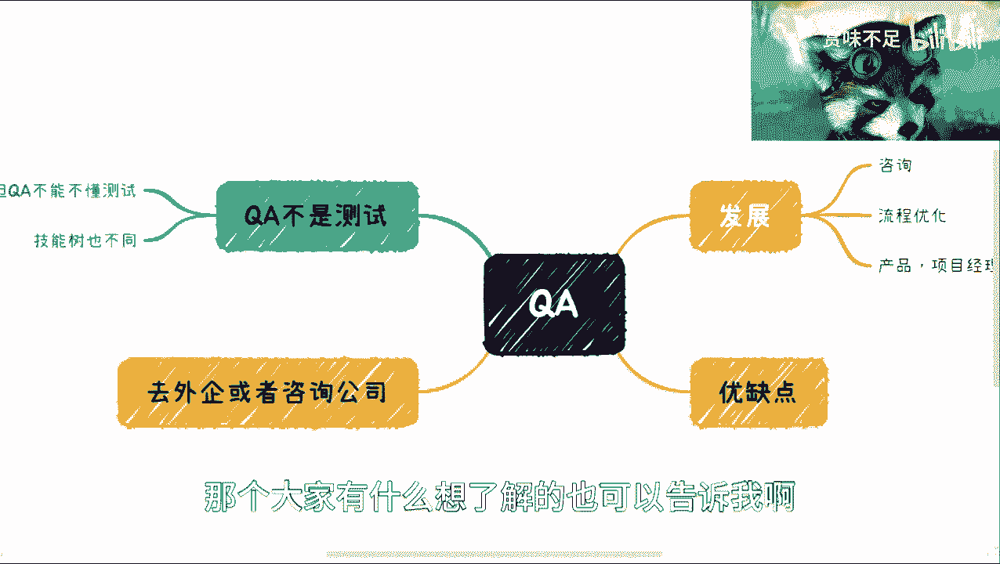

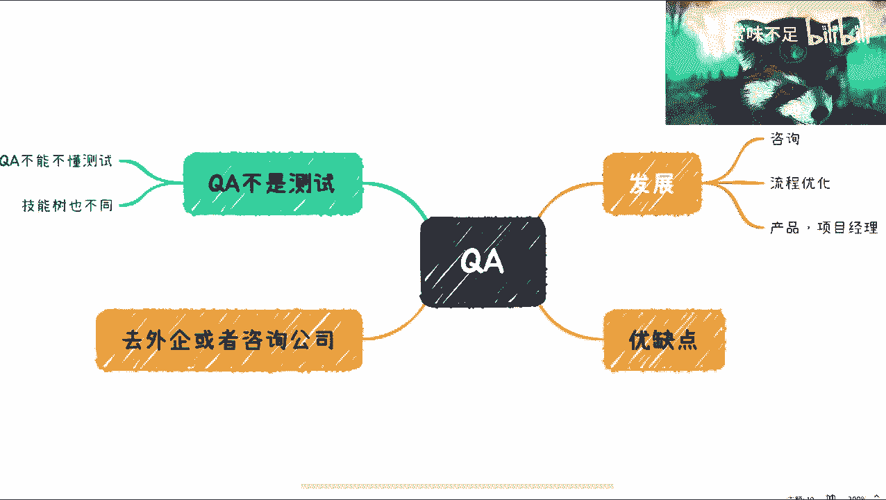

在本节课中，我们将要学习软件测试领域中一个常被提及但易被误解的岗位：QA（质量保证）。我们将厘清QA与测试的区别，分析其在国内市场的现状，并探讨其职业发展路径。

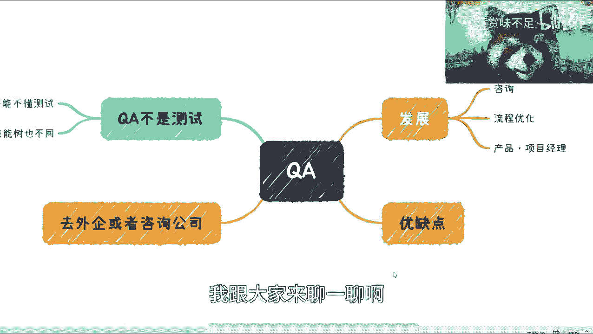

---

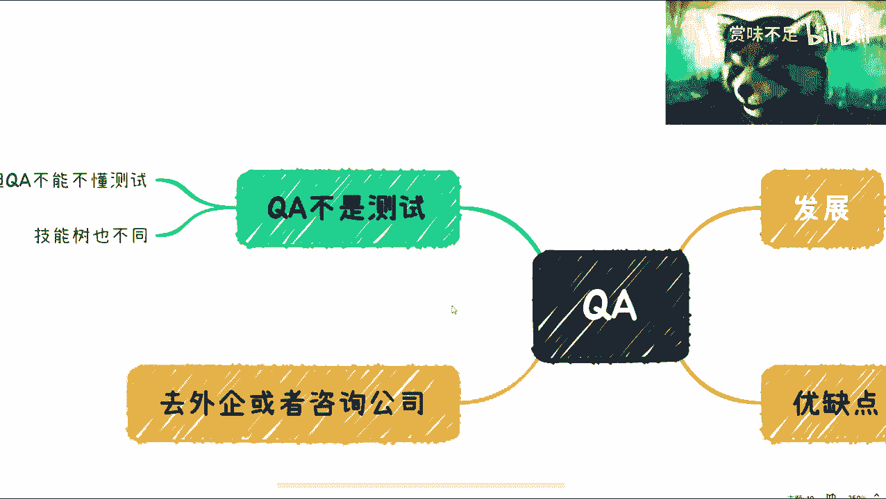

## QA与测试的核心区别

很多人对QA和测试岗位的区别并不清楚。这种不清楚并非个人原因造成，而是整个市场环境导致的认知不足。

例如，在一家公司里，你可能会看到有测试团队、软件开发团队和QA团队。但往往从上到下，公司对QA和测试岗位的认知都存在不足。这就像某些技术概念在国内市场可能被简化或误用一样。

**核心区别在于定位**：QA不是测试。从定位和职业发展角度来看，这是两个不同的方向。

*   **测试** 的核心工作是发现软件中的缺陷。其价值通常体现在发现的Bug数量和质量上。
*   **QA** 的核心工作是**保证质量**。这涉及到系统方法论的落地和整个质量体系的构建。

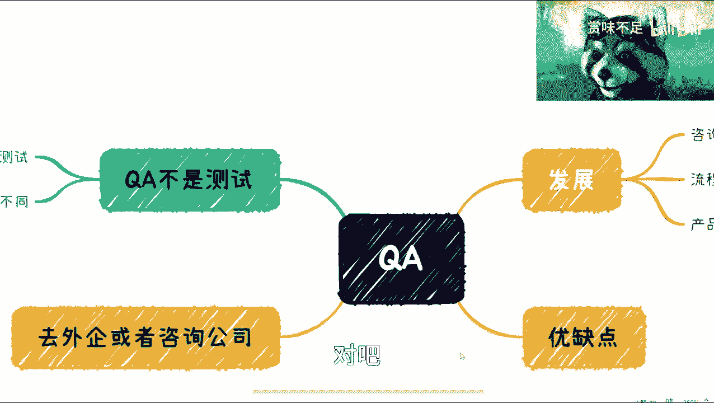

我们可以用一个简单的包含关系来描述：

**质量保证范围 ⊇ 软件测试范围**

这意味着，软件测试只是庞大质量保障体系中的一个子集。QA需要关注的范围更广。

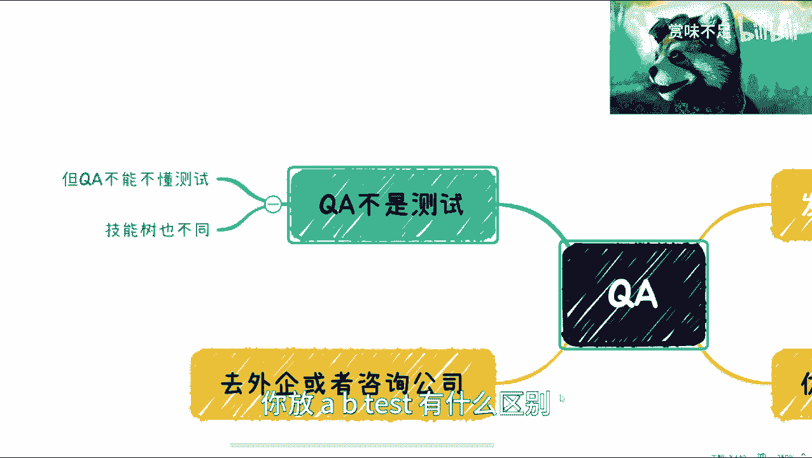

---

## QA在国内市场的现状

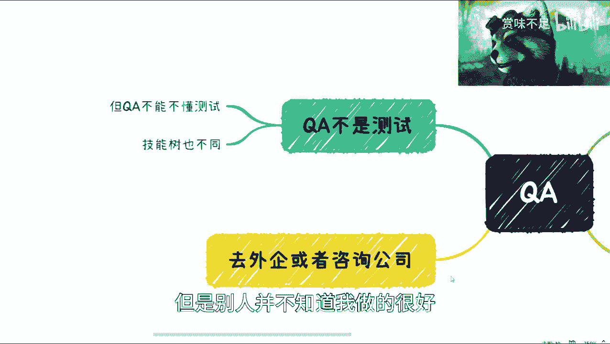

上一节我们介绍了QA与测试的区别，本节中我们来看看QA岗位在国内的具体情况。

在我看来，QA本身不太适合当前国内大多数互联网企业的环境，也不太适合国内个人的普遍职业发展路径。

原因主要有以下几点：

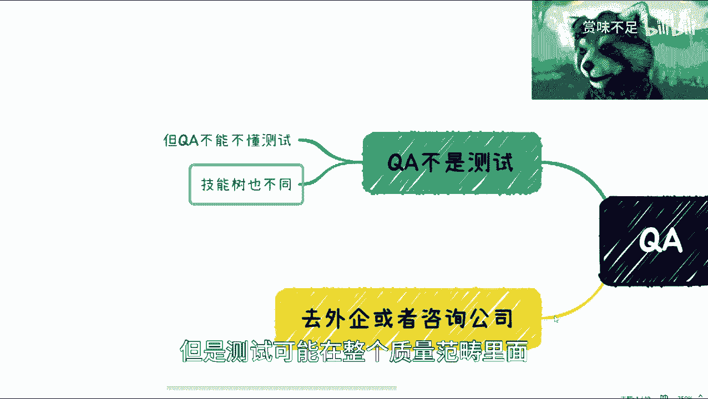

1.  **岗位需求少**：除了核电、航空等对安全性要求极高的领域，或部分大型国有企业，国内大部分互联网公司（包括BAT等）的业务模式并不真正需要独立的QA岗位。许多公司更倾向于采用“线上测试”或A/B测试等快速验证方式。
2.  **价值难以被量化评估**：QA的工作成果（如流程优化、质量文化建设）往往是隐性的，很难像测试人员发现Bug那样被直接、量化地评判。即使做得很好，其价值也常被忽视。
3.  **市场认知混乱**：在招聘网站上搜索“QA”，会出现大量岗位，但这其中很多企业并不真正理解QA。他们可能只是想招聘一名测试工程师，但由于HR或业务方对岗位不了解，错误地使用了“QA”这个标题。

因此，QA在国内的优缺点非常明显：
*   **优点**：竞争相对不那么激烈，因为从业者基数较小。
*   **缺点**：国内互联网行业在过去20年的发展中，普遍不重视体系化的质量保证工作。从大基数来看，该岗位的发展空间和技能积累路径比较模糊。

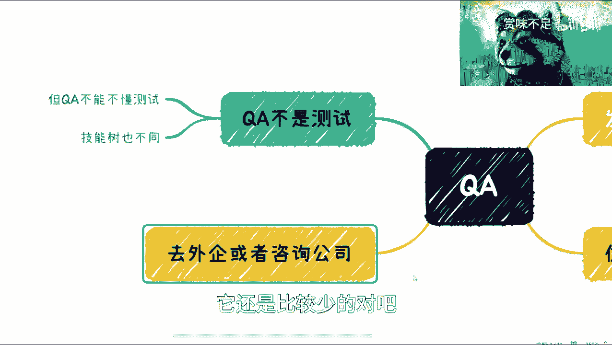

---

## QA的技能要求与发展路径

虽然QA岗位在国内面临挑战，但了解其真正的技能要求，对我们规划职业道路仍有重要意义。

一个关键点是：**测试工程师可以不懂QA，但QA工程师绝不能不懂测试**。QA需要对软件工程、完整开发流程、软件测试技术都有系统性的了解。

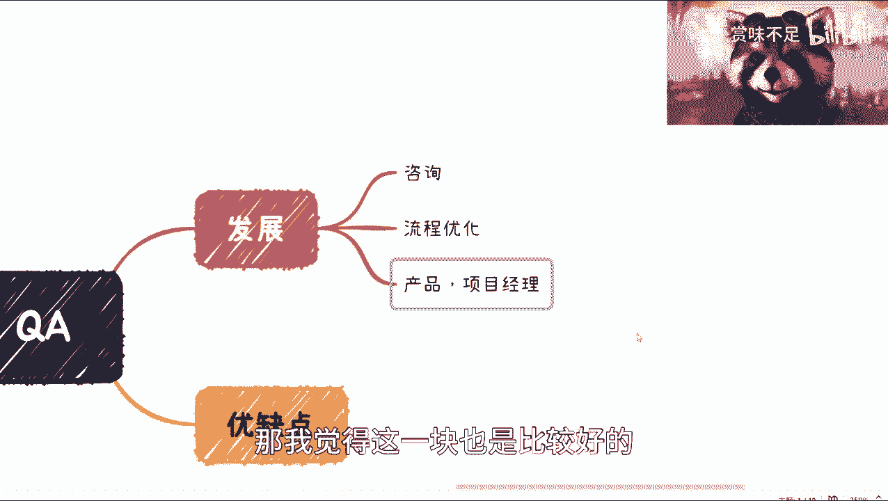

以下是QA所需的核心技能与发展方向：

**技能要求**：
*   **系统性知识**：掌握软件工程、测试理论、质量模型等系统知识。
*   **方法论落地**：能够将质量保证体系（如CMMI、敏捷QA）在团队中推行并落地。
*   **流程管理**：擅长优化研发流程，制定质量标准和规范。
*   **沟通与协调**：需要与产品、开发、测试、项目管理等多方频繁沟通，了解业务。

**发展路径**：
QA的职业发展相比纯测试岗位，可能更适合转向某些综合性岗位：
*   **咨询与流程优化**：进入专业咨询公司或大型外企（如IBM、Accenture、Arm等），从事流程改进工作。
*   **技术架构**：向质量技术架构师方向发展。
*   **转型产品/项目经理**：由于QA在工作中积累了广泛的业务知识、沟通技巧和流程管理经验，这些“软技能”使其更容易转型为产品或项目经理。

---

## 总结与建议

本节课中，我们一起学习了QA岗位的核心概念、市场现状和发展方向。

我们来总结一下关键点：
1.  **QA ≠ 测试**。QA是质量保证，关注整体质量体系；测试是质量验证，关注发现缺陷。
2.  **QA在国内互联网行业并非主流岗位**，需求较少，且市场存在认知误区。
3.  **QA需要更全面的技能树**，包括测试、流程管理和系统方法论。
4.  **QA的职业路径**可能通向流程咨询、技术架构或转型产品/项目管理。

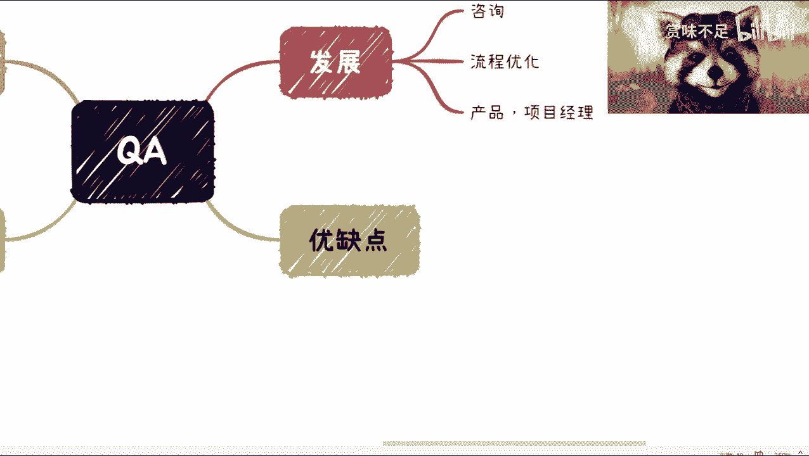

最后，给大家一个重要的建议：**切勿将当前招聘市场或工作中看到的混乱信息当作真相**。很多关于QA的岗位描述源于企业自身的不了解。我们必须主动去了解正确的定义和路径，而不是被错误的信息误导。