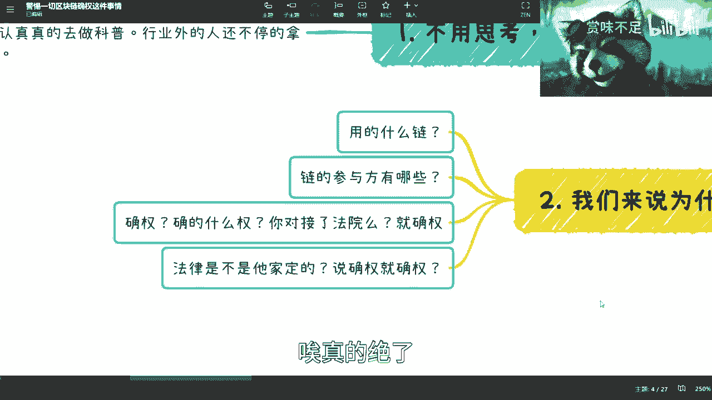
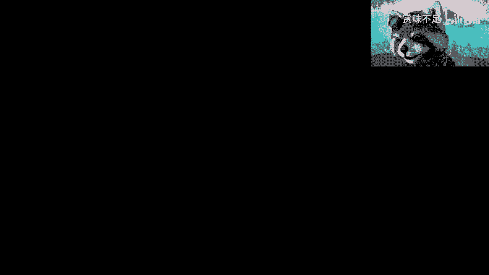
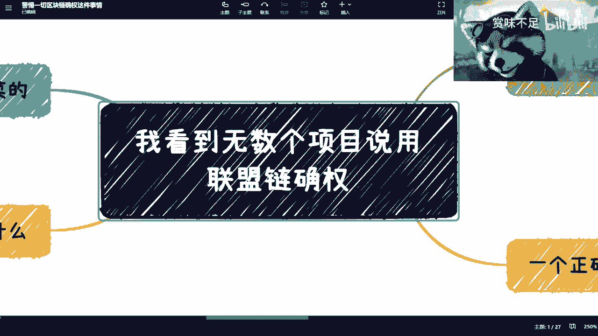

# 警惕用区块链作为亮点的各种项目 - P1 - 赏味不足 - BV1fv4y1p7zC

哈哈那个最近也有很多小伙伴给我看了，一些项目加区块链的东西啊，只要跟我讲的呢，我回答几乎应该都是一样的啊，就是骗局啊，骗得很啊，而且偏得非常不专业，但是一般人呢的确分辨不出来啊。

你们要是谁是读相关专业的，或者说现在是研究生做课题的，你们可以听一下我这期讲的东西啊，然后你们也可以想想看，跟你们学的东西有哪些差别，首先是这样子的啊，我看到无数个项目来跟我说，要用联盟链确权对吧。

第一啊我觉得不用思考对吧，一律都是割韭菜的啊，我跟你讲就是这么果断，为什么，因为国家在法律上面目前就没有定义过，同时国家在相关版权以及确权，相关的一些逻辑上面也没有做过，或者说正在做相关的一些落地对吧。

那你跟我说，国家还在做相关的一些边框边边框框上的东西，包括在做一些案例的一些试点，你跟我说，你的个，你看到某一个个人或者机构，就开始跟你说确权了，那不是割韭菜是什么，对吧啊，你看啊。

首先我认为一个行业为什么这么混乱呢，是因为行业内的人对吧，也不好好的，也不认认真真的去做科普，不告诉大家到底应该怎么做，同时呢行业外的人还不停的拿来割韭菜对吧，关关键是什么，关键是被割的那些人。

他也不清楚自己是不是被割了对吧，这就好像这个，前两天有一些小伙伴给我看的项目也是一样的，就说嘛说的很好听啊，用区块链确权了对吧，然后那些韭菜呢其实看上去哇厉害了，高大上了对吧啊，确权了以后。

什么什么版权属于你啦对吧，以后嘛什么什么啊，不用害，不用这个害怕别人去盗取了，他妈说了一套一套的，然并卵啊，然并卵，我们来看一下为什么南边吧，第二对吧，来看一下为什么，对不对。

首先第一点你说区块链确权对吧，可以，那我问你用的什么链对吧，我们就说国内的情况啊，公链我们先不讨论对吧，以太坊索拉纳这些我们先不说对吧，你比如说用的什么练，你倒是说他们也不说，你们去看大部分的。

几乎可以说所有的项目你去看，要用去看那什么确权的，你去问他用的什么练啊，缺的什么群，用什么练，他都不敢讲，讲出来你也不知道对吧，我就这一个，第二个你讲出来这个链链的参与方有哪些啊，有哪些你敢说吗对吧。

你说了之后啊，你呢我们作为用户，我们作为韭菜，我们能知道你的参与方是哪些，你怎么来证明这件事情呢，对吧，我跟你们说，今天不要说你你你这种乱七八糟的，令他不敢说，你今天就算腾讯蚂蚂蚁那个那个那个危重。

他也不敢说，说我的练就能确权，没有的，因为法律不允许啊，没有法律上的定义，谁他妈跟你说上链就确权了是吧啊，然后练的参与方是谁，第三确权缺的什么权，对你是对接了中国法院啊，这个中国的法院呢还对接了中央呢。

还是对接了谁，对吧啊，你说缺钱就缺权，法院，你家开的哎我就不明白了，我跟你们说就真的好搞笑的很，你知道吗，就法律他家定的，还是说怎么说对啊，动不动就确权，你缺的什么圈都不知道对吧，而且最搞笑的是什么。

你你今天是个区块链，区块链是个什么东西啊，不就是个技术吗，对不对哦，那照你这么说，区块链上了链有确权，那还要法律干嘛，不要法律的啊，是不是哦，我上了那就确权了，谁他妈告诉你的，唉真的吗，真的我跟你讲。

就是就是就是中国啊，这个很多人对吧，什么老师啦，培训机构啦，包括一些院士啦，教授啦，哎呀就老喜欢老喜欢用概念给你套，你知道吧，哎说的一套一套的，说什么什么区块链溯源了对吧，区块链什么什么叫什么啊。

这个跟踪啦对吧，然后不可篡改了，我他妈，我跟你们说都是你知道吗，然后第三个你看啊，现在呢我跟你们说，国家层面呢的确各种地方都在做做尝试啊，我跟你们讲啊，我每次都强调一遍，你们别来问我。

为什么我能有这个这个底气来说这件事情，是因为中国这么多的地区对吧，包括海南啊，上海啊，南京啊对吧，包括以前上饶啊啊这个这个叫什么杭州啊对吧，这么多确权的东西我都有参与过对吧，包括今年版权局这边要去对接。

也是我要给他们出的方案，也是我给他们做的咨询，我怎么能不知道呢，对吧，唉我跟你们说啊，你要去国家层面，现在在做尝试是没有错的，但你要说商店确权这个事情就他妈扯淡了，你知道吗，为什么呢。

因为目前政府平台各地方，包括前两天上上几个月，我不是去苏州嘛，也都在做相关确权的这种就是什么叫做尝试，或者说这种项目的落地对吧，就所谓落地什么意思啊，就是更多的会去找一些对吧，比如说呃那个文物啊对吧。

或者说是一些国家愿意认可的一些东西，先做尝试，而不是说今天我们做了一个确权，比如说3月份做了确权平台，4月份就开始面向c端割韭菜了，没有哪个就中国，没有哪个就是真的是政府的背书。

或者政府的平台是这么做的，不存在的，你知道吧，他就算跟你这么说，他也不会来跟你说哦，我这个平台就完全能确权，也没有的对吧，你们要明白所谓的链是什么东西，它只不过是一个存储机制，对不对。

所以说在这个地方我写的很清楚，什么叫什么叫上链，上链就是一个记录对吧，就是你log一下，而且这个logo是不是不可篡改或者是不是合理，还得看它的共识机制和参与方到底有哪些，对不对。

不是说我今天就上了一个练对吧，那我今天我也可以跟你们说，我也有个练啊，你们来来了，怎么滴了，这练练牛逼啊是吧，牛逼什么东西啊，哦我就比如说我自己在a w s，就是那个亚马逊或者阿里云上面。

我就部署了一个自己的服务器，然后我他妈布了一个脸，那我是不是还是一个人的那个数据库吗，有什么区别了哦，我我你们你们上我这个店就确权了，缺的哪门子权啊，缺的哪家的法律啊，这不扯淡吗。

这不是你说是不是哎一塌糊涂，我跟你们讲真的一塌糊涂啊，你比如说一个我们来讲对吧，一个正确的项目应该是怎么样的，首先你得有完整的节点参与方法，就比如说我今天跟你们讲啊，我们来看这里啊。

哎不用就不用在这里吧，啊这样这样这样这样对不对，好我们缩小一点啊，首先你看啊，你说首先需要一个完整的节点参与方，什么叫完整节点参与方呢，就是比如说今天我做了一个念对吧，是是这么一个东西啊，我说好。

这是一个叫做版权确权的脸啊，好那我说怎么怎么去学呢，那比如说这个对吧，是我啊，这个是我没问题啊，那这个呢你比如说得要有个互联网法院吧，法院啊要要要取证的啊，这个呢比如说版权局啊。

然后呢比如说这个呢可能有一些这个第三方呃，那个公证也不叫公正，叫做确权机构啊，好那么比如说还有什么其他或者说合作方对吧，好对吧，那你这个练叫做什么，叫做一个完整的链，你知道吗，叫做完整的确权的脸对吧。

就就就大部分都是只有我哦，后面什么都没有的，我就确权了啊，缺缺他家定的法律的权是吧是吧，那你说这是第一个，第二个是什么，练的记录，是指为了可信的溯源跟记录没有别的作用，什么叫可信，可信的。

意思是比如说今天这些是我这个练的参与方，对吧哈，那我这根链上的数据，我得告诉大家这根数据是怎么才能改，或者怎么才是谁说了算的对吧，那至少我得告诉大家，这个链上面的数据不是我说了算，也不是法院加索尔算。

也不是版权集体加所有算对吧，他可能是比如说是哎我的权重最低，因为我是个民营企业，对不对，那互联网法院地方版权局，但这两个可能是缺那个权重比较高的，那么我们说这个数据怎么改呢，做多签对吧，所谓做多迁。

就是说这两方必须都同意，那么这个数据才能改对吧，那么这样的话，我们的数据才能有更好的一个保障嘛对吧，那这个叫共识机制啊，这个叫共识机制，那如果来说这个东西不告诉你们啊，我就说是我就是我也不告诉你。

但事实上这个链上数据就是我一家说了算的，那请问这个链上的数据，有他妈的任何毛线的溯源跟记录，还有可信可言可言啊，你们明白吧，对不对啊，好好，那么第三个，你整个链上的链条。

一定是需要有版权局或者版权中心的介入，或者登记吧对吧，因为你做任何一个东西，所谓确权是什么意思啊，从法律上来讲，只有他们是可以确权的，我我是没有权利确权的，练也是没有权利确权的，能明白吗对吧。

我觉得真的就是真的，你知道你们知道，就是因为非常多的常识都没有了啊，都没有了好吧，然后第四个最好互联网法院可以接入，为什么呢，因为在这个过程当中，所谓确权它其实是一个点。

但是确权这件事情它不是只有一个点的，他其实是有很多这个过程的对吧，包括就是说你得登记啊对吧，你得有证书啊，如果有问题了，还得跟踪对吧，还得还得法院打官司对吧，那么这个东西你肯定得要有法院的揭露吧。

当然没有也无所谓，因为他不是确权的一个必要条件，但至少他是吧对吧，好，那么最后你必须要有一个完整的浏览器吧对吧，你们就当然有很多人可能不明白什么叫区块链，浏览器，就是浏览器的意思是什么。

就是他得提供一个东西给用户，能够完整的去了解到整个链上的，比如说啊这个叫什么，就是啊记录的这个流动啊，就是这包括哈希值啊，就反正就是包括就是说这个链上，所有记录的信息，它得是一个公开透明的一个状态对吧。

他有吗，他也没有，他敢有吗，他也不敢有，为什么，因为他他没有啊，他就是他只能够就是跟大家吹吹说，哎我有个练对吧，哎我确权了对吧，我怎么样了，但是他敢有吗，不敢了，因为他做不了啊，你们懂吗，他做不了啊。

ok那说到这我可以再给你们举个例子，上海b站对吧，b站这边有个高能量，高能量也做过一些确权的东西，没有错，但是他做的是什么呢，他做的是版权登记对吧，和是上海数据交易所，还有上海呃，主要是上海数交所。

数交所这边做的合作，但是你们去看他做的东西，第一基本上大部分都是免费的，就抽签对吧，第二数据交易所这边做版权的那个单机证书，也是基本上去年11 12月份才开始做对吧，他告诉所有的人，就是说我只做登记。

我没有别的作用，明白吧，我只做登记对吧，什么叫我只做登记，就是我只是给大家做一个登记的，这么一个叫做记录啊，在法律上面我不会说这个登记就已经承担了，说他版权的这么一个作用也没有的，你知道吧。

因为版权是版权对吧，数据登记是数据登记，这是两码事儿，你知道吗，唉，所以呢就是说就是我真的我碰到就就近2年吧，我碰到过很多人，就是非常兴奋的对吧，微信来跟我说，他说陈老师我们看到了对吧。

有个项目牛逼啊对吧，这个什么结合了区块链，终于开始做数字经济，数字资产，然后我一看，我说他妈骗子说了，然后我再一看还是骗子，他妈看下来就他妈没有一个不是骗子，为什么，因为那不透明啊，所有东西都不透明啊。

你那么你就跟我说区块链，那我也会写的呀，对不对，我做个网站上面写啊，我弱练了你，你能把我怎么滴，唉真的绝了。

我跟你们说，你知道吗，所以这也是为什么啊。

我还是那句话对吧，因为包括这两天评论区也有很有小伙伴跟我谈，院士不院士的事情，我我在微博上也说，他说的很清楚了，什么院士不院士，我一律不信的，因为对我来讲，我只关心你的能力怎么样。

我只关心你到底能做什么事情，我不关心你所谓的title这些态度有什么用啊，没有用，除了骗人还能有什么用啊，对不对，我只关心你说出来的理论逻，你言论的逻辑，我只关心你输出出来的三观，别的我不关心啊。

就这就这么回事，别跟我说你是谁。

