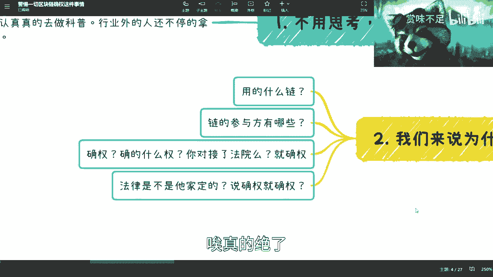
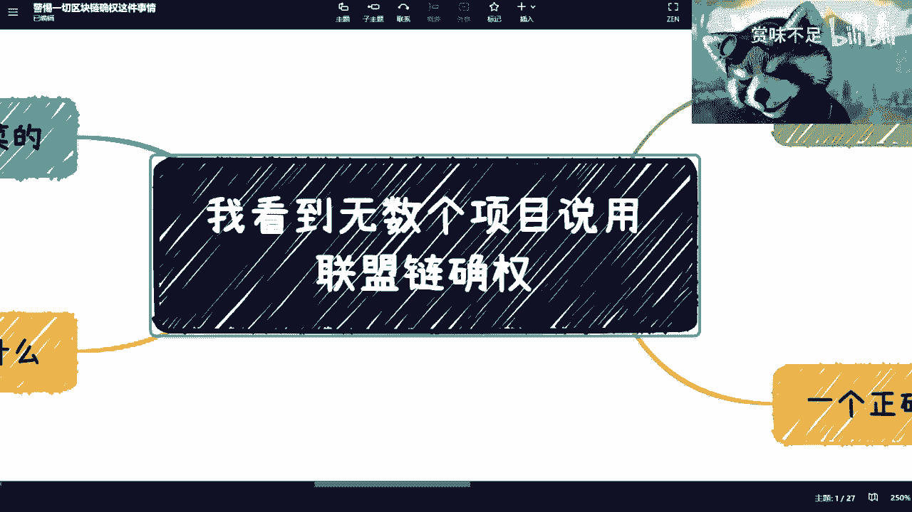

# 警惕用区块链作为亮点的各种项目---P1---赏味不足---BV1fv4y1p7zC

在本节课中，我们将学习如何识别那些以“区块链”为名进行包装，实则缺乏实质内容甚至可能是骗局的项目。我们将剖析其常见话术，并了解一个真正可信的区块链确权项目应具备哪些基本要素。

---

## 行业现状与普遍问题

近期，许多朋友向我咨询各种结合了区块链概念的项目。我的回答几乎一致：这些大多是骗局，且手法极不专业，但普通人往往难以分辨。

如果你是相关专业的学生或研究者，可以思考一下我所讲的内容与你所学知识的差异。

---

## 核心骗局：虚假的“区块链确权”

无数项目向我宣称，要使用“联盟链”进行确权。我的观点很明确：这类项目一律是割韭菜的。

为什么如此果断？原因在于，国家在法律层面尚未对区块链确权进行明确定义。同时，在版权及相关确权的逻辑与实践上，国家也仍在进行框架构建和案例试点。

因此，当某个个人或机构声称其平台能进行区块链确权时，这无疑是割韭菜行为。

---

## 行业混乱的根源

这个行业如此混乱，原因有二：
1.  行业内人士未能认真进行科普，未告知公众正确的做法。
2.  行业外人士不断利用概念进行割韭菜。

关键问题在于，许多被收割的人并不清楚自己已被欺骗。

---

## 剖析“确权”话术的漏洞

这些项目通常将“区块链确权”描述得天花乱坠，声称能保护版权、防止盗取。然而，这些说法空洞无力。以下是其核心漏洞：

**以下是“区块链确权”项目常见的几个不透明之处：**

1.  **链的类型不明**：他们使用什么链？是公链还是联盟链？具体是哪条链？他们通常不敢或无法明确说明。
2.  **参与方不明**：这条链的参与节点有哪些机构？他们无法提供可信的证明。即便是大型科技公司，也不敢声称其链能直接产生法律意义上的确权效力，因为缺乏法律依据。
3.  **确权的法律依据不明**：所谓“确权”，是对接了法院、版权局还是其他权威机构？区块链本身只是一种技术，不能替代法律。上链记录不等于法律确权。
4.  **混淆概念**：许多专家、机构喜欢套用“区块链溯源”、“不可篡改”等概念进行包装，误导公众。

---

## 国家层面的尝试与个人项目的本质区别

国家层面确实在各地进行区块链技术应用的尝试与探索。我参与过国内多个地区的相关项目咨询，对此有所了解。

政府的尝试通常是审慎的，例如选择文物等特定领域进行试点，而非立即面向普通消费者开展所谓的“确权”业务。没有一个真正的政府背书的平台会声称其能立即实现完全的法律确权。

必须明白：**区块链本质上是一种存储和记录机制**。所谓“上链”，就是进行一次记录（log）。这次记录是否“不可篡改”或“可信”，取决于其共识机制和参与方。

如果一个人自己在云服务器上部署了一条链，那与一个中心化数据库没有本质区别。用这样的链来宣称“确权”，是毫无法律依据的。

---

## 一个可信的区块链确权项目应具备的要素

上一节我们剖析了虚假项目的漏洞，本节我们来看看一个相对可信的区块链确权项目应该是什么样子。

**以下是一个可信项目应具备的基本框架：**

1.  **完整的节点参与方**：这条链不应由单一机构控制。一个版权确权链的参与节点可能包括：项目方、互联网法院、地方版权局、第三方公证或确权机构等。多方参与是可信的基础。
2.  **明确的共识机制**：链上数据的修改规则必须公开透明。例如，可以采用**多签（Multi-Signature）**机制，即需要多个权重较高的参与方（如法院和版权局）共同同意，数据才能被修改。这确保了数据的可信性与安全性。公式可以简单理解为：`数据修改生效 = 机构A同意 && 机构B同意`
3.  **版权登记机构的介入**：从法律上讲，只有国家指定的版权局或版权中心才拥有确权或登记的法律职能。区块链技术可以用于记录和溯源，但不能替代法律意义上的登记。
4.  **互联网法院的接入（非必需但更好）**：确权不仅是一个点，更是一个过程，涉及登记、取证、争议解决等环节。若能接入互联网法院，可为后续的司法维权提供便利。
5.  **公开的区块链浏览器**：必须提供一个公开透明的查询工具（区块链浏览器），让所有用户都能查看链上的交易记录、哈希值、数据流转等信息。这是区块链“公开透明”特性的直接体现。虚假项目往往不敢或无法提供此功能。

---

## 案例分析：正规项目的做法

以B站（上海）与上海数据交易所的合作为例，他们确实进行了区块链版权登记的尝试。但其做法是：
*   基本以免费抽签形式进行。
*   明确告知用户，他们只提供“登记记录”服务。
*   强调该登记并不直接等同于法律上的版权确权，版权归属仍需遵循相关法律。

这体现了正规项目应有的审慎态度和边界感。

---

## 总结与核心观点

本节课我们一起学习了如何辨别以区块链为噱头的项目。

**核心在于“透明”与“实质”**。一个值得信赖的项目会公开其技术细节、参与方、共识机制和法律依据。而骗局则用模糊的概念（如“确权”、“不可篡改”）包装，所有关键信息都不透明。

请记住：**区块链是一种工具，而非点石成金的魔法。** 在面对天花乱坠的宣传时，务必追问其具体实现方式、权威背书和法律效力。不要被“院士”、“教授”等头衔或“数字经济”、“数字资产”等宏大概念所迷惑，应关注项目本身逻辑的严谨性与透明度。

**最终，我只相信可验证的能力与逻辑，而非虚幻的头衔与口号。**