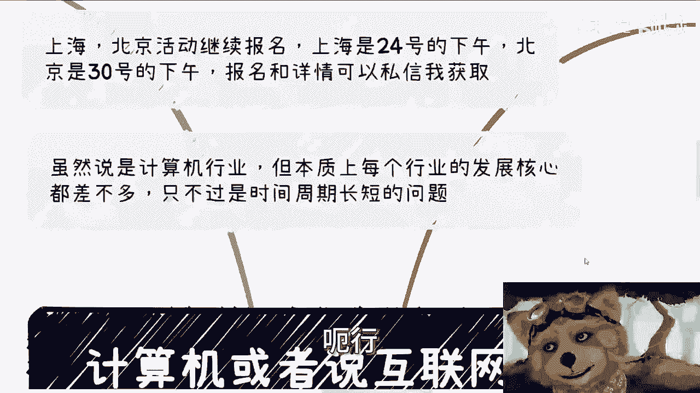

# 计算机和互联网行业当下面临的痛点问题 - P1 - 赏味不足 - BV1nZ421b7iR

嗯嗯哈哈嗯哈啊，大家好啊，哼今天终于他妈的有空在白天录了，我他妈也是服了我操嗯，首先啊这个上海北京活动继续报名啊。

上海是24号的下午啊，礼拜天北京是30号的下午礼拜六啊，然后报名跟详情可以私信我获取啊，然后这一期呢我们虽然讲的是计算机的行业，但本质上呢，我觉得每个行业发展核心都差不多啊，只不过呢就是我以前一直说的。

就是说互联网呢它就是，就在就是说他发展太快啊，他把人家可能30年要走的路，他妈的5年就走完了啊。

或者10年就走完了，所以呢就现在会变成这个样子啊，那么今天这个主题呢，就是说这个计算机啊或者互联网行业啊，现在面临的问题。

大家我觉得吧，反正如果你是呢，你可以姑且一听，你要不试呢。

你也可以姑且一听吧，因为都都差不多，其实呃我从几个方面来讲啊，第一个呢就是这个技术层面啊，我突然发现我这个背景啊，真的是越来越可爱了是吧，卡哇伊呢呃技术层面啊，首先昨天啊我看到这个媒体把计算机相关行业。

说是下一个天坑啊，说是下一个土木啊，怎么样怎么样，呃我觉得吧这个媒体虽然夸张了一点啊，但的确呢，这个问题是所有人实际面临的一个问题，呃我说实话啊，就是互联网发展到今天，渗透在各个行业。

其实已经不是互联网本身所面临的问题了，其实是各行各业面临的问题，你们听下去你们就知道了，就是说呃第一个我们先从技术层面来讲嘛，对吧，呃首先产业跟高校其实问题都有。

就是产业的问题在于互联网以前是百废待兴啊，比如说最早的时候黄页啊，3。5软盘对吧，CD光驱啊，我估计现在很多人都没用过啊，那到最早的电子商务啊，然后一路走过来发展期呢呃这么说吧。

就是你们但凡跟那些稍微老老一点的这种人，沟通一下啊，你们就会发现每个人都是风口上的猪啊，也就是说他技术好也好，技术不好也好，学历好，学历不好也好，反正他都能分杯羹啊，但是技术层面啊。

无论是互联网还是移动互联网，随着框架的越来越成熟，产业人员的价值跟技术含量其实越来越低啊，举个例子来讲，就是说以前做网站呢，大家都是手搓的啊，也就是说嗯作为一个东西呢，你可能成本比较高。

然后都是自己去做的，或者你需要找一些技术比较好的人啊来做，那你你你看随着时间的发展，现在就不是了对吧，现在比如说做网站啊，做网站做app啊，你别说找人做了，你直接你就算不懂，你找个什么收费的网站对吧。

那个套个模板也就会了啊，就直截了，当然后学校层面那就更好了，这一方面呢为了学生更好的毕业，另外一方面呢，其实我觉得也是为了更好的找到工作，毕竟啊，毕竟啊我们说互联网的整个发展过程当中。

应用层的这个出现越来越多啊，这就好像我们打个比方吧，这就好像你今天说啊，比如说手机移动智能手机出来之后呃，做应用的，做application的对吧，就是做这种产品的越来越多，你说能有多少是在做底层的。

比如说做做OS对吧，就是做这种啊这个这个这个呃底层操作系统的，你你说能有多少对吧，这肯定不在一个量级啊，那么你为了学生更好地找到工作，那学校的教学从曾经偏向于，也不叫偏向于原理吧，就曾经是雨露均沾啊。

然后可能会更偏向于原理啊，就教学的时候，然后呢慢慢慢慢就开始转向了这个应用层啊，这个事吧，其实我觉得从本质上来讲是没什么毛病啊，但是呃转向应用层呢就转得过了一点啊，而且忽略了底层就会让创新越来越少呃。

同时应用层的需求呢跟着整个产业的发展有关，任何一个产业它都有高速发展的窗口期啊，那么当这个窗口期过了之后呢，自然也就没有这么多需求了啊，那么自然需求没有这么多。

那就没有这么这么多head count对吧，那么自然也就这个出现了，现在大家所面临的这些问题啊，而且说实话呢这种情况其实是有长尾效应的，为什么你们想想看啊，我们现在讨论这个问题。

大家脑子里面是就是现状的，就是说比如说我们现在说2000年到2024年，大家感觉这24年是个时间线对吧，它就是一个节点到节点的，就是一个相当于是个闭区间对吧，就这个节点到节点了，但是在真正现实当中。

你们想想看啊，专科3年，本科4年，硕士才3年，当产业萎缩，或者当整个的这个需求量减少的时候，高校其实是不知道的，因为高校是脱节的嘛对吧，高校是不知道的，然后很多这个里面从业人员他也不知道啊。

那么这个时候就是说你专科3年，本科4年，硕士3年还在继续，那么你就会发现当这些学生出来的时候，他和整个行业啊，当他刚开始读的时候就已经断断档了，你更别说3年后，4年后，7年后，那更断档，你知道吗。

所以说就这个问题其实蛮麻烦的啊，那么这是第一个，第二个呢就是产业问题，产业问题是什么呢，就是说之前高速发展的时候呢，说不好听点，就是满地捡钱，一点都不夸张啊，以前整体风口的时候，为什么啊，我告诉你们。

为什么，其实到现在为止，很多人还在诟病PPT，因为当年我跟你讲，真的只要你PPT做的好，你妈走到哪，都是牛逼的，你都是王者，你知道吧，别人都跪舔你的，真的就当年是这个市场，就是这样子的。

你找工作我跟你讲什么玩意儿啊，hr也好，面试你的野人也好，懂啥对吧，就是你比如说他有3年从业经验，两年从业经验，大家50步笑百步有什么区别啊，大家经验半斤八两，然后呢，如果你PPT写的好，简历写的好啊。

花里胡哨，然后稍微能说能说会道一点，我跟你讲，牛逼了，起飞啊，然后再加上那段时间啊，公司也有钱，资本也有钱，反正烧的不是自己的钱，也不心疼啊，随着产业越来越成熟，你会发现啊，用户老百姓的钱越来越难赚了。

也就是说如果现在大家你你你们自己看吧，你你我不说以前了，你们现在就现在看能有多少，还面向老百姓的产品有吗，听说过吗，新闻报道过吗，没有的，现在面向传媒老百姓是什么摆摊，对不啦，呃呃呃小零食对不对。

电商这叫什么，这叫生态，这叫呃这这叫这叫商业啊，这叫生意，但是你说现在还有没有做一个产品啊，你说做一个什么什么网站，做一个app啊，黄赌毒我们不算对吧，你做一个产品，做一个网站，做个app。

面向老百姓的，能赚钱的，你妈听到过吗，最近没有啊，是不是，那所以说他只能转向B端，企业端跟政府端，那大家肯定也有印象啊，以前互联网企业的各种发展，然后再加上传统企业的互联网加对吧。

曾经因为因为中央不是一直呼吁互联网加嘛，然后是数字化嘛对吧，然后最近是那个数据资产嘛啊，然后随着时间的推移啊，互联网的各个产业的结合度其实都差不多了哦，那么什么意思呢，意思就是说人性就是这样子。

就是说你从没有到有，你都很兴奋啊，你都很兴奋很开心，然后各种干各种卷啊，然后呢上面有各种批钱啊，但当有了之后啊，比如说今天我们说花100个亿啊，作为一个产品，这个产品呢按道理来讲。

我的理想状态是70分啊，好现在100个亿投下去了，你发现卧槽这产品有吗，有了他妈只有30分好了，那你就会发现什么问题啊，一你发现哦跟当初想的好像不太一样啊，或者说跟好像跟这个当时想的这个也没有。

当时想这么有用啊，那么这是第一点，第二点是哎，反正有也有了对吧，之前是没有啊，现在0~1也完成了，你说的70分也好，30分也好，也就那么回事了啊，我又想到老罗当时的那句那句话嘛，就可能用就行对吧。

那么你会发现自然有了之后，他后续的发展也就放慢了，甚至不了了之啊，那么更何况每一年都有新的热点出来，还要追新的热点呢，谁他妈有空来管这些，有的没的，是不是，所以你才会发现就是烂尾。

这个事情在很多地方都有的，只不过实业的烂尾，大家有感受，互联网的烂尾，呵呵就真的叫做屁都没有，真的叫做屁都没有三啊，就是技能单一，我跟你讲啊，这事以前说啊，大家其实感觉不深。

但现在我相信但凡计算机互联网行业相关岗位，本质上它感觉肯定会越来越深，为什么，因为技能单一这个事儿呢，它会造成两个巨大的问题，第一个是他自己的竞争力会很不足，另外一个呢就是说他换方向比较难，那当然了。

别的行业可能也是如此啊，但是别的行业可能也都过了这个阵痛期了，互联网其实早期时候啊，你们去看2010年之前吧，大家分工蛮明确的，从某个时间点开始啊，就开始说什么啊，一个人当十个人用啊。

一个人当十个人用啊，然后说什么啊，持续集成，说什么什么工程效率对吧，什么提升效率啊，当时呢是没有996007这个说法的啊，但其实本质上已经是差不多这个意思啊，然后慢慢发展了，他就演变成了招人呢。

本来面试的是单一技能啊，后来就变成了多种技能面试啊，那么最后索性呢什么都问啊，就像我们以前一直吐槽我吐槽什么就是招嘛，是他妈的招一个小兵啊，面试的，搞得好像他妈的招我是一个COCT一样，co一样这样招。

那就这样面试啊，那么转行这个事呢可以说非常难，单纯如果从技能上来讲啊，还是说呃呃呃就单纯从性能上来讲，还是比别的一些行业来的好的，这有一说一的，但是问题在于哪里呢，就是互联网呢。

它的呃就像我们刚刚说的企业啊，啊高校啊或者培训机构啊，他这个衍生出来的这种人太多太多，然后互联网渗透的也太彻底了，然后就如我们刚刚说的，他有一个长尾效应在整个的就是萎缩，再到这个长尾效应结束的过程当中。

在这个最后的这段重叠的时间周期里面，其实你会发现这些学计算机出来的人，或者在互联网从业的人是最难最难最难的，因为他们既没有吃到这个互联网的红利期，是就反而是吃到了这个互联网最后的整个。

DEBUFF的这么一个时间，那你说惨不惨啊，那么第四就是说需求更加碎片化，发展也更断层，我跟你讲这个事情也很很神奇，就这个感觉怎么描述呢，这就打个比方，比如说2010年到2015年，很多需求它是连贯的。

比如说第一年我做过产品，第2年我可能加什么功能，第4年可能有个什么新的需求啊，那么每一年呢可以说在上一年的基础之上，可以做很多东西，那么自然发展也是连贯的，自然也会有很多团队，因为你发展连贯。

你才会去招募组建团队啊对吧，有了团队才会有count，但现在你会发现一个什么问题啊，就是自己组建团队可以说越来越少了，当然啊呃那个没有预算呃，成本高，这是一个问题，而另外一个问题是需求。

其实大家心知肚明，就是今年有明年还有没有就不知道了对吧，那你说如果明年还有没有还不知道，那你说今年花大力气去招募不可能的呀，从某种角度来讲，其实他减少了这种团队的组建，也就减少了headcount。

那其实当然了也没有问题啊，啊这个问题也没有问题，但是需求的碎片化也就阻碍了需求的连贯性，也是没有需求，连贯性也进一步减少了很多公司的团队的收入，那么大家等于不停的在换技术啊，换团队啊，换需求啊对吧。

然后就就就就就没有连贯性，那其实就是说本质上也许大家还有单子做，但是收入是没有增加的，那么很多人会发现另外一个问题，他说需求碎片化了，难道不应该更利好于外包，或者说那些计算机从业人员的副业吗。

那这个时候就有个问题，需求碎片化同时是在减少这个需求，你不是说需求碎片化，现在需求在暴增，那没问题啊，然后你会发现同时由于技术的成熟度很很高，供应商也好，包括现在什么低代码产品也好，供应商越来越多。

说白了是什么，就是个人或者小企业越来越难去分这一杯羹，以前由于信息差，由于就是说啊服务的不同，大家是可以分得到的，现在基本上没有啊，所以其实说白一点是什么呢，就是以前喝汤吃渣渣蛮舒服的啊。

大家都可能有不错的发展，但现在是明显就是汤和渣渣都已经没有了，那那那那你们想想看对吧。

所以说其实你会发现整个的这个这个产业发展，社会发展每个行业都一样的，就是当最百分百废待兴的时候，你可以去得到很多的case，你甚至可以作为别人的这个直接的，这个乙方的供应商，你也可以，而不是乙方。

就是甲方的供应商，然后你也可以甚至成为政府的白名单的供应商，对吧，那我呃随着时间的推移呢，哎你发现哦我可能供应商竞争不过来，那我要么去做乙方的供应商，就是乙方的外包或者乙方乙方的分包商好。

那截止到现在你会发现卧槽那乙方的分包商，乙方的供应商你都难做了，都卷成狗了，那怎么办呢，对啊，那更何况现在截止到现在为止，中国各个城市，还有就是虽然我不知道，我也没仔细了解过。

但是我相信肯定还有非常多的这种高校，还有这个培训机构，还是在那边说啊，要学家吧对吧，学什么东西，就把20年前10年前的东西还要拿出来说，然后就告告诉大家啊，很有前景对吧，两年工作两三年的年薪百万。

没有办法的呀，你知道吗，就是你们你们不要觉得好啊，好像哦现在还讲这句话很荒诞对吧，但是我跟你讲，你放到三四线城市一样一样，有人信的，为什么，因为哎又回到那个问题，因为所有的信息它都是有滞后性的。

这就好像当在互联网在一线，二线跌下神坛的时候，那么它在三线四线五线，它还在神坛上，你跌下神坛，不是1~5线一起跌的，没有这种，那就没有一个产业是这样做的，你知道吗，所以说哎呀怎么说呢。

就是就是就是就是产业行业，它就是这么一个问题，而且这个问题不是到今天就结束了，往后还得延续很长时间啊，所以这也是我为什么说就说就说啊，我们个体是很渺小的啊，我们想要去抗争不可能的。

你只能说啊我们自己对行业能有个正确的评估，我们自己对自己能有个正确的评估，然后我们能够做出一些这个及早或者说尽早吧，做出一些新的改变或者新的一些这个决策啊，听那些方向变化。

那才能在未来适应整个的一个变化，你否则你说啊，陈老师，我就是学计算机的，我就互联网的啊，然后我现在觉得工作很难找，我现在觉得薪资很低，然后我我我我我又这个啊害怕转到别的行业，或者我又害怕去呃。

做一些别的东西，那咋办呀对吧，就是你会发现全球也好，中国也好，整个全球的变化其实都很快，而你作为一个个体，你反而跟我说，陈老师，我很害怕变，那那怎么办，那你不就只能淘汰了吗。

是不是啊，嗯行就这么着啊。

然后那个活动好吧，你们两那个24号或者30号的，你们要报名去报名，然后就是职业规划，商业规划啊，然后什么股权融资啊，然后你们有什么啊想法的，或者你们就是目前正好在做点什么东西。

然后对于未来的整个的这个产品发展啊，你们职业发展可能不是特别清楚的话啊，你们可以整理好再走咨询好吧。