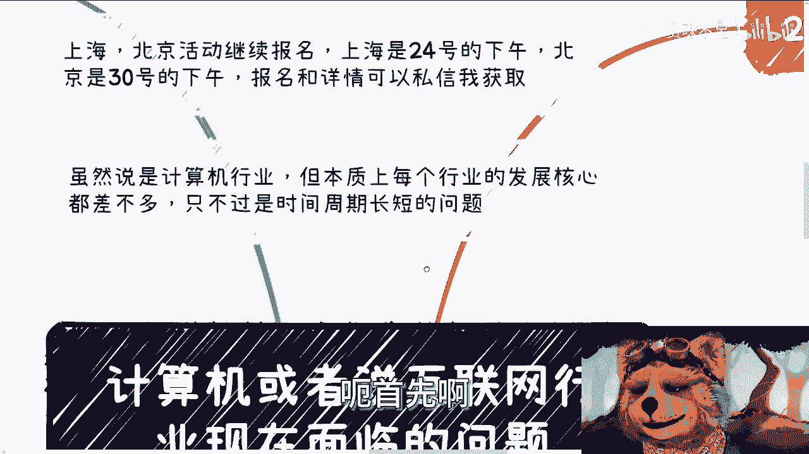
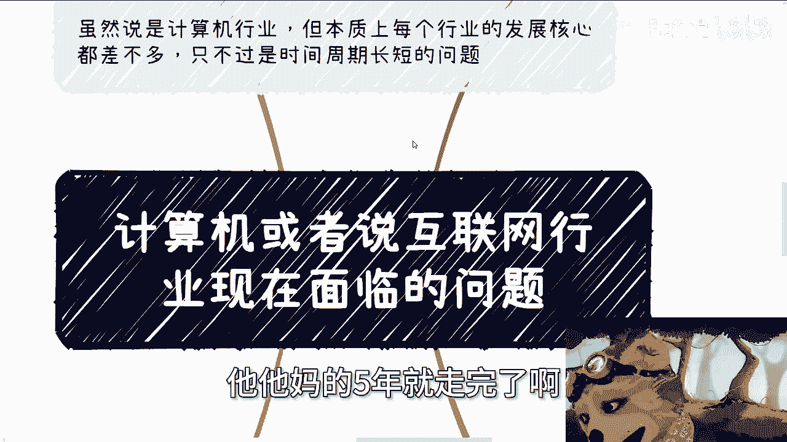
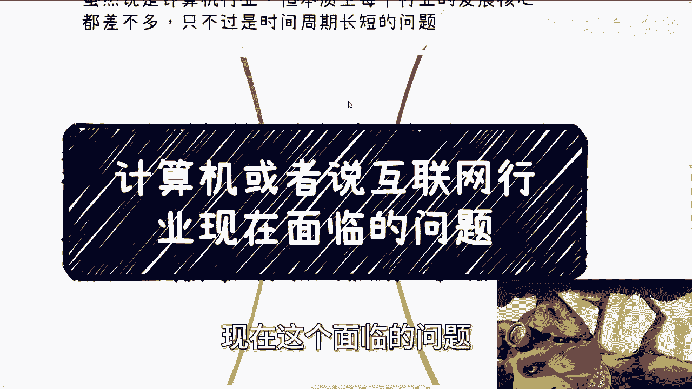
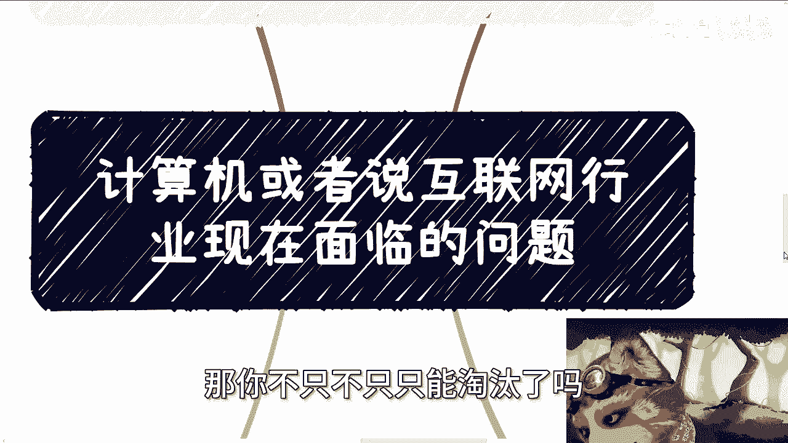
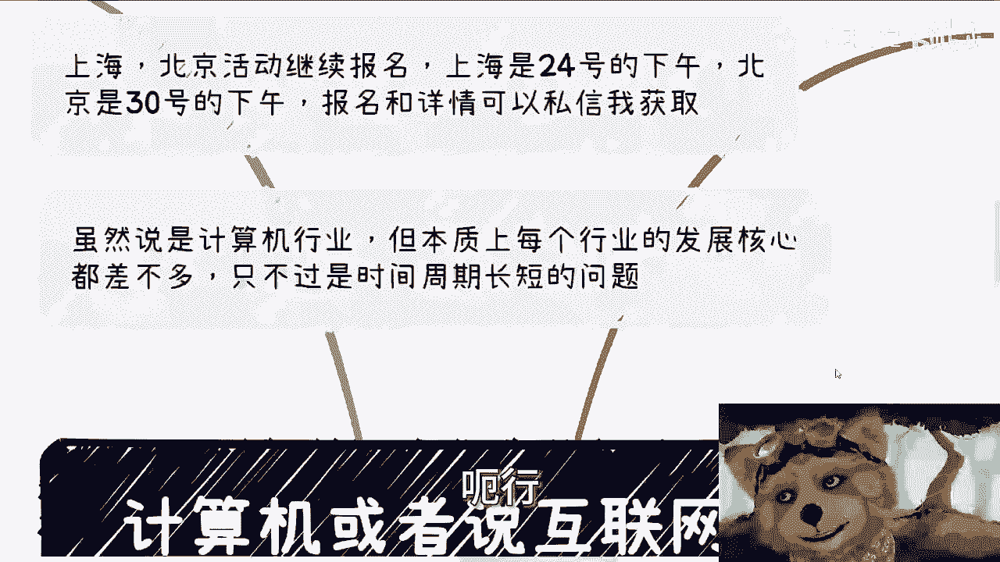
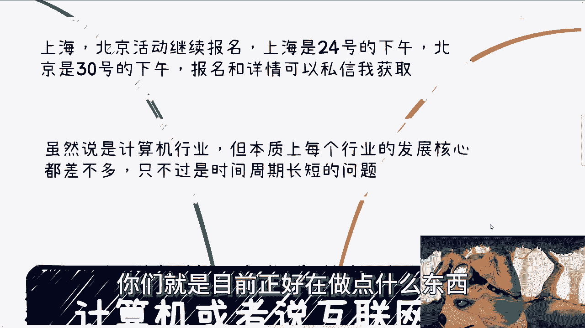

# 计算机行业现状分析教程 - P1 🖥️



在本节课中，我们将一起探讨计算机与互联网行业当前面临的核心痛点问题。我们将从技术、产业、人才和市场需求等多个层面进行分析，帮助初学者理解行业现状背后的逻辑。




## 概述 📋

计算机和互联网行业经历了高速发展期，但目前正面临一系列结构性挑战。这些问题并非孤立存在，而是行业发展周期、技术成熟度与市场环境共同作用的结果。理解这些痛点，有助于从业者更好地规划个人发展路径。

## 技术层面的挑战 ⚙️

上一节我们概述了行业现状，本节中我们来看看技术层面面临的具体问题。

产业与高校在技术发展上均面临挑战。产业早期处于“百废待兴”的状态，技术门槛较高，从业者价值显著。但随着技术框架日益成熟，产业对人员的技术要求反而在降低。

**公式：从业者价值 ≈ 技术稀缺性 / 工具成熟度**

当工具（如低代码平台、成熟框架）越成熟，完成相同任务所需的技术稀缺性就越低，从业者的个体价值也随之降低。

高校教育为了适应就业市场，教学重点从原理转向应用层。这虽然短期内利于就业，但长期来看削弱了创新基础，并与产业萎缩期产生了“长尾效应”。

以下是技术层面问题的具体表现：

*   **产业技术含量降低**：早期开发需“手搓”代码，技术含金量高。现在借助成熟框架和模板，开发门槛大幅降低。
*   **高校教育脱节**：教学偏向应用，忽视底层原理，导致学生创新能力不足，且教育周期与产业变化周期存在滞后。
*   **创新动力不足**：底层研究投入少，应用层创新随着市场饱和而减少。

## 产业与市场的变化 📉

上一节我们讨论了技术层面的问题，本节中我们来看看产业与市场发生了哪些根本性变化。

产业问题核心在于市场从“增量竞争”转向“存量竞争”。早期资本充裕，市场遍地机会。如今，面向普通消费者（C端）的创新型产品难以出现，盈利模式转向企业（B端）和政府端。

然而，B端和G端市场在经过“从无到有”的数字化建设后，投入热情减退。项目往往追求“从0到1”的落地，而非“从1到100”的深化，容易导致项目停滞或烂尾。

**代码比喻：**
```python
# 早期市场：增量模式
if market.is_high_growth():
    invest_heavily() # 大量投资
    hire_aggressively() # 激进招聘

# 当前市场：存量模式
elif market.is_mature():
    optimize_cost() # 成本优化
    focus_on_profitability() # 关注盈利性
    demand_versatile_skills() # 要求多技能
```

以下是产业市场变化的关键点：

*   **投资逻辑改变**：资本从烧钱扩张转向追求盈利，新项目融资变难。
*   **需求重心转移**：从C端消费互联网转向B端产业互联网和G端政务数字化。
*   **项目持续性差**：许多数字化项目完成初步建设后，后续投入与升级乏力，形成“数字烂尾”。
*   **招聘要求矛盾**：企业希望招聘“多面手”，以一人承担多项职责，但提供的培训和发展机会有限。

## 从业者面临的困境 👨💻

上一节我们分析了产业变化，本节中我们聚焦于从业者个人面临的困境。

技能单一化与市场需求碎片化是当前从业者面临的两大难题。早期行业分工明确，如今企业期望员工成为“多面手”，但这并未提升个人竞争力，反而在行业下行时增加了转型难度。

同时，市场需求变得短暂且不连贯。企业因不确定明年是否还有预算，而不愿组建长期团队，更多采用项目制外包。这导致工作机会零散，职业发展路径断裂。

**核心矛盾：** `市场需求碎片化` 并未增加 `自由职业/外包机会`。因为技术工具成熟和供应商竞争激烈，个人或小团队难以分得市场份额。

以下是从业者困境的具体体现：


*   **竞争力下降**：技能单一者在裁员潮中首当其冲，而所谓“全栈”要求又增加了学习负担与焦虑。
*   **转型困难**：行业经验在跨界时折扣率高，且从业者数量庞大，内部竞争异常激烈。
*   **职业路径不稳定**：项目制工作成为常态，缺乏长期的团队归属感和技能累积性成长。
*   **收入增长停滞**：行业红利消失，薪资水平见顶，甚至回调。

## 总结与展望 🔮

本节课中我们一起学习了计算机与互联网行业当前的多重痛点。

总结来说，行业正经历从爆发期到成熟期的阵痛，表现为：**技术门槛降低导致价值稀释、产业需求从C端饱和转向B/G端后劲不足、市场碎片化削弱了职业连贯性、以及人才供给的滞后效应加剧了竞争**。

这些问题具有长期性和结构性，并非短期波动。对于个体而言，关键在于认清行业趋势，放弃对过往“红利期”的幻想，积极评估自身技能与市场需求之间的差距。





**行动建议：**
1.  **深化专业**：在某一领域建立不可轻易替代的深度。
2.  **拓展边界**：有意识地学习相邻领域知识，提高适应性。
3.  **关注底层**：理解技术原理，而非仅仅熟练使用工具。
4.  **保持灵活**：接受市场需求变化，主动规划职业路径，而非被动等待。



行业的变迁是常态，个体的渺小在于无法改变潮水的方向，但我们可以选择如何建造自己的船，以及何时调整航向。适应变化、持续学习，是在任何行业周期中生存与发展的不二法门。