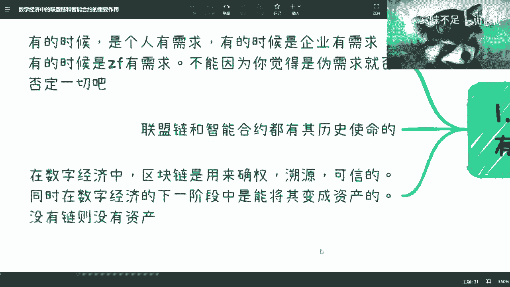
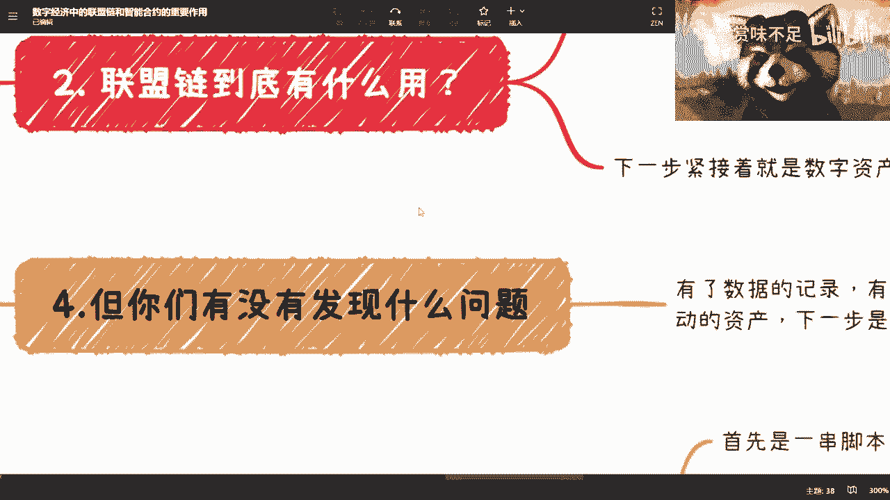
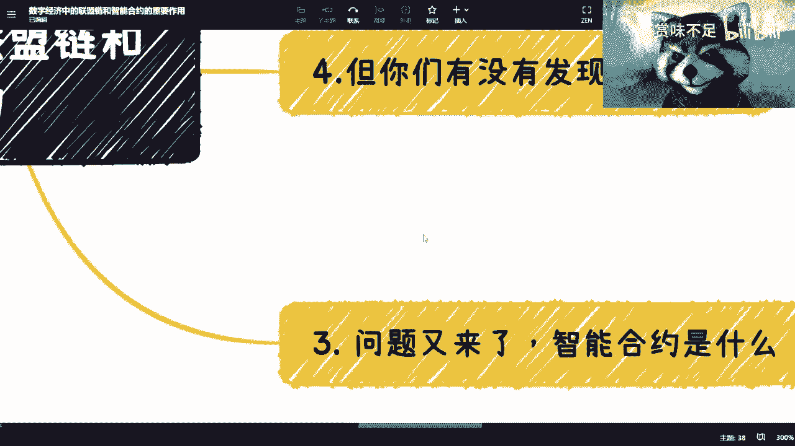
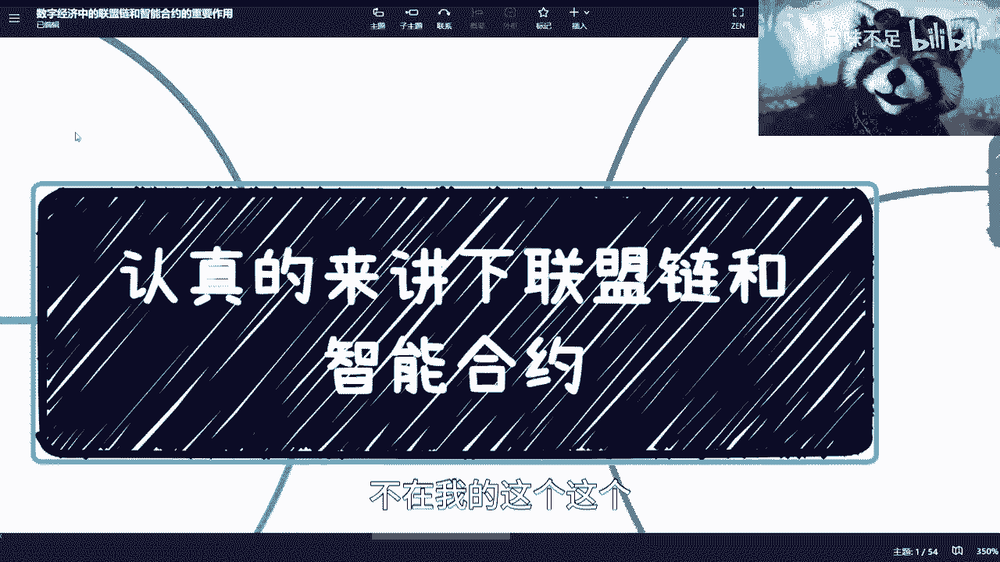
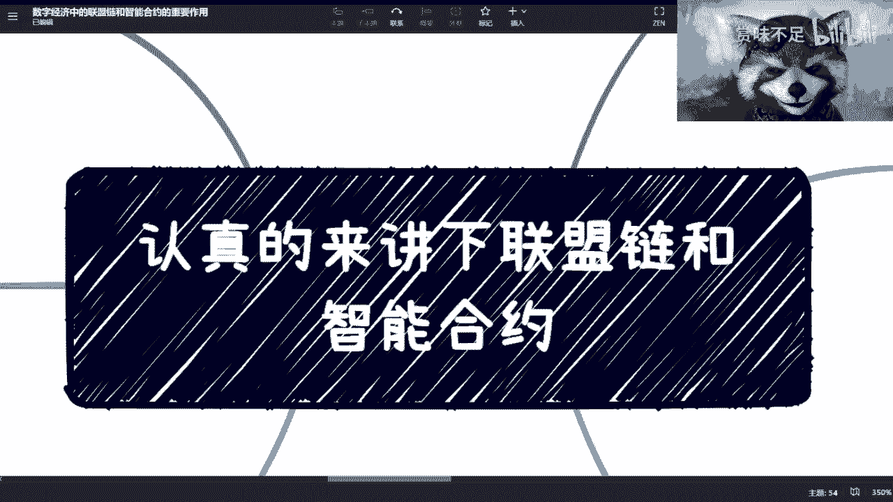

# 认真说下数字经济中的区块链和智能合约 - P1 - 赏味不足 - BV1Q84y1T7W9

好啊，各位小伙伴好啊，这一期呢我们来认真讲一下啊，这个数字经济当中的这个联盟链和智能合约，因为介于很多小伙伴其实不懂啊。

然后也介于说最近一些区块链专业的小伙伴，即将要毕业了，然后我觉得他们在学校里面，其实应该学不到什么东西啊，所以说我觉得这个内容呢，也适合即将毕业的这个大三大四的小伙伴啊，大一大二如果能听到吗，也最好啊。

那么同时让大家能够对数字经济当中，基础建设能有一个正确的认知，好吧，今天这个内容呢我归我讲，你们给你们听啊，你们但凡听不懂的估算我的啊，我就不信这玩意能有人听不懂。

首先啊是这样子的，哎我这个怎么回事啊，我昨天晚上直播直播的活动哑了吗。

难道首先是这样子的，联盟链到底是不是伪需求对吧，现在有非常多的人说啊，这个区块链里面封城公链和联盟链，对不对，这个公链呢是真正的需求啊，联盟链是伪需求啊。

怎么样怎么样怎么样对吧，说半天好，我们来这么说啊，首先我们得要明白啊，我最多最大限度能说的话就这个东西了，就是你要明白所谓需求是什么，有的时候是个人有需求，有的时候是企业有需求，有的时候是政府有需求。

不能因为你觉得是伪需求，就是伪需求，是不是对吧好，你看一个问题，就像我们以前看到一幅图，哎我找不到那个图了，就有一个圆柱体对吧，你从a角度看它是个圆柱体，你从b角度看它是个正长方体。

你说它是圆柱体还长方体呢，没人知道是吧，所以说你在这个过程当中，就是你得明白所谓需求是什么，你从不同的角度去看啊，他有需求，你明白吧啊好这是第一点，第二点是联盟链和智能合约，其实都是有历史使命的。

这个事情以前啊我们隐隐约约是有感觉的啊，但是从现在比如说啊这几年的发展啊，包括整个的这个政策的变化，包括啊2023年到现在4月份，整个三个月的一个一个情况，所以我觉得呢就是这些这条路啊。

我个人觉得是越来越清晰的啊，你们这个可以参考啊，不一定全信，第三呢，在数字经济当中的区块链主要是用了什么的呢，主要是用来确权确权，就是说项链记录对不对好，然后呢溯源对不对好，然后呢可信对不对好。

然后呢在数字经济的下一个阶段当中，能够将其变成资产的好，能向一变资产，那么这个资产就是由智能合约所产出的东西，好吧这个我们后面会详细讲的，你们先有个大的概念啊，我们有一个结论叫做你没有练。

就是没有资产的，你明白吧，就是说没有链，只有互联网，它是只有数据的，没有练，他没有资产，有了链它才会有资产啊，好那么在这个地方呢，我们说啊有几个问题啊，你这个小伙伴肯定都会抱怨这个问题。

他说确权我用互联网数据库也能确权啊对吧，我为什么要用数据库啊，要用区块链确权呢，对不对，好，这是第一点啊，好第二点溯源溯源，区块链有很多相关人员提出来，他说区块链不能保证源头啊对吧，你只能记录啊。

你怎么知道这个源头，对不对，对不对，好好没问题啊。

好这个我们待会儿来讲啊，我在这个地方记一下啊，一个是源头对吧，一个是那个呀，这么拉胯的吗，啊啊算了呃，一个是源头，一个是那个卧槽，我这两天痴呆了，还有个什么东西啊，确权，是吧，好好好ok啊。

我们详细来讲联盟链到底有什么用，对吧好，首先现有现在所有的核心啊，用的数那个技术都是互联网的，中心化的技术不好，那么我们说整个数据共享联盟量，做的第一件事情就是数据共享啊，数据共享跟数据的期权。

那么问题来了，问题是以前你说是不能共享呢，还是不想共享，我跟你说，有一些是不能共享，有些是不想共享，就是说各种各样的原因都有，但是你现在区块链的共享的好处在哪里呢，区块链现在共享好处是它可以做隔离啊。

它可以做数据隔离，什么叫数据，什么叫诶操这么拉胯对吧，什么叫数据隔离呢，就是说今天啊打个比方啊，这个，在这个链上啊，且b也在这个链上，且c也在这个链上啊，我不管这些企业是竞争关系，还是说合作关系怎么样。

每个企业之间肯定都有，有一些数据是不想让对方知道的，对不对，因为你一说数据共享，那么这里面一定就会涉及到商业机密，对吧好，那么这个时候我们就来这么说，就是你既要让别人共享数这个数据。

又要又要就是保证你这个数据的一个敏感度，包括你这个数据呃，做到一定的隔离，不让对方能够获取到，那怎么办呢，那么在这个地方就要用到，就是说我们的这个呃，就是一方面是这个密码学的问题。

另外一方面就是说这个数据得要你的，使用等各方面，比如说今天这个数据我用了对吧，这个数据我我我今天可能是啊要修改了，或者说数据怎么样呢，我都得有记录吧对吧，而且同时这些a企业，a企业，b企业c他都不希望。

虽然他不想说啊，但是他都不希望说哎谁听谁的对吧，大家是平起平坐的，那么这个时候你需要有一个，能够让大家平起平坐的这么一个技术，然后来做共享，对不对，那么当下来讲只有区块链能能这么做了啊，没有别的东西了。

对吧啊，你明白吗，就是说这件事情呢，既能够保证大家的一个这个企业的权益，又能够真正做到一个数据共享，那当然了，你你又要问了，就说啊这个最终数据共享了到底有什么用对吧，这个到底有没有共享。

我们先不去讨论这个问题，因为现在的问题是在于这些企业还没有区块链，你明白吗，就是说第一不是一些有有了之后，我们再去说这个上面数据到底怎么去共享，怎么去落，怎么去怎么怎么去隔离。

你明白吧啊就是这跟你们去创业是一样的，你先想好第一步变现是什么，第一步的商业逻辑是什么，你别去老是纠结1~100的这个过程，这个过程你想不信你想不清楚的，时代在变化，世界在变化，你有什么好想的，对不对。

好，那么我们我们说啊，这个这个就就啊我们先举个例子啊，我们先举个例子，比如说比如说电商一个正常的一个链啊，它应该是怎么样的，比如说啊我们现在有供应供应商对吧，供应商好，然后呢是比如说你创业的平台啊。

你创业平台好，然后呢比如说那个互联网法院对吧好，然后是那个第三方保险，第三方保险机构对吧好，然后呢嗯你的那个渠道对吧好，然后呢你的营销方，呃营销方好，然后呢是，嗯嗯好，第三方，比如说短视频平台啊。

或者说那个各种平台，好吧好，我们来缩小啊，我靠看得见吗，啊啊还可以吧，那么什么意思呢，就是说现在打个比方有一根链啊，是做电商的，然后呢，每一个我现在每一个框框，就是这个链上的节点啊。

那么你们可以理解为是链上的参与方，对不对，好，然后呢那么我们说第一步是什么呢，第一步是我们告诉大家，每一方你们都能够拿到同一时间，拿到我们这上面业务的一些数据，那当然这个时候你就要考虑一个问题。

供应商想要数据，法院想要数据保险，想要数据渠道，想要数据一样吗，肯定不一样，对不对，好那么这件事情做要用什么，就要用数据隔离，你明白吧，但是问题是这个时候又有个问题，如果有一个第三方机构啊。

比如说这个时候是我创业的平台对吧，我说哎我创业的平台，或者是一个或者是一个这个政府平台好吧，嗯那么这个时候呢就有个问题，就是你说哎那以前比如说这些都是独立的对吧，不在一个点上啊。

那么我们通过我创业的平台，就比如像淘宝对吧，或者说平那个政府平台告诉大家，哎你们这些数据由我统一来提供，就是我是一个分发平台对吧，由我统一来提供，行不行行，但是这个问题在什么地方，问题是在于行。

你可能更多的是通过你唉，比如说啊这个树大欺客对吧，店大欺客，或者说是这个从上往下的这么一个命令对吧，去做的，但它不是一个真正的一个一个共享平台呀，它不是真正的一个生态啊，它不是一个平起平坐的一个状态。

而且无论是我创造的还是政府创造的，我们说的不好听点，就是你你你今天要去这个负重做一件事情对吧，大家要把这个生态做大，那么所有人都会来质疑诶，那我为什么要相信你创业的平台呢，你是有什么可信度吗，对吧。

就算你跟我签了合同，你一样会改我的数据，你一样会去挪用我的资产，我怎么知道我一定要相信你呢，对不对，那不管是供应商还是你创造的平台，还是说第三方保险机构，还是你渠道，所有的人都会对你产生质疑印象。

看是不是对吧，那么这个时候就是说，你单纯的一个单方面的第三方平台，无论是个人还是企业还是政府，这没有办法的，因为这个事情你就是他没有因果关系，你知道吗，你不能说哦，因为你是银行，所以我相信你。

那他妈商业银行还会还会破产的对吧，那商业银行破产了还不还，法律上还规定不赔偿呢是吧，那你这话就不能这么讲了啊，所以说呢从链上面的角度来讲呢，他要的是什么呢，就是我都是这个节点啊，我都是节点。

然后呢大家是在上面是平起平坐的啊，拼写你做的，那么同时呢我们对这个链上的数据呢，都有这种可视权，那你说是不是最终有修改权或者怎么样，那这个就是看我们上面的共识机制啊，就是我们之前也说过。

到底是法院说了算呢，还是你创业平台说了算呢，还是第三方保险机构说了算呢，还是说是由法院，地方保险机构和你创业平台三方一起说了算的，这个是大家商议下来的结果啊，那么这个结果最终是这根链上的共识。

什么叫共识，就是这根链上的节点都会就是follow啊，都愿意这个这个这个叫什么，认可你这个链上的这个公式啊，那么这个链才会往下去走，你明白吧，那么这个是一个比较叫什么，就是健康的一个联盟链的生态。

那么好，那么我们说到这边，我们再来说你说他是不是伪需求啊，我们来说几个点，第一个点是源头对吧好，那么链这件事情它主要的保证是数据的可信，数据的溯源，数据的一个一个追踪对吧。

就比如说今天这根链上有一个数据被人改了，就比如说这个供应商啊，他作恶对吧，他那个不怀好心啊，然后他就改了，改了之后呢，在这根链上的数据他是被记录过的，虽然这个数据是错的。

但是这个数据这个供应商想抹除证据，或者想要把这个数据改回来，他是不可能一家说了算的，因为这根链上还有这么多别的节点，你们明白吧啊，那么这个是练的作用，不是说这个链一定要保证它的源头啊。

你说今天这个源头在这个地方啊，然后我们要保证它不可能，这不是练要做的源头，怎么保证，我来跟你们说啊，源头很多数据它是靠人工输入的，当下对吧，那你说怎么保证呢，这个时候就要用到什么ai啊，ai对吧。

i o t就是那个物联网是吧啊，传感传感器对吧，然后那个监监控不是监控吗，那个叫叫叫视觉捕捉，那图像捕捉，对吧等等啊等等啊，那么这些啊包括5g6 g对吧，你这些技术需要合进来才来做的。

不是说所有的东西都靠区块链来解决对吧，我我给你们举个例子，比如说今天你是一个也是拿电商来讲，今天你是一个整个的一个供应商链条，对不对，那你这边可能有个工厂，打个比方啊，也不是工厂仓库啊。

仓库你每一个键要进库出库，对不对，好，那你进库出库在链上是不是要留记录，要留吧，对吧好，那么你留一个记录，我就问你这个记录怎么留，你是人工输入呢，还是说你是通过我们打个比方。

你是通过有一个很很强的图像捕捉技术，来输入呢，还是说是通过这个包裹里面有个芯片，是通过i o t的传感器来输入，还是通过ai的整个识别来输入呢，你这个都可以，但是唯独一点不行。

就是你肯定不能一直用人工来输，你明白这个道理吧，就是说不是这件事情是通过练来解决的，是要通过技术上的结合来解决的哦，那么我觉得这个是第一点啊，这是第一点，那么练你说他是不是伪需求，但肯定不是对吧。

因为你要是单纯的中心化的系统，那么我刚刚就说了嘛，这个供应商今天想改系统就要改数据，就改数据了，到时候就大家扯皮了，就说不清楚了，对不对，好，这是第一点，第二点是什么，就是确权，确权就是为下一步做准备。

什么意思呢，就是说因为你单纯的中心化的一个一个系统，比如说中心化系统对吧，这个中心化系统它最多也就是一个数据的概念，它是不会有确权的概念的，你知道吗，就是今天比如说国家啊有一个版权中心，或者说产权中心。

这个你说确权吗，是确权的，但是区块链的这个确权是相当于是一个啊，二保险就双层保险，就是说除了国家的一个缺陷以外，我们像我们希望的是通过技术的方案，能够更进一步的能够保障这个数据的安全，你明白吧。

所以说这个是联盟链或者区块链的一个，核心的作用，那么还有最终的一个点是什么，就是下一步就下一步数字资产，因为在链上你才有智能合约，有智能合约才有数字资产，你知道吗，那么你或者说有智能合约。

才有数字资产的后面的生态对吧，那么你现在这个问题在哪里，你现在问题是啊，我先不做练啊，打个比方，你说联盟链是我的需求，我不做练好不做练，那么你可以做一个平台，但是你做一个平台，你回头你要做数字资产吧。

你要做数字化改造吧，哎呦我去我说你要做数字化改造吧对吧，那你是不是还得做个练，或者说你不做练可以，你是不是还得加入别人的链的节点，你加入到这个链的生态去，对不对，那你是不是还得做力对吧，那么你想想看。

你从整个国家的生态来讲，你不可能就是就是你明明知道链是一个基础设，施，链是下一个数字资产的一个前提的，叫做新新一代基础建设，你说我现在不做对吧，我等到后面要做了，我再去做，这不是吃饱了撑的吗。

去就就绕弯路嘛，没有必要呀，你明白吗，就是当下是不是伪需求，这个并不重要，重要的是他和他是要为下一代的基础建设，为下一代的生态要去打基础的，你懂吗，这个就好像什么，这个就好像这个。

就好像我当时最早做移动互联网的时候，我跟微软的人对吧，就就当时在上海这边，我跟微软工程师聊的时候，就是当时说什么，当时就在说哎，你现在塞班不是蛮好的吗，你是吃饱了撑了要去做安卓啊，对不对。

那你说安卓在当时有很多人说是伪需求啊，这他妈吃饱了撑的吗，你说你妈塞班这么好用的，为什么多多做了出来一个了，对不对，那一样的道理，你平台是要做什么，你平台是为了下一代智能时代做准备的，你不能用。

因为安卓也有很多版本，安卓最早的时候你去看他的s d k的document，它最早是一点吗啊一点j呃，叫做s dk，1。0一点的安卓简直就是个垃圾啊，什么都没有，很不好用啊对吧。

然后很多人就说我呃那个那个什么，就是这是一个伪需求对吧，这个东西没什么用的对吧，怎么样怎么样，你不能用当时这个时代的眼光去看这个东西的，你们你们知道吧啊这是第一点啊，这是第一点啊，那么这个是链的核心。

就是它的这个这个东西事先要有有这个平台，平台有了之后，后面再会有很多完善的啊，你不能说现在有了一个有了一个点，但这个链是垃圾，但是你不能说它就是个垃圾，那不行的啊，这这事情总会发展的。

你不能一步到位点啊，不不可能的啊，你说是不是对吧，这个是第一点，卧槽老牛逼了啊。

已经讲了这么长时间了，我就我真的我也被你们白嫖了是吧。

那么问题来了对吧，那么你说吕老师，你说区块链智能合约好，那么我们来讲智能合约，智能合约从本质上来讲，它是一串就是一串代码，你们怎么理解呢，你们可以把链理解为android和ios啊，这么一个操作系统。

哎我跟你们讲这个地方我有个有个东西要吐槽，有很多人你们去看啊，很多人写ios是这么写的，哥哥们啊，ios是什么东西的缩写，是一个操作系统的缩写，os是一个特定的一个一个缩写，哪里有os他妈的小写的。

郭语不专业，你知道吧，然后然后那个智能合约呢就是上面的p p啊，上面的app你们就这么理解啊，那么在这个地方呢，我还得再提一点，智能合约，跟很多人现在在web 3世界里面所说的合约，它是两个玩意儿啊。

那个很多人说的合约呢，是指在交易所里面的杠杆啊，类似于像合约，包括永续对吧，这些智能合约是智能合约这两码事啊，你们别混为一谈啊，到最后这回头哪天被割了吧，回头过来说哎陈老师说的，这我没说过啊。

跟我没关系啊，别别别老是扣我锅上啊，然后那个那么接下来就要说对吧，你说啊这句话来讲，我们得要明白一点，就是你要用智能合约，那是不是得要先有练对吧，因为你要写app，你得先有操作系统对吧。

你连安卓ios都没有，你写个毛的app，是不是啊，那么智能合约有什么用呢，我们来举个例子啊，首先比如说2020年上海的china joy啊，他用的那个电子门票就是由智能合约啊，来生成的。

那么智能合约生成的它是这样子的，首先智能合约我们刚刚说了嘛，它是一串脚本代码嘛，对不对，那这个代码它能有很多属性，我们随便举些例子啊，比如说总量门票发行总量对吧，比如说是不是可以交易，对不对。

好比如说是不是有金融属性，对吧对吧，那个，好然后其他的这个优点好，那么你这样看啊，我们一个个来讲，首先你从控制总量角度来讲，这个是智能合约能做的啊，然后中心化系统能能不能控制，能可不可信不可信对吧。

很清楚了，就刚刚我们上面上面这个这个，这个例子已经讲的很清楚了，就这边这个例子讲的很清楚了，对不对，能不能能不能做，能做可不可行不可行啊，对吧好，这是第一点啊，第二点是能不能去，比如能不能交易这件事情。

中心化系统能不能操作，当然也能啊对吧，我接口我在写代码时候，接口上面写嘛啊，这个门票对吧，只能只能核销对吧，我们我们现在是叫做核销嘛对吧，就你们相当于是大众点评买这个优惠券，消费券是一样的。

只能核销不能交易，但问题是中心化系统可信吗，不可信，你怎么知道它能不能合效，能不能交易啊，鬼他妈知道啊对吧，而且而且问题是问题是什么，就是你说只能核销不能交易啊，那回头比如说我们打个比方有个黄牛啊。

跟中秋跟跟这个平台关系很好啊，他这个1000张里面，比如说垄断了800张，然后呢他总量又又不呃又又又不透明啊，然后这个平台又超发了500张，那谁知道呀，就整个生态就会很乱，整个生态就会很垃圾。

你说是不是啊，那么合约这个东西呢，它就能从这个，合约这个东西它就能从最根本就相当于是dna啊，就从他的这个dna里面编程，就是从它的核心生成的时候，他就会告诉你哎我就设置好了，它就是不能交易。

就这个门票是自带属性的，他就是比如说只能合交不能交易，那你黄牛还还倒卖是吧，没什么好倒卖的，对不对啊，这是第二点，第三点他是不是可以有金融属性，比如说这个东西它能不能抵押啊对吧，能不能去去去去。

比如说是有点像定程啊，定投啊这种东西，这个东西呢也是由智能合约来控制的，就是你定存定投，他也是跑到智能合约上面来做的啊，那么我我呃，我们我们后面再讲一个，这里再讲一个预付款的，好预付款。

那么你比如说其他优点是什么，其他优点就是因为因为智能合约是在链上的，那么我们刚刚所说的链的所有优点，它都是有的对吧，就是数据的记录啊，数据的不可篡改啊，数据的跟踪啊，对吧等等等。

那么你想想看这个东西是不是一个对于上层啊，对于生态来讲很好的一个一个基础建设对吧，就是说它既有智能合约的属性，又有链的属性，它才能很好地往下发展对吧，你们还是那句话啊，你们先别来，别急着去看。

现在现在好不好不重要，我们只来讨论这个东西有没有未来啊，有没有未来的发展性，好吧好，这一点啊，那么智能合约最大的那个功能点在于什么，在于自动交易，好在有自动交易是核心的逻辑，是核心中的核心哦。

核心重要核心啊，也许你们现在不明白，不太明白我现在说的核心重要核心什么意思，但是未来你们就会明白呵，很核心啊，核心到你们无法理解啊，就是预付款这个东西，我们打个比方，像以前那个那个叫什么音符啊。

不是音符啊，尾巴硬对吧，好我们举个例子啊，比如说今天啊这个是我啊，好然后呢这是韦博英语对吧，微博英语好好呢，预付款什么意思呢，就是我我给他付年费对吧，好啊，我付了一个啊，预预预预预这么垃圾的吗。

啊比如说我付了一个2万块钱1年啊，给他了对吧，好给他了，那这个时候有个问题，什么问题呢，就是韦伯英语跑路了，跑路了，那这2万块钱我是不是就没了就没了，好没了好，那么这个时候呢你就会说了，那我没关系啊。

我做个淘宝平台吗，就类淘宝平台啊，类淘宝平台什么意思呢，这是个第三方，第三方叫做什么叫做叫做叫做担保机构，好好好练完担保机构啊，没问题，那么这个时候我就有问题了啊，你说韦博英语会跑路，我他妈怎么知道。

你这个电担保机构会不会跑路呢，不是一样的道理吗，对不对，就这件事情最终就会成为一个扯皮的事情，就是你会发现无论谁来做，你都有扯皮的风险，你都有这笔钱被吞的风险，只有一种可能性，什么可能性，上链好。

那么你说诶上链什么用呢，我还是不懂是吧，好没问题啊，上链是什么意思呢，就是我今天不给第三方担保机构的，我给的是链上的智能合约，啊每个智能合约是自带钱包的，也是自带自带。

你们可以理解为自带支付宝的那种那种，那个钱包地址，那么这个时候呢，就是我把这2万块钱每年付给他啊，付给他，那么你说他为什么可行，是因为智能合约本身并不可信，可信的是整个链上的节点，你明白吧。

就是因为因为我们刚不是说了吗，就是说你这个智能合约是在这个，相当于这根链的这个操作系统上面运行的，那么这个智能合约但凡要把钱转走，肯定是需要你这个链上的这些机构同意点投弹。

那么我们说单纯的一家韦博英语点头有用吗，没卵用，你你要让你，你今天跟我说，哎我说英语联合创业平台，联合法院，联合第三方机构联合渠道，大家说一起跑路，你觉得可能吗，你觉得概率大吗，对不对，你明白吗。

所以这个是智能合约的核心逻辑啊，核心逻辑就是它能够保存那个金融，就是金钱，他又能做自动的转移，那么自动转移你又说了，哎，那这个自动转移怎么做呢，对不对，好也很简单，今天我去韦博英语上课了，对不对好。

我可以选择打卡，韦博英语这边可以选择确定对吧，那么由双方确定之后，智能合约可以从这个系统当中读取到啊，这边是ok了，这边也ok了，那么我把钱按照每一次自动的，比如说500块钱一次啊。

转给韦博英语的这边账户，那么无论韦博英语跑不跑路，这笔钱永远在合约上面没毛病啊，你们明白吧啊，那么这个场景不单单是预付款的问题，因为这不单单是我国英语的问题，是预付款这个场景是可以放在任何一个地方的。

那么我就问你们，你们有没有想过为什么要这么做，这件事情最大的受益者是谁，是我吗，不是是社会的稳定，你明白吧，所以这也是我为什么说，智能合约是最重要的东西啊，当然我可以明确告诉你们。

说到这我还是没有退出到核心啊，没有跟你们讲核心这个东西，我就暂暂时先不讲好吧，但是你们要明白智能合约到底有什么用啊，那么总结一下，总结一下什么意思呢，就是说练它是基础设施合约是练的下一步好。

然后智能合约要做的是什么，要做的就是把所有现在的一些积分，把现在的这种就是权利啊，把它做出来，合约回头我会再讲一期好吧，其实合约的作用很多很多，不仅仅只有我今天讲的这两个功能非常多啊，因为我跟你们说。

这个逻辑里面，你们但凡细想它里面还有，就可能你们会还会有些疑问，但是这个疑问呢合约都是能解决的啊，真的合约都是能解决的。

因为时间问题吧，也是。

唉然后第四点嗯，讲完链和智能合约，你们会发现有个问题，什么问题呢，就是有链是数据的记录，对不对，有了可以流动的数据啊，有了可以流动的资产，请问下一步是什么，你们想看下一步是什么，很简单交易对不对哦。

你有了数据，有了资产不交易，干什么白流动啊，啊你核心是金融呀，你你所有所有东西都都是资本市场，没有金融，你还玩个屁呀，是不是啊，国家你你你全球化来讲，你人与人之间，企业与企业之间，国家与国家之间。

没有金融，你搞个屁啊，是不是啊对吧，那么好，那么你会发现这个问题在哪里交易，那交易就有个问题，交易有个东西叫什么叫交易，对对吧，什么叫一对，就是我们再往后讲xx杠y对吧好，那x杠y是什么东西啊。

就是x比如说是你的资产对吧，比如说是我今天手上的，比如说这个视频啊，这是我的一个资产啊，那你说y是什么，y是你的货币对吧，那货币是什么数字人民币嘛，对不对，你就结束了嘛，简单来讲就是现在的智能合约啊。

不是智能合约，简单来讲，就是说区块链跟数字人民币是两条平行线，但是未来呢就是在适当的时期会有个交集。

而且这个交集一旦有了之后呢，才是真正的数字经济啊。

现在不是好吧，那么第五点呢我们来说什么呢，就是你们看啊，呃可能你们不知道啊，无所谓，我跟你们讲吧，就是呃2020年左右，其实到现在为止一直在很多企业啊，其实每1年都在做数字化改造，嗯数字要改造。

那数字要改造呢，我跟你们讲啊，你们如果有机会呢，你们可以去问啊，就是那些高管还有老板啊，做数字要改造的，做完培训，做完咨询，他我跟你们说，他们依然会觉得缺了点什么，为什么呢。

因为他们会发现整个数字要改造这个闭环，就是感觉那种缺了点什么，但是我又不知道缺什么，什么意思呢，因为你做一个改造，你的目标是什么，降本增效对吧，好降本增效是一个啊，这叫什么，就是明面上第一步的事情。

对于老板来讲要的是什么，增加收入对吧，你降本增效没有用的，增加收入好吧好，那么为什么我们说总归总归缺少点什么呢，是因为数字化改造很多，它是停留在流程，停留在系统，停留在就是它的这个这个视觉。

是那个那个叫什么形态上面对吧，但是他们就会觉得没有，他知道核心核心是什么呢，其实是交易，其实是金融，但是为什么没有他渠道，是因为我就这么说吧，做数字化改造，大部分的人他是不懂区块链的。

他也是不懂智能合约的，他更不懂数字经济，所以他只能在流程上，只能在平台上去做，他根本不知道现在做数字改造的目的，其实是为了未来做数字经济做准备的，所以我说直白一点，现在很多做数字改造的企业就是浪费钱啊。

就把钱扔在水里面，他们根本就不知道数字改造，到底是用来做什么的对吧，就是有很多企业就会觉得，哎说的话改造跟以前说的互联网加一样嘛，其实不一样，只不过这些培训人不懂啊，我跟你们讲，关于培训机构。

回头我会我会再跟你们说一下，哎呀这是一个真的，这是一个很复杂的一个事情，但是我跟你们说，你们也不能怪他们啊，也不能怪他们，最后一点呢就是你会发现啊，我们回过头来最终来讲，你说是不是伪需求，肯定不是啊。

肯定不是，你看到过哪个伪需求被提到这个战略高度的，没有的对吧，这个14 五规划也好，没有出现过哪个东西提到这么高的高度的，没有的对吧，这是第一点，第二点是整个链的这个生态，其实是每个行业都需要的。

不管你今天医疗啊，金融啊啊这个叫什么啊，艺术啊对吧，还是什么其实都要的啊，那为什么呢，因为这是一个上层需求，你们要一定要明白，这不是一个我们的需求，你不能我们觉得伪需求伪需求啊。

然后他也是一种抗风险需求啊，我跟你讲啊，抗风险需求怎么理解啊，也很简单，因为今天啊，因为今天生态都是寡头生态。

你明白吗，就都是寡头生态，但是寡头生态其实是有两个很大的问题的，第一个问题是寡头生态很容易一夜之间倒来，这个生态就倒了，你知道吧，就就很就很很尴尬的，这是第一点，而且就算这个生态不倒。

它影响面也会很大对吧，这是第一点，第二点是寡头生态，他其实对整个生态的扩张和整个生态扩展，不是那么有利，你明白吧，就是说因为我们之前说互联网的时候，不是说到过一个主题嘛，就是说以前都是屠龙的少年。

后面就变成龙了，但是你为什么会变成，是因为他整个生态发展时候，他是一个寡头，他没有办法，他总归是要有这种叫做叫做叫做叫做就是啊，自己的利益保护啊，数据保护啊等等等对吧。

但是你说区块链是不是为了打破它的保护，也更不是区块链，是为了让其实说实话，区块链是为了让这个寡头从一个变成一个生态，就是他现在叫做企业寡头，我们以后叫做生态寡头，但是生态寡头有什么好处啊。

它抗风险性强啊，因为它里面不是一个企业，它里面是完整的一个生态，完整的一个链链上有很多的节点，但凡这里面某一个企业出了什么问题，这个生态不会受到太大影响，你们能明白这个point吧，你明白吧。

所以说这个才是核心，这个是核心中的核心啊。

因为我们最后在呃这在我们回过头来讲啊，回到回到这个地方，回到这个地方，就是说互联网的发展不是到了尽头，而是要到下一个阶段，而互联网就是第一个阶段的基础建设，那么下一个阶段就是你有很多东西要改变啊。

你不改变，你就这么想，很多的东西不改变它就没有增量市场，很多东西不改变，它有很多老的问题是永远解决不了的，你知道吧，就这些历史问题永远卡在那个地方对吧，你说寡头有风险吗，有对吧，你说数据可信吗。

不可信对吧，你说中心化容易改吧，容易改的对吧，你说你说这些东西就是很多的这个数据啊，什么东西啊，这个这个这个掌控有有多大，掌控权，没有的稳定吗，不稳定的，那你怎么办呢，你总会改变吧对吧。

那么你改变你又不能强行行的通过说啊，因为我是你爸，你得改变，那不行吧，是不是对吧，那么我们需要有一个合理的技术，合理的方式先去做改变，然后去衍生出新的经济形势，衍生出新的经济生态，这个才是最大的重点。

对吧，哦你跟我说这是一个伪需求，我说的不好听点啊，我我至少苏州杭州南京上海海南北京对吧，包括中国联通，中国银行，各个地方我都去讲过区块链，我不认为一个伪需求，放在国家这么多这么高的高度。

同时还这个这个这个这个整个一个省市，所有的领导来学习，不可能的，我不相信的对吧，就是说你只能说它落地可能落得不好，你只能说它落地可能操作层面不行，但你不能说这个东西是个伪需求，好吧。

差不多好吧，差不多你们我觉得大概应该能明白啊，大概能明白，反正技术细节这个也不叫技术细节吧，这里面一些业务细节回头我可以再跟你们讲啊，这个科因为我之前回复过大家。

就科普这件事情呢，不在我的这个这个，这个这个这个叫什么内容里面，因为你要说我这里面科普那不得了了，那区块链我起码能给你们科普出400个小时啊，那谁看啊，没人看啊，你们这个学校还不如让我去上课是吧，好吧。

ok那先这么着吧，那呃有任何职业发展啊，任何职业发展这个就业数字经济啊，或者来说商业合作有问题的啊，你们可以咨询我好吧，私信我。

好先这么着吧。