# 认真说下数字经济中的区块链和智能合约---P1---赏味不足---BV1Q84y1T7W9

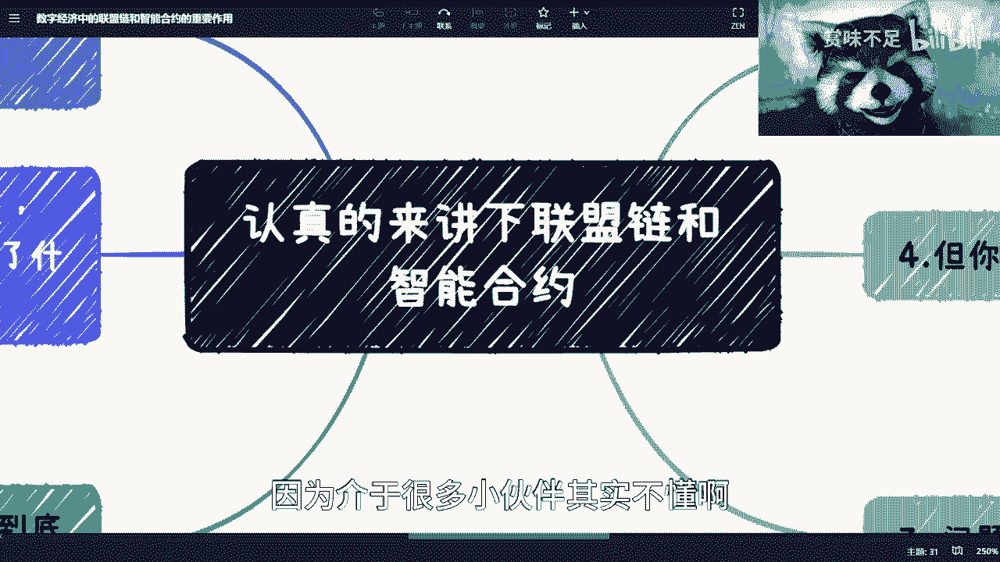

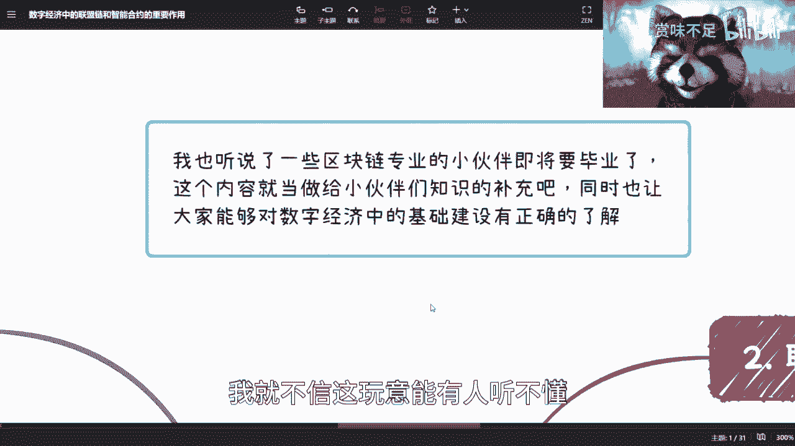

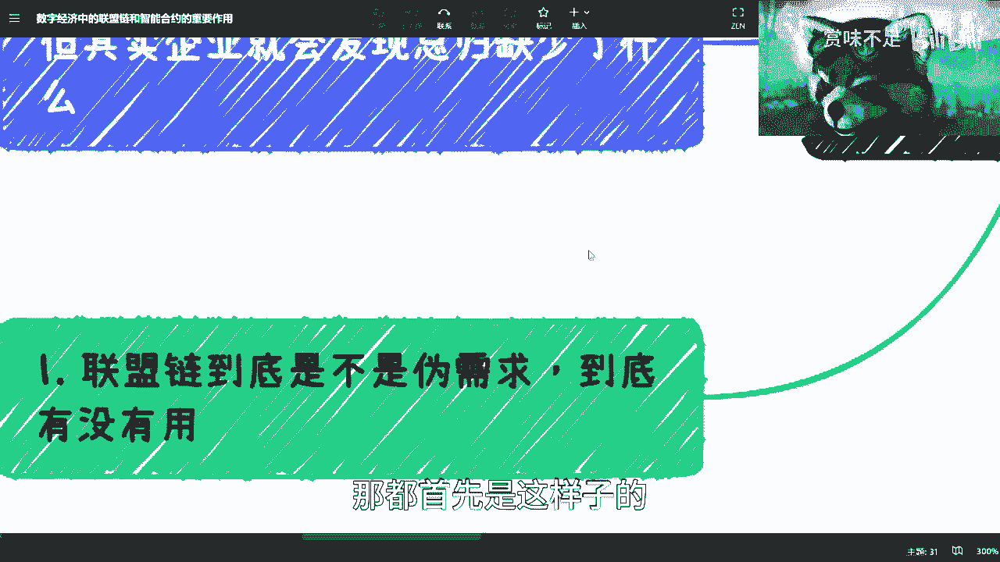

在本节课中，我们将要学习数字经济中的核心基础设施——联盟链与智能合约。我们将探讨它们的基本概念、核心作用、应用场景以及为何它们对于构建未来的数字经济生态至关重要。

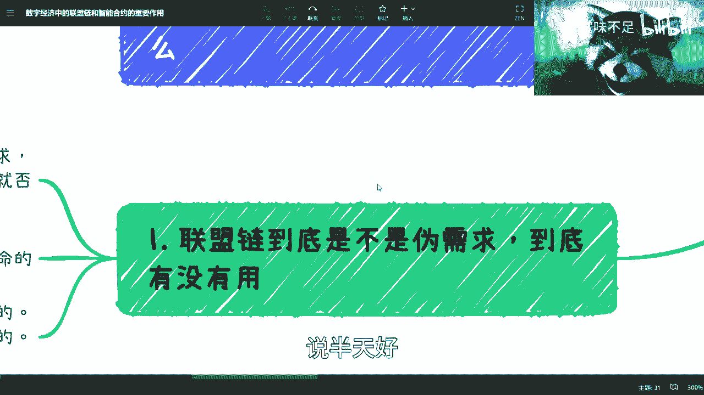

---

## 联盟链是伪需求吗？🤔

上一节我们介绍了课程主题，本节中我们来看看关于联盟链的一个常见争议。

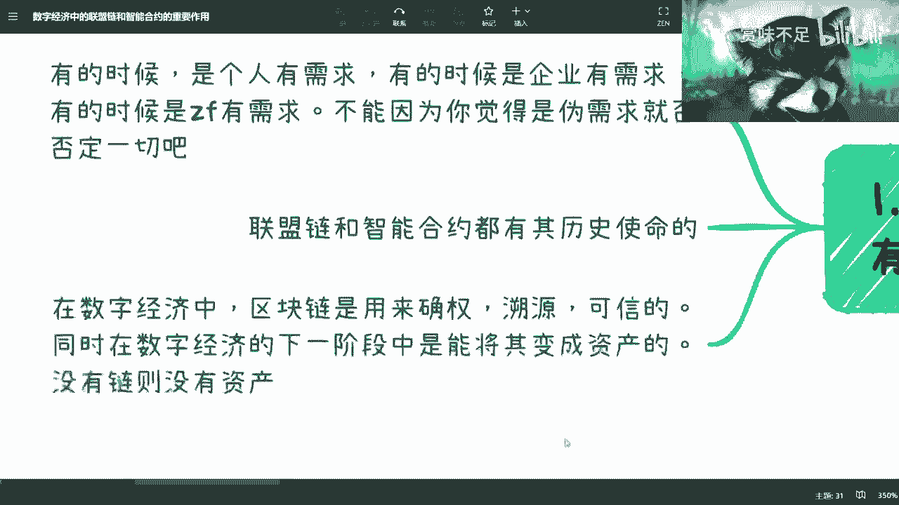

首先需要明白，所谓“需求”因人、因企业、因政府而异。不能因为个人认为它是伪需求，就断定它没有价值。看待问题如同观察一个圆柱体，从不同角度会得到不同结论。

其次，联盟链和智能合约都承载着特定的历史使命。从近年来的政策发展与行业变化来看，这条道路正变得越来越清晰。

在数字经济中，区块链主要被用于以下几个核心功能：
*   **确权**：明确数据或资产的所有权。
*   **溯源**：追踪数据或资产的流转历史。
*   **可信**：确保数据的真实性与不可篡改性。
*   **资产化**：在数字经济的下一阶段，将数据或权益转化为可交易的资产，这主要由智能合约实现。

一个核心结论是：**没有链，就没有（数字）资产**。只有互联网，数据仅仅是数据；有了区块链，数据才能成为可信的资产。

以下是初学者常有的两个疑问：
1.  **关于确权**：用中心化数据库也能确权，为何要用区块链？
2.  **关于溯源**：区块链只能记录流转过程，如何保证源头数据的真实性？

我们将在后续内容中详细解答这些问题。

---

## 联盟链的核心作用：数据共享与隔离 🔐

上一节我们提出了关于联盟链价值的疑问，本节中我们来看看它的一个核心应用场景。

当前所有核心系统都基于中心化的互联网技术。联盟链要做的第一件事就是实现**数据共享**与在此基础上的**数据确权**。

问题的关键在于，过去企业间是“不能共享”还是“不想共享”？答案是两者皆有。区块链共享的优势在于它能实现**数据隔离**。

以下是数据隔离的具体含义：
假设企业A、B、C同处一条联盟链上，无论它们是竞争还是合作关系，都必然存在不希望对方知晓的商业数据。区块链技术（结合密码学）可以在允许数据被有限使用（如验证、审计）的同时，确保敏感数据的机密性，并且所有数据操作都有迹可循。

更重要的是，联盟链提供了一个**平起平坐**的技术框架。没有任何单一企业能完全控制链上数据，这保障了所有参与方的权益，从而真正促进了数据共享。目前，只有区块链技术能同时满足这两点。

至于数据共享后的具体应用和价值，那是生态建成后需要探索的问题。当前的首要任务是构建这个基础平台。

---

## 联盟链生态示例：电商场景 🛒

为了更直观地理解，让我们以一个电商联盟链为例。

假设一条电商链的参与方（节点）包括：供应商、创业平台、互联网法院、第三方保险机构、销售渠道、营销方、短视频平台等。

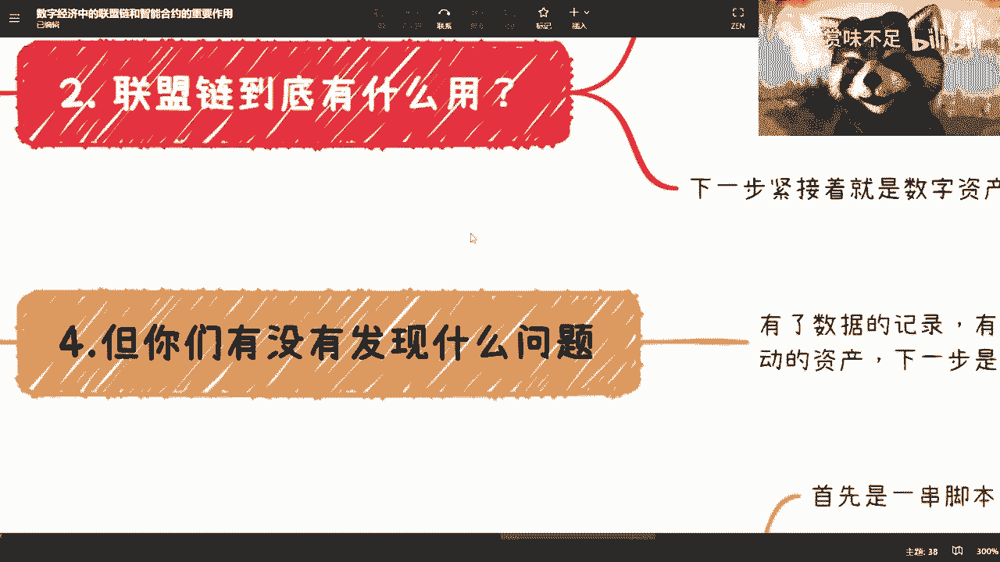

理想情况下，链上各方能同步获取业务数据。但不同方需要的数据不同（如供应商关心库存，法院需要交易凭证），这就需要**数据隔离**技术来定制化数据视图。

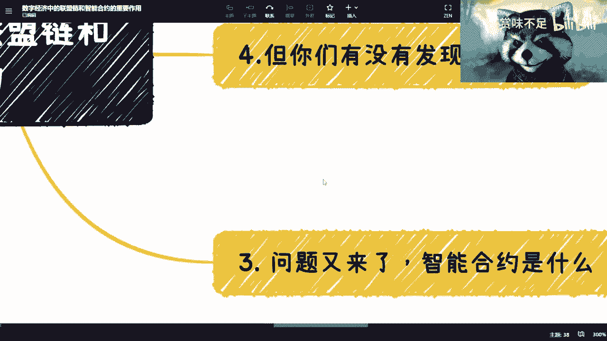

如果由一个中心化平台（如创业公司或政府平台）来统一分发数据，会面临信任问题：其他参与方为何要相信这个中心平台不会篡改数据、挪用资产？单纯的合同或行政命令难以建立真正的、平等的信任。

而联盟链的解决方案是：所有参与方都是平等的节点，对链上数据拥有共同的**可视权**（查看权限）。至于数据的**修改权**，则由链上共同商议的**共识机制**决定（例如，由法院、平台、保险机构三方共同裁决）。所有节点都认可并遵守这套共识规则，链才能持续运行。这才是健康联盟链生态的模样。

---

## 解答核心质疑：源头与确权 🎯

回到最初的质疑，联盟链到底是不是伪需求？

**关于源头保证**：区块链的核心作用是保证数据上链后的**可信、可溯源、可追踪**。例如，如果链上某个供应商恶意篡改数据，他无法单方面抹除证据，因为其他节点都保留了记录。至于数据上链前的“源头”真实性，则需要结合AI、物联网（IoT）、传感器、图像识别等其他技术来解决，并非区块链一己之责。例如，仓库入库数据可以通过IoT传感器自动采集上链，而非依赖容易出错的人工输入。

**关于确权价值**：中心化系统（如国家版权中心）也能确权，但区块链提供了**双重保险**。它通过技术手段进一步保障了数据权益的安全性和透明性。更重要的是，确权是为下一步的**数字资产化**做准备。只有在链上，通过智能合约，数据权益才能被封装成可编程、可交易的数字资产。

从国家数字经济发展战略来看，区块链是新一代信息基础设施。就像移动互联网早期，许多人质疑安卓系统是伪需求一样，不能以当下的不完善否定其作为下一代生态基础的战略价值。发展需要过程，不可能一步到位。

---

## 智能合约：链上的“应用程序” 📱

上一节我们明确了联盟链作为基础设施的价值，本节中我们来看看运行在链上的核心组件——智能合约。

智能合约本质上是**一段运行在区块链上的代码**。可以做一个类比：**区块链（如联盟链）相当于Android或iOS操作系统，而智能合约就是上面运行的App**。

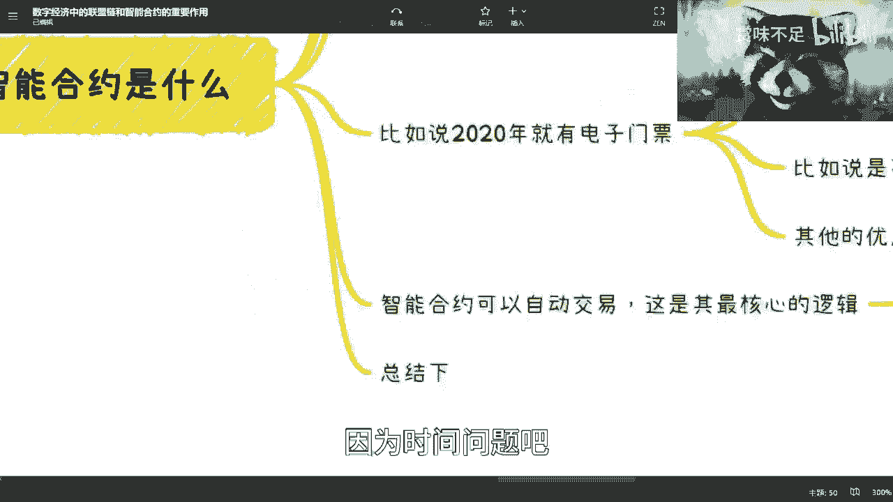

> **注意**：此处的“智能合约”与加密货币交易所中提到的“合约交易”（杠杆、永续合约等）是**完全不同的概念**，请勿混淆。

显然，要开发智能合约（App），必须先有区块链（操作系统）。那么智能合约有什么用？

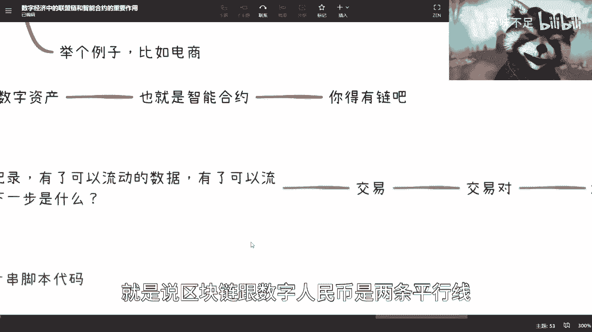

---

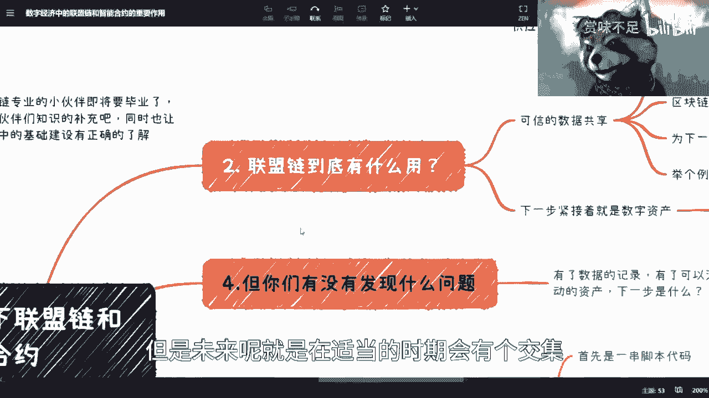

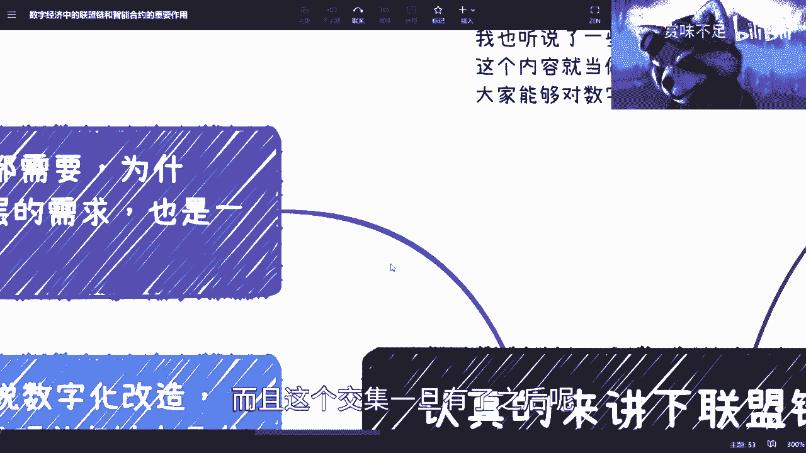

### 智能合约应用场景示例

**场景一：电子门票**
以2020年上海ChinaJoy使用的电子门票为例，其由智能合约生成。合约代码可以定义门票的多种属性：
*   `总量`：发行总数固定，不可超发。
*   `可交易性`：设定为不可转让，从根本上杜绝黄牛倒卖。
*   `金融属性`：可附加抵押、分期等属性。

中心化系统也能实现这些功能，但**不可信**。智能合约则从“基因”层面确保了规则的透明与不可篡改，并结合了区块链的数据可追溯等所有优点。

**场景二：预付款与自动交易**
这是智能合约**最核心的功能之一**。以预付费课程为例：
*   **传统模式**：用户将2万元年费付给机构（如韦博英语），机构跑路，钱款消失。
*   **中心化担保模式**：钱付给第三方担保平台，但该平台同样有跑路风险。
*   **智能合约模式**：用户将钱存入**链上的智能合约地址**。每次上课后，用户和机构双方确认（如打卡、确认），智能合约自动将当次课程费用（如500元）划转给机构。**只要双方不串通作恶，资金永远安全地由合约托管**。

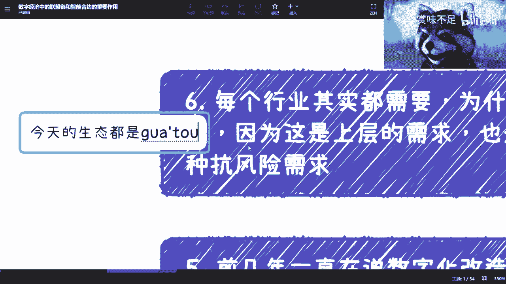

合约的可靠性不源于自身，而源于其运行所在的**整个区块链网络（众多节点）的共识**。单一方（如机构）无法挪用资金。这个模式不仅适用于预付费，更可扩展到任何需要可信自动支付的场景，其最大受益者是**社会经济的稳定**。

---

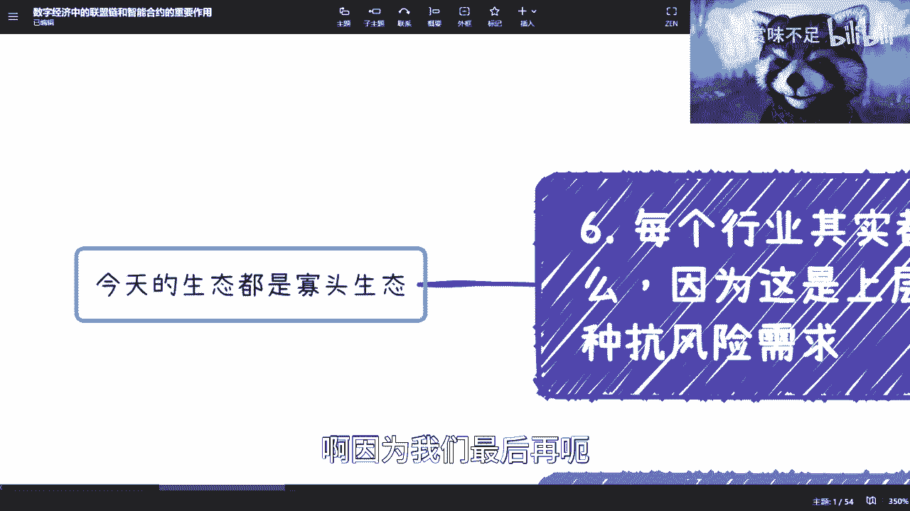

## 总结与展望：数字经济的未来图景 🚀

本节课中我们一起学习了联盟链与智能合约在数字经济中的基础作用。

让我们总结并展望未来：
1.  **链是基础设施**，负责可信地记录数据与资产。
2.  **智能合约是链的下一步**，它将规则代码化，创造出可编程、可自动执行的数字资产。
3.  **交易的产生**：有了可流动的数据和资产，下一步自然是**交易**。交易对（Trading Pair）如 `X/Y`，其中`X`代表各类数字资产，`Y`代表货币。
4.  **与数字人民币的融合**：当前区块链与数字人民币（数字法币）是平行发展的两条线。但在未来恰当的时机，**两者的交汇将催生真正的数字经济**。届时，资产与法定数字货币将在链上无缝交易。
5.  **数字化改造的缺失一环**：当前许多企业的数字化改造只停留在流程优化，感觉“缺了点什么”，其核心缺失的正是**基于区块链和智能合约的资产交易与金融能力**。改造的最终目标应为未来的数字经济生态做准备。
6.  **抗风险与生态升级**：区块链生态（由多个节点构成）相比互联网时代的**寡头生态**更具抗风险性。即使生态中个别企业出问题，整个生态不会崩溃。它旨在将“企业寡头”升级为更稳固、更开放的“生态寡头”。

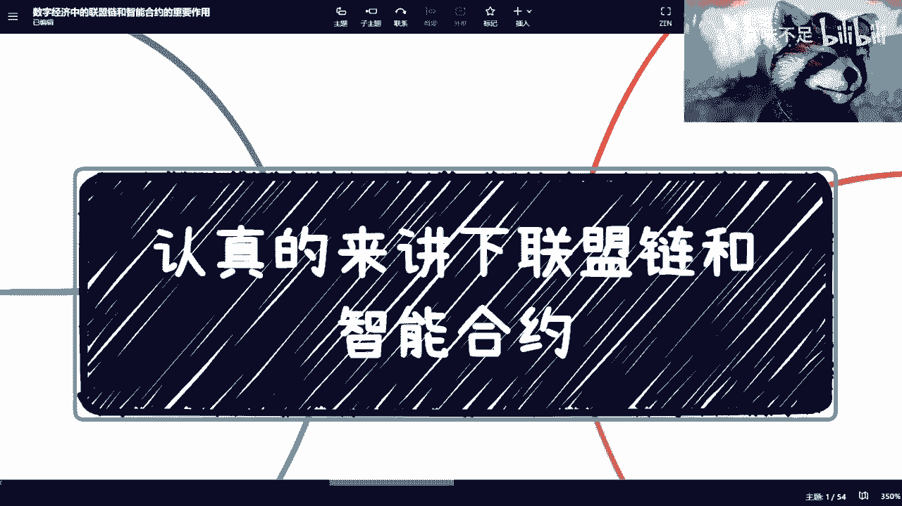

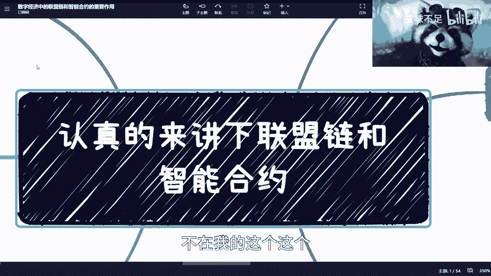

互联网的发展并未到头，而是即将进入新阶段。区块链及其上的智能合约，正是为了解决中心化系统的历史遗留问题（如数据可信度低、寡头风险高、权益保障难），并孕育新经济形态而生的关键基础设施。它不是一个伪需求，而是面向未来的战略选择。

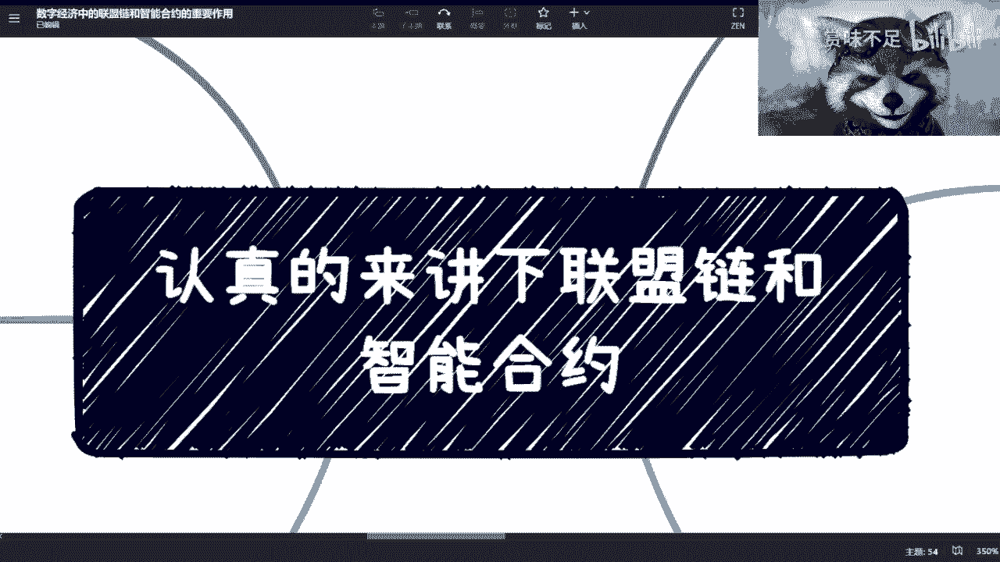

---
*有任何关于职业发展、数字经济就业或商业合作的问题，欢迎咨询。*