# 让我们来讲讲白嫖的故事---P1---赏味不足---BV1Sh411u7py

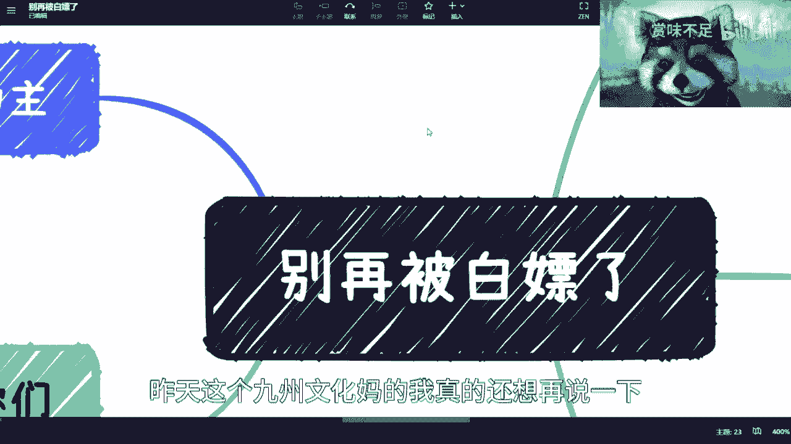

在本节课中，我们将要学习如何识别和防范工作与商业环境中的“白嫖”行为。我们将明确“白嫖”的定义，分析哪些人容易成为目标，列举常见的白嫖案例，并最终探讨如何有效保护自己。

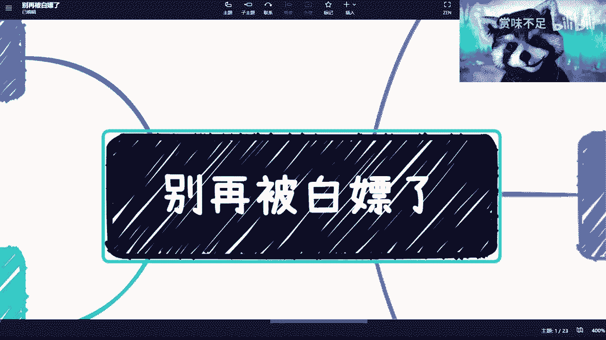

---

## 什么是“白嫖”？🤔

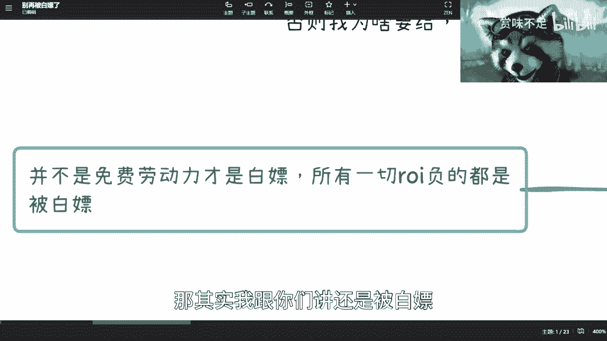

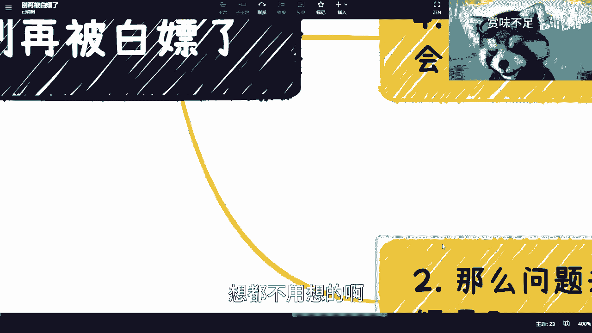

上一节我们介绍了课程主题，本节中我们来看看“白嫖”的核心定义。

“白嫖”并不仅指完全免费的劳动力。其核心在于**投入产出比（ROI）为负**。简单来说，当你获得的报酬远低于你为此付出的实际劳动价值时，你就被“白嫖”了。

用公式表示即：**你的实际劳动价值 > 你获得的报酬**。

例如，你完成一项工作的市场价是每小时200元。对方支付了你200元，但你为了达到要求，实际投入了4小时的工作量。那么，你被“白嫖”的价值就是 `(4小时 * 200元/小时) - 200元 = 600元`。许多人因无法准确评估自己的投入产出比，在拿到报酬后依然处于被“白嫖”的状态。

---

## 哪些人容易被“白嫖”？🎯

理解了定义后，我们来看看哪些特质或处境的人更容易成为目标。

以下是几类高风险人群：

*   **焦虑的人**：为满足短期生存需求（如房租、生活费）而焦虑的人，思维容易被困住。他们为了抓住“机会”，可能接受远低于价值的条件，甚至付费寻求不靠谱的“捷径”。
*   **急功近利的人**：追求速成，希望立刻看到结果。这种心态容易让人忽视长期价值，被“快速成功”的承诺所诱惑，从而接受不公平的交易。
*   **处于地位不对等关系中的人**：例如下属对上司、乙方对强势甲方、个人对某些机构或亲戚。这种不对等的关系可能让人因“不敢得罪”、“要搞好关系”等想法而放弃应得的权益。
*   **分不清商业与人际关系的人**：将商业合作与私人感情混为一谈，认为“这次吃点亏，以后对方会帮忙”。但在纯粹的商业环境中，可靠的合作基础通常是过往成功的利益交换，而非单方面的付出。
*   **缺乏自我保护意识的人**：不尊重自己的劳动成果，出于“不好意思”而不敢谈钱、不敢拒绝，或主动大幅降低自己的报价。

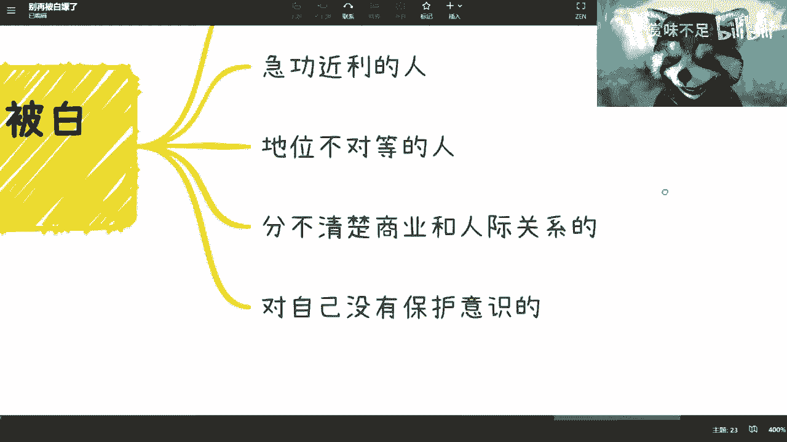

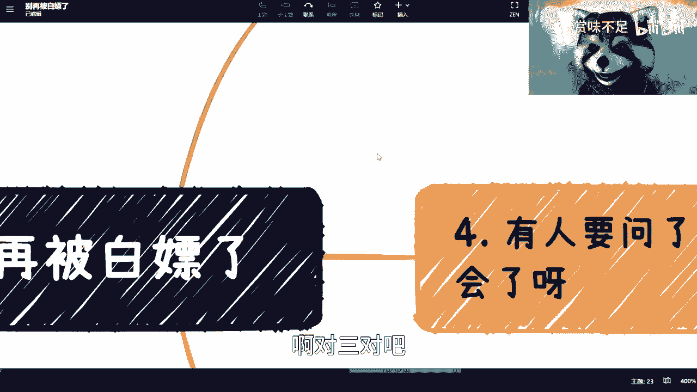

---

## 常见的“白嫖”案例 📋

认识了自己，我们再来看看对手。以下是商业和职场中几种典型的“白嫖”手法。

以下是几种需要警惕的场景：

1.  **虚假招聘**：企业以招聘为名行咨询之实。邀请候选人面试，实际目的是套取行业见解、解决方案或创意，并无真实招聘意向。
2.  **公开征集与竞赛**：以比赛、方案征集等名义，广泛收集参赛者的创意或作品。最终只奖励极少数人，其余大量未获奖的成果则被无偿使用或借鉴。
3.  **方案咨询与申请**：以“合作意向”、“项目上报需要”等理由，要求对方提供详细方案或策划。最终可能使用该方案却与他人合作，或直接内部消化，方案提供者一无所获。
4.  **一次性买断价值被低估的资产**：以一次性低价买断你的培训课程、版权作品（如设计、文案）等。之后该资产产生的持续商业收益，将与你再无关系。
5.  **滥用试用期**：频繁招聘员工，在试用期以极低成本获取劳动力后，再以各种理由不予转正。

---

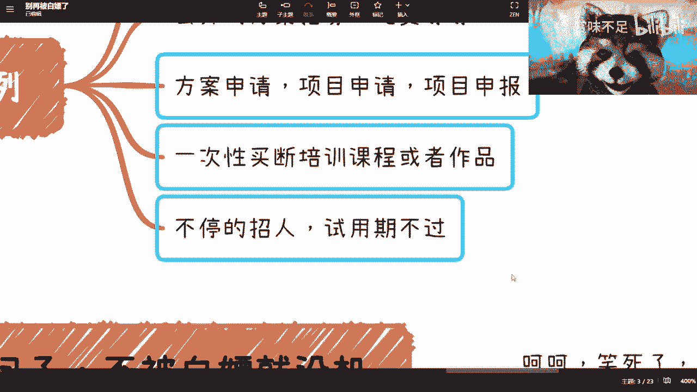

## 如何防范与拒绝“白嫖”？🛡️

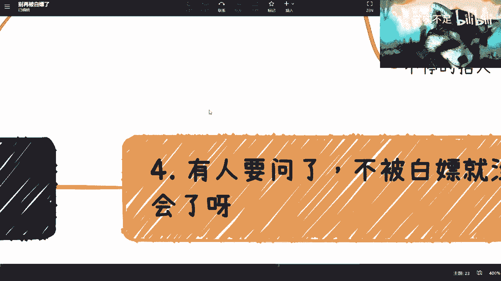

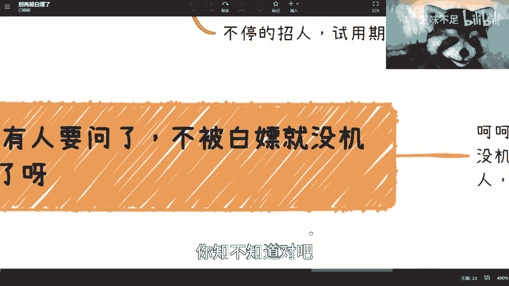

了解了现象和案例，本节我们聚焦于解决方案：如何构建防线。

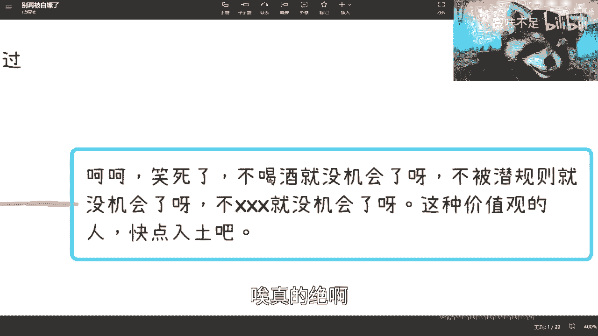

核心原则是：**树立正确价值观，坚守底线，并用理性手段保护自己**。

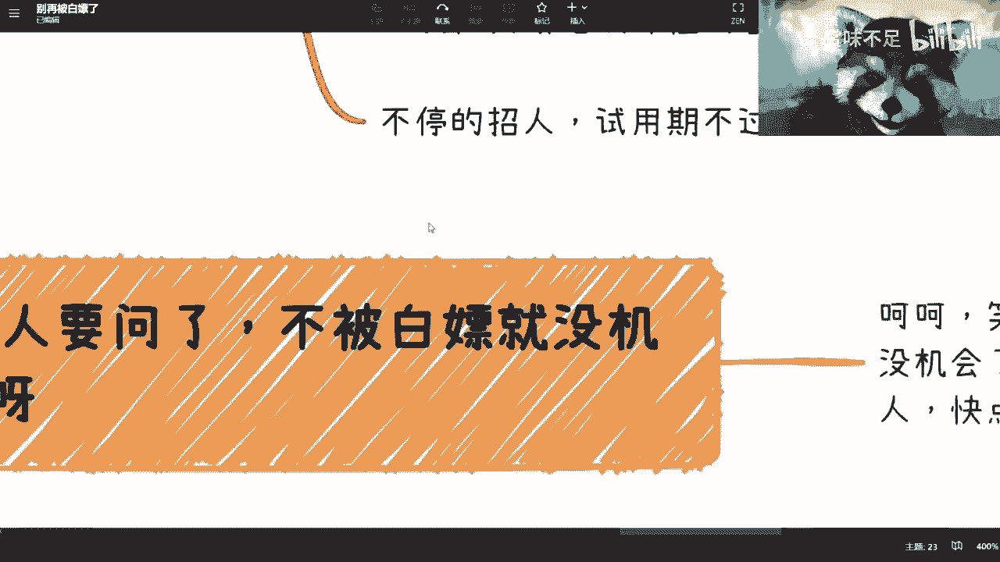

以下是具体的行动建议：

*   **树立正确价值观与底线**：从内心认同自己的劳动具有价值，坚信“不被白嫖”是基本原则。拒绝讨好型人格，尤其在商业场合。
*   **一切以合同为准**：无论关系如何，合作细节务必落实在合同上。明确工作范围、交付标准、报酬、支付节点以及违约责任。对于无法立即确定金额或时间的“战略合作”，可以要求签订**排他协议**作为保障。
*   **分阶段提供信息**：根据合同进度和款项支付情况，分阶段交付成果。避免在未获得任何保障时，就提供全部核心方案或数据。
*   **敢于拒绝与离开**：当对方的要求明显不公平，或试图用“机会”、“关系”等话术施压时，要敢于说“不”。思考最坏情况：失去这个“机会”真的无法生存吗？很多时候，委曲求全换来的只是暂时的安稳，而非长远的发展。

---

## 总结 📝

本节课中我们一起学习了“白嫖”行为的本质与应对策略。

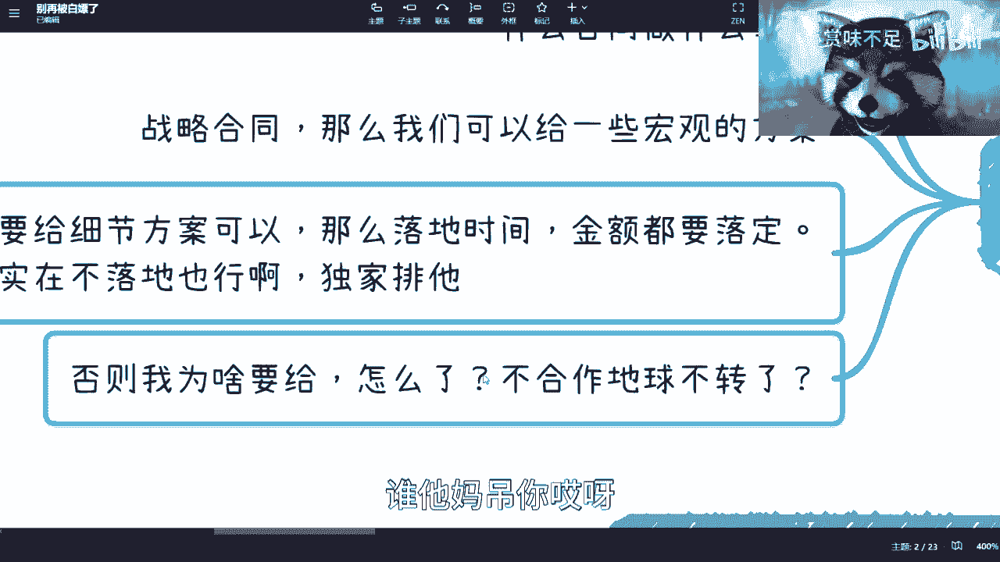

我们首先定义了“白嫖”即**投入产出比为负**的交易。随后分析了**焦虑、急功近利、地位不对等**等人群容易中招。接着，我们列举了**虚假招聘、公开征集、方案咨询**等常见白嫖案例。最后，我们探讨了防范之道：**坚守底线、以合同为准、敢于拒绝**。

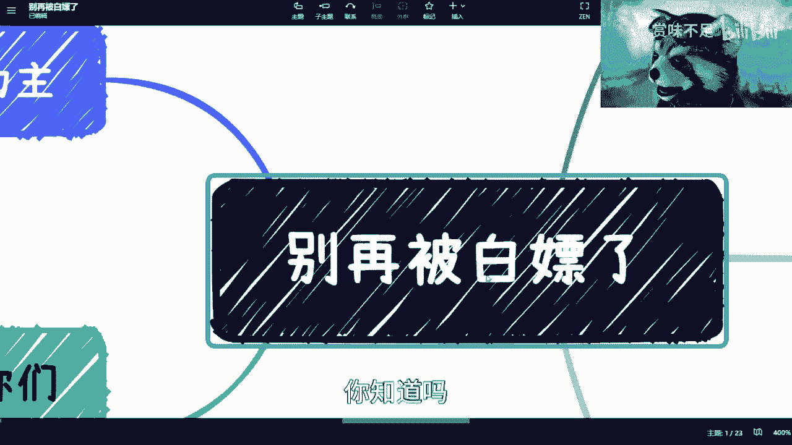

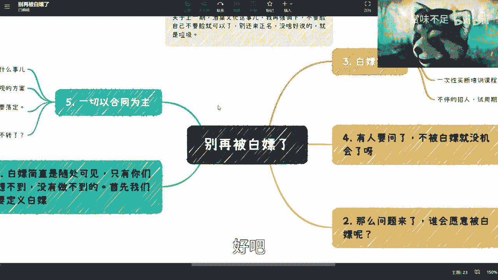

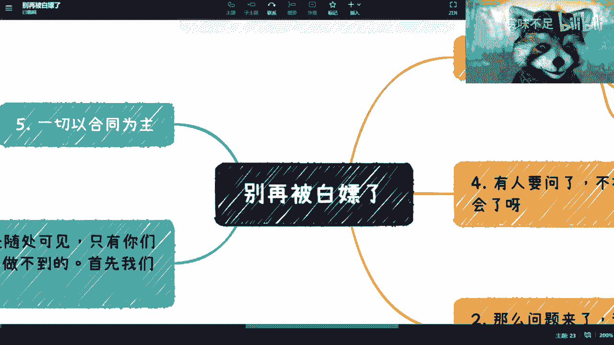

记住，保护自己的劳动价值，是获得尊重和长远发展的第一步。在商业世界中，清晰的规则和自信的坚持，远比模糊的“人情”和单方面的“付出”更为可靠。