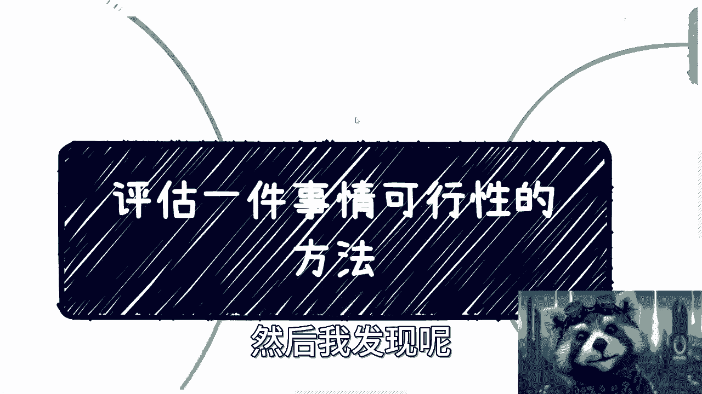
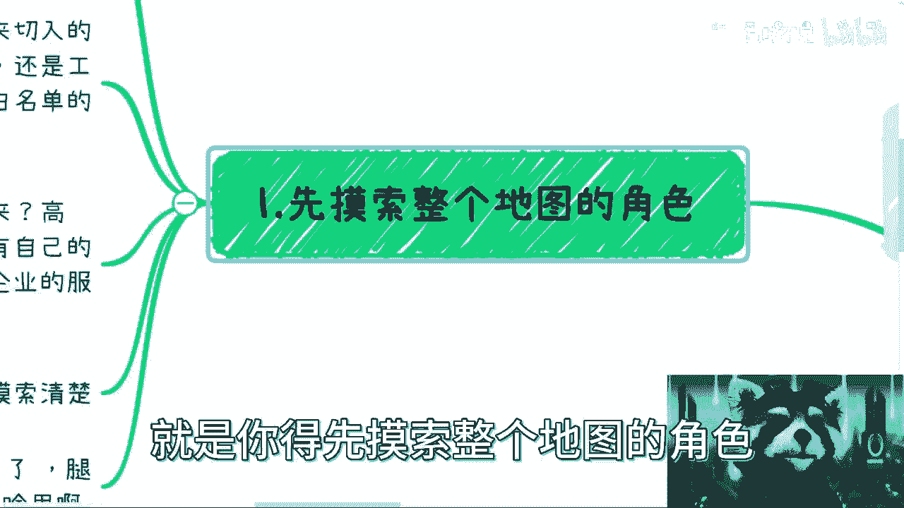
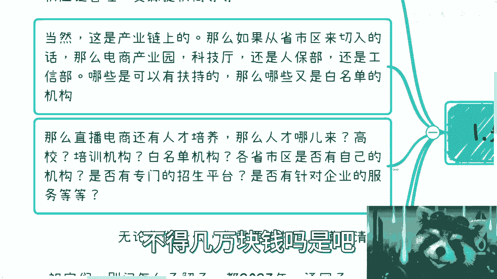
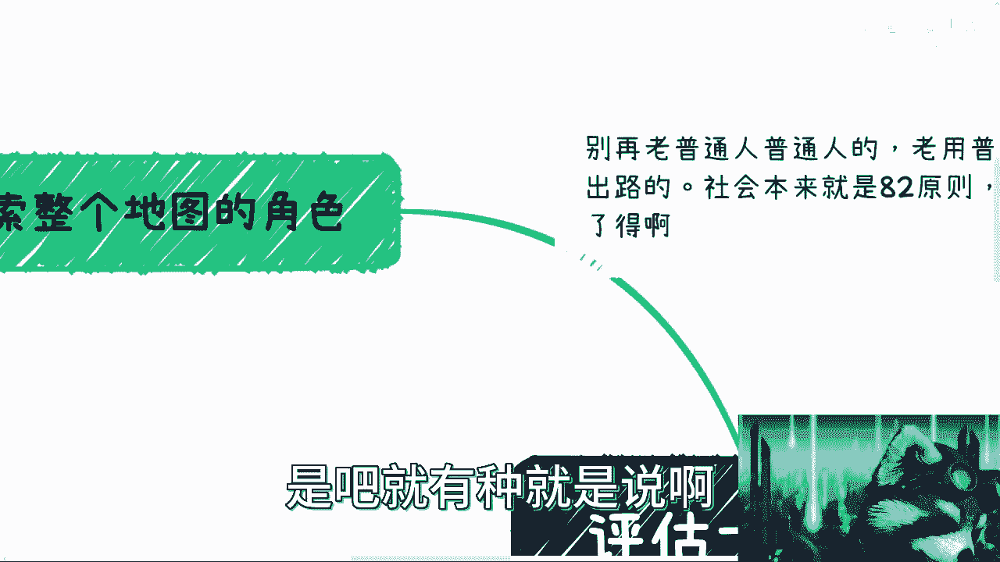
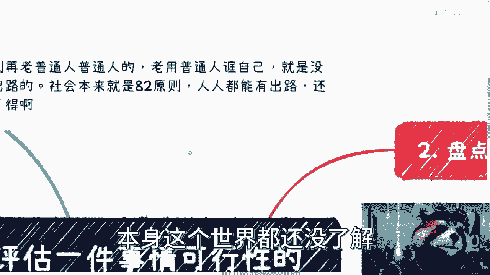
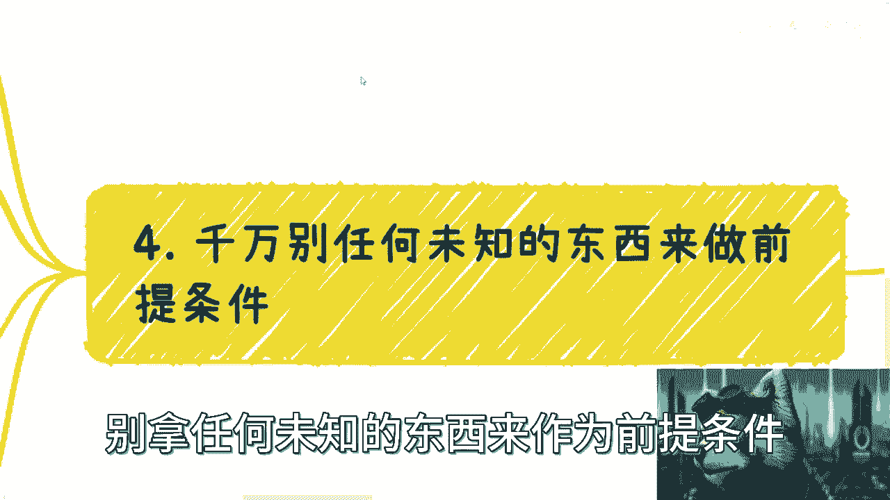
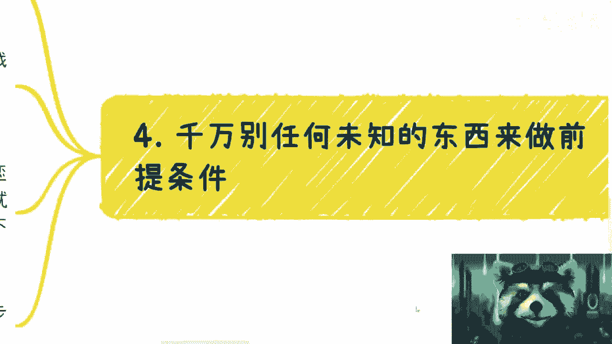
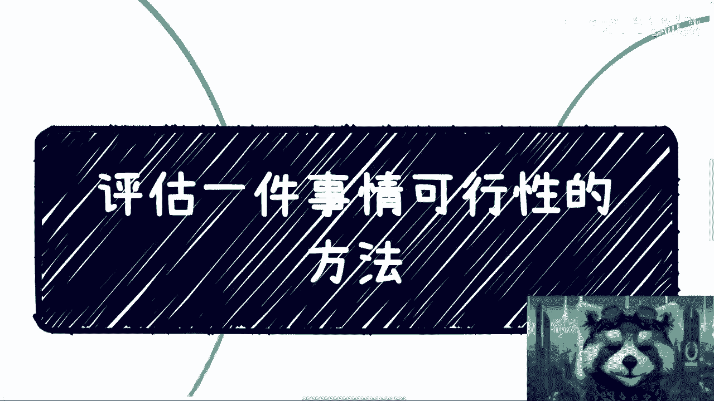

# 评估一件事情的可行性方法 - P1 - 赏味不足 - BV1CL41187o5

好啊大家好啊，我最近跟我聊下来呢，好多小伙伴这个都在说自己想做点事情是吧，然后我发现呢就大家这个逻辑性呢极其混乱啊。

就说是说要做的，但是根本就不知道怎么做，或者说他们知道怎么做，但其实本质上还是不知道怎么做啊。

首先我们来看一下啊，就是在这个地方我写了啊，就是所有的这个问题呢，别再用普通人啊来做这么一个啊，就是前提啊，你老是用普通人夸自己嘛，本身是没有意义的，为什么呢，因为这个世界就是八二原则对吧。

或者九一原则对吧，你你不可能人人都有出路，是不是，那你老是用普通人来诓你自己有什么用呢对吧，就就就你老是用普通人换你自己，就好像什么你知道吗，就好像你在跟我说啊，你说陈老师，我这个也没什么好的学历对吧。

也没什么能力，我也不想出去对吧，我每天都想躺着，但是我想听钱从天上掉下来，可能问了唉。

我的天哪，真的是我他妈绝了，我跟你们说啊，然后关于这个事儿呢，我我今天就是帮你们一步一步拆开来好吧，你们要是回头再有问题，我也是就有细节问题再说吧，好吧就是就是大框架，我觉得我应该都已经列清楚了。

在这里啊，第一个呢就是你得先摸索整个地图的角色。

什么意思呢，就是你今天做一件事情，你得先对全局和角色有了解吧对吧，你比如说啊你说你要去做电商好，那么我们说你角色里面有哪些呢啊，可能有比如说m cn对吧，可能有主播的外外包，可能有主播服务对吧。

可能有广告商服务对吧，可能有电商平台，可能有供应链管理，可能有货源提供商等等等等等等等等等，是不是好多好多好多好多对吧，那你首先要去摸对吧，你要做的这个领域，或者你要做的这个这个这个产业。

这个这个链路上面，到底有哪些人和哪些角色对吧，不是说你今天什么都不了解，然后就说好他妈的老子要去干了对吧，你干什么东西啊啊你干个屁啊，是不是这第一个啊，第二个呢就是说你比如说啊。

这刚刚那个是产业链上的对吧，那么还有呢你要做直播电商，那比如说还有别的切入点，是不是你比如说从省市区来切入的话，那么你可能有电商产业园对吧，上面可能是科技厅啊，还有科技司还是人保部，还是哪边。

还是大数据局对吧，你得去看呢，是不是，然后哪些有扶持，哪些没有扶持，哪些是这个有呃那个那个那个国家这边，哪些又是白名单对吧等等等，你得去了解点，你一无所知，觉得自己老牛逼了，你知道吗，就他妈干我真的。

我我跟你们讲，我是实在不理解，就是说就是这种，就是说这个自信到底哪哪里来的，你知道吗，就是这就好像啊，这就好像你今天要去打一个游戏对吧，然后你说啊我所有角色都不知道对吧，我所有什么规则也不看。

我他妈上来就干，我马上就世界第一了，可能了，哥哥们啊啊祖宗们是吧啊，然后还有什么呢，你做直播电商，它有上下游吧对吧，你比如说人才培养，那人才哪来呢，高校来呢，还是培训机构来呢，白名单来呢对吧。

各省市区是否有自己的机构呢，是否有专门的招生平台呢，是否有所谓的考试平台呢，是否有针对企业的服务呢，你知道吗，你一律都不知道，就干是吧啊，我也是很绝的，我我表示我是没有这种自信的是吧。

所以说呢你要明白你无论做什么，你先把一张地图上的规则角色摸清楚，你再去做是吧，就是我发现我沟通下来有个把人啊的确牛逼，就是那种他就是会告诉你，我他妈就是不要了解，我觉得我的路就是创新的。

那你怎么不去拿诺贝尔奖呢是吧，你要是觉得你不是在给人类社会，你你你你的idea前无古人，后无来者，那请问你为什么他妈的现在是这个狗样子呢，是不是哎呀，真的是我，我就觉得心里没点逼数，你知道吗。

就在这个地方写了啊，祖宗们别问怎么去了解了，都2023年了，你们不是断网的腿，在你们手自己身上出去干呐啊，出去了解啊，要假以时日的是吧，不是今天他妈的听了一个视频，付了几千块钱去报了个培训班。

你就牛逼了，没有用的啊，你们明白吗对吧，不是说一定割不割韭菜对吧，或者你们一定会不会割，这个不重要，重要的是你们你们的付费，你们的这个那个免费也好，几百块钱，几千块钱也好。

不足以让你们能知道这么多东西啊对吧，这些信息里面任何一个切入点，他妈的没几万块钱吃得下来吗，你去请一个领导吃个饭，不得几万块钱吗是吗。

唉，真的就有种什么呢，就是说就我们之前讲过一个主题，叫做楚门的世界是吧。

就有一种就是说啊那你不要说真实世界了，那楚门的世界本身这个世界都还没了解。

就就感觉卧槽他妈的自己可以他妈上天入地，你知道吗，老牛逼懒啊。

那第二个是什么呢，就盘点一下自己的资源，你怎么盘点呢，你要分成，你要分成自己可控的资源和自己不可控的资源，就我聊下来发现吧，大家大部分人呢，对所谓的资源是没有任何的认知的啊，就好像那种就是说哦。

今天只要有人跟我说了一句对吧，有人跟我跟我提了一嘴，我他妈的就资源满满，就是我，我背后都是资源对吧，背后都是人是吧，我跟你们讲什么叫可靠资源啊，一切靠你们自己能做的能产出的。

或者来说你已经在以前的商业闭环当中，用过的啊，使用过的对吧，接触过的落过地的叫做可控资源，其余一切的都叫不可控资源，他妈的你的你爸妈，你亲戚，你朋友，你商业伙伴，网上碰到一个大佬。

一切跟你讲他能提供的他妈的都叫不可控资源，为什么，因为你没有落地过，怎么知道能不能可控啊，啊人家跟你说句话就可控了，跟你签了合同就可控了，谁他妈跟你讲了啊，这莫名其妙了，真的是是吧，还有第三点是什么呢。

就是你要完成一件事，你可能需要abcd很多很多资源，对不对，你自己盘点一下，哪些是可控的，哪些是不可控的啊，很多人跟我一说，我一听就觉得他妈的所有资源都是问号。

就是你自己把你的那些自己的a b c d e对吧，列在一张纸上，或者列在这个脑图里面，你自己去想想看，是不是很多都他妈是问号对吧，然后你很多都是问号，你都没有合作过你，你怎么能保证对方就一定合作呢。

你怎么保证对方不放你鸽子呢对吧，是吧，然后你你你你所有东西都是问号，然后你就出去干了啊，你你这种干法不亏钱，不被别人割可能吗啊有多大概率啊是吧，你不能把所有的幸存者偏，大家都放到你自己身上的啊。

然后第三个就是以最小的投入走一遍商业闭环，我跟你讲啊，不管你做什么，不管你到底在地图当中扮演什么角色，你哪怕今天只是在里面扮演一个小喽啰，一个一个很小的环节，一定要自己先走一遍。

验证你想的这条路是能赚钱的，你再去做，你知道吗，就是所有的东西，一个产业或者一条切入点，它是可以浅做也可以深做的对吧，你往下挖可以深挖很多很多，但是你得先验证你自己yy的这条路是能赚钱的。

或者说你要去走一遍，你觉得他能赚钱的，你别今天别人跟你说，卧槽他妈的，老子做的就是就是就我有个朋友跟我讲哦，有个业务对吧，我做做了很多遍了，我我年度几千万对吧，那他妈跟你有什么关系啊啊，那我跟你说。

他妈的，我在路边，我在路边扫地，对啊，我在路边扫地，我年入一个亿，你信不来，你怎么不去扫地了，哎我就莫名其妙了，是不啦，就我跟你讲，真的很多时候就是这种对吧，听一嘴啊，就觉得好像哎呀牛逼了。

有什么用呢对吧，我跟你讲，什么叫走一遍，就是你做一件事情呢，不管你是给这个给企业做对吧，给个人做还是给政府做，你从一开始项目开展，你加入对吧，直到最终钱到账了，你赚到的属于你的那一份。

这才叫完整的闭环啊，所以我在这个地方一直跟你们说，我说我为什么一直建议大家去做中介，做做撮合，做一个介绍商，是因为这从一开始来讲，对你们这些对大家自以为普通人的这个切入点，这是性价比最高的方式。

也是唯一的方式对吧，就是你不用投入额外的钱，你只要投入精力对吧，去去在当中分一杯羹，哪怕钱再少对吧，然后你在这里面能够参与参与到很多东西，这个是你要去做的一件事情，对吧啊。

那么在这个地方呢啊之前有很多人说了，他说哎呀这个我作为普通人对吧，我也没背景，我也没这个这个叫什么资源对吧，那人家为什么会让我介入呢，为什么会让我参与呢对吧，这个事儿就是这样子的，就是你作为一个普通人。

你不是一个废人，你知道吗，因为你该有些东西你该去学的该是怎么样的，你总归还是要有的，你明白吧，就是你不能说我什么都没有对吧，那你哪怕就像我说的，你哪怕突击学习一下，你哪怕包装一下，也得有些东西吧对吧。

你不能完全不劳而获吧，是不是，对吧再说你试个一两次没有，怎么了呢对吧，你你你很多时候就是要不停的试，不停的这个碰壁，然后不停的吃，不停的碰壁，就是这个样子的，你还想一次性就成功。

是吧，这个是三啊。

我们来看四嗯，还有一点呢，就你们在做事情的时候呢，千万别拿任何未知的东西来作为前提条件。

你知道吗，我我已经碰到过好多次了，是什么呢，就简单来讲，就是说你今天要去画饼去框，别人就无所谓，但是你别画饼，把自己框进来，对不对，那你比如说我接触下来所有的人员啊，基本上都有一个通病。

就是说我永远是我感觉对吧，我感觉对吧，然后我感觉我跟你讲，你感觉没有用啊，你感觉有什么用呢，对吧，哎我感觉这个行业蛮好的，我感觉我们怎么样怎么样，我感觉就很多很多有用了没有用的呀，你要去实践啊。

你要去探索，你要去验证啊，你感觉有用了没有用的呀，没有任何卵用的呀，对不了，然后还有什么，还有就是啊，我觉得我业务很稳定啊，我觉得我合伙人跟我关系也很稳定，比如我觉得我的恋爱也很稳定啊。

我觉得我的这个各个方面都很稳定，我还是那句话，稳不稳定只是当下的你你你就在现在对吧，都2023年了，在这么一个每天都在报黑天鹅的这么一个时代，对吧，你用未来的稳定区能当条件吗，不能呀，对不了。

因为你思考问题的时候，你千万不能觉得哦我未来就很稳定对吧，我未来觉得这个岗位啊，或者某一个某一个产业，它现在发展不错的对吧，我至少能工作个3年或者工作个5年，对没有用的呀，你不能把这个东西当成现代条件。

你只能说这是一个参考，你只能说这可能会发生，但是你不能把它当成一个充分非必要条件，放在这个地方，然后说哦好，因为我觉得就是考虑的时候我就这么考虑了啊，然后把未来的这个事放到现在，然后啊我做出一些抉择。

这个一般局你的这个判断就不对啊，因为你的前提就不对对吧，还有就是说你别再去老去做长期规划了，长期规划对现在来讲没有任何意义对吧，我一直跟你们讲，就是我就我包括评论区我也跟很多人说。

我说你们要去了解的是整个大局对吧，所谓大局就是说你去看看海外，看看国内，看看这几年对吧，各种各样的事情，包括包括什么应届生啊，就业率啊对吧，包括这个这个这个企业的呃，企业的出海啊对吧。

包括这个疫情的投入啊，包括互联网的投入啊对吧，包括真正的投入产出比啊等等等，你去看看综合的情况，你就你就能明白为什么现在是这么个情况是吧，为什么你的所长期计划是没有意义的对吧，因为本身变化就很快了。

好吧哎我写了我写了几年啊，我写了四点对吧。

所以说呢我跟你们讲啊，就不管你们今天是要做一个副业对吧，或者做一些别的东西，你做任何一件事情都是这样子的，就都是这么个1234的流程，你得去评估对吧，你得去找资源对吧，你得去就是说积累自己的东西。

你得去在这当中再寻找到自己的切入点对吧，这就好像我们一直说的嘛，就是说你你的你的这个资源，可能其实你手上有哪些牌对吧，然后呢你手上除了这些以外，你还有哪些东西，你自己可以想想有没有哪些竞争力。

那没有对吧，那你就去找能不能借力打力，如果实在没有，那你就自己学对吧，自己去去去弥补你这短短板对吧，就是说很多东西不是说你完全就空空对空，或者怎么样子，因为你要空对空，你本身也得对整个的大局。

整个的一个一个一个一个产业链对吧，或者来说整个的一个关系链你是非常清楚的，你才能知道怎么去利用左边去套右边，怎么利用右边套左边对吧，你说我什么都不知道，我就上去干，那这个肯定是不行的啊，哎呀好啦。

那反正就这么着吧，就是别老普通人普通人了啊，然后做改变，你要从现在就开始做改变了，然后思考方式就按照这个，我今天给你们讲的这四个方式，就这个步骤步骤去做了好吧，别再就是说想到一个idea。

然后三分钟热度就开干啊，这个浪费时间，行吧就这么着吧。

