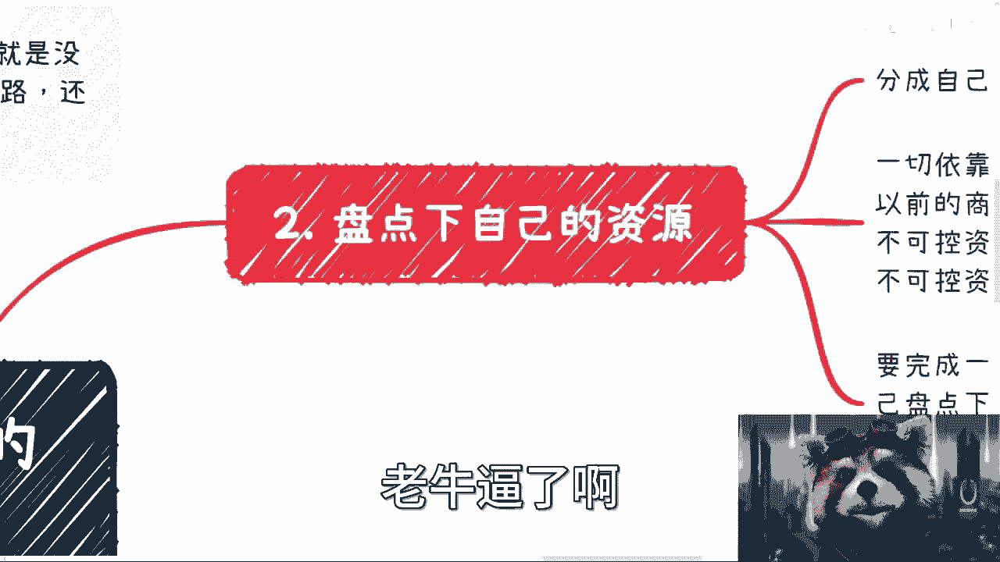

# 评估一件事情的可行性方法---P1---赏味不足---BV1CL41187o5

在本节课中，我们将学习一套系统性的方法，用于评估任何你想做的事情的可行性。这套方法将帮助你理清思路，避免盲目行动，从而更有效地规划和执行你的计划。

---

## 第一步：摸清全局地图与角色 🗺️

上一节我们介绍了课程目标，本节中我们来看看评估的第一步。在开始做任何事之前，你必须先了解整个领域的全局和其中的关键角色。

许多人逻辑混乱，声称想做某事，却根本不知道具体如何操作，或者自认为知道，实则不然。问题的根源在于，他们常常以“普通人”为借口，这毫无意义。世界遵循**二八定律**或**一九定律**，并非人人都有出路。以“普通人”自我安慰，就像期望不劳而获，钱从天降。

因此，首要任务是探索你目标领域的“地图”。

以下是具体做法：

*   **梳理产业链角色**：以电商为例，产业链上可能包括MCN机构、主播外包服务、广告商服务、电商平台、供应链管理、货源提供商等众多角色。你必须先了解这个链条上有哪些参与方。
*   **寻找其他切入点**：除了产业链，还可以从其他维度切入。例如，从行政区域看，可能涉及电商产业园、科技厅、人社部、大数据局等机构。你需要了解哪些有政策扶持，哪些属于白名单项目。
*   **分析上下游生态**：例如直播电商，其人才从何而来？是高校、培训机构，还是白名单机构？各省市是否有专门的服务机构、招生平台或考试平台？这些都需要了解。

总之，在做任何事之前，必须先摸清该领域的所有规则和参与者。不要在不了解全局的情况下就贸然行动，这如同不熟悉游戏规则和角色就宣称要成为世界第一，极不现实。获取这些信息需要你主动走出去，花时间调研和积累，而非仅仅通过付费课程就能速成。

---

## 第二步：盘点个人资源 📋

在了解了外部环境后，接下来我们需要向内看，盘点你自身所拥有的资源。我发现很多人对“资源”存在误解，常常将道听途说的信息视为可靠资源。

你需要将资源分为两类：**可控资源**与**不可控资源**。

以下是分类标准：

*   **可控资源**：指完全依靠你自身能力能够产出、调动的，或者在你过去的商业实践中已被验证并使用过的资源。
*   **不可控资源**：指那些你未曾亲自验证或落地合作过的资源。例如，你的父母、亲戚、朋友、商业伙伴，甚至网上认识的“大佬”口头承诺提供的帮助，在未经验证前都属于不可控资源。

完成一件事通常需要A、B、C、D等多种资源。请将它们列出来，逐一审视。如果大部分都是“不可控”的问号状态，那么你计划的可靠性就非常低。你不能将所有希望寄托在未经检验的假设上，否则极易失败或被利用。

---

## 第三步：以最小成本跑通商业闭环 🔄

摸清地图并盘点资源后，下一步是进行实践验证。无论你在地图中扮演什么角色，哪怕只是一个很小的环节，都必须亲自以最小的成本走一遍完整的商业闭环。

这至关重要。一个产业可以浅尝辄止，也可以深入挖掘，但你必须先验证你设想的路径是否能真正赚到钱。不要因为听说“某个朋友做这个年入千万”就盲目跟风，那与你无关。

**什么是“走一遍商业闭环”？**
它指的是从一个项目开始介入，直到最终你应得的利润落袋为安的全过程。公式可以简化为：
`项目介入 -> 参与执行 -> 款项回收 -> 利润到手 = 完整闭环`

对于初学者，我强烈建议从**中介、撮合或介绍商**的角色切入。这是性价比最高、风险最低的方式。它不需要你投入大量资金，只需投入精力，在交易中分得一杯羹。通过这个过程，你能深度参与并理解各个环节。

你可能会问：“作为普通人，对方为何让我参与？”关键在于，你需要具备一定的价值，哪怕是快速学习或适当包装后获得的能力。成功往往需要多次尝试和碰壁，不要幻想一次就能成功。

---

## 第四步：摒弃以未知作为前提 ❌

最后，在思考和执行过程中，有一个致命的思维陷阱需要避免：**切勿将任何未知或不确定的事物作为决策的前提条件**。

你可以向别人“画饼”，但绝不能自己相信这个“饼”并以此为基础行动。我观察到人们常犯以下错误：

以下是常见的错误前提：

*   **依赖“感觉”**：“我感觉这个行业很好”、“我感觉我们能成”。感觉毫无用处，必须通过实践去验证。
*   **假定“稳定”**：“我觉得我的业务很稳定”、“我觉得我的合伙人关系很稳定”。在充满变化的时代，未来的“稳定”不能作为当下的决策依据。它只能作为一种可能性参考，而非充分必要条件。
*   **执着于“长期规划”**：在当前快速变化的环境下，过于详细的长期规划往往失去意义。你应该做的是了解大局（如国内外趋势、就业市场、行业动向），保持灵活，而非制定僵化的长期计划。

你的思考前提必须建立在已知和已验证的事实上，而非臆测的未来之上。

---

## 总结 📝

本节课中，我们一起学习了评估一件事可行性的四个核心步骤：

1.  **摸清全局地图与角色**：全面了解目标领域的规则、参与者和生态。
2.  **盘点个人资源**：清晰区分可控与不可控资源，明确自身底牌。
3.  **以最小成本跑通商业闭环**：亲自验证路径可行性，实现从开始到盈利的完整循环。
4.  **摒弃以未知作为前提**：基于已知事实决策，避免将感觉和不确定的未来作为行动基础。

无论你是想开展副业还是创业，都应遵循这个流程：先评估全局，再盘点资源，接着通过实践积累经验并找到切入点。这就像打牌，你需要清楚自己手上有哪些牌（可控资源），思考如何组合或借力打力（利用不可控资源），如果不足，就去学习弥补。

请停止用“普通人”自我设限，从现在开始改变思维方式，并按照这四个步骤严谨评估你的每一个想法，避免仅凭三分钟热度就盲目行动。