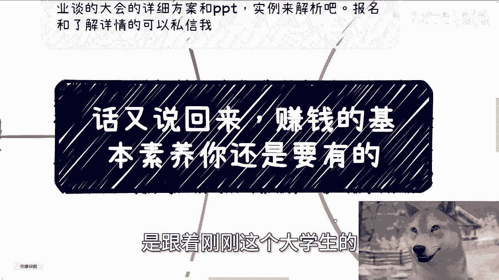
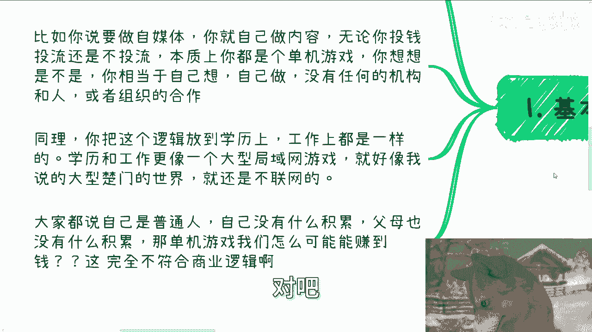
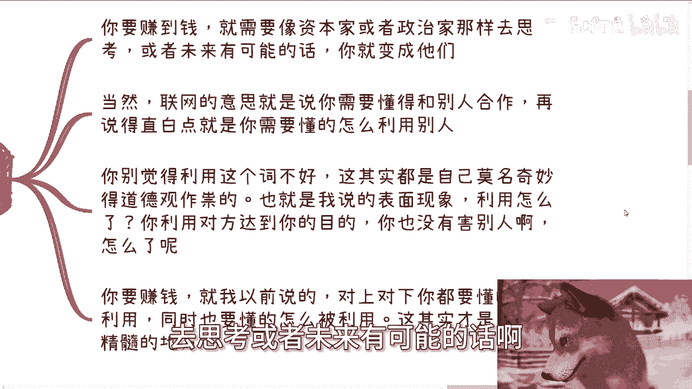
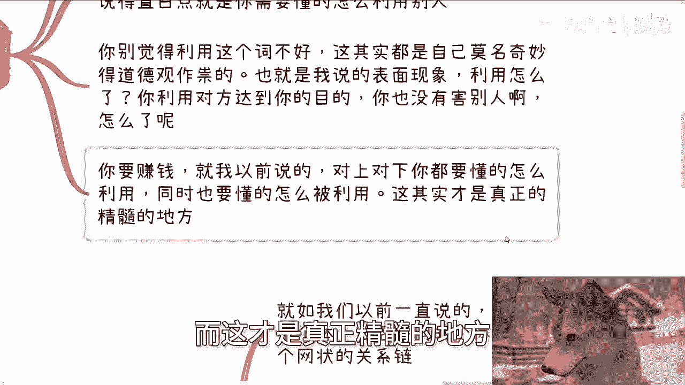
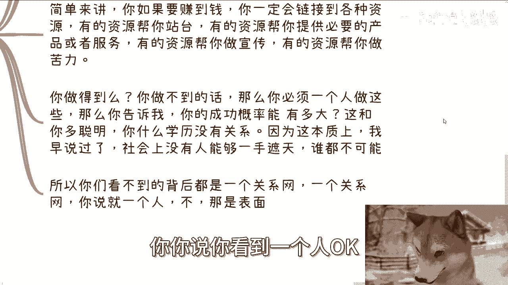

# 话又说回来，赚钱的基本素养你还是要有的 - P1 - 赏味不足 - BV1MAtte9Evj

好大家好呃，这一期呢是跟着刚刚这个大学生的那个。

第二期来的啊，为什么补这一期呢，是因为啊我我觉得还得补一下，因为我担心很多人他妈一根筋啊，我先这么说啊，话又说回来啊，就是赚钱的基本素养，你还是要有的，什么意思啊，就是我在第二期里面我给你们讲的是什么。

就是你不要轻信别人对吧，你爱怎么样，你该去验证的，你该去就是说啊，对于一些就花里胡哨的东西，清这个这个怎么说呢，不清楚的你就不要去理会，对不对，但是咱话又说回来啊，你既然作为一个想要赚钱的人。

那么你就也必须懂得怎么花里胡哨去跟别人讲，你没有办法，你知道吗，因为社会本来就是这么一个样子，人人类世界他就是这么一个样子，对不对，你别一根筋，你到最后就说啊，张老师说的对吧啊。

这个东西啊他妈的都是都是忽悠的，都他妈的是花里胡哨的，但是我跟你讲，得会呀，你不会你怎么搞啊，对不对啊。

首先我先说啊，下一期活动啊，也定了9月21号下午一点到六点好吧，在杭州，那么本期呢我也加了两个新的主题，一个是我私下跟大家讲一下，就上海大会啊，这次跟这个研究院院长聊下来，一些这个政府最先关注的一些点。

一个呢就是说我现场会跟大家，主要可能就是这个东西就跟大家分享一下，就是说这个活动的这个方案啊，还有就是跟高校以前合作的一些PPT啊，那么呃想要参加或者了解详情的，可以继续私信我啊。

那么额首先啊咱先说我先说最后一个的。

就是你们可能会觉得啊，就是如果按照我这个说法，那我们可能就是跟资本家政治家一样了，对不对，首先啊你必须一样，为什么就像我说的，你不能一根筋来对吧，你必须一样，你不一样，你怎么赚到钱，你不从他们角度思考。

你不像他们这样思考，你怎么可能赚到钱，对不对，你怎么起步，你怎么了解这个社会，你怎么就是往更深入了解对吧，你就像很多人很搞笑的，非常可笑的跟我说，哎我就靠读书对吧，靠靠就是说我我我认识的人。

你读书你认识的有有卵有卵用啊，对吧啊，但是呢同样的我在这地方也放到一开始说啊，就是说你需要保持自我，这就是你需要不一样的地方，因为你需要时刻记住你是个群众的议员对吧，老百姓的议员。

我们是为了要要造福大众，造福群众，为了人民群众对吧，而存在的希望就是说大家能够未来啊，让更多的人能够去了解到对吧，当然啊我也相信啊，很多人他可能就是啊怎么说呢，赚钱肯定是第一位。

那剩下是不是说要让就是时刻能记住自己，是老百姓一员，或者时刻记住自己是，比如说人民群众议员这个东西呢就有点我，我对于他来讲，我有点道德绑架了对吧，你那那OK我我也认可啊。

所以说这种东西随缘啊，随缘，我反正只是阐述我的这个看法啊。

首先第一点啊，基本素养是什么，我沟通下来这么多人啊，其实我发现核心中的核心中的核心中的问题，其实就一个，就是如果你永远把赚钱当成单机游戏，那么你就永远赚不到钱啊，你比如说你说有很多人说我要做自媒体啊。

我要出去赚钱了啊，我要做做副业了啊，你你你比如说啊你就自己做内容，那么无论啊，我今天就说你是这个花钱投流还是不投流，本质上你都是个单机游戏，因为你你自己细想想看啊，你相当于是自己想一件事情哦。

自己做一件事情，然后呢平台或者投流无非就是你的一个工具，这就好像你今天啊自己要要要要说，我要种种种个树对吧，然后你自己拿铲子自己挖坑对吧，自己埋对吧，自己怎么样子，就是说你没有跟任何的机构或者人。

或者组织去合作，那这个就是个单机游戏，那同理你把这个逻辑放到学历上，工作上也是一样的，学历跟工作或者学校跟工作更像一个什么，更像一个大型局域网游戏对吧，这就好像我以前说的大型楚门的世界。

就他还是不联网的对吧，那大家一直都说自己是普通人，自己没有积累，父母也没有什么积累，那都已经是这样了，那单机游戏我们怎么可能赚得到钱呢，这就像我那天跟你们讲的，你们在战略上只要是错的。

战术上再怎么勤奋都没有用啊对吧。

你在战略上永远就是啊，把自己变成一个战单机游戏，你说我他妈战术上很勤奋对吧，我他妈从早上到晚上我就拼了命的读对吧，寒窗苦读，或者我就是在那边拼了命的工作，有用完了没有用的呀，对不对啊。

第二那么咱话又说回来啊。

你要赚到钱，就需要像资本家或者政治家那样去思考。

或者未来有可能的话啊，你可能就会变成他们，当然啊联网的意思是什么，联网的意思就是说你需要懂得和别人怎么合作，这就是好像，我我今天这个视频一开始跟你们讲的，你们得要去懂得分辨什么是花里胡哨。

但同时你们也得懂得，怎么用花里胡哨去跟别人讲，对不对，你没有办法的啊，再说的直白一点，就是你要懂得怎么利用别人，那当然有很多人听到现在就说了啊，陈老师，你说利用这个词我就不开心了对吧，那我就跟你们讲啊。

就我以前举过一个例子啊，就是嗯去年早早期的时候啊，B站上有蛮多的人啊，对于我一直说他妈的对吧，韩妈区博主嘛对吧，说怎么样的就是很不满啊，说这个人呃满口脏话对吧，怎么样子，你记住一点啊。

就是所有的这些东西其实都是表面对吧，也就是说OK我今天就算他妈的呵呵，就是脏话连篇，那能代表什么呢，请问能代表什么吗，对不对，就是如果你对我有偏见哦，或者说你你给我下了个结论，或者你对我下了个定论。

那只能代表你对我有偏见对吧，那是你的问题，那不是我的问题对吧，那同样的就好像你觉得如果利用这个词不好，那是你的问题，你放到整个社会上有什么问题呢，唉请问有什么问题呢对吧，你这个东西就像我们说的。

很多人都是莫名其妙的道德观作祟，那也就是我说的表面现象，你你的格局如果仅仅都是关注在表面现象，你怎么能够去赚到钱，你怎么能够看到更多的东西呢，你从一开始就在局限你的视野有什么用呢，对吧啊。

那么我就说利用怎么了呢，你利用对方达到你的目的，你也没有害别人啊，怎么了呢，对不对，你要赚钱，就我以前说的，对上对下，你都要懂得怎么利用，同时你也要懂得怎么被利用，而这才是真正精髓的地方。

而这个东西哼，我只能说就是说，不管是所谓的知识付费。

或者学校里面肯定是没有人会说的啊，那么第三记住啊，你被道德观绑架的那一刻。

其实你已经输了啊，这就是我说的，就是说战略上你一开始就错，那那你怎么可能赢呢，啊就如我们以前一直说的，你是一个个体。

别人也是一个个体，然后不同的个体形成了一个互联网，或者一个网状的一个关系链，你觉得啊你不应该利用别人，那么你就达不到你的目的对吧，那么有很多人就要说了，哎我我他妈不认可，我觉得我一个人就牛逼。

对你可以不认可，你也许可以不通过利用对方达到你的目的，但是你们有没有想过，你不利用对方达到你的目的，第一你的成功概率很低，第二你的性价比很低，那还赚屁钱啊，对不对，就是说你本身可以达到。

但是你性价比不高，你利用的人越多。

利用的组织越多，利用的关系越多，你的效率也就越高，你赚钱的性价比也就越高，是不是啊，没有，我没有说你们做不了，但是我觉得没有必要对吧，那简单来讲就是说你如果要赚到钱，你一定要连接各方的资源。

有的资源帮你站台，有的资源帮你提供必要的产品或者服务，有的资源帮你做宣传，有的资源帮你做苦力，好好说到这啊，说到这啊，嗯有很多人就要说了，陈老师，我是个nobody，那按照你这说法。

你说你要连接各方资源，那我连接不到啊，那凭什么人家跟我合作呢，是我跟你讲，你们有这种思想也是被PUA出来的，为什么我就问你们面前有100个人，我们按照概率学角度来讲，或者按照一个正常的。

你们就是正常的这个智商的思维脑子来讲，这100个人都跟你们合作，你肯定觉得嗯陈老师你是个，你不要PUA我们，那如果我跟你们说，这100个人都不跟你们合作呢，你也觉得不切实际，对不对，不是一个道理吗。

那你就凭什么觉得别人不跟不能跟你合作呢，诶我就奇了怪了，你们能明白这个道理吗，就是说整个中国基数这么大，你为什么就去关心那些不跟你合作的呢，不跟你合作的多了呀，但是你只要找到一个跟你合作的不就好了吗。

对不对啊，那么我们就说关于这个连接资源，你做得到吗，你做不到的话，那么你必须一个人做这些，那么我就告诉你的成功概率能有多大对吧，这跟你多聪明，什么学历一点关系都没有，因为在本质上我早就说过了。

社会上没有一个人能够一手遮天，谁都不可能啊，所以你们看不到背后的呢，其实就是说都是一个一个个关系网啊，你你说你看到一个人。

OK那只是表面啊，那么第四我们来让我们来举个例子，你就拿我们前两天说的学校来讲。

因为前两天不是刚说完学校嘛，我觉得也蛮好的，你看啊，学校需要院士，需要政府机构的合作，需要企业合作，那需要干嘛呢，需要政府来合作实验室对吧，要要要批款啊，包括各种各样的合作证书。

需要企业来做校企的合作对吧，产业学院啊，包括产学研这种，也需要各种企业创业团队过来做分享，对不对，好，那么学校还需要什么各种普通老师来教课，也就是我们说的牛马，还需要各种教授来骗阿，不对吧。

同样的教授也需要各种硕士或者博士啊，或者甚至本科生来做苦力，对不对，那么至此啊，当然还有啊，学校还需要各种学生，也就是我们说的苦力啊，牛马啊，劳动力啊，甚至韭菜啊来提供金钱，让自己能够继续活下去。

那么你会发现至此，整个高校的生态循环它就已经怎么说呢，叫做商业闭环，对不对，就是既有韭菜提供钱啊，又有这个呃，上面能够去问问问别人要补贴，对吧，要要要经费对吧，然后自己又能够在里面呃，怎么怎么说呢。

就对吧，这个贪点钱对吧，怎么样的，那整个生态就就完善了啊，那么这个叫什么，这个就叫做合理利用资源啊，那你说我们就像我们刚刚举的例子啊。

你说哎今天有个人很他妈能干对吧，他能把一个人24小时，当成240个小时来用啊，那么他就说哎那陈老师，你说我能不能我做校长，我做院长，我也做老师，我也做教授，行不行啊，行啊，可以啊，你又不是你做对不对。

你说能不能赚到钱，哎那不好意思，我我我我没有办法一棒子打死你，你说我你说你必然赚不到钱吧，哦我说你必然赚不到钱吧，你肯定不开心对吧，但是我就这个例子扔给你们，你们用你们的脑子思考一下，你说他们能赚不到。

赚得到钱，你怕不是觉得他是个傻子，是不是这个道理对吧，所以说就是说你们记住一点，就是很多人在那边说啊，我要做个副业，我要做个自媒体，我要做个什么东西，你但凡只要还是单机去玩的，我就告诉你，你随便怎么选。

你卷不出钱来，你也卷不出关系的，你明白吗，哦好吧，你仔细再想想看啊，仔细再想想看行好吧。

然后那个叫什么活动好吧，9月21号啊，要报名的继续报名，那么剩下的话就是说工作上面职业规划啊，商业啊，副业对吧，或者其他的就是商业规划啊，你们觉得有任何的一些呃问题，或者职业规划上面或未来发展上面。

商业规划，商业发展上面，你们有任何的需要啊，我给你们一些啊，接就是贴切你们个人情况，因为每个人情况不一样嘛，听一些你们个人情况的，职业规划和商业规划的建议的话，那么你们可以整理好对应的。

个人问题和个人背景好吧。