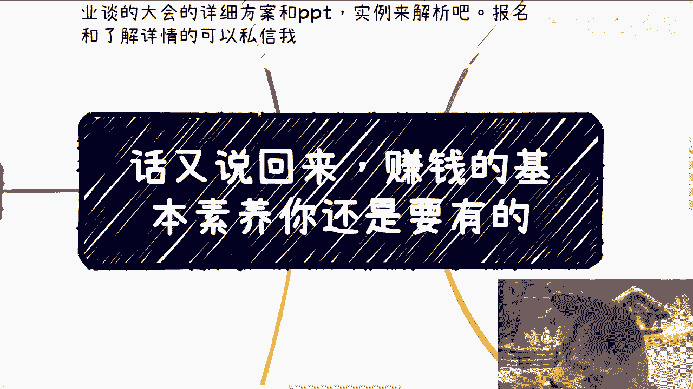

# 课程名称：赚钱的基本素养 🧠 - P1

## 概述
在本节课中，我们将要学习赚钱所需的核心思维模式。我们将探讨为什么不能将赚钱视为“单机游戏”，以及如何通过建立连接和利用资源来构建有效的赚钱策略。

---

## 核心观点：赚钱不是单机游戏
上一节我们介绍了课程的主题，本节中我们来看看第一个核心观点。

如果你永远把赚钱当成单机游戏，那么你就永远赚不到钱。例如，很多人想做自媒体或副业，但只是自己制作内容。无论你是否花钱推广，本质上这仍然是一个单机游戏。因为你只是自己思考、自己行动，平台或推广只是你的工具。

这个逻辑同样适用于学历和工作。学历和工作更像一个大型局域网游戏，它仍然不是完全开放的。既然很多人都自称是普通人，没有积累，那么玩单机游戏怎么可能赚到钱呢？**战略上的错误，无法通过战术上的勤奋来弥补**。

你在战略上把自己局限在单机游戏里，战术上再勤奋，从早到晚拼命学习或工作，也是没有用的。

---

## 转变思维：像资本家或政治家一样思考
理解了单机游戏的局限性后，我们来看看需要如何转变思维。

你要赚到钱，就需要像资本家或政治家那样去思考，未来甚至可能成为他们。所谓“联网”，就是指你需要懂得如何与他人合作。正如视频开头所说，你要懂得分辨什么是“花里胡哨”的包装，同时也要懂得如何用“花里胡哨”的方式去与他人沟通。直白地说，就是你要懂得如何“利用”别人。

很多人听到“利用”这个词会感到不适。但请记住，所有的情绪和道德评判往往只是表面现象。如果你的格局只停留在表面现象，被个人的道德观所局限，你就很难看到更广阔的机会，也难以赚到钱。

利用对方达到你的目的，只要没有损害他人，这本身并无问题。要赚钱，你必须懂得如何“对上对下”地进行利用，同时也要懂得如何“被利用”。这才是精髓所在。无论是知识付费还是学校教育，通常都不会教授这一点。

**你被道德观绑架的那一刻，其实你已经输了**。这同样是战略上的错误。

---

## 连接资源：构建你的关系网络
学会了转变思维，下一步就是付诸实践，即连接资源。

你是一个个体，别人也是个体。不同的个体连接起来，就形成了互联网或网状的关系链。如果你认为不应该利用别人，就很难达到目的。当然，你可以选择不利用他人，但这样做的成功概率很低，性价比也很低。

**利用的人、组织和关系越多，你的效率就越高，赚钱的性价比也越高**。简单来说，要赚到钱，你必须连接各方的资源。有的资源帮你站台，有的提供产品或服务，有的负责宣传，有的承担执行工作。

很多人会问：“我只是个无名小卒，凭什么别人要跟我合作？” 这种想法本身就是被误导的。中国人口基数庞大，你不需要关注所有不与你合作的人，只需要找到愿意与你合作的那一个就够了。如果你无法连接资源，所有事情都只能自己完成，那么成功概率将非常低。这与你的智商或学历无关，因为社会上没有人能一手遮天，背后都是一个个关系网络。

---

## 案例分析：高校的生态闭环
理论需要结合实际，让我们通过一个例子来加深理解。

以高校系统为例。学校需要院士、政府机构和企业进行合作。它需要政府合作实验室、批准拨款和颁发证书；需要企业进行校企合作，建立产业学院和产学研项目；还需要企业创业团队来做分享。

同时，学校也需要普通教师来授课，需要教授来领导项目（教授也需要硕士、博士甚至本科生来做具体工作）。此外，学校还需要学生来提供学费，以维持其运转。

至此，整个高校的生态循环形成了一个完整的商业闭环：既有“韭菜”提供资金，又能向上级申请补贴和经费，系统内部还能实现各种运作。这就叫做**合理利用资源**。

假设有一个人非常能干，能把24小时当成240小时来用。他问：“我能不能同时做校长、院长、老师和教授？” 当然可以，但这并不意味着他能有效地赚到钱或成功。这个例子说明，单打独斗的效率远低于构建一个协作网络。

很多人想做副业或自媒体，但如果始终以单机模式进行，无论选择什么领域，都很难赚到钱或建立起有效的关系。

---

## 总结
本节课中我们一起学习了赚钱的基本素养。核心要点是：**赚钱不是单机游戏**，必须摒弃孤军奋战的心态。你需要**转变思维，像资源整合者一样思考**，懂得合理利用与被利用。关键在于**主动连接各方资源**，构建协作网络。最后，我们通过高校生态的例子，看到了一个**利用资源形成闭环**的实际模型。记住，战略方向正确，努力才会有效。

---

## 活动与后续
*   下一期活动已定于9月21日下午1点至6点在杭州举行。
*   本期新增了两个主题：一是分享上海大会与研究院院长交流中获得的政府关注点信息；二是现场分享以往的活动方案及与高校合作的相关资料。
*   如需报名或了解详情，请私信联系。

如果你在职业规划、商业发展、副业选择等方面有任何个性化问题，需要结合个人背景的具体建议，请整理好你的个人情况和问题后进行咨询。