# 详细来聊下轻资产运作-我从不做重资产---P1---赏味不足---BV1F84y1g7u3

在本节课中，我们将要学习什么是轻资产运作，以及个人如何从零开始实践这种低风险、高效率的商业模式。课程将结合具体案例，拆解轻资产运作的核心逻辑与实操步骤。

---

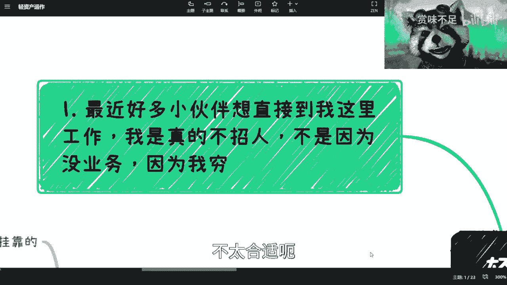

## 概述

轻资产运作是一种避免投入大量固定资产和资金的商业模式。其核心在于利用现有资源、信息和人脉，通过撮合、顾问、渠道等方式创造价值，从而最大限度地控制风险并保持灵活性。对于创业者、自由职业者或寻求副业的人来说，这是一种非常实用的起步策略。

---

## 一、 我为何选择轻资产运作 🤔

上一节我们概述了轻资产的概念，本节中我们来看看我选择这条路径的具体原因。

我最初选择轻资产运作，是因为对商业了解不深，自知没有能力驾驭需要重资金投入的项目。重资产项目容易导致巨额负债。如今我坚持轻资产运作，是基于对当下及未来经济环境的判断，结合自身能力边界做出的选择。我清楚自己的定位，只做能力范围内的事。

此外，我不想承受过大的心理压力。一份固定工作虽然能提供稳定收入，但往往需要做不愿做的事，面临绩效压力，且所有积累都属于公司。长期如此会让人心累，情绪变差，甚至需要额外方式缓解压力。轻资产运作让我能掌控自己的工作与生活节奏，避免这种消耗。

---

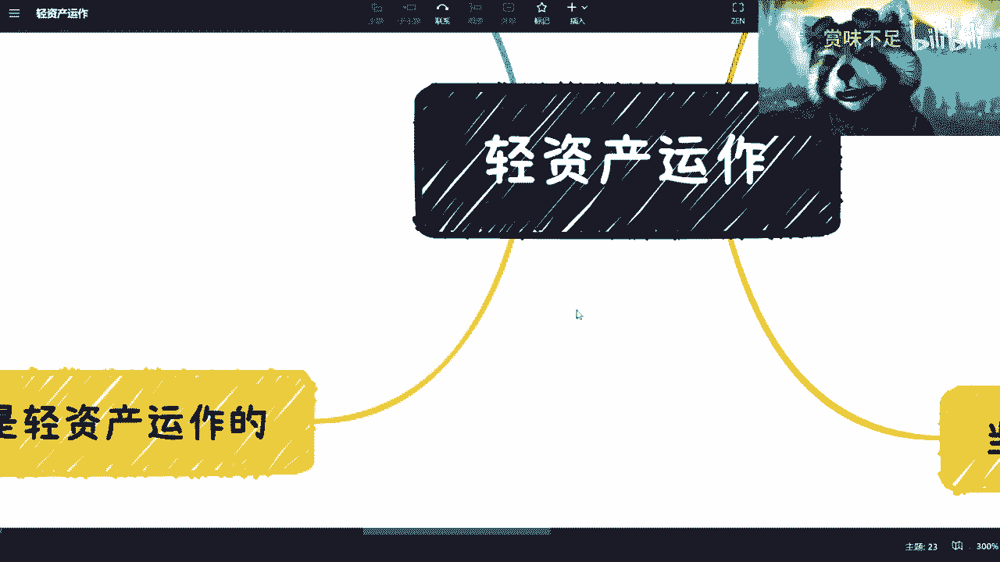

## 二、 我的轻资产实践案例 📋

了解了动机后，本节将具体介绍我目前进行的轻资产实践项目。以下是几个主要方向：

1.  **公司架构用于信用背书**
    我拥有一家公司，但其主要作用并非经营流水，而是作为商业信用背书。在商业合作中，一个合法的公司实体能增加可信度。其公式可以简化为：**可信度 = 合法实体 + 过往记录**。这家公司不用于发工资或缴社保，纯粹是一个架构工具。

2.  **顾问与培训服务**
    我以个人或顾问身份与各类产业园、学院合作，开展数字经济相关的培训与活动。合作基于项目制，不签订劳动合同。例如，为上海虹桥天地的智慧学院提供课程服务。

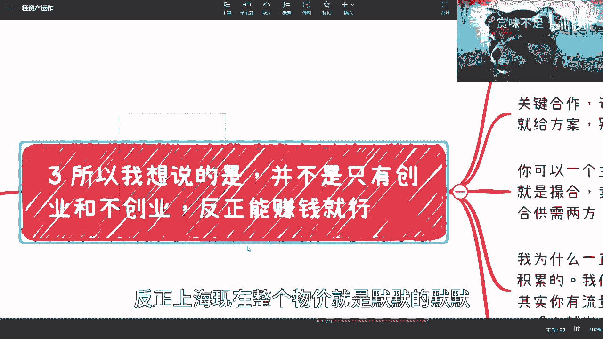

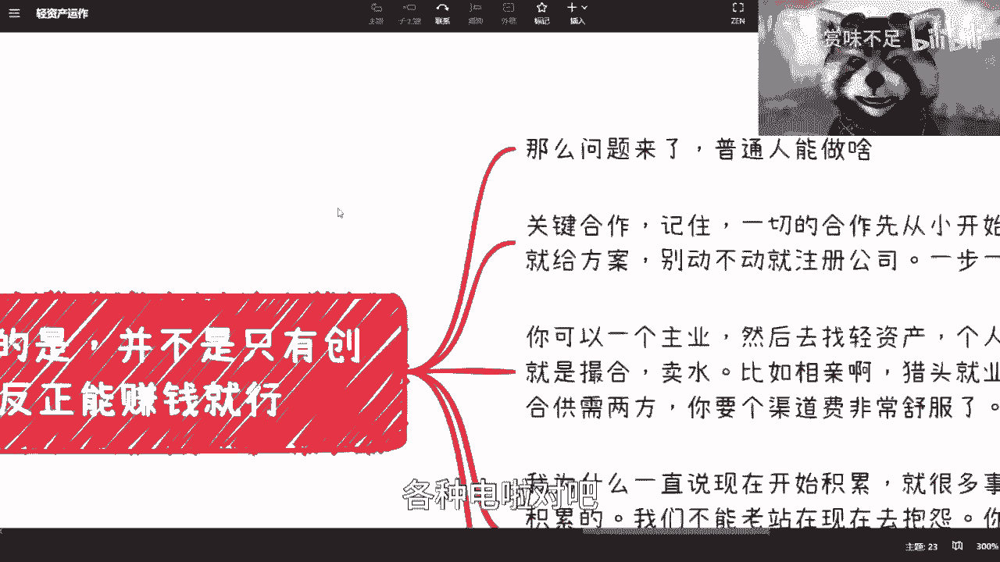

3.  **直播带货撮合**
    我连接货源与直播主播，促成合作。交易达成后，我从中抽取少量佣金。其核心代码逻辑类似于：`if (sale_completed) { my_commission = sale_price * commission_rate; }`。我不参与具体运营，只做资源对接。

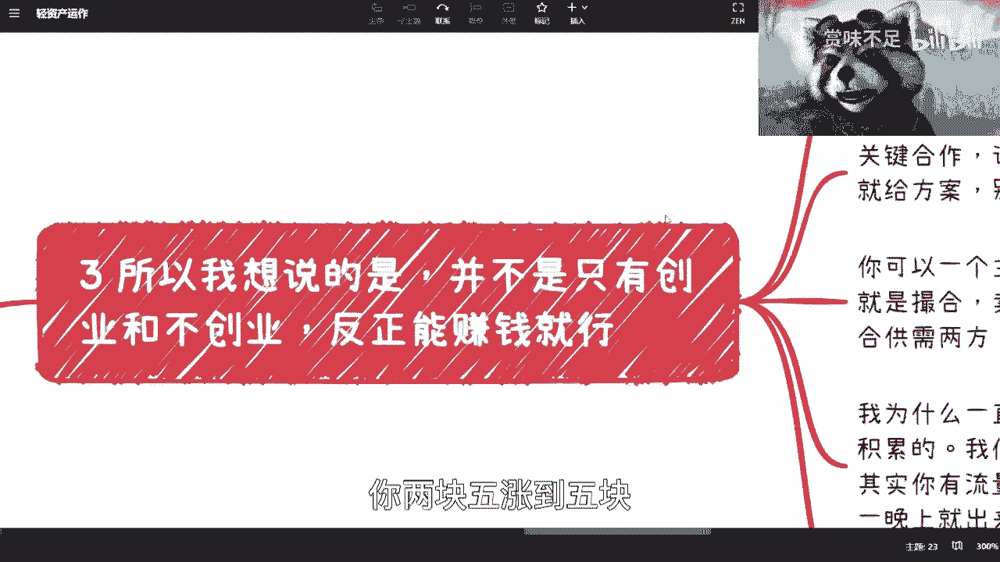

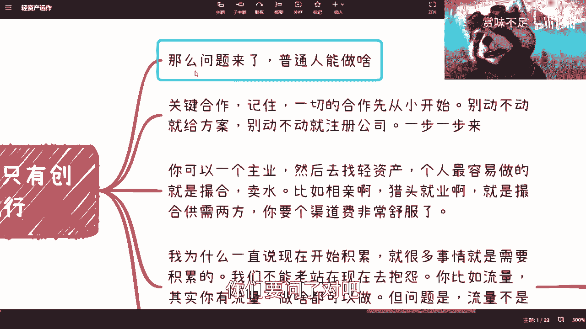

4.  **方案设计与项目转包**
    我承接企业或政府的方案需求，申请项目。项目获批后，我再寻找合适的团队来执行。在这个过程中，我扮演了“总包”再“分包”的角色，赚取信息差或管理费。

---

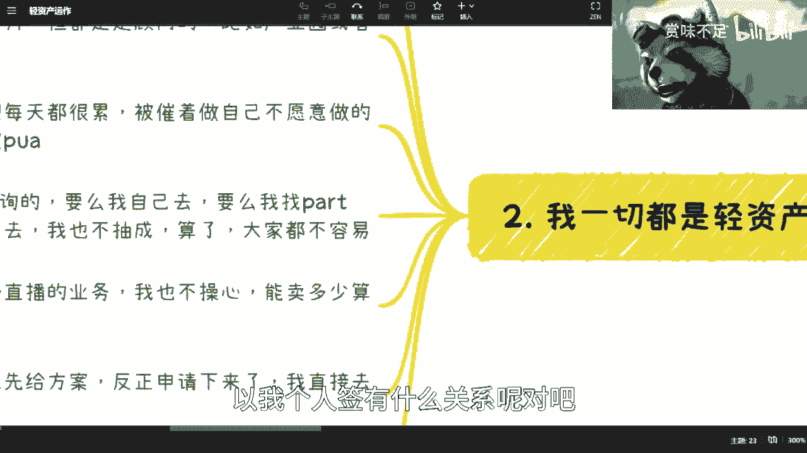

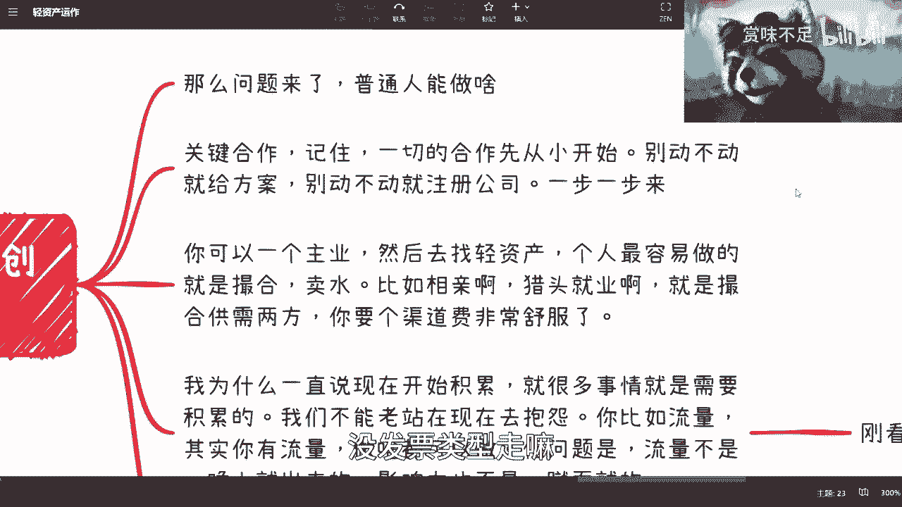

## 三、 当前环境下的核心原则 🛡️

在介绍了具体实践后，我们需要关注实施这些实践所必须遵循的原则。结合当前经济环境，进行轻资产运作必须牢记两点核心原则：

*   **保住现金**：杜绝一切不必要的资金投入。不要轻易投资、注册不必要的公司或购买重型资产。
*   **赚取现金**：行动目标是产生正向现金流，无论起步阶段金额多少。重点在于迈出第一步，建立赚钱的通道。

同时，要理性看待知识付费。不要二极管思维，认为所有收费都是割韭菜，或所有免费都是真心帮助。判断标准在于价值是否匹配价格，以及对方是否真诚。例如，我提供咨询明码标价，价格合理与否由客户自行判断。

---

## 四、 你可以如何开始 🚀

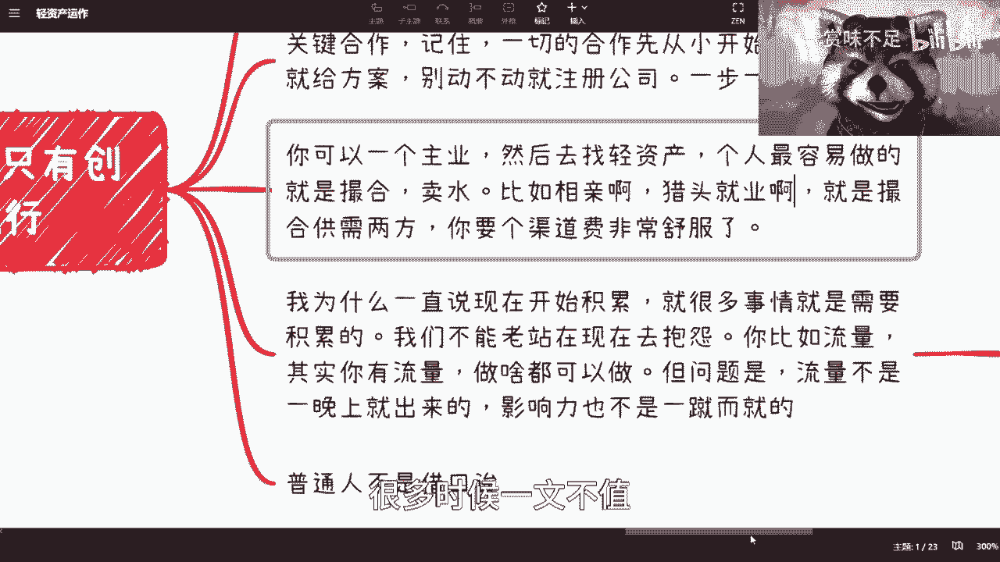

掌握了原则，本节我们来看看作为初学者，你可以采取哪些具体行动来启动自己的轻资产运作。

以下是给个人创业者的具体建议：

*   **从小处着手，切忌好高骛远**：所有合作都应从低成本、小规模试水开始。不要幻想一夜暴富。
*   **保护自身利益**：不要轻易免费提供完整方案，避免被“白嫖”。初期合作可以个人身份进行，签订合同并正常纳税。如果对方要求，可以注册“个体工商户”，这比重资产的公司更轻便。
*   **诚意是合作基石**：真正的合作方会想办法促成交易，而非一味设置障碍。如果对方吹毛求疵，很可能其中存在风险。

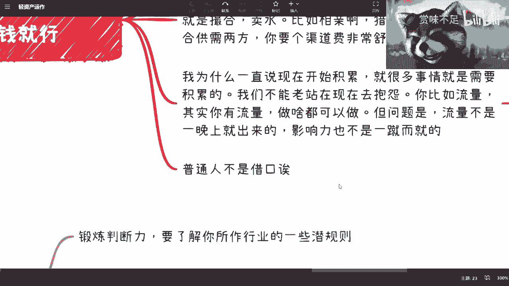

---

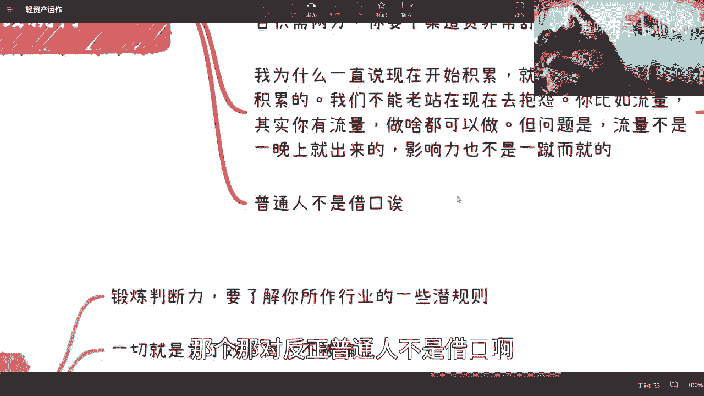

## 五、 轻资产的具体方向与案例 💡

那么，有哪些适合个人的轻资产方向呢？其核心模式往往是“撮合”。以下是几个案例：

1.  **活动撮合**：例如组织线下相亲局。寻找场地，策划活动，每人收费499元。这不需要专业背景，核心是组织能力和营销能力。
2.  **人才撮合（猎头）**：左手积累人才简历，右手对接企业HR需求，成功推荐后抽取佣金。本质是信息中介。
3.  **资源撮合**：结合政策寻找机会。例如，在乡村教授老人面点手艺，以此项目申请政府“乡村振兴”补贴。赚取的不是学费，而是政策补贴。
4.  **渠道销售**：成为某个产品或服务的分销渠道，赚取佣金。核心是“卖”，而不是“生产”。

这些方向与你的学历、专业关系不大，关键在于发现需求并连接资源。

---

## 六、 关键：积累与长期主义 ⏳

找到方向后，成功的关键在于坚持和积累。很多事情无法一蹴而就。

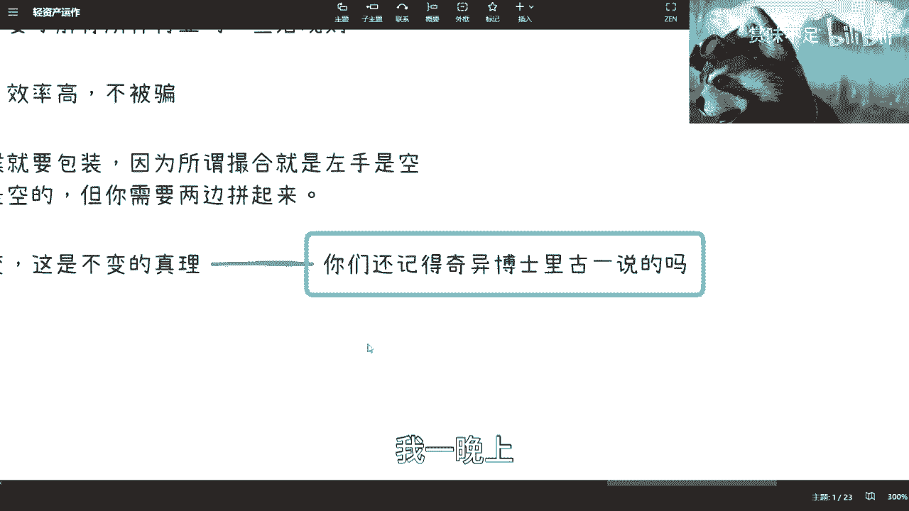

*   **立刻开始积累**：无论是人脉、流量、行业知识还是项目经验，都需要时间沉淀。不能永远停留在“寻找方向”的阶段，而要用行动创造积累。`current_experience += daily_learning;` （经验值每日增加）
*   **提升判断力与效率**：在行动中，要不断锻炼对行业潜规则（这里指真实运行规律）的判断力。合作时追求高效，前期明确分工与利益分配（是分润还是固定费用），避免无效沟通，这能帮你过滤掉许多不靠谱的合作方。
*   **善用包装**：在撮合业务中，适当的包装可以增加信任度。这不是欺骗，而是有策略地展示自身价值和可靠性，以连接起原本“空对空”的供需双方。
*   **相信量变引起质变**：所有成功都源于日复一日的练习和积累。就像奇异博士成为外科专家一样，商业认知和能力的飞跃也建立在持续实践的基础上。当你通过积累，窥见社会多层次、多元化的商业本质后，许多过去的纠结自然会豁然开朗。

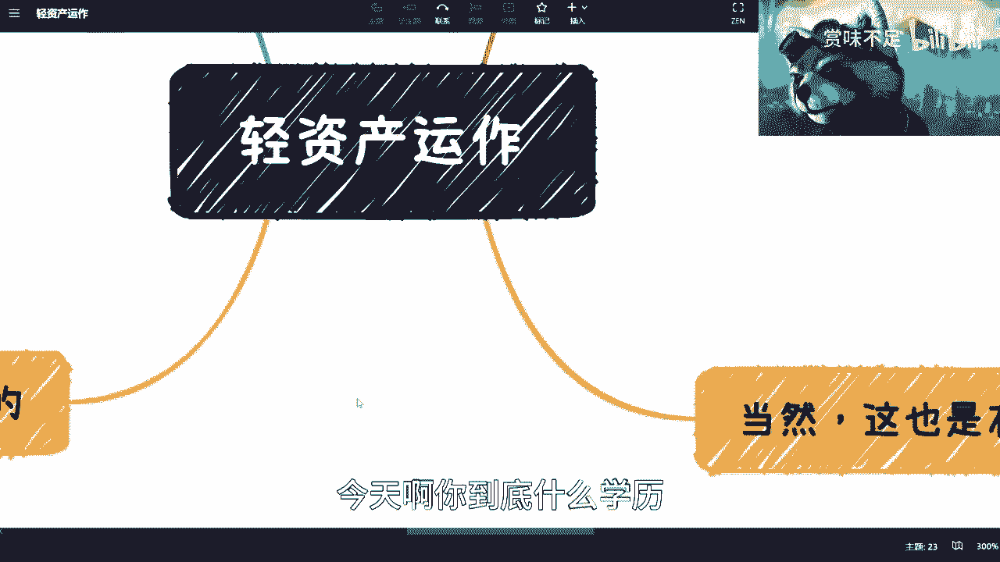

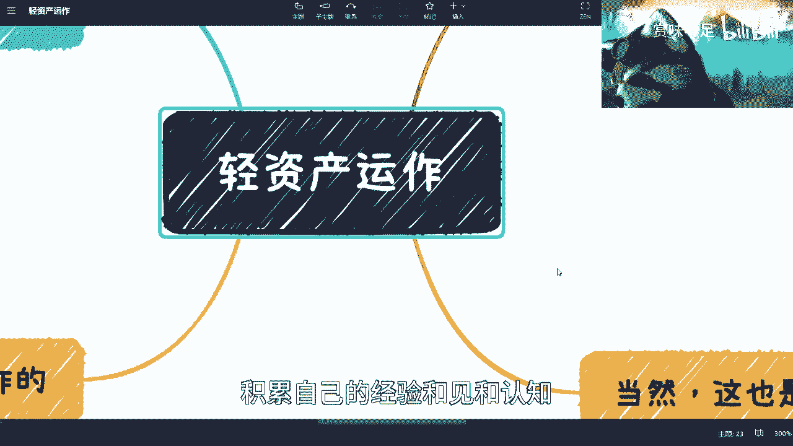

---

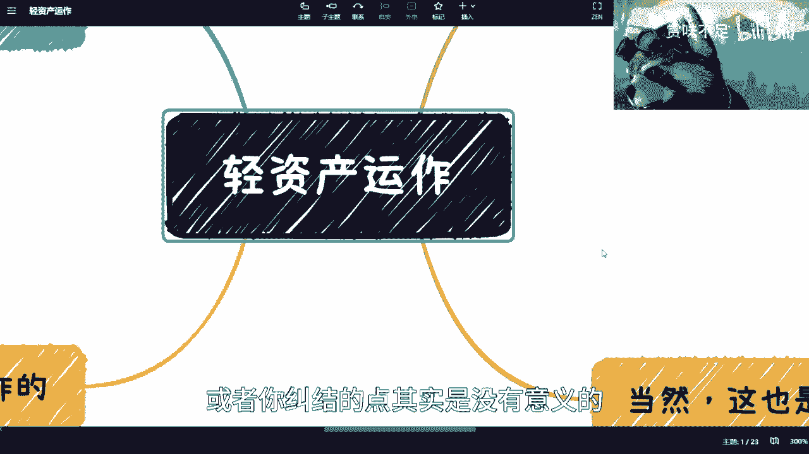

## 总结

本节课中我们一起学习了轻资产运作的核心理念与实践方法。我们探讨了其低风险、高灵活性的特点，分析了我个人的实践案例，并强调了在当前环境下“保住现金、赚取现金”的原则。更重要的是，我们拆解了个人如何从“撮合”业务入手，通过从小处着手、注重积累、提升效率、善用包装等策略，逐步建立起自己的轻资产事业。记住，重要的不是你现在的起点，而是你从何时开始行动并坚持积累。商业认知的升级，就藏在这日复一日的实践之中。