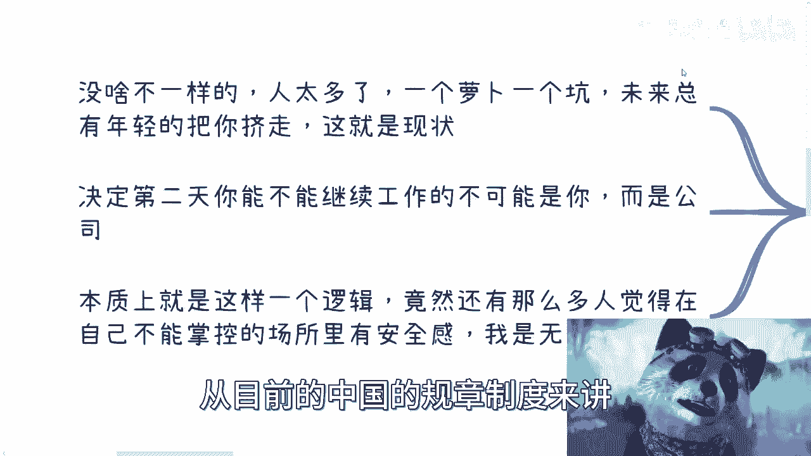

# 详细聊下毕业之后怎么做职业规划 - P1 - 赏味不足 - BV1K8411U7tD

好啊大家好啊，今天在外面没有用，我那个麦克风可能收音会不太一样啊，呀小熊猫小熊猫小熊猫对嗯，然后呢这一期还是给大学生啊。

给大学生这边来讲这个内容，我看看在哪里啊，这就我们说哎我这边改一下吧。

改一下吧，这个大学生就这个毕业之后呢，应该怎么做你的职业规划啊，呃首先呢我先说个大前提啊，就是呃大家如果客观的啊评价自己，或者大家如果客观的了解事实啊，你们要是觉得你们能做职业规划。

我觉得还是大家不接地气或者太过于狂妄啊，因为大部分的人职业规划是做不了的。

他只能被规划啊，你别去想做职业规划了。

没有没有这个可能性的啊，呃那么我们先来说这个大的前提啊，大的前提呢就是说不仅仅是计算机对吧，几乎所有行业现在都很卷啊，你的领导呢年龄也越来越小啊，你们公司里面你们行业里面也越来越卷啊。

然后跟你竞争的人越来越多，呃学历本身呢在行业里面也越来越水啊，简单来讲，就是说它能够给你带来一些这个起点啊，就是可能也不是多高的起点吧，但是在未来你工作35年之后，对你来讲就没什么卵用啊，那么所以呢。

我在这个地方要跟你们说的是什么呢，就是大家放下所有的有的没的面子啊，这个不用不用去想，有什么有什么好争的呢，对吧，就有很多人说哎呀，我没有985211对吧，我没有读书对吧，我没有去大厂怎么样了呢。

无所谓啊，你知道吗，就是你去不去，你这几年也就差那几万块钱，或者差了十几万块钱，你你本质上就是没有从A突破到B，那有什么区别呢，没有区别的呀，就如果如果大家说搞钱，如果大家说赚钱角度来讲。

大家同样都没赚钱，有谁可以看不起谁呢，对不对，没什么意思的，所以不要去争那些有的没的，你知道吗，就大家当你去争有的没的的时间，当你去羡慕别人的时间，剩下那些真正能够想要去搞钱付诸于行动的人。

每时每刻都在搞钱，没人来跟来来搞这些事情，你知道吗啊，而且另外一方面是什么呢，就是大家也自己认清楚一点啊，你们手上也好，这个大部分人手上也好，你们有的技能别人也有，对你们会的东西别人也会啊。

别搞得好像地球上中国14亿人，好像就你会对吧，那么话又说回来，就是你会的东西别人也会，那你早晚会被别人别人替换掉，那就这事实就这样子对吧，就是就怎么说呢，这个弱肉强食对吧，社会规则对吧。

这个发展规律就这个样子，有什么好回避的呢对吧，没有必要的呀，所以说认清楚这些事实，我们再来说职业规划这个事儿啊，不要老师就是说我发现这个评论区对吧，不要老师就是你们在我这在别人那边老问啊。

我现在这个在什么大厂，我前景怎么样，我现在做什么行业，前景怎么样，跟你没关系，前景怎么样，跟你有关系，为了你又不赚这个钱，又没能力赚这个钱，对不了啊，而且这个继续往下说啊，然后另外一方面呢。

现在也没有像以前那么多天时地利人和对吧，也就是说也就是说也没有这么多的收购啊，那么多的IP啊，就是当时以前的时代已经一去一去不复返了哦，你们千万别再拿着你们父母啊，你们老师啊，你们那些什么老师啊。

给你们描绘的那个饼啊，那个饼早就已经过时了，不知道多少年前的事了啊，所以说呢我们需要得出个结论啊，就是大部分的普通人，或者说大部分的老百姓，在工作上是赚不到钱的哦，你也是赚不到钱的啊。

而且你不但赚不到钱，你还很难直接往上去走，这才叫普通人啊，对吧啊，不是我们说啊，你们这个这个现在大家说哎呀，我这个呃这个本科没读对吧，我硕士读了，我说是或者我学校不好啊，或者我现在这个天坑专业有关系啦。

但在我看来没有关系的，就大家大家都还在一个牛马的level，大家都还在一个打工的label，有什么关系啊，有什么区别没区别的呀，哦你你你说你要是我就这么说吧，但凡你们要是真的很在乎对吧。

找到一份工作对吧，年薪差个10万20万，要月薪差个几千块钱或者几万块钱，你们要是在乎这种东西，我跟你们讲，那你就去在乎啊，就是你也干不成什么大事，你也不要去想赚钱，赚大钱了，就这个样子啊。

这格局就是放在这儿了啊，首先这是大前提啊，那么我们一个来说啊，首先我们来说怎么来做这个职业规划啊，是这样子的啊，我在这个地方呢也给你们分的很清楚了，如果你很优秀对吧，比如说啊。

你这个已经是高校里面的前百分之多少了啊，行业里面呢你也有一定知名度了，那么我觉得没问题，你就想慢慢往上卷，为什么呢，因为这个你的手上的这个牌适合往上卷对吧，通过跳槽啊，通过比如说熟人介绍去提升你的薪资。

就是你的那个basic basic salary对吧，还有basic package，还有就是你的值那个岗位的职级，比如说junior ci啊，management啊对吧，VP啊对吧。

这样往上走没毛病的啊，没毛病的，你就往上去走啊，然后一边走呢你会看到有更多的人更多的机会，我也相信以你的聪明才智，能够抓住一些自然而然的机会，然后呢就会衍生出更多的赚钱机会。

这些东西它是一个渠水到渠成的事情，是不需要我去教的，也不需要别人去教的，当然这个东西里面到底能做多大，做到底你能做多深，这个就跟你们每个人的悟性有关对吧，但是咱要说回来，大部分人不没有这个优秀的能力啊。

我相信你们看我视频也好，包括我自己也好，我们都不属于这类，这类人对吧啊那这是第一方面，第二方面呢如果你家里有关系，那么你可以回到有关系的地方啊，或者老家做公务员，也有很多做体制内的。

或者那些你们关系能够触及得到的那些岗位啊，就比如说呃非编制，但是是全额全那个叫什么劳动合同的岗位，那么接下来你不管你养老也好，往上升也好，你就别去想了呀，为什么呢，因为你反正都靠关系了。

也就说明你没能力对吧，你没有自主的能力，那么你就好好躺平对吧，你说哦你我跟你讲，很多人是这样子的，他既要又要对吧，就表现出自己好像很牛逼，你知道吗，就是你明明没有能力，你都已经靠关系了。

还要回还要再想着说哎，驴老师，我要不要我能不能再赚钱啊，我能不能在外面搞点东西，大哥你要能搞，你早就搞了啊，不是说你回家回家弄了个关系，你觉得你有能力搞了这两把他妈两码事啊，你知道吗。

你要明白你要有能力搞事情，你在哪都能有能力搞事情哦，而你会做这个选择，在我看来，你的内心就不想搞事情，就这么简单，哎口嗨，谁不会啊，对不对啊，那么你我跟你讲，你就好好躺平，反正接下来怎么地咋地也好。

好也好坏也好，反正不是你能决定的，不是这么回事，对不对，我一开始说了啊，放下面子，放下有的没的啊，这就直面问题啊，不要对吧，装没什么好装的啊，那还有第三个呢，就或者你家里经商对吧。

我也碰到很多人家里经商呢，你回去继承业务，而且爸妈呢很多父母呢也是愿意啊，希望孩子来继承这个业务的对吧，那我觉得很简单嘛，你就要一培养你自己的能力，能够守住了的业务，咱至少不倒退嘛对吧，然后再用。

比如说一些呃这个这互联网运营的方式啊对吧，这个媒体啊，MCN啊，或者等等其他的方式去提升效率，其实也是很可以啊，我觉得真的很可以的啊，那么以除上以外啊，我觉得普通老百姓就得认清楚，就像我这样的对吧。

就是我上面几个我都没有，跟我一点关系都没有对吧，我觉得普通人就要认清楚，你要么就选择去卷，什么意思呢，就是你明知道我没有关系，我没有钱，我也没有资本，但是我他妈还想去选，你，既然选择这条路了。

那就意味着什么呢，意味着在很多方面，包括名额可能内定，人家关系优先级比你高的情况下，你还要去卷，那么吃卷的意思是什么，就是你别再去问什么钱，你好不好，别再去问好也好不好，别再去问任何的东西好不好好不好。

本身没有关系，跟你没有任何关系，你就往死里卷就可以了，你明白吧，因为你在卷的这条路上，外面行业好不好跟你没有关系啊，因为行业好不好是资本家赚钱，是企业赚钱，跟你一个打工的牛马有什么关系，毫无关系。

对不对哦，你你既然选择去卷了，你就别再去想说哎呀，驴老师，我觉得我现在很卷，我现在很苦，我又赚不到钱，既要又要没有意思呀，对不对，就这么简单啊，一个人一天就24小时对吧，你就这样，很多人跟我说。

我做计算机很忙，那你换个好的，有不忙的呀，你薪资要低一点呀，对不对，你不还是心里面就想着要多拿那几千块钱，然后忙忙那么又不开心对吧，然后又没时间，又说自己没空去做别的，那你怪谁呢，对不了。

那么第二个要么就是选择太太，明明打工对吧，稍微卷一卷对吧，比如说60分卷对吧啊，然后呢你也怕身体不好，那你就一辈子平平淡淡就可以了对吧，你也别去想要去赚钱，别再就东东想西想对吧，焦虑说哎我怎么不赚钱。

我怎么赚不到大钱对吧，不可能的啊，你也别忘行业好不好，前景好不好，别问任何东西好不好，跟你没关系对吧，这不就第二条路嘛，对不对啊，就简单了，你也别去问什么，哎呀，我第一份工作多做多久。

我要不要几几年后跳槽，怎么样子，有关系的没有关系的，有意义，本来没有意义的呀，你以为仅做几年或者几年后跳槽，这个当中的选择多几年，少几年，你去哪些公司怎么地飞黄腾达了，还是说有质变，我告诉你们不可能的。

别想想都别想，我给你讲一点希望都没有的哦，你要抱有这希望，你不能买福利彩票啊，就这么简单啊，那么还有呢，要么就是说你一开始就想好对吧，主任我随便找啊，找份工作对吧，混个五险一金，混个温饱对吧。

我不想跟大家卷，就是你的态度就是我一点都不想跟大家卷，我就想找个工作，不要太忙，结束了对吧，剩下的是什么呢，接下来就是你副业多开对吧，多多开几条线，就是搞钱啊，当然在这个地方我跟大家说的很清楚。

别去创业啊，创业跟搞钱是两码事，不是只有创业才能搞钱的，搞钱的方式多如牛毛对吧，那么你就各种短线长线的业务去做对吧，能赚外快的就赚外快，不能赚外快的，你就正常的对吧。

商业合作就往往积累积累的去做长线去做对吧，别人打工，别人双休日对吧，休息别人晚上休息，你晚上出去混，你双休日出去混对吧，你该混圈子混圈子，该混关系混关系，趁你年轻的时候多出去积累人脉。

别人卷别人在工作上卷你去，你去商业上去卷，对不对，那么只有这种时候，我跟你讲，只有你这样去做了，行业不好，我跟你讲，你也能赚钱，为什么，因为商业层面很多的单子，很多的机会都是在的，只不过是钱多钱少。

你知道吧，行业真的好了，你就有可能起飞，就这么简单，没力啊，对不对，当然说到这边啊，有人就要说了，他说哎呀，驴老师我上线做不了啊，我觉得我不是这块料对吧，而且真的能做的，我觉得其实是凤毛凤毛麟角的。

对吧好，那我就这么跟你们讲，那他妈的哥哥们，大佬们啊，姐姐们，爷爷们，奶奶们，你们怎么不说，在工作上面往上卷都是凤毛麟角呢，那你们怎么还想着往上卷呢，对吧对吧，而且另外一方面你们实践都没实践过。

怎么就得出来是凤毛麟角了呢对吧，而且我跟你讲，你要真的能卷，你要会卷，商业上也好，工作上你都能够成功哦，但凡你要不会折腾打工，你也是卷不来的，我跟你讲，你也是舔不来的，你也赚不到钱，就这么简单回事。

就是我跟你讲认清楚，你知道吗，就不要就不要就是说自己对自己又认不清楚，而还抱有很多幻想，没有意思的，你知道吗，真的没有意思的，就是我跟你们说，你们现在如果大一大二大三大四还是有机会的。

如果你们刚毕业一两年也还是有机会的，你别等到毕业10年对吧，然后说唉呀我要想着出去积累了，哎呀，我要出去怎么样了，哼我跟你们讲，你到时候叫什么叫心有余力不足啊，而且你的驱动力也不强。

而且你也没这么大精力，还主任去换了，到时候怎么滴了呢，到时候我就这么说吧，就是可能30岁35岁，你真的只能盖棺定论了，就棺材板就盖上了，就这么回事了啊，你后面就是像我跟你讲啊，按照这时代发展。

35岁40岁找不到工作的人多了去了，对你该摆出去摆摊出去摆摊，该该干嘛该干嘛干嘛对吧，就别再去老师穿长衫了，也别也别老师就是在那边问他，哎我这个前景怎么样，我要不要换个行业，没有用的。

这跟行业你我你我跟你们说，你们工作跟行业一点关系都没有，你知道吧啊张雪峰跟所有人讲的对吧，就是选什么专业，做什么东西，只不过是一个很好的起点，或者说能够让大家在自己有打牌的情况下去打，去打一个攻。

你知道吗，但是并不代表这件事情长远来讲，10年20年很稳定，不存在的啊，怎么可能稳定呢，对不对啊，好这个是二对吧，我们来看三啊，好那么我们来职业规划，那我们来看看职业规划啊。

首先打工层面你是认识不到任何商业上的人的，你也积累不了任何商业关系，我跟你们讲，别老幻想了啊，你们别老觉得说我做个销售，我就能去积累商业关系了，不可能的，你积累出来的东西，你写出来的代码。

你做出来的专利，你做出的任何东西都是归公司的，人家合作也是看工作面，公司的面子上，人家看合作也是公司也前期的打招呼，前期的关系积累跟你没有关系，你积累的东西，你积累到的东西不是你的。

你知道吗哦这是第一点，第二点呢你别去看什么攻，你别去看去什么公司，去什么岗位做什么，有没有什么帮助，你知道吧，有没有什么帮助，很简单，看你需求，你如果用爱发电，你是个抖M，那么你随便对吧，你去哪都一样。

反正都是被打工被压榨，对不对，就结束了，你说你现在去了大厂或者有什么好的项目对吧，你觉得这个地方很好，国家电网或者别的地方，你觉得最近这个包括电动车，你觉得机会很好，那我就问你嘛，你觉得机会好不好。

是那对于你来讲，你积累什么东西对吧，你说这个项目很好，这个项目很好，我的理解是这个公司可能很难赚钱，这个公司可能在这个项目上面大捞一笔，那我就问问你能做什么吗，对了你能积累什么，你能了解到什么。

你能你能积累更了解到的东西，是不是能够给你个人未来带来变性，或者能不能有可能利用这些事情带来变现，如果不能，那有卵用啊，就就我发现很多人这个评论区跟我讲，哎呀我我觉得这个这个这个公司不错对吧。

我觉得这个行业不错，他做这个东西不错对吧，然后什么怎么样怎么样怎么样，那错不错，跟你有啥关系呢，你是合伙人还是董事会，你又不是，你说是不难啊，所以说其实你真的从普通人，从基本盘角度来讲。

大家哪有能力跟主动权做什么职业规划，这他妈就是BULSHIT，你知道吗，就更多的就是被规划罢了啊，我觉得职业规划大家不应该理解为打工的规划，而是说你属于个人的这个叫做职业上的规划啊。

现在很多人做职业规划就是打工规划，我不知道为什么，你知道吧，就是说你要让自己一步一步的更高效的去赚钱，这叫职业规划哦，不是说我今天这个牛马在哪里做，明年在这个牛马在哪里做，卧槽我就问你们。

你们牛马在哪里做，是你们说了算的吗，不是啊，哥哥们啊，姐姐们，爷爷们，奶奶们啊。

是你们说了算的吗，不是啊，对不啦。

好第四个啊，自己的选择呢就是已经决定了你的发展啊，别再去问怎么发展都在浪费时间，什么意思呢，你比如说啊，你选择公务员对吧，你选择国企央企对吧，曾经B站上有小伙伴就来问我，他说我这个之后怎么发展。

我那次可能这个形势不好对吧，说的也不太好听，我说都这样选择了，有啥好发展的，对不对，就我说你自己想想看，你都这么选择了，你问我发展，你说话发展对不了，就是你的选择已经代表着你内心的想法了对吧。

不要既要又要既要又要没有用的呀，你叫又要只会竹篮打水一场空，你知道吗啊，第二个就是说你选择去卷工作，卷大厂卷技术，那就说明你是想去卷的对吧，你别老师喊着说哎呀，驴老师，我不知道有没有别的路。

我不知道怎么样，你不是不知道，你就是想卷，你就是不想去做别的东西，你知道吗，我跟你说，你要你要这样做，你就别去喊赚钱，你就别去喊别的东西，你赚不到钱的啊，基本盘就是这个样子的啊，第三就是你要想赚钱。

我跟你讲工作就随意，反正年龄大了都是要被筛选下来的，就这么简单哦，那么你需要在年轻的时候出去折腾啊，出去看看别人怎么赚钱呢，看看别人怎么提升实心的，这才是本质啊，看看别人是怎么躺赚的对吧。

为什么别人坐在那能不赚钱，对不对对吧，那你如果不愿意去折腾，那就别喊着赚钱，你知道吧，就我现在做咨询也是的，我跟你们说，我每次都会问问对方，我说你到底想干嘛，你跟我说清楚，你想干嘛对吧。

因为有的人就是想用爱发电的。

有的人就想赚名，就感觉有成就感，有的人就想搞钱，你知道吧，我最怕的你知道是什么吗，就是驴老师，我想打工，但是我想搞钱搞，你跟我他妈要逼着你说，对不对，就这这话要逼掉了，对吧啊。

那第五个就是有的小伙伴要说了对吧，每个行业的每个岗位都不一样，你不能一概而论，我跟你讲是不能一概而论，但是现在情况没有什么不一样，为什么，因为每个行业的人都很多，一个萝卜一个坑，未来总有年轻人把你卷走。

未来总有人跟你掌握同样的技能，把你卷走，更何况我开局就说了，大家手上技能不是什么了不起的东西，对不了，而且你要明白，决定第二天你能不能继续工作的，继续做牛马的人，不是你啊，是公司啊。

哦你以为你今年签签了个两三年的合同，签个5年合同就什么稳坐泰山了，高枕无忧了，可能不了，对吧，你想让他就知道不可能的呀，你们的去你们的未来，你们来去对吧，你们的所有东西都是公司所说了算的。

但凡你们手上没有自己的一些竞争力，你不不就是别人决定你们的命运吗，对不对，还做啥职业规划，做个屁，职业规划本质上就是这样一个逻辑，我跟你讲啊，就我就不明白这么多大学生读出来对吧，这么多年书读出来。

竟然还有这么多人觉得，一个在自己完全不能掌控的一个行业，或者一个领域，或者说一个公司里面，他竟然跟我说他有安全感，我他妈是无法理解的，我不知道债券哪里来的，你知道吗，就是我就这么说。

从目前的中国的规章制度来讲。

的确哦有编制的人有安全感，我可以理解，那当然这个安全感就是说你可能新就是说薪资，我可以告诉你们，薪资可以随时减的，比如减50%，减75%都可以的，但是工作是丢丢不了，这是对的啊。

当下我只能说当下未来我不敢说啊，但是除了这个以外，别的你跟我说安全感，我他妈是不理解的，你是你爸是董事长呢，还是你是董事长呢，还是你爸是你爸是CEO呢，我也不明白对吧啊，所以说呢。

就是不要再用学生思维去考虑工作这件事情，对吧，就是我跟你们讲就两个极端，什么极端，就是你要么就做好牛马啊，永远就做好牛马，不要反抗，要么就另外一个极端，就是我他妈没毕业，我或者一毕业对吧，我就开始搞钱。

我不管他别的这种牛马公司对我，比如说我就五六千块钱，你要爱要不要不要他妈我至少另外一家公司，他妈的天下公司这么多了，我怎么怎么滴了，没公司要我吗，对不了，然后剩下时间我就去搞钱，我管你们这么多。

你你这种什么大厂里面谁爱卷谁卷，跟我有什么关系，有的就这么简单，我跟你们讲，结束了哦，不要花时间，不要再浪费自己这么宝贵的什么，毕业后的两到3年，三到5年的时间去那边想有的没的，哎呀，我选这个公司好。

选那个公司好，还选这个还选那个号，我他妈有区别吗，没区别的呀，哥哥们，你知道吗，没有真的是一点区别都没有的，好吧嗯就这么着吧啊嗯反正大家有有什么。

就大家如果知不知道自己牌怎么打的啊，或者有自己觉得有些有些兴趣爱好，或者有什么牌啊，这个不知道怎么排列组合的对吧，你们整理好私信我好吧，这个大家可以我可以跟你们约个线上的咨询哦。

跟你们说一下你们这牌怎么打。

