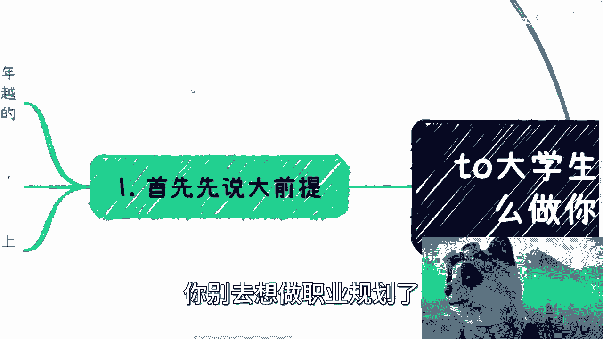
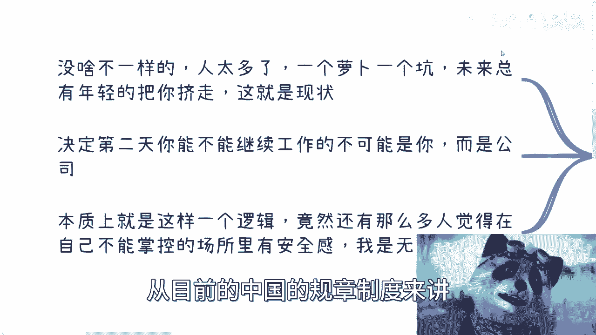

# 职业规划入门课 P1：认清现实与核心路径 🎯

在本节课中，我们将一起探讨大学毕业后应如何进行职业规划。课程将首先分析当前就业市场的普遍现实，然后梳理出几种核心的职业发展路径，帮助你基于自身情况做出更清醒的选择。

## 概述：职业规划的真相

首先需要明确一个大前提：对于绝大多数普通人而言，**主动进行“职业规划”是困难的，更多时候是“被规划”**。当前几乎所有行业竞争都非常激烈，与你竞争的人越来越多，领导层日益年轻化，学历的长期价值也在稀释。因此，首要任务是放下无谓的面子与比较，认清自己手中技能的普遍性（即“你会的东西别人也会”），并接受“大部分普通人在工作上难以赚到大钱且晋升困难”这一现实。这才是讨论规划的基础。

## 核心发展路径分析

基于上述现实，我们可以将毕业后的选择归纳为以下几种核心路径。以下是每种路径的详细说明：

### 1. 路径一：精英向上卷 🧗‍♂️

如果你属于高校顶尖学生或在行业内已有一定知名度，那么这条路径适合你。你的核心策略是通过跳槽、熟人介绍等方式，持续提升基础薪资（`basic salary`）、薪酬包（`package`）和岗位职级（如从 `Junior` 到 `Management` 乃至 `VP`）。在此过程中，你会自然接触到更多机会和人脉，能否抓住并放大这些机会，则取决于个人悟性。

### 2. 路径二：依靠家庭资源 🏠

如果你的家庭能提供关系支持，常见的去向是回家乡进入体制内（如公务员）或进入关系所能触及的稳定岗位。选择此路径，意味着你需要接受“能力并非主导因素”的现实，核心目标是“守住”而非“开拓”。建议放下不切实际的幻想，安心躺平，或利用新方法（如互联网运营）提升既有业务的效率。

### 3. 路径三：普通人的抉择 ⚖️

对于没有特殊背景和顶尖能力的绝大多数人（包括讲述者本人），需要在以下三条子路径中做出清醒选择：

*   **选择A：全力内卷**。明知竞争激烈、存在不公，仍决定在职场拼杀。选择此路，就不要再抱怨行业好坏或工作辛苦，因为你的目标就是卷赢。公式可以概括为：**选择内卷 = 放弃对外部环境的抱怨 + 全力竞争**。
*   **选择B：平淡打工**。只愿付出中等努力（如60分），追求工作与生活的平衡。选择此路，就要接受平淡的结果，不再焦虑为何赚不到大钱。职业发展上的细微选择（如第一份工作做多久）对你而言意义不大。
*   **选择C：工作保底，副业搞钱**。找一份不忙的工作保障基本温饱，然后将主要精力用于开拓副业和搞钱。别人休息时，你去混圈子、积累人脉、尝试各种商业合作。这条路径的逻辑是：**个人总收入 = 保底工资 + 副业收入**。只有这样做，你才能在一定程度上抵御行业波动，并可能在风口来临时抓住机会。

上一节我们梳理了几种主要的职业路径，本节中我们来看看关于职业规划的几个关键认知。

## 关键认知与误区澄清

在理解核心路径后，还需要建立以下关键认知，以避开常见误区：

1.  **打工无法积累真正的商业资源**。你在工作中创造的代码、专利、客户关系都归属于公司。合作是基于公司平台而非你个人。因此，别幻想通过打工就能积累属于自己的商业资本。

2.  **区分“职业规划”与“打工规划”**。真正的职业规划应着眼于如何更高效地为自己赚钱，即**个人商业化路径规划**，而不是简单地规划下一份打工的岗位和公司。后者往往不由你完全掌控。

3.  **选择即命运，拒绝既要又要**。你的选择已经暴露了内心的真实偏好。选择公务员就别问如何飞速发展；选择职场内卷就别喊赚不到钱；选择搞钱就别太在意工作的稳定性。贪心只会导致一事无成。

4.  **行业差异的表象与共性**。尽管不同行业岗位有差异，但本质共性大于差异：人才过剩、技能可替代性强、个人命运受公司和市场摆布。除非你有不可替代的竞争力，否则“安全感”只是一种幻觉。

5.  **抛弃学生思维，走向极端清醒**。对待工作，需要极端清醒：要么彻底接受“牛马”定位，安心打工不反抗；要么从毕业起就明确“搞钱”为主业，工作只为保底，将主要精力投入到商业实践和人脉积累中。

## 总结与行动建议

本节课我们一起学习了职业规划的底层逻辑。核心结论是：对于普通人，**真正的职业规划是个人赚钱能力的规划**，而非打工职位的规划。

你需要基于“是否顶尖精英”、“是否有家庭资源”这两个条件，先对自己进行归类。如果两者皆无，则必须在“全力内卷”、“平淡打工”和“工作保底、副业搞钱”中做出果断选择，并坚持到底，拒绝摇摆。

请珍惜毕业后的2-5年黄金时间，停止在无关紧要的选择上纠结（如选A公司还是B公司），尽快确定路径并付诸行动。如果你不清楚自己的“牌面”如何组合，可以整理好你的情况（如专业、技能、兴趣、资源），寻求进一步的针对性咨询。

记住，**行动比规划更重要，尤其是在规划本身充满不确定的时代**。