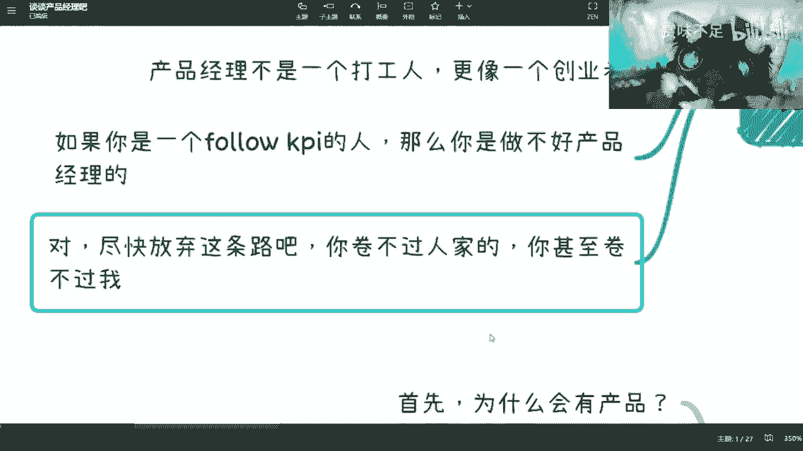
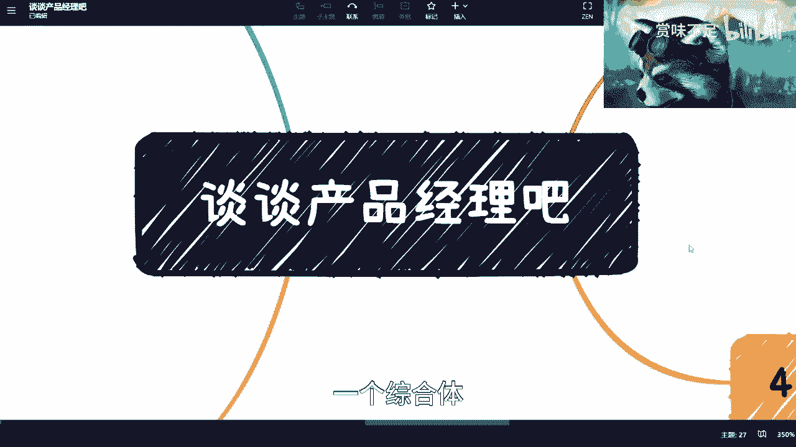

# 课程一：C端产品经理的职责与核心素养 🎯

在本节课中，我们将深入探讨C端（消费者端）产品经理的角色定位、核心职责以及成为一名专业产品经理所必需的素养。课程内容基于对行业现状的观察，旨在澄清对产品经理岗位的常见误解。

## 概述

产品经理是一个专业性极强的岗位，但行业中真正理解并胜任此职的人并不多。本课程将系统性地拆解产品经理的工作内容与能力要求。

## 对产品经理岗位的基本看法

首先，我们需要建立对产品经理岗位的正确认知。

以下是三个核心观点：

1.  **产品经理不是应届生就能胜任的岗位**。当前互联网行业存在大量产品经理岗位，部分原因是行业竞争激烈导致的岗位泛化。
2.  **项目经理可以由应届生尝试，但产品经理不行**。两者的职责范围和所需经验深度有本质区别。
3.  **优秀的产品经理在心态上不能是“打工人”**。虽然劳动关系上受雇于公司，但必须具备主人翁精神和决策担当。

## 产品经理的核心特质：敢于“怼”

上一节我们介绍了产品经理的基本定位，本节中我们来看看其核心特质。

专业的产品经理必须具备“敢于质疑和挑战”的特质。这种特质体现在为了产品成功和用户体验，敢于与任何人进行专业辩论，包括公司高层。

如果因为害怕失业而选择唯命是从、只跟随KPI行事，那么可能不适合产品经理这个岗位。缺乏这种魄力，在激烈的竞争中难以长久立足。

## 产品经理的核心工作内容

明确了心态和特质后，我们具体看看产品经理需要做什么。其工作远不止于撰写文档。

以下是产品经理的核心工作职责：

*   **撰写专业的产品需求文档**：PRD不是简单的功能列表，它需要详尽描述业务逻辑、用户交互、前后端接口定义等。
*   **进行深入的团队沟通**：产品经理不能闭门造车，必须与设计、研发、测试、运营、市场等团队保持高效沟通。
*   **组织并参与PRD评审**：确保所有相关方对产品需求达成一致理解。
*   **对产品“管生管养”**：不仅负责设计产品，还要持续跟踪产品上线后的表现、用户反馈和商业结果，并负责迭代优化。

## 如何写好PRD：从需求到细节

上一节我们列出了产品经理的职责，本节我们深入探讨其中最基础也最重要的一项：撰写PRD。一份专业的PRD是产品成功的蓝图。

写好PRD的第一步是明确**需求来源**。所有产品功能都应源于真实的用户需求，并有数据、报告或严密的逻辑作为支撑，而非主观臆断。

一份完整的PRD应包含以下关键要素：

*   **UI与交互设计**：明确页面布局、图标、交互流程等所有视觉与操作细节。
*   **完整的业务逻辑**：描述清楚每一个功能背后的业务规则和用户路径。
*   **前后端接口定义**：产品经理应定义核心的业务接口、返回码和数据结构，技术团队负责实现。公式可以表示为：**产品定义业务逻辑 -> 技术实现架构**。
*   **用户画像与使用场景**：明确产品为谁而做，在什么场景下解决什么问题。

## 产品经理的深度工作：调研、分析与验证

产品经理的工作远不止于设计功能。要做出成功的产品，必须进行一系列深度工作。

以下是产品经理必须承担的深度工作：

*   **需求尽调与竞品调研**：深入研究竞争对手产品的核心功能、用户路径和优缺点。例如，调研竞品某个核心功能需要几步完成，响应时间如何。
*   **定义产品卖点与数据分析**：明确产品的核心价值主张，并规划上线后的数据埋点与分析方案，用于效果复盘。
*   **设计并分析A/B测试**：通过对比实验验证不同方案的效果，用数据驱动决策。代码逻辑可简化为：`if (实验组A) { 展示方案A } else { 展示方案B }`，然后分析数据指标。
*   **参与研发与测试评审**：评审开发时序图、架构图，确保业务逻辑被正确实现；评审测试用例，保证核心功能被有效验证。
*   **与市场、销售沟通**：作为最懂产品价值和用户痛点的人，需要向市场团队传递清晰的产品信息，并获取市场反馈。

## 总结：产品经理是综合能力的体现

本节课中我们一起学习了专业C端产品经理的全貌。

一个优秀的产品经理是一个**综合体**，他需要对业务、用户、技术、数据、市场都有深刻的理解，并且不逊色于任何单一领域的专家。他需要精准定位用户，推动产品创新，并对产品的全生命周期负责。从清晰的接口定义到市场推广策略，任何一环的缺失都可能导致产品失败。这正是专业产品经理稀缺且价值巨大的原因。