# 说下C端产品经理吧，专业的C端产品经理太少了！！！ - P1：说下产品经理吧，专业的产品经理太少了！！！ - 赏味不足 - BV1kX4y1R7jo

哈喽大家好啊，这个很多人让我讲产品经理是吧啊。

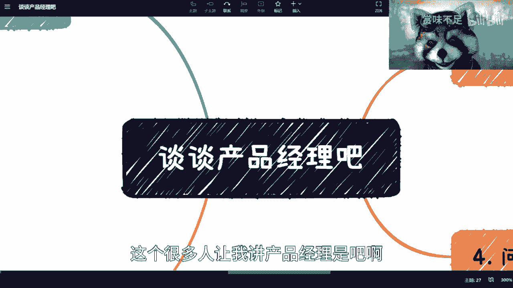

我就来讲了啊，首先啊先说个大前提，有一说一啊，没有几个人是懂产品经理的啊，这个话我扔在这了啊。

虽然我不是做产品经理的，但是呢我也是跟国内啊，这个日活几个亿的这个产品经理，打过很深的交道，共事过一段时间对吧。

我自然而然认为，我对产品经理还是有比较深的了解的啊，你们但凡有谁对吧。

这个叫什么这个这个叫什么。

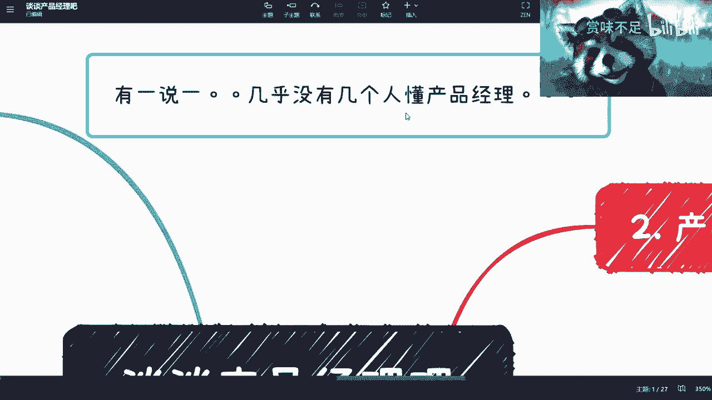

就是不服的啊，你来pk来pk没关系。

首先是这样子的啊，这个产品经理呢，你看啊。

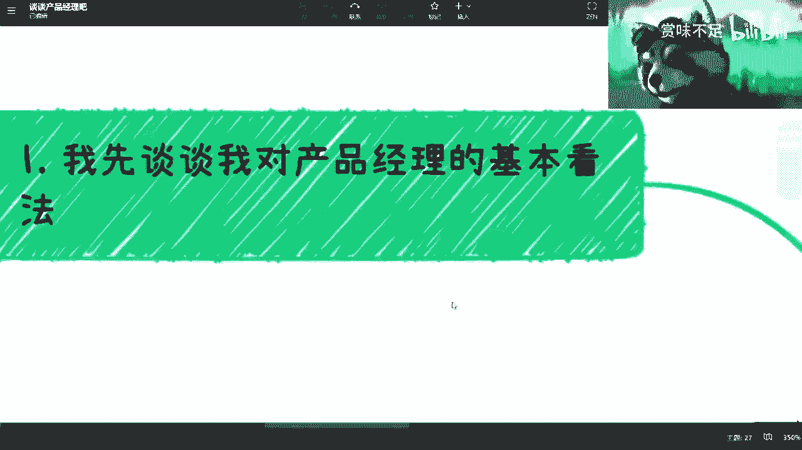

首先啊我要谈谈我对产品经理的基本看法，第一我认为从这个理论上来讲啊，产品经理必肯定不是个应届生就能做的岗位，那当然你说互联网，为什么现在有很多的这个岗位有产品经理，为什么，因为他卷了对吧，这是第一点。

第二点是因为公司里也没多少人懂啊，啊又不是一个创业者，一个老板就懂了对吧，懂个屁，我跟你们说啊，一群鸡你知道吗，这是第一个，第二个呀，我怎么写到一半，我靠我当时想写什么来着，呃呃呃呃呃呃呃呃。

尴尬了尴尬了，bug了bug了bug了，卡住了，哦对对，我想起来了，我想起来了，想起来了想起来了想起来了想起来，我知道这句话怎么断断断巨人啊，这句话第二点是什么呢，其实就是说项目经理其实是可以的。

什么意思呢，就是说一个应届生啊，其实做项目经理，我觉得倒是不是不行啊，不是不行，但是产品经理是真不行啊，真不行，第三点是什么呢，就产品经理啊，本质上如果要做好，他不是一个打工人，就但但他的这个叫什么。

就是呃劳动关系，他可以是个打工人，但他的心态不能是个打工人，我跟你们说是个打工人，他做不好产品经理的啊，我告诉你们啊，就这么回事了，而且我跟你们讲啊，产品经理一定要有个特质，一定要会怼啊，一定要会干啊。

一定要会来事，而且呢不要不要管他是谁，就是干，我跟你们讲很简单，就是他妈的，今天今天李彦宏对吧，马云对吧，这个这个叫什么这个各种老板对吧，李一鸣是吧啊，张一鸣，呵呵是吧啊，我跟你讲怼就对了。

你不要管他是谁啊，往死里怼，我跟你们讲，你们别来跟我说什么，哎呀我们不怕我们怼的，怕的怕失业对吧，怕干嘛，我就问你们，你们到底是怕失忆，还是怕你们做一个岗位做不好，你们但凡一个岗位做不好。

你们早晚都会失业，有什么区别啊，我就不明白了，我跟你们说对吧，就我觉得最近聊下来就很多人非常神奇，你知道吗，他们跟我说，我担心失业啊，我我这个叫什么怎么样怎么样，我跟你，我跟你们说早晚都会失业。

你们就记住这句话对吧，就既然在早晚都会失业情况下面，你们不好好锻炼一下自己吗，是吧嗯啊然后这个点啊，我说如果你是个follow kpi的人，我跟你们讲，你们是珠宝产品经理的对吧，你一定要怼啊，然后呢。

但凡你说你你你怼不了对吧，你你觉得这个你要保住这份工作的好，那我跟你讲啊，很简单，你趁早放弃这条路啊，别做产品经理，你换别的岗位去吧啊啊你卷不过人家的，你甚至卷不过我对吧，你最多也就是活个我活个几年吧。

过几年年纪大了，你就会被卷死啊啊这该该被动离职，被动离职。

该降薪降薪，就这么回事了，别做啊，别别自己折腾好吧。

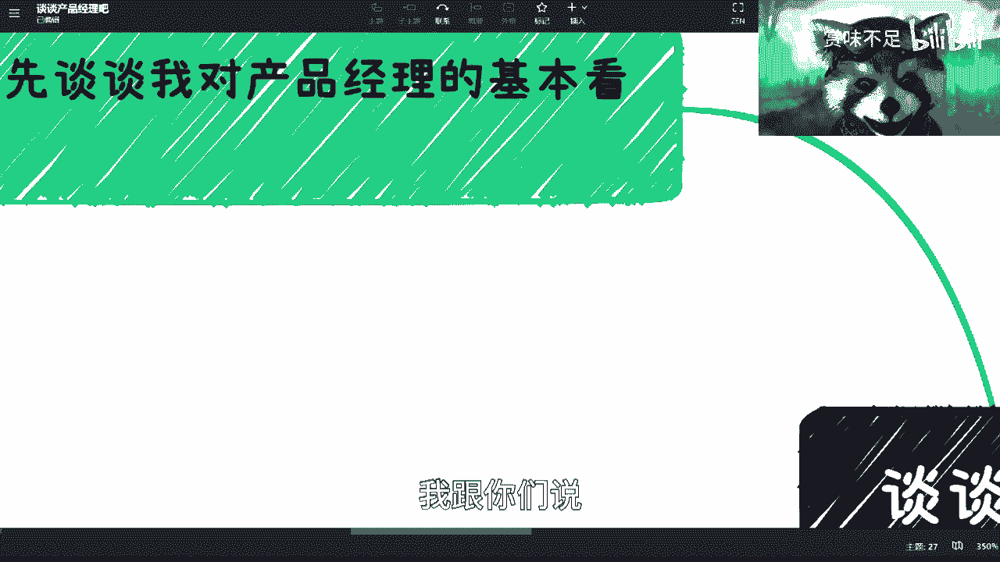

我跟你们说，你们信不信无所谓啊，反正就是我为你们好对吧，你们这个回头别到时候过两年了对吧，到时候过来找我，我我我不吊你们的啊，我先说清楚，嗯这是第一点啊，第二点呢这个产品经理要做什么对吧啊。

本质上来讲呢，产品经理要做的什么呢，一个写PID，哎我跟你们说，你们也别来问我pr g是什么，你们自己百度一下，google一下好吗，就是就伸手党，没这么深的啊，没这么深的，你这个自己搜啊。

你们看啊产品就要做什么写pad对不对，好啊，pd这个团队沟通嘛对吧，你产品经理不能密闭门造车啊，你团队沟通吧是吧好啊，pr d评审吧，对吧啊，那个管是要管养吧对吧好，什么叫管生管养呢。

就是说你这产品经理设计出来一个产品，那你这产品好不好，你得管吧，你总不能说哦，这坨屎是我拉的，这个屎好不好，好不好用，赚不赚钱，我不管了，那你这个还做个屁啊，你说是吧，然后呢，我跟你们讲。

我为什么会讲这个专题呢，是因为有人之前跟我说，他觉得产品经理没有什么前途，他觉得产品经理就是一个写PDF讲PDF的人，卧槽我他妈当时我就炸了。

你知道吗啊我就炸了啊，炸毛啊，这种就是你知道吗。

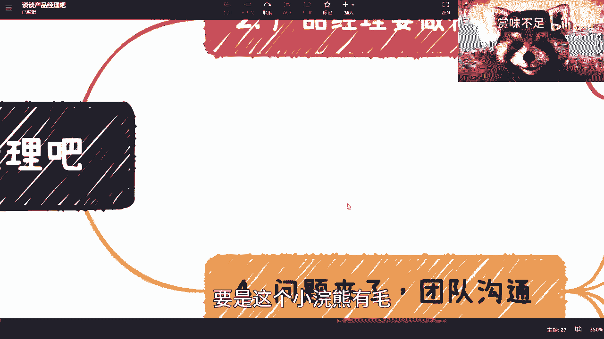

要是这个小浣熊有毛，我就给他炸了，真的啊，我跟你们说，首先对吧，刚刚我们说了几个点，那么问题来了，怎么写好PRD，对不对，怎么写好PRD啊，产品需求说明书，对不对，好，首先第一点啊，我们来讲啊。

你为什么会有产品，我不是说会为什么会有产品这岗位啊，为什么会有产品这个东西，为什么，因为有需求，对不对，好，今天我就问在座所有看这个视频的产品经理，我就问你们，你们知道这个需求哪里来。

你们做的这个产品需求哪里来，需求是什么啊，别跟别跟我就是信口开河，有数据支撑吗啊有报告支撑吗，有任何逻辑性的东西支撑吗，需求是什么，有几个人知道啊，是吧对吧，这是第一点啊。

第二点PID里面产品包括什么UI对吧，界面交互，业务逻辑，前后端所有都得有啊对吧，不是你写一个PRD，这PRD里面就是就是一个功能列表，没有卵用的，这功能列表谁不会写啊，有什么技术含量啊，我跟你们说。

正常好的PRD里面，你甚至要把接口都对上，你知道吗，所有的业务接口是什么，返回是什么都要的，你是产品啊，你明白吗，什么叫产品，你明白吗，就是技术只是用来实现的，你知道吗。

就是技术架构是用来提升整个技术效率，提升几整个技术架构的，那这个技术应该跟业务怎么挂钩，应该怎么去做的更好，应该怎么个效率，更就业务层面效率更高，这个是产品去定的，你明白吗，别觉得好像一个一个一个接口。

一个API的return code是一个技术来定的，技术不定的，不好意思好，我跟你们说，你们但凡只要在大厂做过做过大的项目，你们就会明白产品到底要写什么啊，别觉得好像产品他妈的就写个工人计划。

说没卵用的，我跟你们讲啊，第二点第三点，需求尽调竞品调研啊，我我问题有几个人做过啊，你来别来问我怎么做啊，这个东西还不好做吗，你比如说你今天要做个大众点评的竞品，竞品调研，你去做啊。

你先把大众点评用一遍，大众点评每一个功能核心功能对吧，链路是怎么样的，要要每每和很多核心功能花几步对吧，用户能看到什么响应时间是多少对吧，你要做的呀，你调研要做的，否则你做个P产品啊，是不是我跟你们说。

真的我很气啊，我很气我，我激动了激动了，我我稍微平复一下，唉真的这么绝了，我真的是我跟你们说，那个对吧，你做产品对吧，UYUX你不管嘛对吧，你页面长什么样子，交互长什么样子，不管吗啊你做P产品啊。

啊你你你页面长什么样，交互长什么样，不是你产品该管的吗，对吧啊，写PDF读PDF啊，然后功能设计功能设计很复杂的，功能设计要设计到所有细节，功能设计每一个细节，每一个角落，每一个icon对每一个图标啊。

每一个布局对吧，每一个前后端的沟通，前后端的对映射对吧，很多很多啊啊然后我还还得问啊，你做一个产品，你知道用户是谁吗，我跟你们说，我见过多少团队，搞笑的很，你知道吗，这些产品经理做出来的产品。

我的产品用户是谁啊，是自己团队和老板，那做个P产品，你一个产品用户是自己团队或老板，的还还还在那边抱怨啊，运营团队卖不出去，运营做不好市场，做不好销售做不好，人家才他妈的不给你们背锅了，对吧啊。

要不是因为看到这个公司，老板是他妈的发钱的份上，早他妈把你们喷成鸡了，我跟你们说，对不对啊，你们知道用户是谁吗，但用户画像都没有啊，就就他妈做产品对吧好，然后还有什么产品本身里面是要有买点的呀。

别来问我买点是什么，自己去查好吗，产品要有买点的，买点之后要有数据分析的，要有复盘的啊，我就问你们几个人做过啊，是不是几个人做过，几个人知道怎么做对吧，你最后还有a b test，A b test。

现在在很多的产品里面都要做的对吧，就整个的啊看看啊，对吧，然后你你你做了之后要做分析啊，到底是A方案B方案好啊对吧，然后做灰度测试啊，我跟你们说，所有的策略战略都是产品经理定的。

你知道吗啊啊这产品经理我。

很多人觉得没有深度，我也是很焦虑。

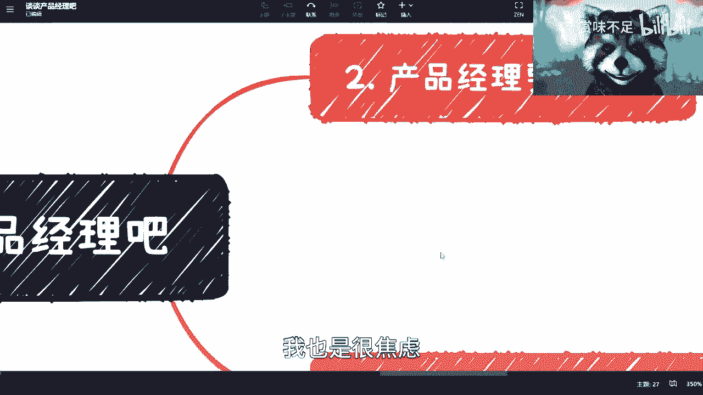

真的我很火大对吧，第四个问题来着，团队沟通对吧，好团队沟通我就问你，你开发测试运营啊，运营对吧，市场沟通了吗，你做产品，你沟通了你怎么沟通的对吧，你不得把开发的时序图拿过来啊，项目看看。

你看看这个开发前后端时序图怎么样子的，业务到底怎么走的，你不得看吗对吧，我不是让你看代码，你逻辑去看吧对吧，正常的PRD里面所有的功能都会有对应，实习时序图和架构图在那个地方的啊，有多少人写了。

我就问对吧对吧，然后第二个你你后台时序图，前端的业务交互图有吗有吗，你有去了解过吗对吧，有有多少人觉得卧槽他妈的开发跟我没关系的，这是开发的事情，不好意思，开发不背这个锅，开发不懂的啊，开发要懂的话。

要你这产品经理干啥吃啊，对吧啊，你test case要评审吗，test case评审你参与吗对吧，你要测试用例怎么测对吧，你你你产品不得评审一下，你不得看一下，你是产品啊，你不你不看谁来看啊，对吧啊。

我跟你们讲，我他妈看过多少团队啊，从头到尾产品都是打酱油的对吧，然后后端一团乱对吧，就后端的那个那个架构，业务架构一团乱，前端的交互一团转对吧，测试测的东西根本跟产品没什么太大关系。

跟核心功能都不知道的对吧，然后市场我跟你们说啊，产品经理也得跟市场去沟通啊，跟销售去沟通啊，为什么，因为你是知道需求在哪里的人啊，你是知道为什么要做这个产品呢，你要是知道市场怎么推的。

核心这个产品解决什么痛点啊对吧，什么都不知道啊，别的在里面做啊。

有卵用啊，我他妈真惊了，我真的，这是你知道吗。

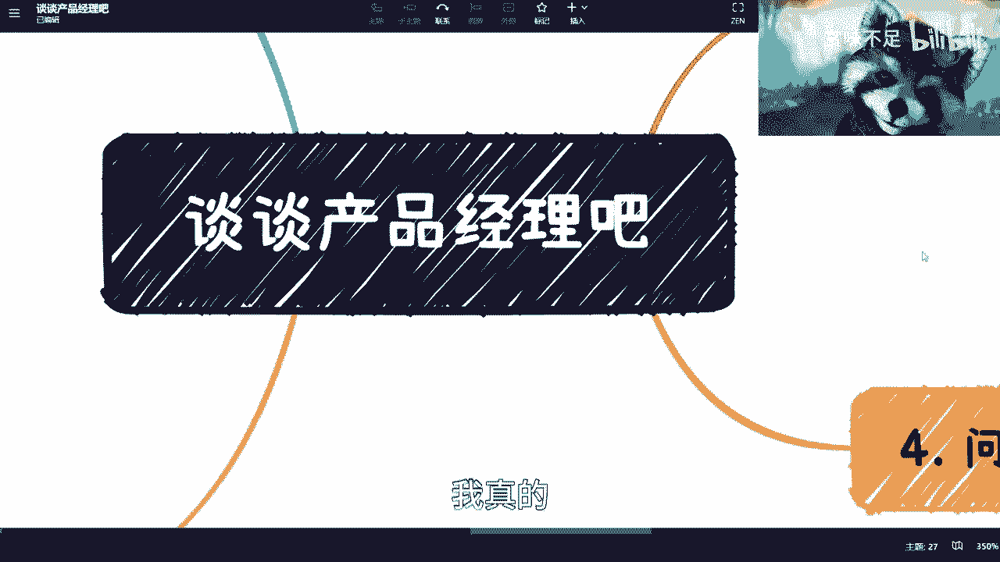

还是那句话我不懂啊，我承认我不懂对吧，但是我知道一个好的产品经理应该做到哪些，一个好的产品经理在我们以前团队里面对吧，他是一个不输架，不输研发架构，不输测试架构，不输运营运维，不输市场，不输任何团队。

一个综合体，你们要知道这个产品多难吗啊，而且他要准确的，他要准确的去了解到用户画像是谁，要准确的知道为什么这个产品服务的是谁，要准确的，还能够能够去创新，我们现在这边写的其实都是现有的东西。

你还要去创新，否则你这个产品怎么占领市场啊，怎么占领市场对吧，包括你管身得管养啊对吧，你后面的产品买买点了，数据分析啊，复盘啊，包括你有些东西你可能摸不准的对吧，你可能摸不准的。

那么你得自己自己去做一些a b test对吧，怎么做啊对吧，包括就是我们刚刚说的就是研发层面，好研发层面，你研发层面，你比如说API对吧，所有的return code，return code对吧。

对应的对应的这些业务功能对吧，哪些比如说哪些是200诶，完了哼这个嗯不太好弄啊，你比如说哪些是200对吧，哪些是404，哪些是205对吧，201对吧，或者怎么样，因为你的接口定义有些是定义给用户。

有些人定义给自己开发的，有些是定义给你的合作方的，你合作方一多，你接口定义不清楚，我跟你说怎么对接对吧，你去问问你们的开发对接南南如登天，你知道吗，沟通沟通南如登天，为什么就是因为产品没设计好啊。

对吧啊，我跟你们说，为什么你觉得比如说你做产品经理，为什么你觉得哎没有啊，我们产品也没说啊，我们研发也没说啊，我们怎么样，不好意思，没有说的原因是他们都不专业，要是碰到我他妈早就喷死你了，你知道吗啊。

哎真的火大的很。

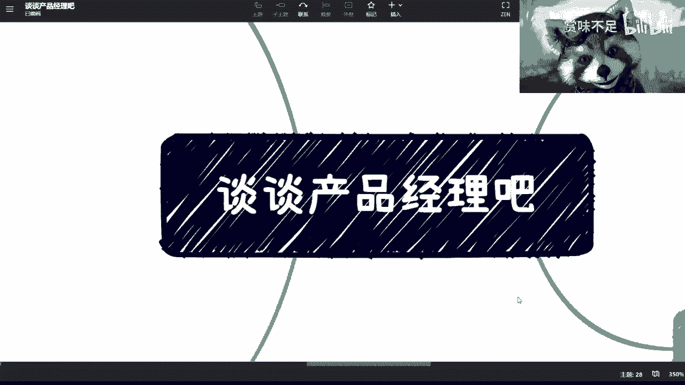

你看这个小浣熊，我现在就这个样子，唉真的，我跟你讲我很悲观，我真的很悲观啊，我悲观的原因就是，我觉得10年前很多人懂的东西，10年后很多人就不懂，我也不知道为什么，你知道吗。

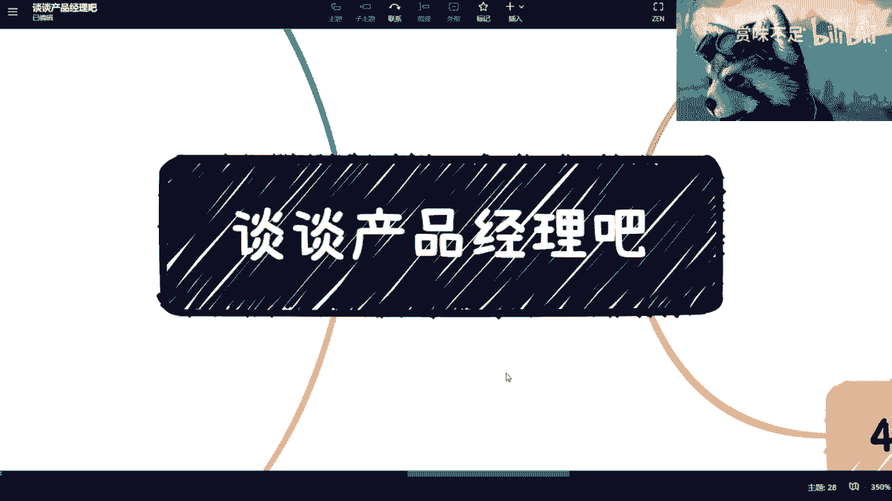

唉好吧，就这么着吧好吧。

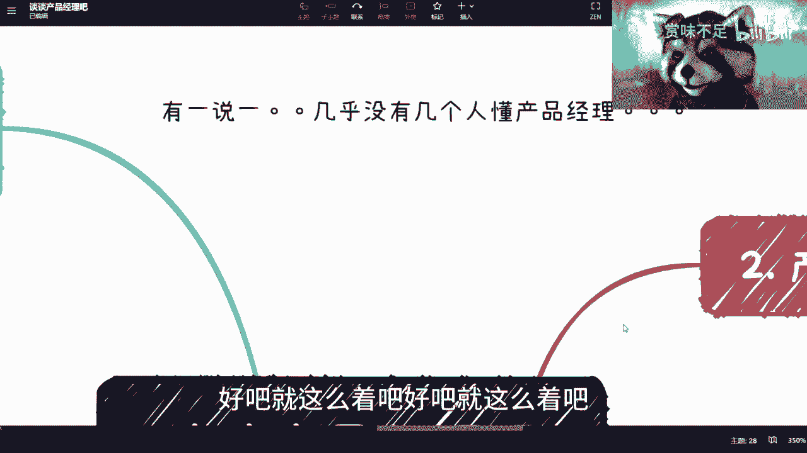

就这么着吧，就这么着吧啊，我觉得我以我的知识水平。

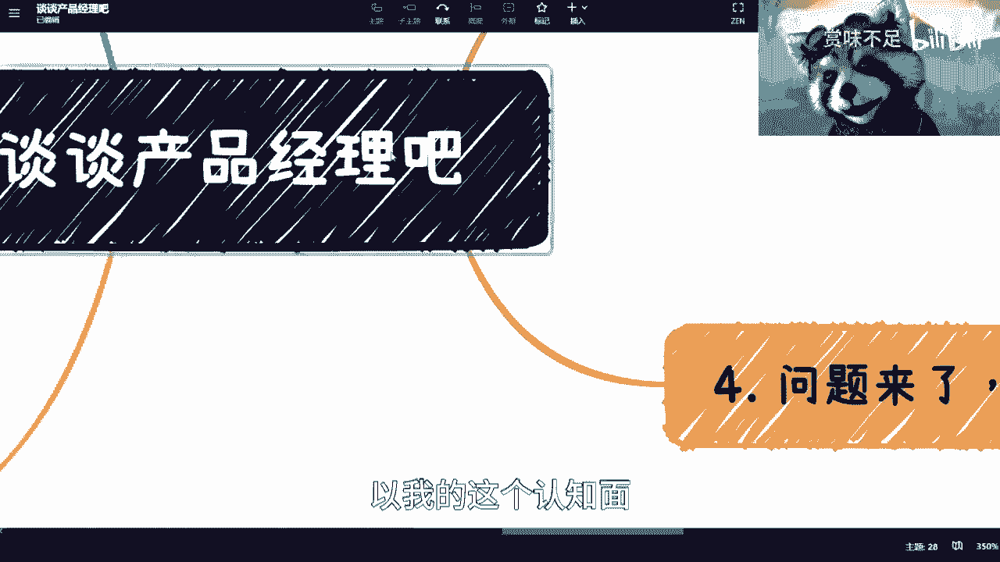

以我的这个认知面，我觉得我能讲的也都讲了啊，也就那么些东西了好吧，深挖的。

反正我也不懂啊，就这么回事啊。