# 创业避坑指南：摆摊、加盟、网店与直播的底层逻辑 🧭 - P1

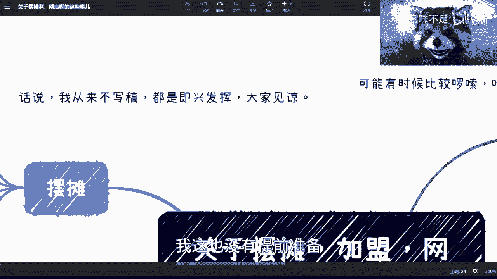

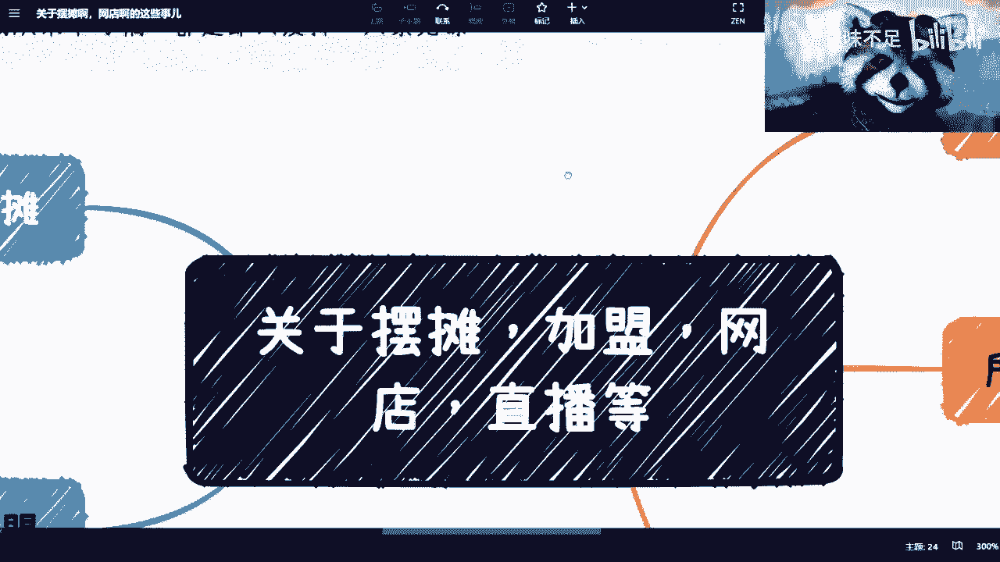

在本节课中，我们将探讨摆摊、加盟、开网店和做直播等常见创业或副业选择的底层逻辑与核心风险。课程将结合个人经历与商业分析，帮助你理解这些看似简单的项目背后，真正决定成败的关键因素。

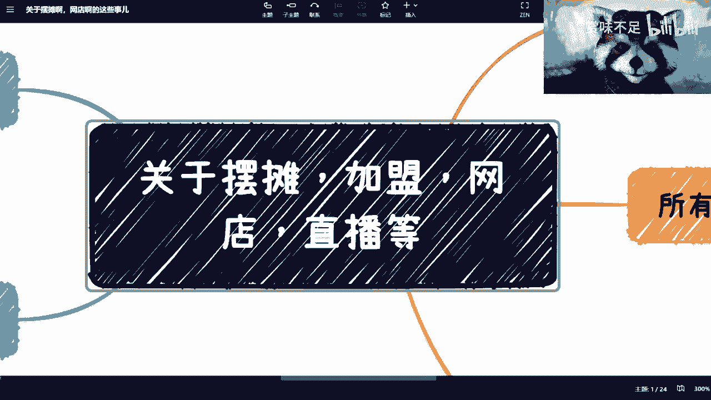

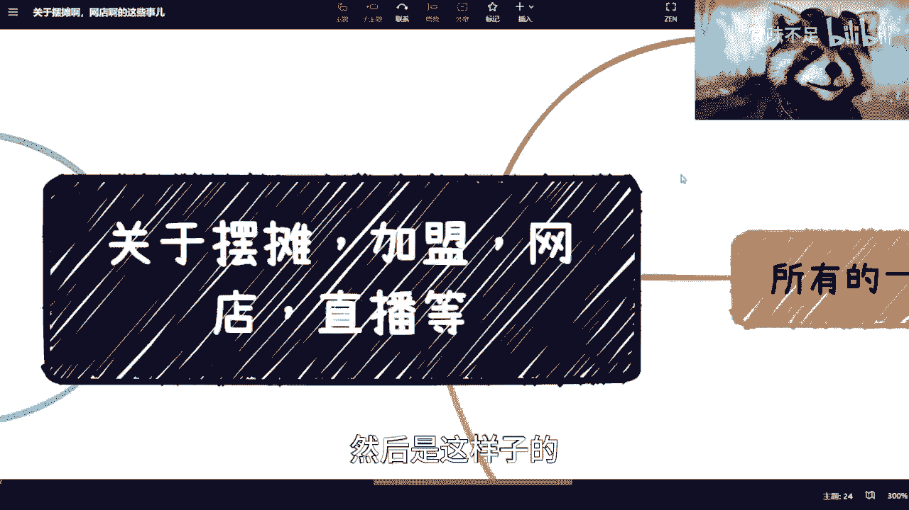

---

## 个人经历与时代差异

我小学时曾在上海卖过报纸，也帮忙做过炸串生意。当时做这些事主要是因为家庭条件有限，需要帮忙。

所有事情的经验都可能过时。过去的经验不一定适用于现在，因为时代已经改变。

现在的环境与过去的差别，不仅在于消费者口味或商业模式，也在于政策和社会协作的复杂度。过去的商业流程相对简单，互联网也不发达。同时，过去的人际关系可能更单纯，不像现在这样复杂。

## 关于直播与网店的现实考量

上一节我们提到了时代背景的差异，本节中我们来看看具体项目。首先谈谈直播和网店。

我母亲曾提出想做直播，我当即提出了几点质疑。

第一点是不能盲目跟风。不能因为看到别人在做某事并获得成功，就认为自己也能轻易复制。

第二点是关于可持续性。若想长期从事直播，往往需要**企业化运营**。个人或许能坚持一两天，但长期来看，没有团队和系统化运营，几乎不可能成功。

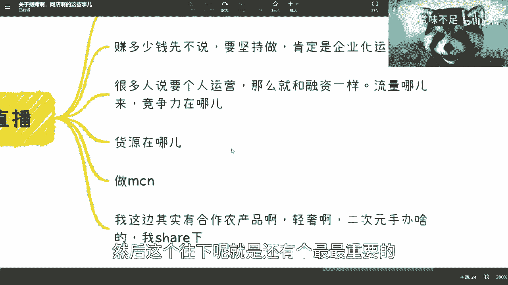

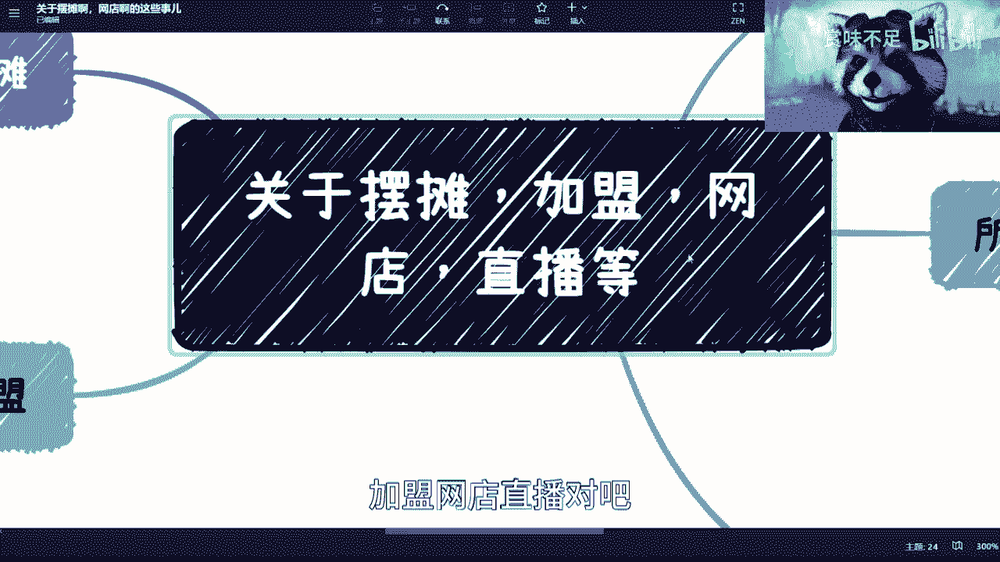

```text
个人长期坚持直播 ≈ 小概率事件
```

此外，实际操作远比想象复杂。它不仅仅是购买手机、摄像头和补光灯。你需要搭建专业的直播间背景，处理网店资质、企业注册等一系列繁琐事务。

第三点涉及商业本质。无论是个人还是企业运营，核心问题都一样：**流量从何而来？竞争力是什么？商业模式是否成立？**

许多人并未深入思考这些问题，没有形成清晰的商业闭环，就盲目开始投入设备和行动。

## 所有项目的命脉：供应链

在分析了前端运营的挑战后，我们必须认识到，相比运营，背后的**供应链**更为重要。

不管从事摆摊、加盟、网店还是直播，都必须明白货源在哪里。前端的运营固然消耗大量时间和精力，也需要技巧，但这些与供应链相比，都处于次要地位。

供应链是所有业务的核心价值点、核心竞争力与命脉。它直接决定你的投入产出比。

以下是供应链包含的关键要素：

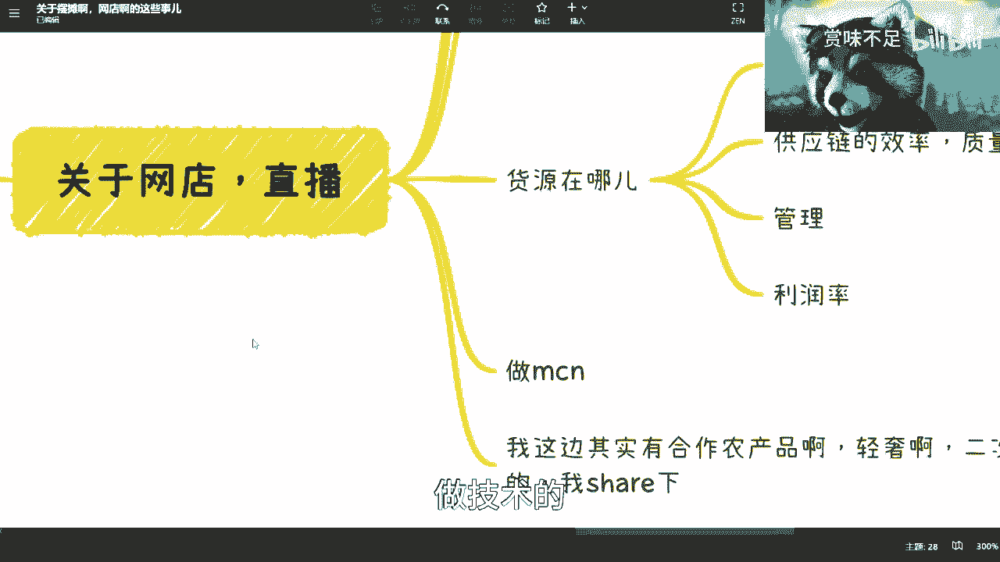

*   **品控**：产品质量控制。
*   **效率与质量保障**：稳定、高效地提供合格产品。
*   **管理**：供应链本身的管理体系。
*   **利润率**：供应链成本直接决定你的利润空间。

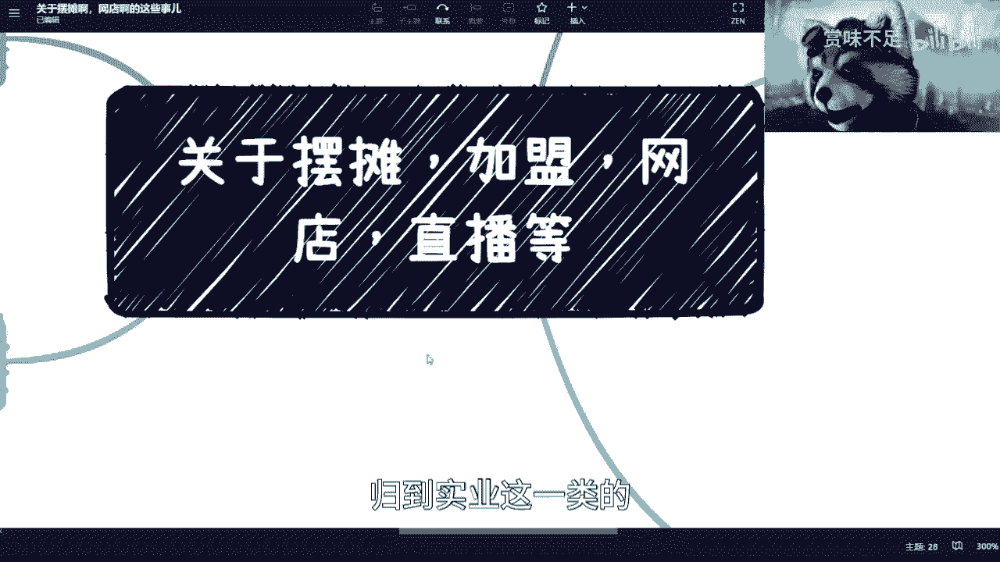

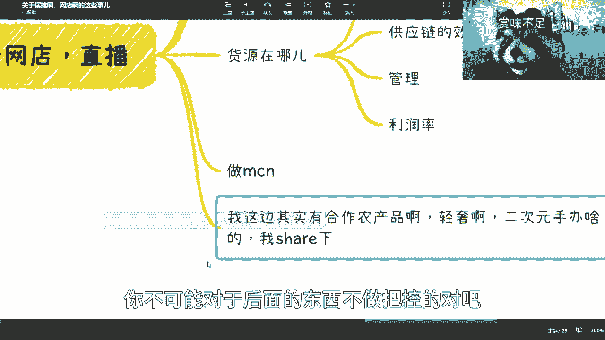

很多人并未认真考虑过货源问题。轻信网上或他人介绍的“可靠”货源风险极高。在商业社会，对于未经实地考察、没有合同约束的合作，应保持高度警惕。

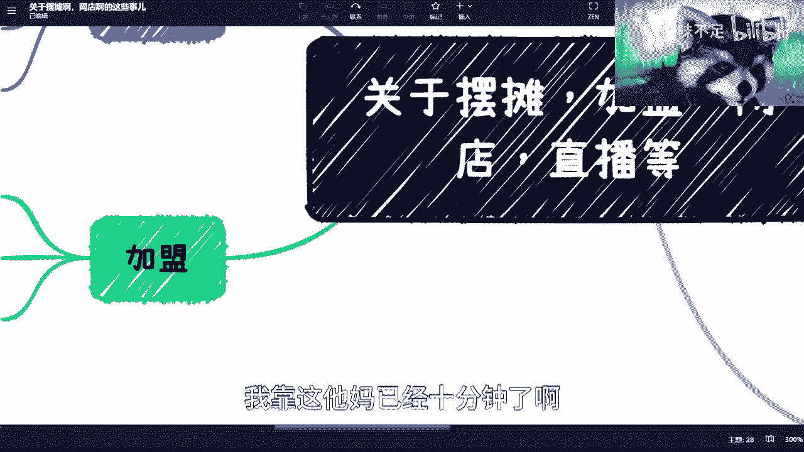

有人说可以将供应链外包，自己只做MCN（网红孵化机构）。但在中国，MCN行业已经极度内卷，数量泛滥。这导致单个MCN的议价能力极低，利润率被压到非常微薄。

以我自己的直播团队为例，我们的货源（如农产品、轻奢品、二次元手办）都来自我实地考察过、并建立直接点对点合作的渠道，没有中间商。即便如此，我仍然认为，任何人（包括我自己）声称有可靠货源时，合作方都应亲自考察验证。

## 摆摊的真实面貌

现在我们把目光转向更传统的“摆摊”。许多人将其视为退路，但实际情况可能远超你的想象。

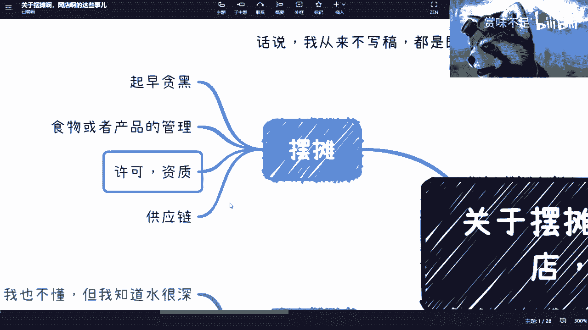

摆摊是一件更复杂、更辛苦的事情。核心问题包括：

1.  **工作时间极长（起早贪黑）**：如果经营食品，通常需要凌晨（如四五点）去进货，晚上则要经营到很晚。每日工作量巨大。
2.  **产品需要持续更新**：即使是卖物品，也需要不断更换花样以吸引顾客。这不是体验生活，而是真正的生意。
3.  **需要相关许可资质**：例如经营食品需要健康证等。现在相比过去，监管更加规范。
4.  **再次回到供应链问题**：无论规模大小，都需要一个质量有保障且成熟的供应链。在互联网时代，找到并信任一个源头供应商本身就是一个巨大挑战。

## 加盟的本质：做事 vs. 资本

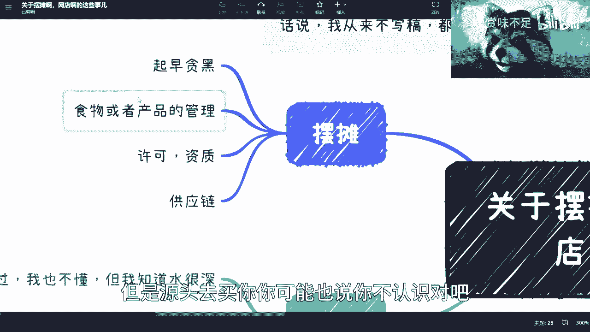

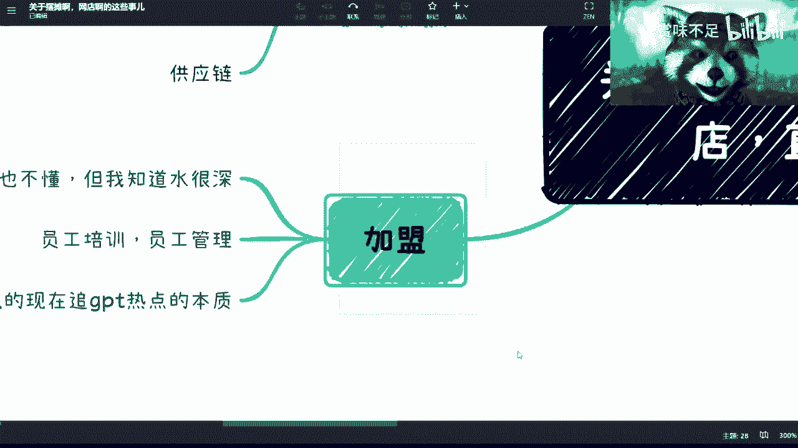

最后，我们来剖析“加盟”模式。我没有加盟经验，但深知其中水很深。网上关于加盟陷阱的内容很多。

加盟的核心矛盾在于：**加盟者（普通人）的出发点是“做事”（经营好一家店），而品牌方（总店）的玩法往往是“资本运作”。**

这并不是说品牌方一定会故意坑害加盟者，而是两者的根本目标和运作逻辑不同。资本追求的是快速扩张、市场份额和品牌估值，而加盟者追求的是单店的稳定盈利。

风险往往由抗风险能力更弱的普通加盟者承担。因此，加盟容易出现信息不透明、支持不到位等问题，其本质是“做事逻辑”与“资本逻辑”的错配。

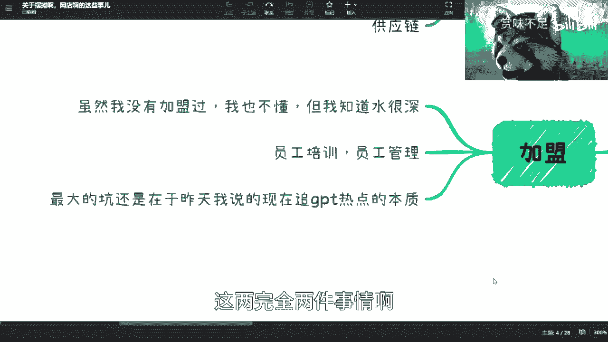

## 总结与核心观点

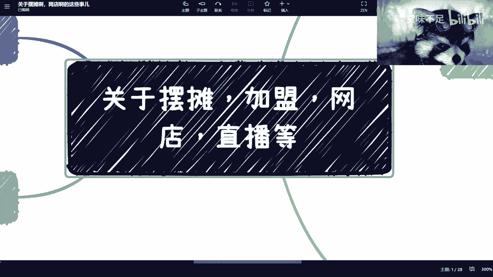

本节课中我们一起学习了摆摊、加盟、网店和直播等项目的底层逻辑。

最终的观点是：选择这些项目，与找工作的道理相通。我不认为未来传统的“就业”具有很高的抗风险能力。因此，我更希望大家培养在复杂商业环境中独立生存的能力。

很多时候，你感到被坑或运气不好，本质原因可能是你的思维模式是“做事”，而对方的思维模式是“商业化”或“资本化”。双方出发点和目的不同，导致认知差异。

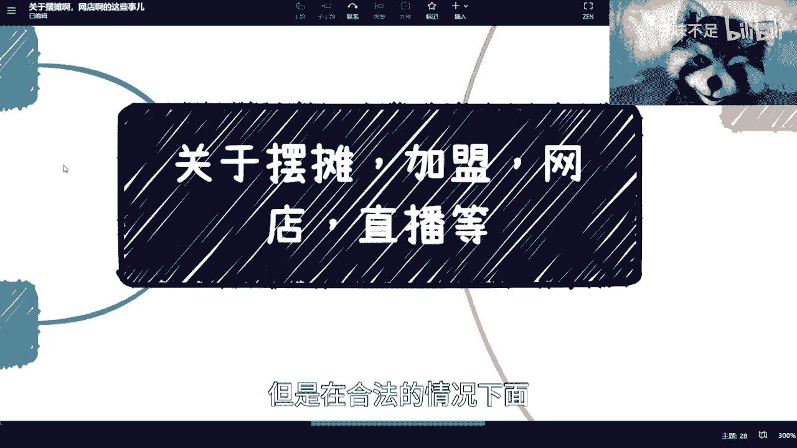

在商业世界里，**在合法的前提下，通常只有“赚钱”与“不赚钱”之分，没有绝对的“对”与“错”**。

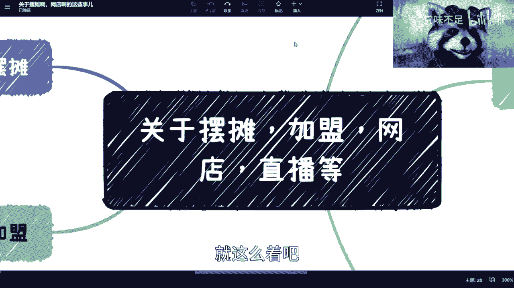

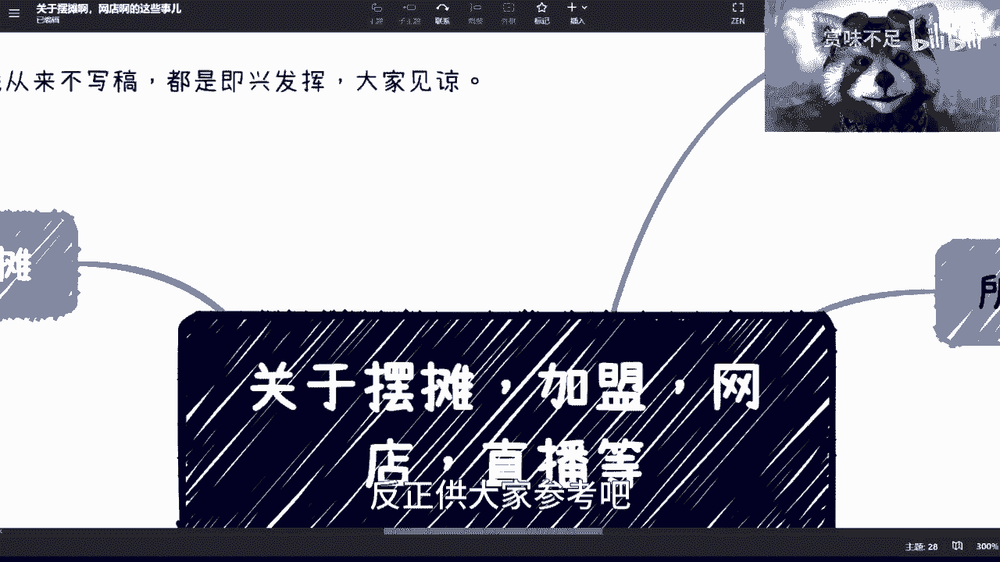

以上内容供大家参考，希望对你评估和选择创业、副业方向有所启发。