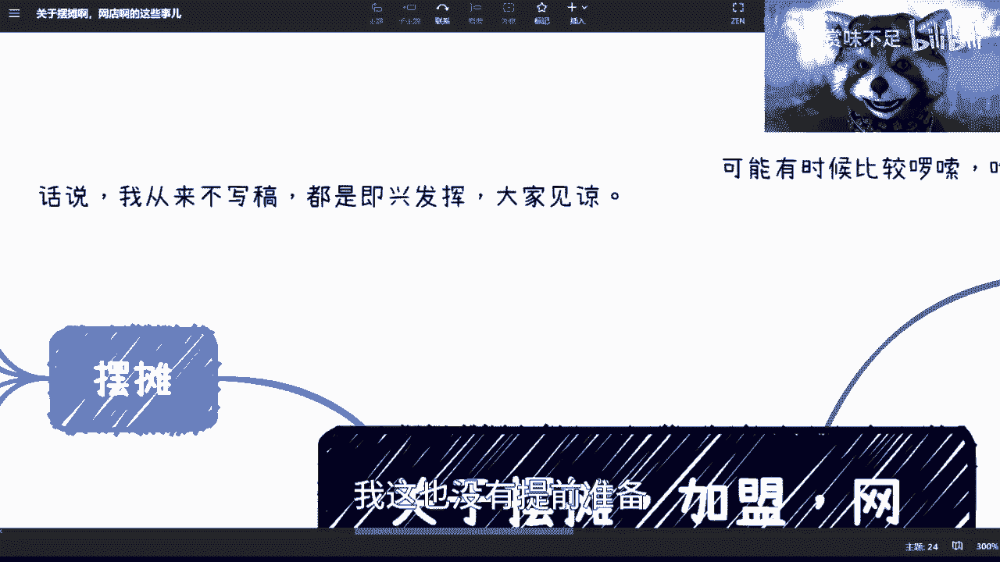
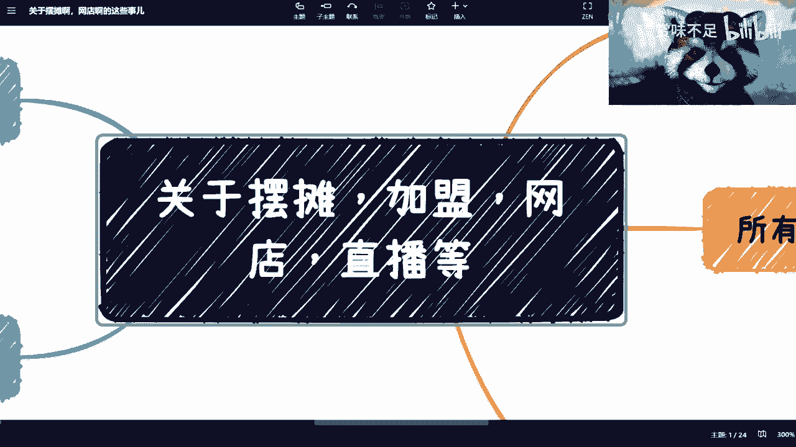
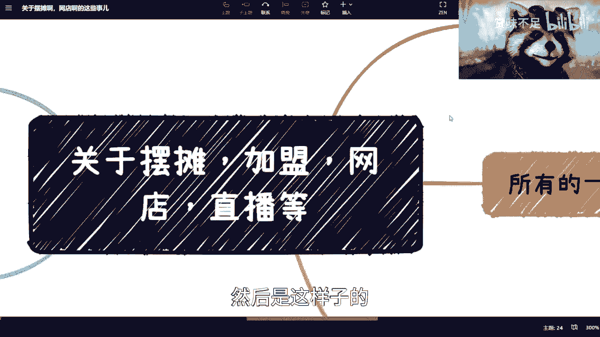
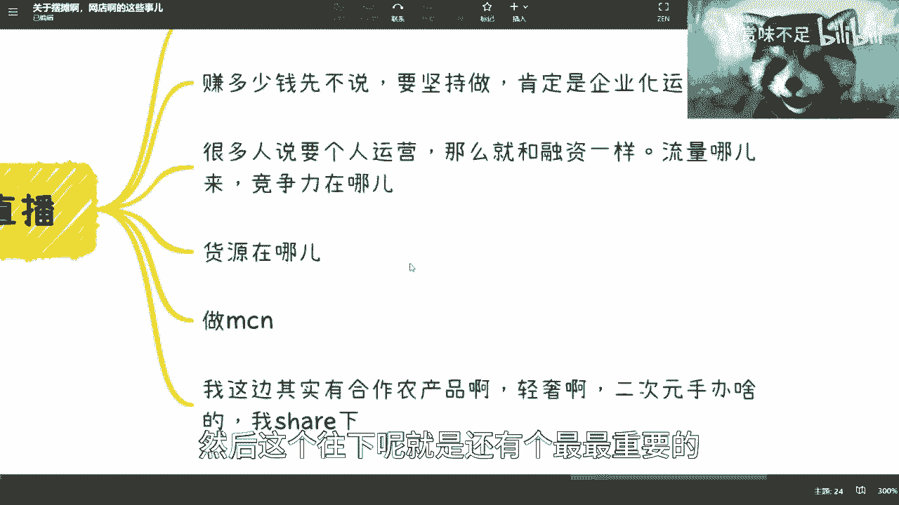
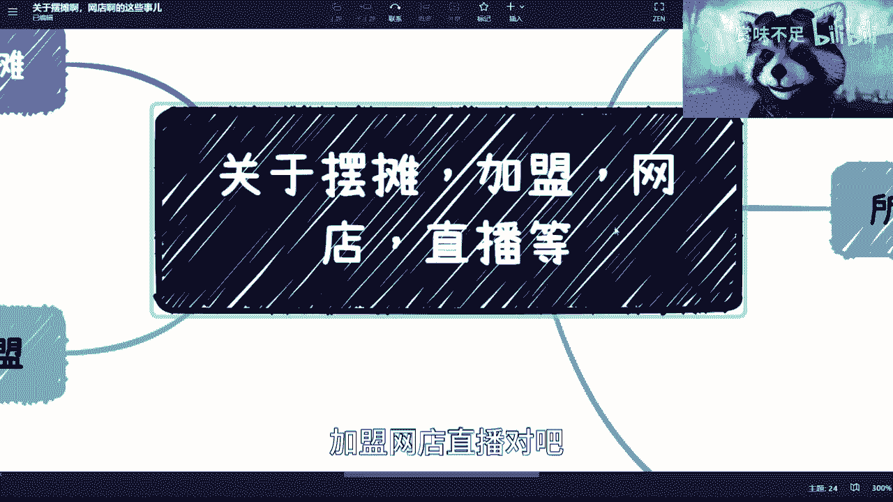
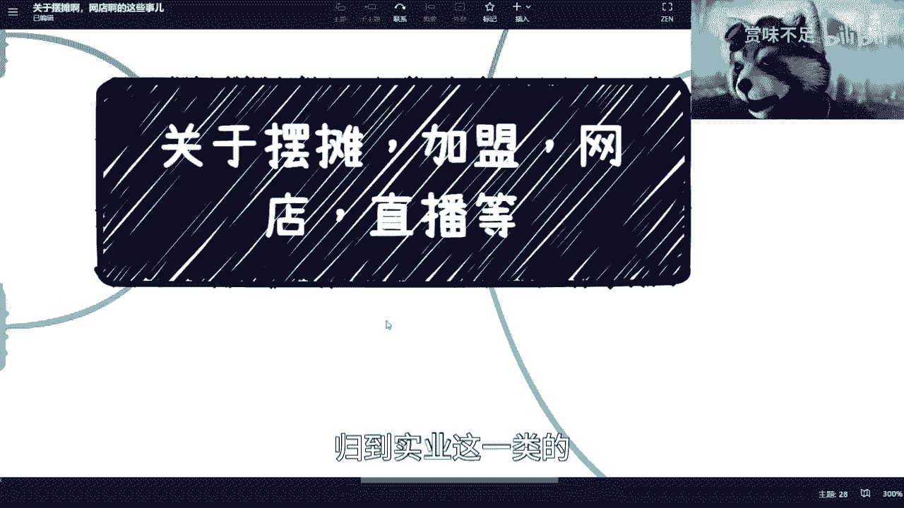
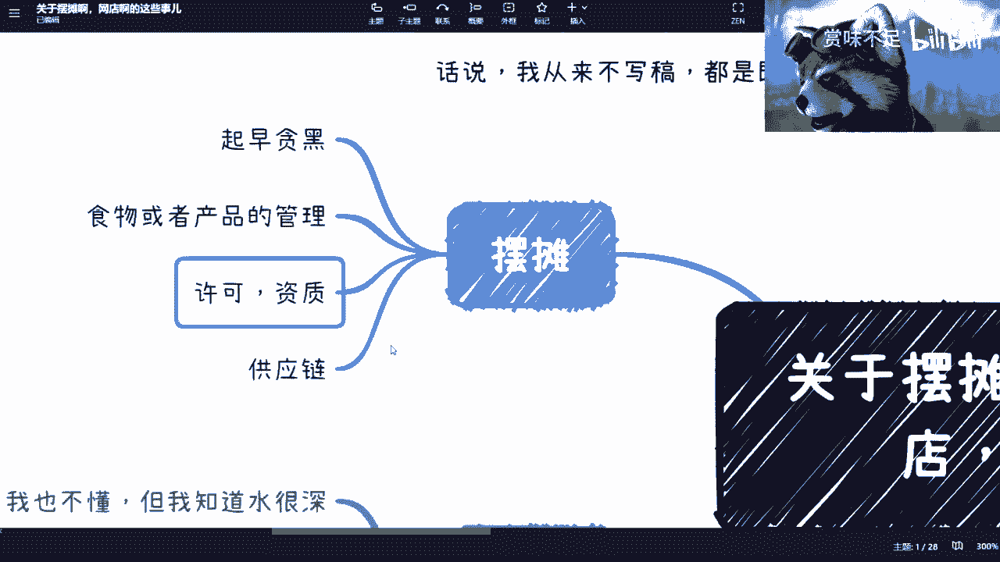
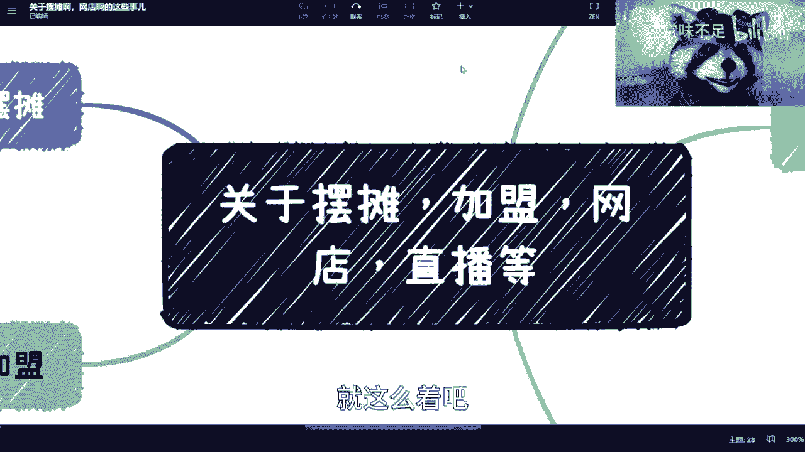

# 说下摆摊、加盟、网店、直播等这些事儿 - P1 - 赏味不足 - BV1sx4y1A7jX

好大家早上好啊，对我这边是早上那个我先说啊，就是我这个是从来不写稿的，就我没有什么word什么东西呢，我就是想到啥说啥的，所以说呢就我就对我来讲效率很高啊，对你们来讲可能比较啰嗦啊。

因为我一般都是想到啥说啥，我这也没有提前准备是吧。

然后呢。

因为之前的话呢，其实蛮多小伙伴也跟我提到这个事儿对吧，就他们跟我说那个叫什么，就是摆摊对吧，做加盟，然后做网店，做直播，然后做嗯做电商对吧，这样一些。

社会人ok嗯。

然后是这样子的，我觉得我现在说几点吧，第一个就是先说我小时候的事儿是吧，就我小学的时候呢卖过报纸对吧，那时候就是我在上海嘛，然后上海还还有书包亭是吧，就知道小伙伴应该也知道。

然后我当时卖那就不是书包亭那种，我就我就是摆摊的那种呃，在徐家汇当时卖新闻晚报吧，大概我忘了多少钱，五毛钱还是多少钱，反正卖嘛，但差不多一天能卖掉个三五百张吧，三五百份，三五百份，然后呢我也做过炸串。

然后也是我小学时候做的，为什么我要都要做呢，因为我穷，这个当然也不是说我单纯，我做就家里帮忙一起做的对吧，那我帮忙一起做，你敢说啊，呃然后就说我觉得呢是这样子的，就是所有的事情啊。

就是啊可能有很多小伙伴以前也做过对吧，但是那个以前的经验呢可能不适合用现在，而且另外一方面呢，就是说呃就是说现在跟以前的差别，其实不仅仅在于口味，也不仅仅在于就是就是模式啊，包括政策。

其实我觉得很多很多还是在于什么呢，就是我是觉得以前的很多时候呢，大家的合作啊，大家的这个呃流程没有这么复杂啊，就是因为可能以前也没有这么先进啊对吧，就是说以前的整个流程啊，包括你要去做一件事情啊。

它可能相对比较简单，你就可以做了啊，因为毕竟以前互联网没这么发达嘛，对不对，然后另外一方面呢，就是说我觉得以前的人可能相对也比较单纯啊，也没有说现在啊虞我诈是吧，就就比较复杂。

然后呢就是关于网店跟直播这件事情呢，我也得说一下，就是，就我妈之前也跟我说，她说她要做直播对吧，然后我当时就怼回去了，我就说我说我说你做直播对吧，那你做直播干啥呢对吧，你你你是要赚钱吗，还是要干嘛是吧。

我我说你你要能赚钱，中国14亿人都能赚钱，全部脱贫算了是吧啊，然后我觉得这个是第一点，我说你不能看别人在那边啊，这个干嘛干嘛，你也干嘛干嘛是吧啊，这是第一个，我说第二个呢就是说就是呀傻了傻了傻了。

放在第二层啊，就是第二个呢就是你说赚多少钱，我觉得先不说他啊，就是如果你这件事情想长期做的，你往往肯定需要企业化运营的，就什么意思呢，就是说你你要自己去做这件事情对吧，我不是说不能做啊。

但是你可能坚持不了多久，因为为什么，因为这个并不是说啊，并不是说你这个没有耐心，没有毅力啊，我就说你你要知道直播这件事情，一天如果你要做啊，你往往一天是要花很多时间的，我觉得你做一两天没问题。

但是你要长期做这件事情，不是企业化运营，我觉得几乎是不可能的啊，没有概率的啊，这件事情，然后你更不要说就说你做这个事情，你总不能跟我一样，现在这个在家开一个摄像头是吧，你说为什么要用小浣熊啊。

就是因为我不能家里太乱了是吗，哈哈啊，那你直播间也是一样，你还得去搭直播间呢对吧，你还得搭搭直播间做背景对吧，然后还要去弄弄网店对吧，弄资质对吧，弄弄弄企业，你想想看哪里这么容易啊啊这个事啊。

他不是说你今天这个买个手机，买个摄像头，买个买个那个直播灯就可以做了，你说是吧，我觉得这第二点啊，第三点呢，就是说你你你很多人说自己要个人运营对吧，就我刚刚说的，其实我跟你讲个人运营也好，企业运营也好。

问题都一样，是什么呢，就是就是我跟你们讲故事啊，就以前啊有很多人就是跟我这个聊聊那个融资，你知道吧，就是他们不但会给我去审bp啊，不是呸，他们不但会给我去省那个简历，他们也会就融资啊。

他说陈老师帮我们看看这个企那个商业计划书，你知道吧，那最近也有很多人找我看啊，但是呢我跟你们讲，其实这个事不用我看，为什么呢，就是所有商业计划书里面，我觉得最最简单。

但是呢就最最没有人把它说清楚的是什么，就是你们做一件事情，流量到底从哪来，你们的竞争力到底在哪里对吧，你们的模式是什么对吧，就是这个事情你得先说服你自己对吧，你说服说服不说服我无所谓啊。

你得先说服你自己，那那你说这些事情你都没想过啊，你说我也不知道啊对吧，我这个这个这个闭环也不清楚对吧，我也没思考过好，我就说我要干了啊，然后然后就开始买手机，买直播灯对吧，就开始干了。

那你这个干的那你也可以干是吧，我我要那随意啊随意，然后这个往下呢，就是还有个最最重要的就是你们看啊。

就不管是摆摊啊，加盟网店直播对吧。

等啊等记住等，就是所有的这一系列的东西，你们一定要明白，就是货源到底在什么地方，因为其实本质上最重要的是什么，最重要的你们看啊，就是前端的运营固然很重要，而且也会花费你大量的时间，而且你们需要套路的啊。

不是说你们这个这个叫什么白手起家，什么都不懂就开始干了啊，但是这些相比来讲，都没有背后的供应链来的重要，你知道吗，因为供应链才是所有东西的一个核心价值点，以及核心的竞争力所在的地方，而且也是个命脉。

因为为什么呢，因为供应链本身，其实会直接决定你做这件事情的投入产出比，因为供应链本身它后面会包含什么呢，比如说我们随便举两个例子啊，你比如说品控对吧，有些小伙伴单独跟我一样的，我也给大家提过啊。

品控比如说那个供应链的这个叫什么，就是效率啊，质量保障，嗯保保保保保障对吧，保障啊，然后还有那个叫什么啊，管理对吧，因为你供应链也得管理啊对吧，然后包括那个诶还有什么来着的哦，对利润率对吧好。

那么这些其实最最都是最重要的，那你说这些东西我就问嘛，就是说你们有没有自己的货源对吧，你你不要跟我说什么网上对吧，什么来了个人啊，说他很靠谱的，怎么样怎么样，这些我都不信的对吧，你看在评论区聊的时候。

我就会说我说我说经过这个社会的毒打是吧，只要不签合同的，我一律不行啊，签了合同的我也姑且也就那么一信对吧，那你说网上出来一个什么人跟你说啊，我们很牛逼对吧，货源在什么地方啊。

然后我们怎么样怎么样怎么样吹得天花乱坠，我跟你讲，我一句话都不行，我一个字都不行，我一个拼音都不行是吧啊，那这些我跟你讲才是最最重要的，然后我发现很多人其实也没考虑过这个东西，然后说我要干了啊。

那你你你你干个啥子嘞，干个啥子啊啊，然后还有人说呢，他说那没关系啊对吧，我可以不care这些，就这些我交给我的外包公司对吧，交给我的上游，那你做什么呢，你做mc是吧，好我跟你们讲啊，做mc可以啊。

但是还是那句话，在中国啊，在中国mc n已经卷成狗了，什么叫卷成狗呢，就是遍地都是m c n，就跟那种遍地都是小卡片是一样的，那当一个地方遍地都是m c n的时候，我跟你讲，只有一个结果是什么。

就是你的利润率会是极低极低的，为什么呢，因为你没有竞争力啊对吧，你也没有竞争价值，就是我缺你，ok啊，你滚好了，我随便找一个，反正mg这么多对吧，所以说我跟你们说，你们自己去谈谈看，你就知你就知道了。

现在的m c n利润率压到多低，好多低，你们自己去想想看啊，好然后呢我也可以跟你们说一下，因为你们前两天可能也看到嘛，就是我在那个去了一些仓库嘛对吧，呃我们现在那个直播，那我想看直播团队在义乌啊。

然后呢我是直接找了，就是我自己的货源啊，就是一个是农产品，就自己家里就我那个合作方自己家里有地的啊，然后轻奢对吧，轻奢就直接做那个呃直营代购的，然后那个二次元手办就是日本直销的对吧。

那我这个地方我可以跟你们讲这个东西呢，一样的，就是你说是不是我的不是，但是这个这个这个我都是全部实地考察过的，而且我跟他们之间就是直接点对点的合作，不存在什么时候中间商啊对吧。

还有什么里面供应链还有很多层啊，我不管他啊，我不管他，但是就是说所有的仓库内容供应链的介绍对吧，包括就是说这个人我认识的年年限啊，包括我对他们的认知我都是很清楚的，但不是说大家直接就说不认识的。

然后大家说商业合作对吧，我跟你们讲，今天但凡我跟你们说啊，比如说啊陈老师跟你们讲说啊，这个我这边有的啊，大家过来合作啊，我跟你们讲，你们也不能信我，为什么，因为你们也得来考察，那为什么我说的就是真的呢。

对吧啊，所以说我觉得这件事情都是一样的，就是你你要做就是你但凡以前不是做互联网的，做技术的，做软件的。

你可能没这个感知，但是你们要明白，就是摆摊啊，加盟啊，网店啊，直播啊，就是因为它是一个虚实结合的东西，它最终其实还是实业的东，归到实业这一类的。

那么实业这一类，你不可能对于后面的东西不做把控的对吧。

这不现实的啊，那么我讲了几分钟了。

我靠这他妈已经十分钟了啊，然后你比如说摆摊吧，摆摊我跟你们讲啊，这个事情就更更复杂了啊，你比如说起早贪黑，你能坚持吗，我跟你讲这个东西真的叫起早贪黑啊，就是就是你可能是一个吃的，你也可能是你的产品对吧。

但是不管怎么样，你的东西肯定是就是你要这么想，如果是实物对吧，你肯定每天要去更新了，那你更新你想想看，你说从哪里进货，但是我告诉你，不管你从哪边进货，你基本上都是凌晨四五点四五点算早算晚的了。

我觉得对吧，然后你晚上又要做到几点，你说不好听点，你为了赚钱，晚上肯定要做的晚一点，但是你想想看一天你工作量是多少，对不对，那你如果不是吃的，比如说是一些产品对吧，是一些这种物品化的。

那你依然是要去换换花样的，为什么，因为你是做生意啊，你总不能说哦，我今天卖那么五个，我明天卖那么五个，那我觉得你不是做生意，你是财务自由，在这边体验生活是吧，那那这个东西我跟你讲都很苦的，真的很苦的啊。

就是我觉得那句话说的是对的，就是哎呀很多人觉得呃就以前啊，就是以前这么说的，就很多人觉得做办公室已经很苦了，但是呢就是呃毕竟吧，可能我们就业就是互联网时代嘛对吧，就是大家就也可能更互联网时代。

因为我觉得你们现在我的受众啊，应该看看到这个视频的人，估计年纪比我大的有有也有，但是我估计不会多啊，所以你们应该是一个纯互联网时代的，那纯互联网时代呢，我就觉得这个东西呢就是说呃可能感知度不大。

但是你们就不能说轻易的就说啊，我就实在不行，我就摆摊对吧，那没你们想这么简单啊，第三个呢就是许可资质，这个东西呢其实要是要的，因为很简单，你去做一些食品类的东西，你比如说健康证对吧。

因为当然啊你放到我当时小学那个年代，可能没有对国家没有这个东西啊，但是你比如现在你肯定是需要有资质啊，有些许可啊。

有些震惊啊对吧，那你还得去搞是吧，那最后就还是回到供应链这个问题上面，就是你去如果要做，不管你是做得小，做的大对吧，你其实都是需要有一个叫做质量能够保障，并且成熟的供应链啊，就是你哪怕你说我以前对吧。

我去进货对吧，供就是早上去去去去去这种，就是说集集市去那边拿货嘛对吧，那拿货也是一样的，就那个集市可能就是我的整个供应链，但是现在因为互联网时代了，包括就是说嗯，可能我觉得大家也没有就直接的关系吗。

你比如说你说我我现在要去进海鲜对吧，我要去进一些这个牛肉对吧，怎么样子，你你总不可能跟我说，你去菜市场买吧对吧，你去菜市场买，我觉得这个怎么说呢，就亏你肯定是要去一个进货的地方买对吧，源头去买。

但是源头去买你。

你可能也说你不认识对吧，所以其实这个也是现在很大的一个问题嗯。

加盟这个事情呢，我觉得大家这么说吧，就是我没有加盟过对吧，我也不懂，但我知道水很深，而且b站啊别的地方啊，就是加盟的这个坑的视频或者内容，其实很多很多，你们随便搜就有对吧，就说的很清楚。

我觉得在这里面其实核心点还是什么呢，就是说呃这个员工管理，员工培训对吧，你虽然说你有总店的一些一些一些支撑对吧，或者怎么样，但其实我跟你们说这件事情的本质，我为什么就有人跟我说，加盟我一口就否决掉。

为什么呢，是因为并不是因为加盟是一个实业，也不是因为加盟是一个实体店，也不是因为加盟，比如说啊哪怕没有实体店，是一个网网店对吧，并不是因为这些原因，就跟我昨天跟你们说，g p t这个热点是一样的道理。

就是你们要明白，就是说我们作为普通人，我们去加盟，我们可能我们的点是在做事情，而上面的总店，他们玩的是资本，你们一定要明白，这是两码事，那么我话又说回来，就并不是说总店和创始人一定会来坑加盟店哦。

不不是说咱们有意一定要去坑加盟店，而是说从资本运作来讲，他们要的和他们的整个运作逻辑，跟我们去做加盟店做事情，他们本身的出发点跟本身的做事方式就不一样，但是风险和康复，就风险往往是在我们普通人身上。

也就是老百姓身上，而老百姓又是一个抗风险能力极低的，这么一个群体，那么所以最终才会变成了一个说，加盟店很容易被坑，你知道吧，所以其实这个是本质，而不是说大家比如说就觉得哎呀，加盟店不靠谱对吧。

加盟店这个叫什么，信息不透明对吧，怎么样的，我跟你们说，这些都是表面现象，本质还是在于一个是做事，一个是资本，你知道吧，这两完全两件事情啊。

所以呢这个就是又又回到我最后中，我看看时间啊。

啊对哎呀，15分钟我好烦啊，15分钟这个添加字幕就要分两段，你知道吗，就是所以我跟你们讲就是点题，我最终点个题是什么呢，就是说这跟找工作是一个道理，你知道吗，就是我为什么在这个合集里面。

跟你们讲了这么多，是因为我不像别人跟你们说怎么去就业，我不想告诉你们怎么就业，因为在我认知里面，未来就业就没有戏，你知道吗，就未来就业没有抗风险能力，就是就是一个就是说你就把就业当成个副业。

就当成你的计划之一，你知道吗，所以你看我从头到尾给你们讲的是什么，就是我希望大家在这个黑暗丛林里面，是有自己生存的这个能力，对啊，不是说仅仅就业，我要告教你们怎么就业，我早就甩了对吧。

但是对我来对我而言，我觉得没有意义啊，这件事情你知道吗啊，所以说就是这件事情也是一样的，就是就是呃你去做一份工作对吧，你去做一件事情的时候，你会发现为什么很多时候你被坑，或者你觉得好像别人不靠谱。

或者你觉得就是说呃是不是自己运气很不好，其实我跟你讲都不是，本质上还是在于说你的思考模式是做事情，而可能别人思考模式就在商业本呃，就在商业本身，但可能就在商业化，那么这个时候。

你们两者由于出发点和目的都不一样，那么可能就会导致说哎，你们双方对相互之间的这个看法很有呃，就是很有些差异，但是呢并不代表说谁对谁错，因为在所有的商业上面，只有赚钱和不赚钱，没有对和错。

这件事情当然啊有违法和不违法啊，但是在合法的情况下面。

没有对和错，这件事情好吧，ok。

行吧，就这么着吧，我就暂时想到这些，反正供大家参考吧。

