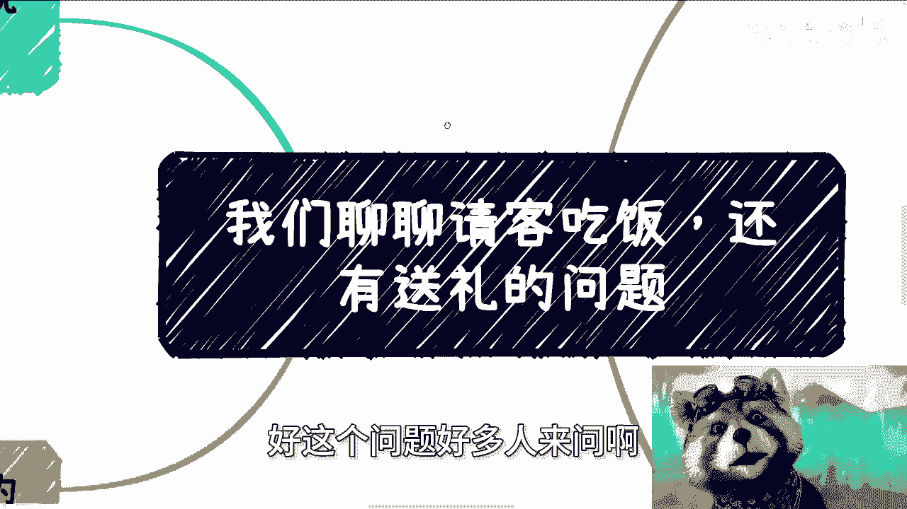

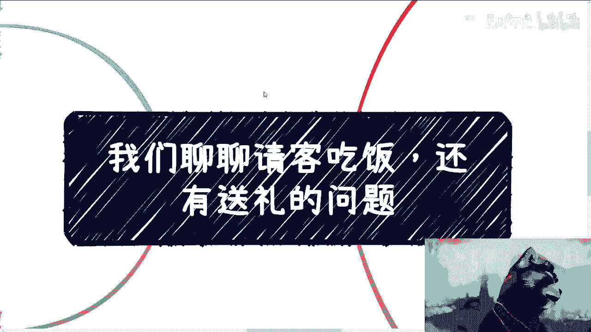

# 课程 P1：请客与送礼的底层逻辑 🍽️🎁

在本节课中，我们将探讨商业与社交中“请客吃饭”与“送礼”的核心逻辑。我们将分析不同对象（如商人、政府领导）的真实需求，并揭示这些行为背后的本质，而非表面的形式。

---

## 一、 请客吃饭的本质

上一节我们介绍了课程主题，本节中我们来看看请客吃饭的真实含义。

请客吃饭的对象，通常是商人或拥有商业壁垒的赚钱人士，以及政府部门的领导。

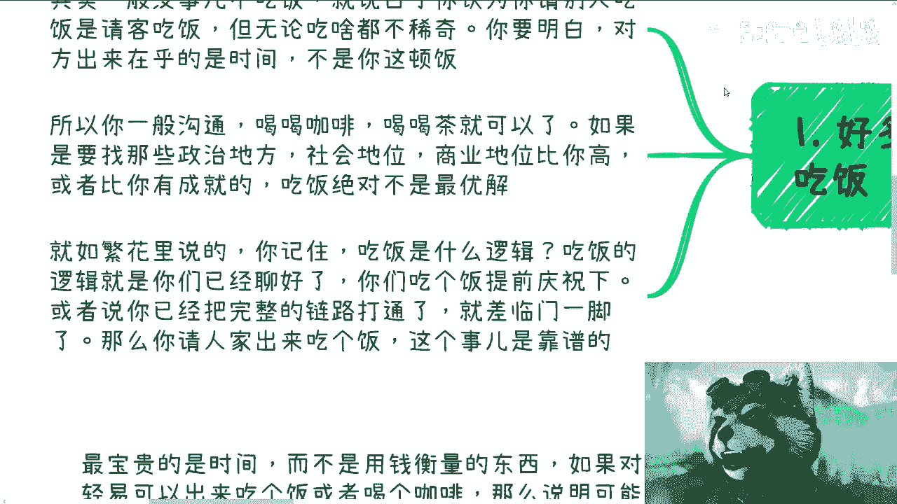

通常，重要人物不会轻易答应吃饭。频繁参与饭局的，往往是负责传话或撑门面的下属。对于商人而言，最宝贵的是**时间**；对于政治领导而言，看重的是**地位**。

因此，请客吃饭的关键不在于“吃什么”，而在于“为什么吃”。其核心逻辑是：**吃饭吃的是双方都认可的“机会”**。

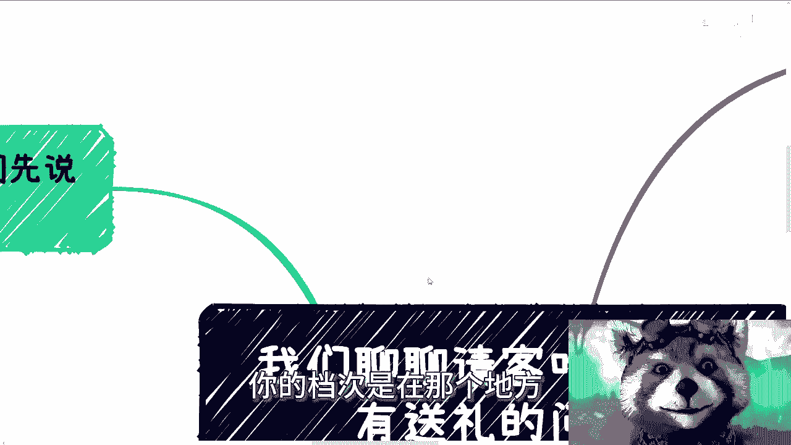

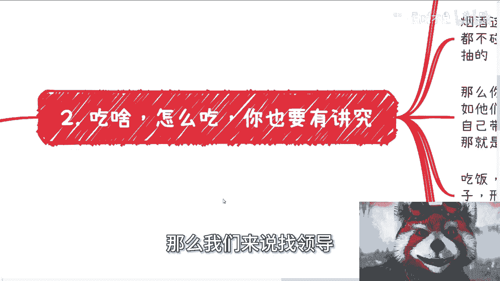

用公式表示即：
**有效饭局 = 双方认可的机会**

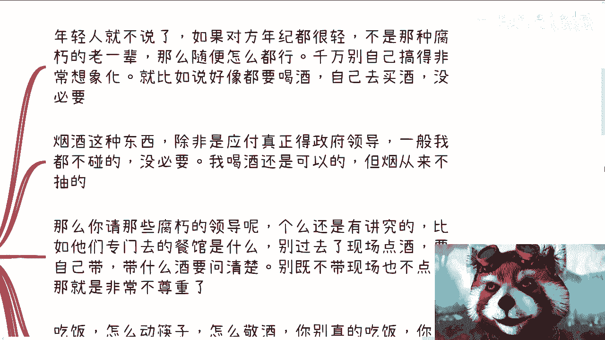

这种机会通常出现在商业洽谈已基本成型（聊得“七七八八”），或只差临门一脚（如需要对方站台、提供资源）的时候。饭局更像是一种提前庆祝或巩固关系的仪式。

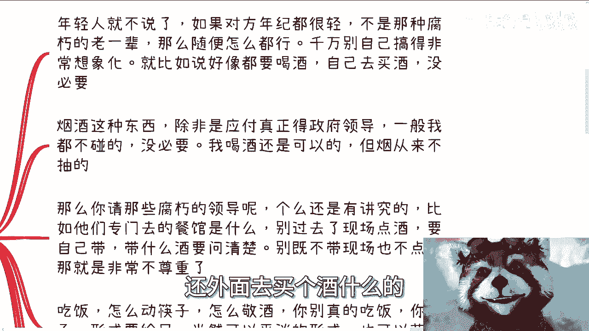

---

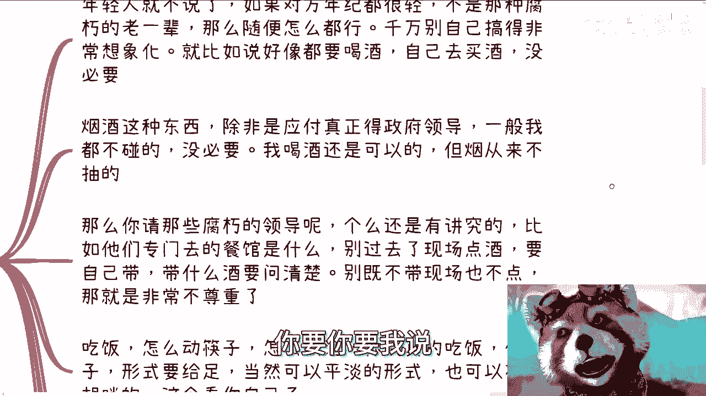

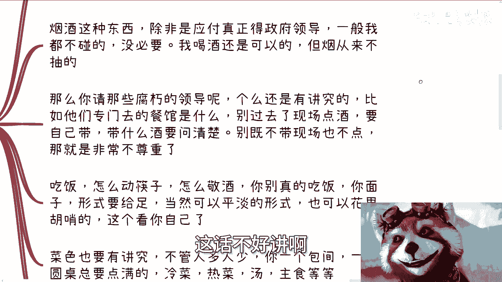

## 二、 与不同对象吃饭的讲究

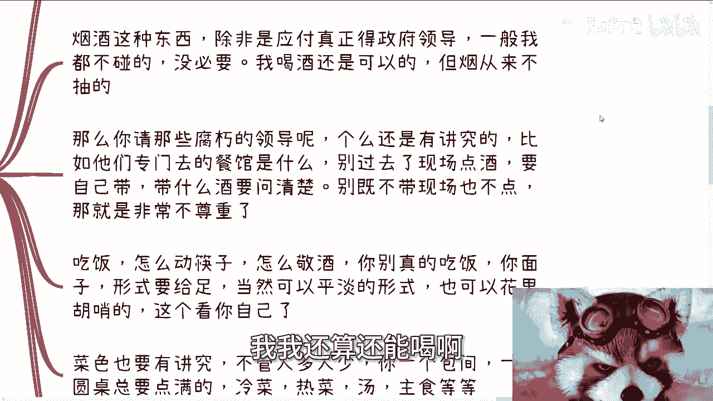

理解了饭局的本质后，我们来看看实际操作中需要注意的细节。以下是针对不同对象的要点：

**1. 与年轻或开明人士吃饭**
如果对方年纪较轻、思想开明（例如课程主讲人自己），形式可以非常随意。关键在于对方是否有空，以及避免不必要的、刻板的形式化操作（如非要喝酒、特意买酒）。自然、舒适即可。

**2. 与“老一辈”领导吃饭**
与较为传统的领导吃饭，则有诸多讲究：
*   **地点**：并非越贵越好，要选择对方常去、认可的场所。
*   **酒水**：切忌在现场点酒，显得很外行且不尊重。应提前准备好，并了解对方喜好。
*   **目的**：牢记饭局是“媒介”，核心是提供“面子”和形式，而不是真去吃饭。
*   **菜色**：无论人数多少，在包间内应按照冷盘、热菜、汤、主食的流程点满，尤其要注意对方偏好（如海鲜）。
*   **红包**：如果涉及现金，给多少需提前打听清楚，具体情况具体分析。

---

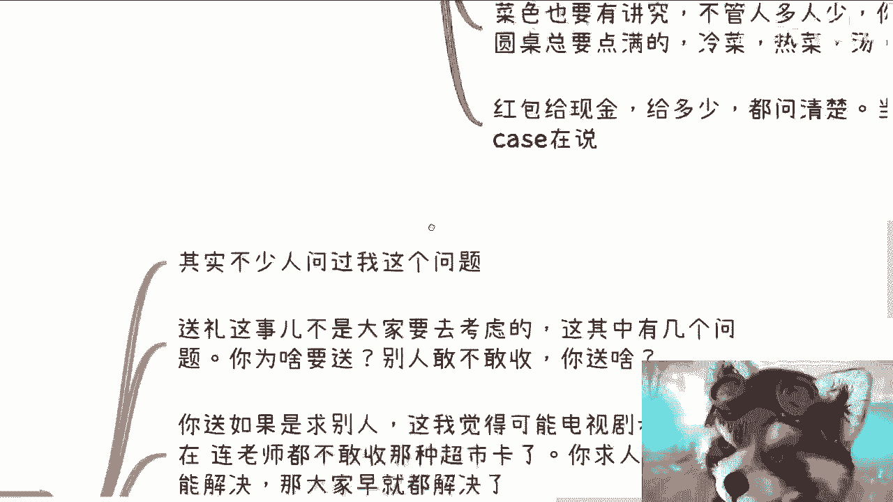

## 三、 关于送礼的逻辑

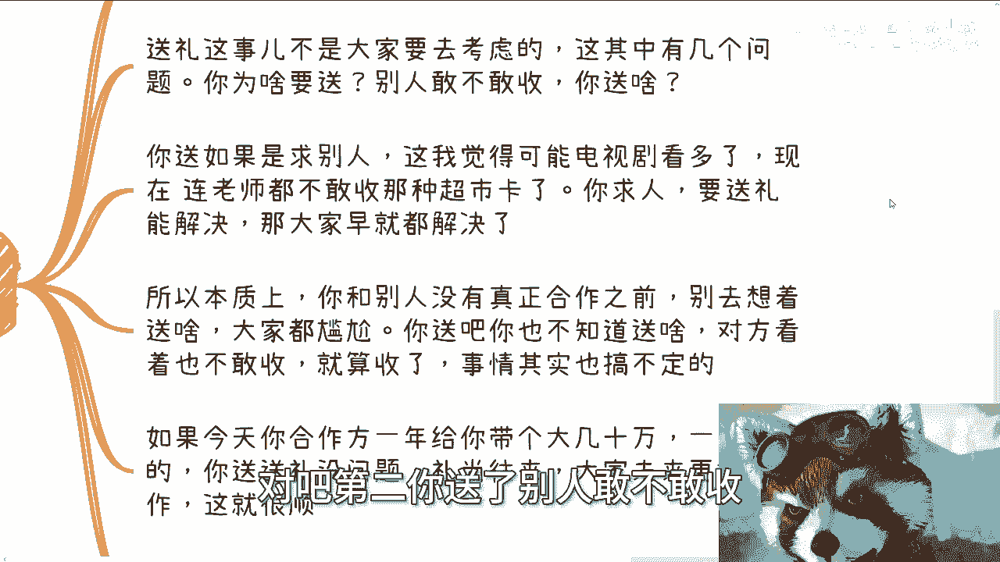

谈完了请客，本节我们来分析另一个常见问题：送礼。

送礼前必须思考三个核心问题：
1.  **目的**：为什么要送？
2.  **风险**：对方敢不敢收？
3.  **内容**：送什么东西？

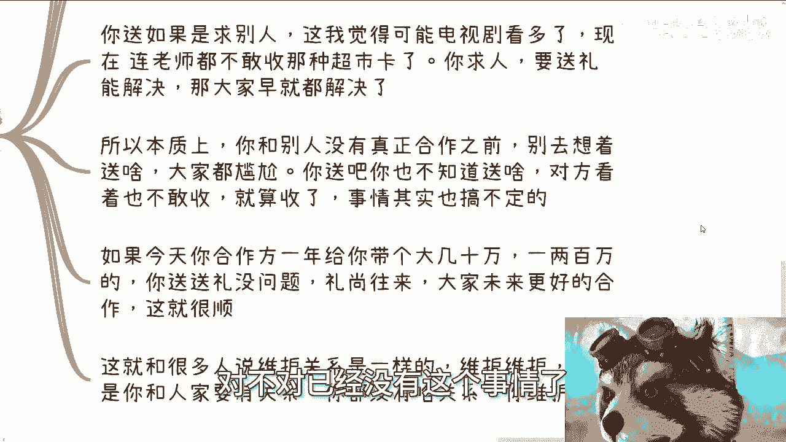

在当前的商业环境下，为“求人办事”而送礼的想法往往不切实际。如果事情能通过送礼解决，那所有人都能解决了。在双方没有建立稳固的**合作关系**并共同**赚到钱**之前，送礼会让双方都尴尬：你不知道送什么，对方也不敢收。

有效的送礼，应发生在**礼尚往来**的语境下。例如，合作方一年为你带来可观收益（几十万或上百万），此时送礼是共同庆祝，并预示着未来更好合作的象征。这时，礼物的意义在于巩固已有的、坚实的合作关系。

关系的维护建立在**已有关系**之上。如果双方只是喝过咖啡、吃过饭，并无实质合作纽带，所谓的“维护关系”往往是自作多情。

---

## 四、 核心原则：时间与地位

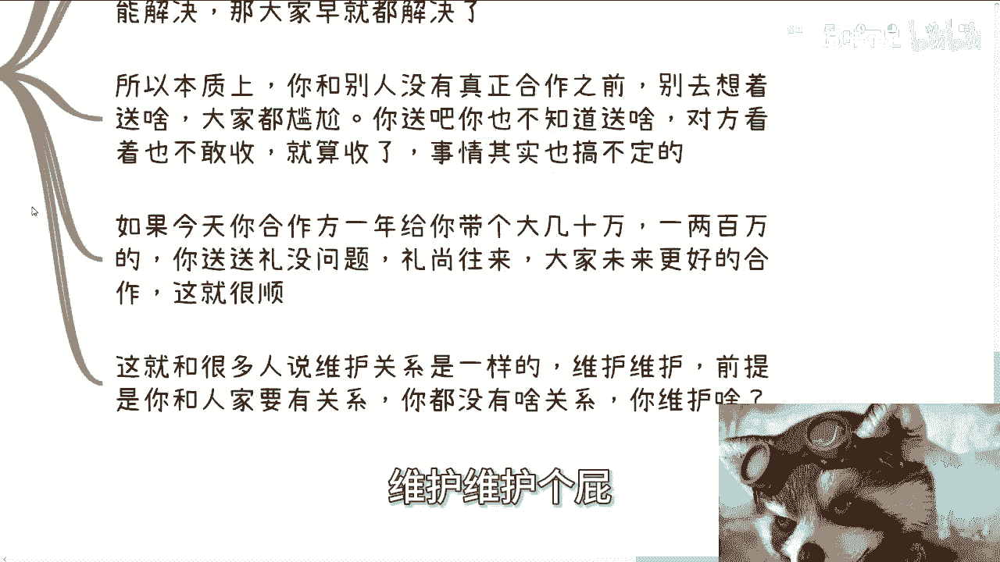

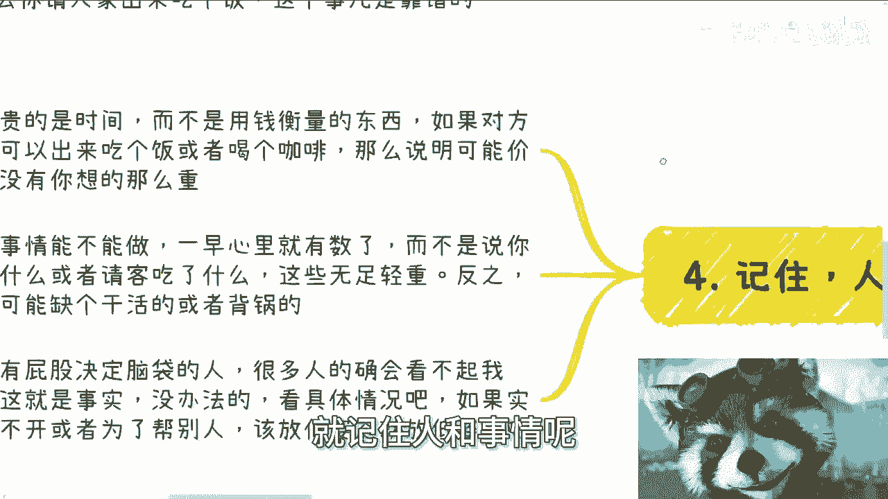

最后，我们需要把握最底层的原则。

在中国社会交往中，最宝贵的两样东西是**时间**和**地位**，它们通常无法用金钱直接衡量。

如果一个人能轻易、随时被约出来，可能意味着：
1.  他不忙。
2.  他的时间价值不高。
3.  他能提供的价值可能有限。

商业合作的决定性因素，是双方能否实现 **`1 + 1 > 2`** 甚至 **`> 3`** 的增值效应。请客吃饭等礼节性行为，最多是锦上添花，让双方开心，但绝不会成为合作成败的关键。它无法让原本 **`1 + 1 < 2`** 的组合变得有价值。

同时，必须认清现实中的**地位差异**。在商业场合，你是老板；但在某些政治或传统场合，可能需要暂时放低姿态。这不是清高与否的问题，而是现实规则。

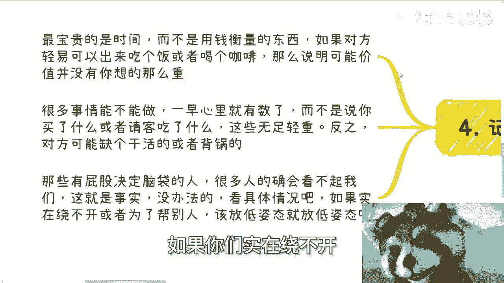

---

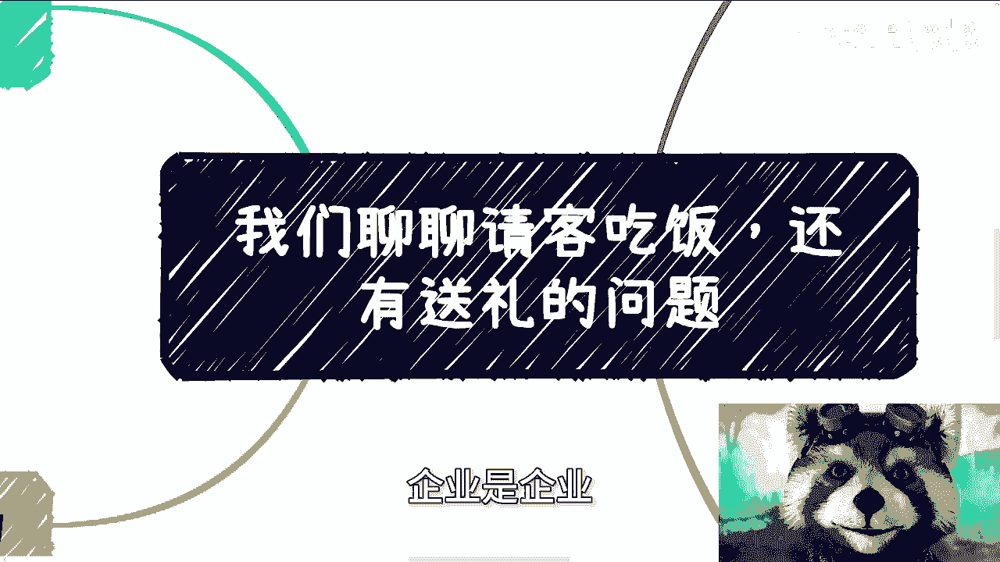

## 五、 总结与忠告

本节课中我们一起学习了请客与送礼的底层逻辑。

对于绝大多数尚未在商业和社会“游泳池”中深入畅游的人而言，无需过度纠结这些细节。**赚钱的能力和实质性的合作，永远比研究请客送礼更重要**。当你真正赚到钱、身处其中时，自然会明白该如何处理。

所有具体问题都是 **`case by case`**（具体情况具体分析），没有放之四海而皆准的模板。商业社会不是应试教育，没有标准答案。

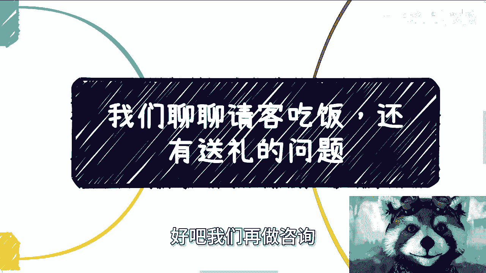

希望本课能帮助你理解这些社交行为背后的本质，而非拘泥于形式。