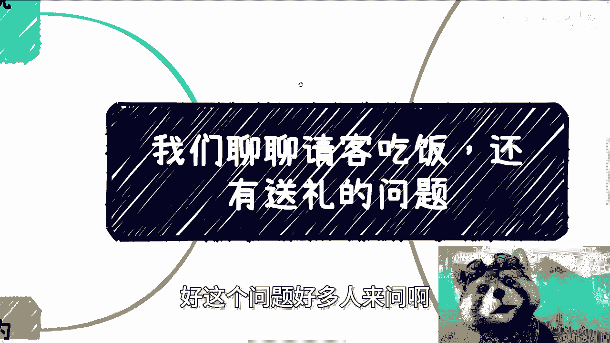
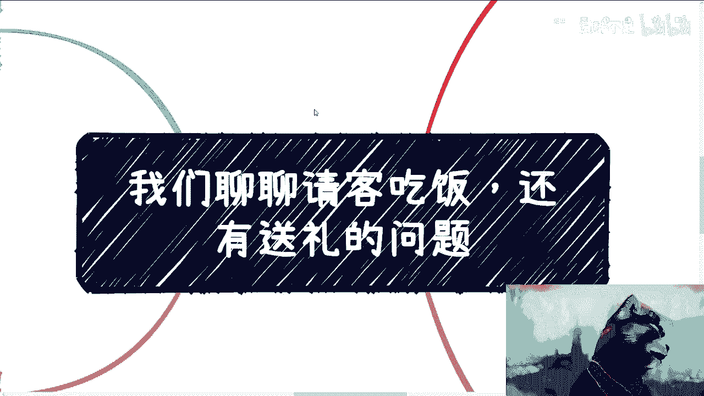
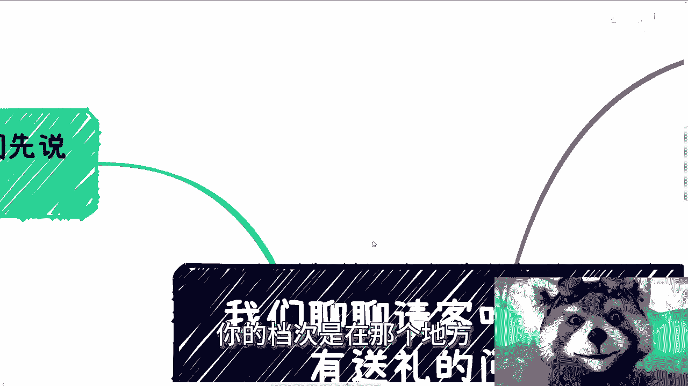
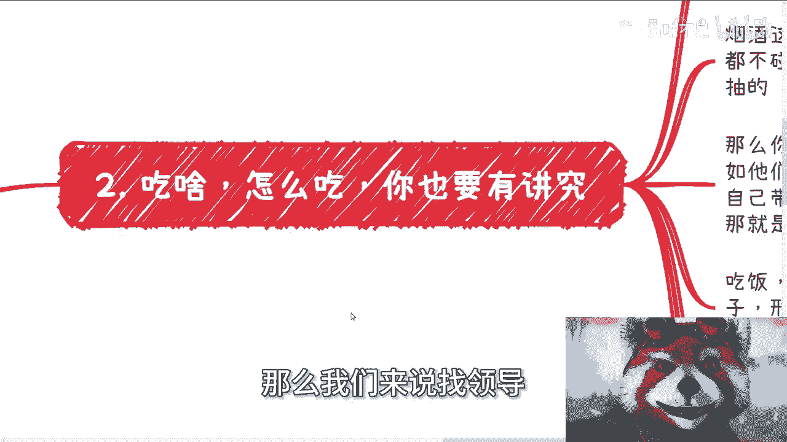
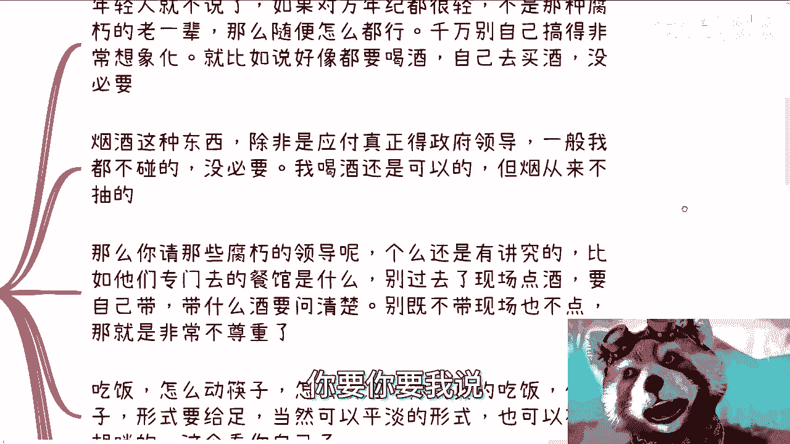
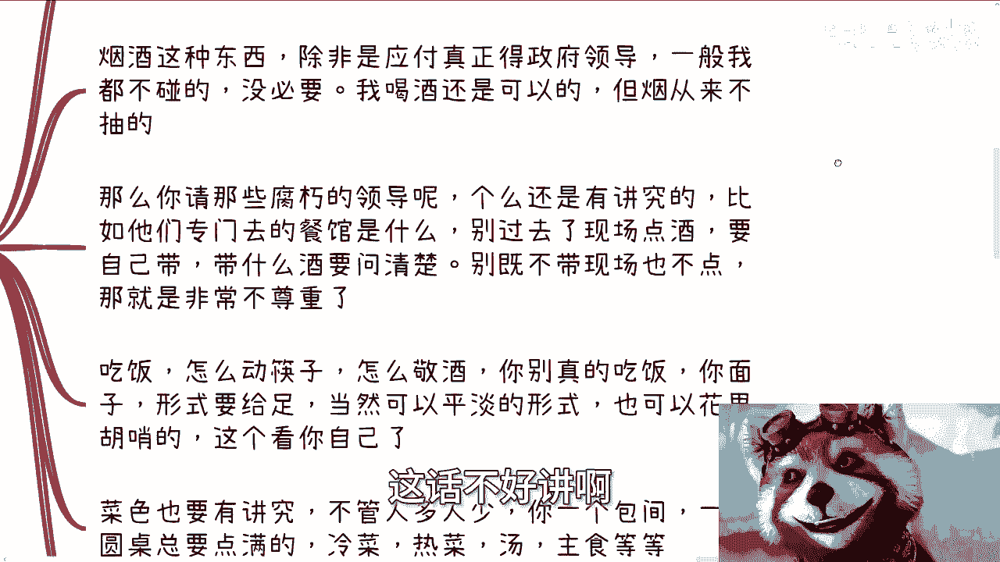
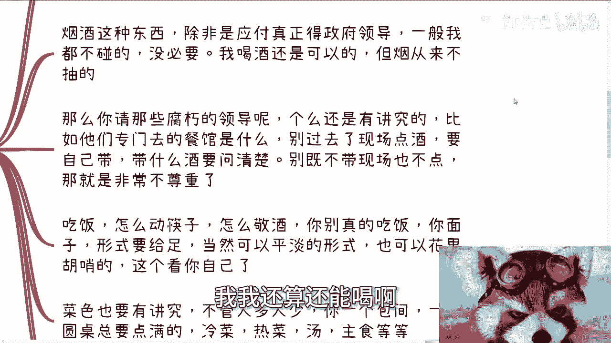
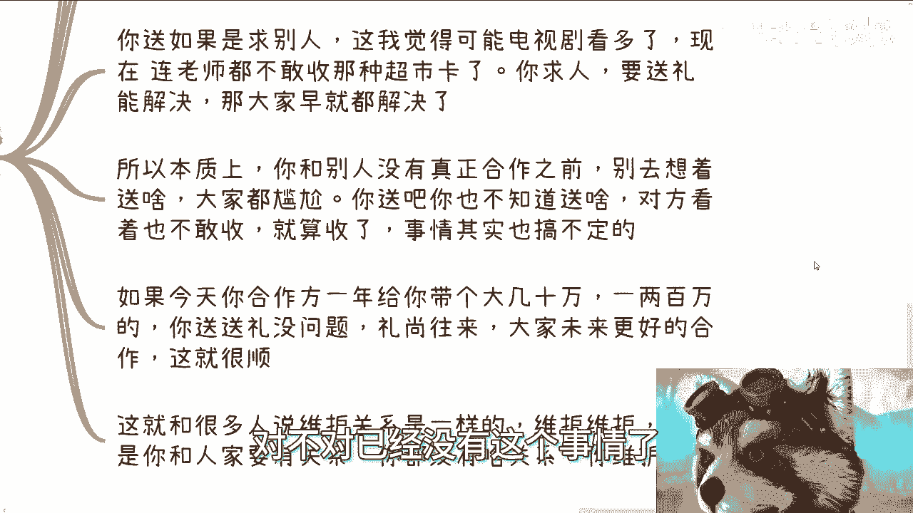
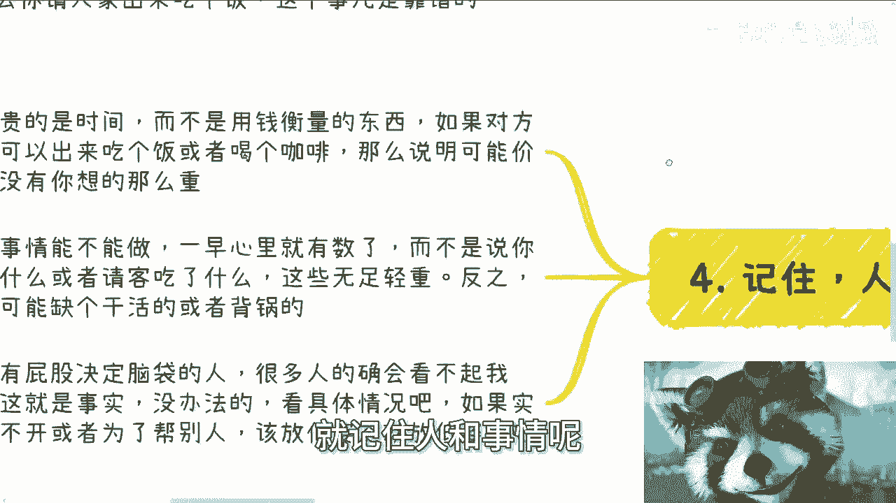
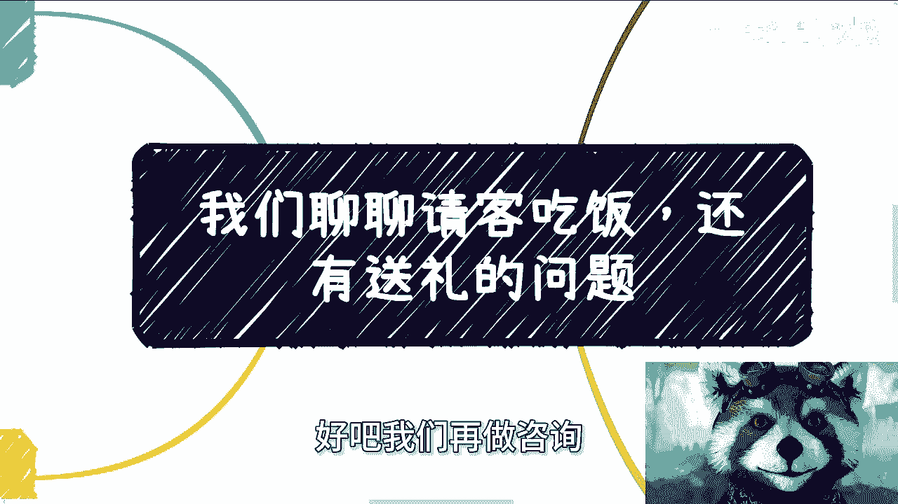

# 说正事儿了，我们来聊聊请客和送礼 - P1 - 赏味不足 - BV1Mt421a7E1

啊这个问题好多人来问啊。

这个请客吃饭，他有送礼的问题啊，咳咳咳咳咳。

我们来看啊，先说吃饭，其实啊首先我们先来说啊，就是说我这边的这个对象啊，我往往是那些嗯怎么说呢，商人啊，或者说你们可以认为有，就是比较有比较有自己商业壁垒的，那些不算成功人士吧，就是赚到钱的人啊。

或者说是那些政府的领导呃，呃首先是这样子的，其实一般呢没事，他不吃饭啊，说实话不吃饭就吃饭的呢，唉其实都是一些怎么说呢，就就就你可以认为都是一些撑门面的，就是小喽啰啊，就或者传话，你懂吗，就真正领导。

那怎么可能说吃饭就吃饭了，对不对，那那那你也得约啊，啊也得有事啊啊，就说白了你认为你请别人吃饭是请客吃饭，但无论吃吃啥都不稀奇，就是你要明白对方出来呢，他在乎的是时间呢，这么说吧，商人哪在乎的是时间。

而政治上面的领导啊，在乎的是地位啊对吧，就说白了就是说时间什么意思，就是你出来我给出来能不能，你能不能给我赚到钱啊，然后上那个政治地位的人，就说你配不配让我出来，你你不要觉得就是很多人可能听到这句话。

就不开心了对吧，但我跟你讲，其实很多时候你得认清楚地位啊对吧，你得认清楚角色就这么回事啊对吧，哦不是说人家在乎的，绝对不会是你吃顿饭了对吧，所以说一般你沟通啊，但就我们比如说跟人家称称蒙面的对吧。

小喽啰啊，你喝咖啡喝茶就够了，当然你要请客请他吃饭，他也不会拒绝啊，但是你请他吃饭，你说有什么用吧，这个唉你们自己判断啊，你如果要是真的找那些那个政治地位，社会地位，商业地位比你高的人呢。

或者说是比你有成就的，我跟你讲，吃饭绝对不可能是最优解，就是你也请不到他吃饭对吧，我跟你讲，这就像之前那个繁花那个电视剧里面说的，就说你记住啊，吃饭是什么逻辑，吃饭吃的是机会对吧，但是什么叫机会。

机会就是你觉得是机会，他也觉得是机会哦，你要觉得是机会，他觉得不是机会，那你是个屁对吧，所以说吃饭的逻辑就是一种可能性，就是说你们其实已经聊得7788了对吧，你们就吃个饭，提前庆祝一下。

大家喝个酒开心一点对吧。

或者说你呢已经把整个完整的商业链路打通了，就差临门一脚了对吧，你比如说呃差对方站个台呀对吧，他差对方给个给个这个这个资源啊对吧，怎么样子，那就像我们做生意是一个道理嘛。

就是你找人也不可能说只找一个人对吧，你说我今天要是找他不行，那怎么滴啊，我他妈之前做的准备都白费了，不可能的，你肯定会找别人对吧，但是你找别人也是一样的，你之前该怎么请，你，后面还是该怎么请。

你的档次是在那个地方的对吧好。

那么我们来说找领导对吧。

你吃啥怎么吃，你有讲究的啊，你以为这么容易啊啊年轻人我跟你讲就不说了。

如果对方年纪都很轻，不是那种腐朽的老一辈，简单来讲，就比如说你们请我吃饭，对不对，你随便怎么搞都行，无所谓对吧，那前提我得有空啊啊，那你千万自己别搞得非常的想象化，就是说比如说你就你虽然没做过对吧。

你你你你会觉得哎这非要喝酒对吧，怎么样子，我跟你讲，你但凡找我吃饭，你说啊这个这个还外面去买个酒什么的。

哎呀其实我跟你讲没必要，我我也不开心，何必呢对吧。

你要你要我说算了，不说了，不好说对吧，这话不好讲课啊。

然后就说烟酒这种东西，除非是应付真正的政府领导啊，一般我也是不碰的啊，没必要啊，你说我喝酒可以吗，可以的啊，我我还算还能喝啊。

但是烟一般我不抽的，也不是不抽，我从来不抽的，那么那么你请那些腐朽的领导，你还是有讲究的，你比如说你专门他们专门去什么餐厅啊，对你你别找那些乱拉乱七八糟的，他不去的，不是说越贵越好的哦，我跟你们讲。

他们都有常去的地方的啊，真的啊，别过去了，我跟你讲另外一点就是很大的忌讳是什么，就别过去现场点酒，很low的啊，很low的，你要么就自己带啊，要么就还是自己带啊，待什么酒呢，你要问清楚。

就是别你到最后别什么呢，就是现场嘛也不点，还要人家领导说对吧，那就是非常不尊重啊，然后吃饭对吧，怎么动筷子的，怎么敬酒的，我跟你讲，你别真去吃饭了啊，饭是什么，饭是面子形式要给足，你懂吗。

就是饭只是一个一个媒介，你别真过去吃饭的，你过去吃饭，怎么你就废了，你懂吗对吧，当然形式上你可以平淡的形式，你也可以花了一胡哨形式，这无所谓，这个看你自己，但是问题是你别真的过去吃饭啊。

然后菜色也是有讲究的，你不管人多人少，你总会有个包间吧对吧，你一个圆桌怎么点满吧，热菜冷菜汤，主食对吧，你比如说他喜欢吃海鲜的，但一般领导可能以海鲜为主吧对吧，怎么样子的，你这会得有吧，你别哎呀。

你别搞的，就好像比如说咱比打比方，你说咱三人哎，就找个找个找个什么什么大厅啊，不行的，我跟你讲，没有这样吃饭的，然后你比如说红包，红包给现金，给多少，你都得问清楚啊，当然这个具体case具体再说。

然后第三个就说到送礼啊，我跟你讲啊，其实不少人问我这个问题，我跟你讲送礼这个事不是大家现在去考虑的，因为这其中有几个问题，第一你为什么要送，你送了什么目的对吧。

第二你送了别人敢不敢收对吧，第三你送什么东西，你看啊，如果今天你是求别人，也不要求别人吧，就是你是希望跟他有什么合作，或者你希望就是说他啊，比如说这个接下来有什么单子啊，或者有什么有什么事情啊对吧。

能够能够写呃，这个这个提携提携你的对吧，我跟你讲，你要但凡这种想法呢，第一呢这个这个事情放在20年前，我觉得是可能的啊，另外一点呢就是很有可能你电视剧看多了啊，我告诉你。

你现在连中小学老师都不敢收那种超市卡了，你求人送礼，但凡如果能解决的话，那大家都解决了，对不对，已经没有这个事情了。

你知道吧，这是第一点，第二点呢，就是说本质上你跟别人没有真正的合作，就是没有真正的赚到钱之前，你别去想着送啥，大家都尴尬，你送吧，你也不知道送什么，你也不知道送什么价位，对方看着吧，也不敢收。

那你买了也浪费对吧，那我说不好听点，那那那对方但凡还有点人性，还有点良心，他也会觉得有点尴尬对吧，而且就算他真的收了，我跟你讲你所想的事情，他也不一定搞得定啊对吧，就我跟你讲什么情况下送啊。

如果今天你合作方，比如说一年给你带来个大几10万啊，一两百万，我觉得你送送礼没问题，礼尚往来嘛，大家开心开心嘛对吧，大家都赚到钱了嘛，那大家这个你这个礼送的，更多的是预示着说。

大家未来能更好的合作嘛对吧，因为虽然没有铁饭碗，但是你跟他的这个合作关系，已经是可能在天底下最硬的饭碗了对吧，但是这层关系不代表未来不会被替代啊，没有人知道的对吧，那你送送礼物，我觉得没什么问题啊。

而且而且我相信就是就是你真的送了哎呀，对方也懂得对吧，因为意义不在理啊，利益是在你们的合作关系啊对吧，这就跟很多人说维护关系是一个道理，你维护维护维护，那前提是你得跟人家有这个关系。

你今天跟人家就就就比如说喝了个咖啡，吃了顿饭对吧，怎么样子，你跟他屁关系没有，你上来就说诶，我要跟人家维护关系，你有啥好维护的对吧，就说白了我没见到过多少人，都是那种就说哎你这我那那我跟你讲。

那个关系跟我关系很好的，这个关系跟我关系很好的，都是自作多情，人家跟你没啥关系啊，你回顾过维护维护个屁对吧啊。

还有最后一点呢，就记住人和事情呢其实都是相对的。

就是说最宝贵的还是时间，你要记住，就是中国这个国家对吧，你最宝贵的要么是时间，要么就是地位，你别的没有，就是你用钱衡量的东西都不宝贵，用钱能衡量的，你宝贵啥呢，对不对啊，你你所以我就跟你讲。

但凡如果对方他轻易，如果说打我，打个比方，比如你说今天中午就约啊，然后下午就出来吃个饭或者喝喝咖啡，我跟你讲，一方面说明他不忙啊，第二方面说说明他的时间可能不值钱啊，第三呢就是说他可能提供给你的价值。

没有你想象这么重对吧，那很多事情能不能做呢，一早其实心里就有数了，就像你们找我合作，或者跟我说有什么单子，其实我心里是知道的，这个人能不能合作，或者这个团队能不能合作对吧。

那不是说你买了什么或者请客吃饭，我觉得，你买了什么和请客吃饭这个东西来支援，最多就是大家开心开心对吧，就有人请我吃饭，我怎么不开心呢，对啊，当然你别嫌我吃太难吃了对吧，就都开心的。

但这些不足轻重你知道吗，这些不会决定说哦，因为他没请客吃饭，所以不能合作哦，因为他请客吃饭，所以能合作，这跟商业上也是不成立的对吧，因为商业上要的是什么，就是你有什么事情，你有什么东西，我要我可以用的。

大家1+1怎么大于二对吧，怎么大于三啊，你说哦大家1+1本来就是小于二的啊，你请我吃顿饭就大于二了，这不现实的呀，你说对不对啊，这种我跟你讲，真的去电视剧看多了啊，我跟你讲，那些人的确会看不起我们。

我跟你讲的很清楚，就是看不起啊，这个就是所谓的政治地位，这个就是没有办法的啊，但是如果啊我觉得实在绕不开，因为这个事情不是我来做，你要让我来做，我就让他滚对吧，但是你放在不同的人身上。

如果你们实在绕不开。

或者为了帮别人，要还别人人情，那我觉得你该放低姿态就放低姿态，没有办法的，所以你要明白啊，就是说嗯打工也好，公司也好，就是就是打工是打工，企业是企业。

政治是政治，他在商业上它是不一样的，这个定位你知道吗，就是咳咳你作为一个企业家，你可以是个总裁，可以是个老板，但是你在政治这些领导面前你还是懂吗，就是就是你你还是低人一等的。

就我把说直白一点就是低人一等的，所以说你你敬酒啊，吃饭啊，你自己心里得有点逼数啊，你别就说装清高，装清高没有用的，还是那句话，地球不是围绕你转的啊，你明白吧啊，所以说呢我就觉得就是说嗯还是那句话。

就是说你们如果还没有完完全全的去，就我们如果把商业跟社会比作一个游泳池啊，你们如果还没有完完全全跳进去，我觉得你们根本就不用去考虑这些问题，这些问题不是你们要去考虑的啊，你们要去考。

就说白了你们如果赚到钱了，你们自然而然会明白这个饭应该怎么吃，理应该怎么送，否则你们赚不到钱，这就是个悖论，你懂吗，哦就是说不是说我们今天看本书，看个视频啊，或者说你说啊。

陈老师以后吃饭是不是带你们去对吧，怎么样，没有用的，你懂吗，因为我们还是那句话，所有的问题都是都是case by case，就是每一个人，每一个地区，甚至每一个不同的部门，他的那个那个做法都不一样的。

我们不是应试教育，好吧行啊，这个事情就这么着，你们反正有数就可以了啊，就这样招吧，然后你们其他的就是要是嗯比较复杂的对吧，有什么啊，这种商业上或者说职业规划，或者别的东西有问题的好吧。

