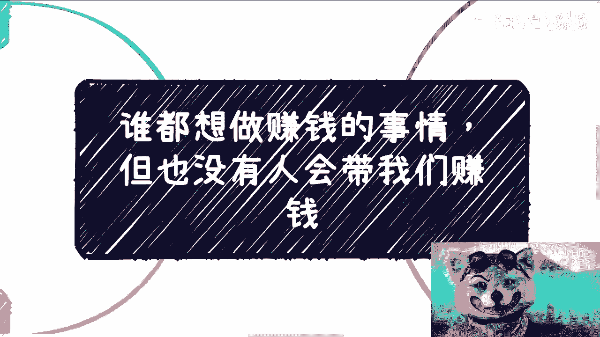
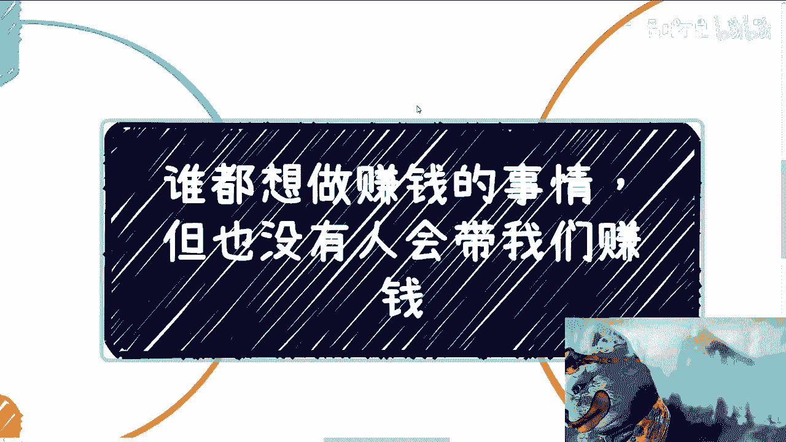
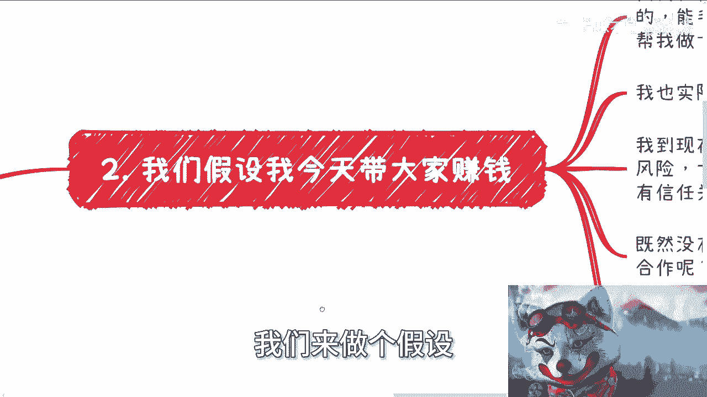
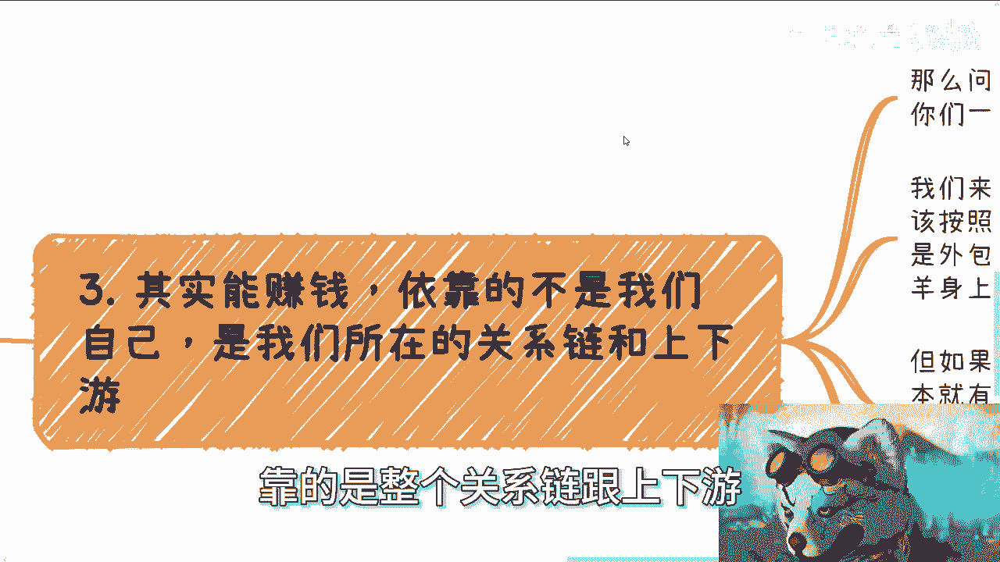

# 谁都想做赚钱的事儿，但的确也没人会带我们赚钱 - P1 - 赏味不足 - BV16W4y1F72b

啊大家好啊，今天终于有空给大家来录视频了啊。

嗯这个问题啊，这个问题几乎每次咨询，每次沟通都会有人问我啊，包括那个之前线下那个小伙伴啊，还在跟我说，就说能不能合作啊对吧，能不能帮我做点事情啊对吧等等等，哎呀其实蛮感谢大家的。

蛮感谢大家的，这个我先来给你们翻译一下啊，啊3年啊，三像素足够晒车票，晒车票日期啊，但是呢啊实际上根本没有人带了才出票。

为啥多利亚啊，为什么一你看啊这个事情呢。

就是每个人的真实想法，包括我很正常嘛，谁不想呢，对啊，今天有人带我，我我我也不要多，我只要5%，你让我躺着转就可以了，谁不希望呢，对不对，你看我最近是跟你们说忙啊，我最近一直在接待各地来的朋友啊。

还有合作伙伴啊，嗯还是那句话，大家大家来呢，嗯也不是说来吃饭的啊，也也也那当然了，就是说我也说直白点，你肯定也不是来看我的啊，呃大家就是来找机会的啊，就是跟大家那个繁华里啊说一样，就黄鹤路吃饭。

他吃的不是饭，吃的是机会啊，一个道理好嗯，谁都想赚钱，谁呢也都希望别人带自己赚钱，包括我对吧，然而呢那个我希望不是我希望我相信啊，每个人其实内心都清楚，就是我是觉得很多东西，每个人内心是都清楚的啊。

这是不可能的对吧，或者来说怎么样，只不过呢就是看他自己能骗自己多少，你懂吗啊，这就像我我一直觉得啊，就是说赚钱的所有事情都有灰色地带，就是看这个灰色地带占比是多少对吧，当有的人能骗自己，就自己骗自己。

骗99%，骗100%，那没问题啊，那他就觉得别人带我就是有可能的，那你怎么跟他说服说服他呢对吧，就像我们那句话怎么说来着啊，你叫不醒一个装睡的人，没有办法的呀，啊所以说你像买彩票也是一样的对吧。

就是我心里知道我不可能中奖啊，但是我时不时的可能我还会去买对吧，那那这就是人性吧，是不是啊，我跟你讲啊，人性就是这样子的，那不存在绝对的理性和绝对的感性，你知道吗，就如果存在意味着什么，只是筹码还不够。

你明白吧，就就就这么简单啊，那么我们假设我们来做个假设。

假设我今天大家来带大家来赚钱啊，你看啊，其实私信我或者咨询我的时候呢，好多小伙伴蛮好的啊，我觉得能毛遂自荐比较有自信的啊，来说找我合作或者怎么样子，哎呀这个我觉得没什么对吧。

因为我已经是非常的清明了对吧，我我也不会因为你们说什么怎么样，怎么样怎么样，无所谓的人爱咋地咋地呗，对吧啊，或者说就是免费的能帮我做些什么事情对吧，呃我也实际点跟你们说，我思考的方式很简单。

就是我到现在都是一刀切不合作的原因就两个，一个是风险啊，一个是没有价值的交换，通俗点来讲呢，前者叫做没有信任关系，或者叫做没有看到赚钱的切入点啊，好那么按照我上次视频的观点啊。

我这么跟你们讲所有一刀切的行为啊，我也客观的说一刀切的行为不是你们有问题啊，所有一刀切的行为说明我不行啊，说明我垃圾，为什么，因为说明什么说明就说OK啊，我没有这个风险把控的能力啊对吧，我也没有。

这个就是说就是说能够能够就是说呃，有一定自信跟大家说，爱你们合作之后能帮你们赚钱，是我不行对吧，所以我一道歉对吧，如果但凡我有这种把控能力，我能帮大家赚赚钱，OK那我为什么拒绝你们呢，对不对啊。

所以说既然没有信任关系，也没有赚钱的可能性对吧，那为什么要合作呢，你想想看为什么呢，啊所以说如果啊你想啊，如果哪天我真的说好，来没问题的，你坐啊，或者说我说我来赚大家赚钱了，那要命了，我相信你们。

那你们喷我不喷我，这是后话对吧，你们肯定是第一时间在想，卧槽这不符合陈老师的逻辑嘛，对不对，就是你没有看到赚钱的可能性，你来跟我说好，来来来，大家赚钱了，那OK可能有一些人马上就反应过来了哦。

陈老师看到赚钱的可能性了，有啊，那不就是歌吗，对不对，那没了呀，你就说明要么就是我被盗号了，要么就是说我也放开了对吧，也他妈也不做什么业务了，做他妈什么毛业务对吧，就购就完事了对吧。

所以说你按正常的逻辑，你没有赚钱的可能性，那怎么会有别人带你赚钱，对不对啊。

好那我们往下来讲啊，其实你说能赚钱，你们仔细想看啊，我们所谓的赚钱是靠我们自己吗，是靠我们自己吗，不是你哪怕是一个专家定位，你哪怕是一个叫什么呃，院院士定位，你哪怕是一个教授定位，能赚钱。

靠的不是我们啊，我们每一个人都是尘埃，我们能能成什么事，我们什么事都成不了，靠的是什么，靠的是整个关系链跟上下游。

或者我们称之为靠的是这个生态对吧，也就是说我们随便打个比方，你说我在数字经济，我去政府里面去讲课，我去咨询，是因为我牛逼吗，不是对吧，是因为整个上下游整个产业链，整个生态，他要这么一个东西。

我正好在作为一个拼图在这个东西上面对吧，它是一个相辅相成的过程，所以问题来了，你想想看，如果今天有一个A啊，他说我能带你们赚钱，那么势必说你们一定会成为它的上下游，或者A的合作方，对吧好。

那么万事就怕假设啊，我们来假设一下，如果你们今天是A的上下游啊，什么叫上下游，我们叫做赚钱，一定是要按照分类来分的，而不是按照固定的那个费用，因为按照固定费用，那不叫合作方，那叫什么，那叫外包对吧。

那么如果你是外包，也就意味着虽然maybe你可以赚到钱，很简单，比如说你今天对吧，Nobody，你说就像我们刚刚那个上面写的对吧，我们既没有信任前提，也没有赚钱的前提，而你又能成为我的上下游对吧。

或者你成为我的外包有什么前提吗，有的你你先给我钱，你先付个45万的培训费，对不对，你先门槛吗对吧，那么好，就是你可能第一个黑子能赚3万，那不好意思，那他妈的3万可能是你的钱啊，大哥大姐。

你们明白吗啊那么好啊，又有人要说了，他说那也可以点，那也开心点，对不对，那他总不能一天到晚那个倒贴吧对吧，或者怎么样子，大哥大姐，你要想啊，你们其实叫什么，你们其实叫做既给别人薅了羊毛。

又在帮别人数钱啊对吧，什么意思，就是你们如果能赚到钱，你们往往是个标杆啊，你们的存在是为了骗更多的人啊，哦你以为每个人都能向你们赚到3万吗，赚到5万吗，不可能的呀，这才叫商业逻辑呀对吧。

否则惩罚的这叫什么，这叫慈善，但如果你们能够接触到A的上下游，你们想想看啊，要么就像我刚刚说的，要么你就是原本就有那个价值，否则你为什么会接触到A的上下游对吧，或者说A为什么要让你们接触到它的上下游呢。

难道因为交了钱吗，好这个逻辑是走不通的，因为但凡能交钱，那他妈世界上能交钱的人多了去了啊，每个人都能接触A的上下有人吗，那么A就是，我跟你讲，那么要么就是这个上下游就是假的，要么如果是真的上下游。

那么就A就是，不就这么回事吗，对不对，哪来的这个真正赚钱的有利益链条的上下游，是大家说赚花钱就进去的，没有的呀对吧，所以我们要明白，所谓的赚钱，无非是我们在成为一种外包，或者成为一种分销商。

说白了就是说我们可能还是别人的工具人，只是他的链路当中，哪怕分点小钱给你，你都会觉得是一个大钱，所以你觉得叫赚钱，但本质上它不是赚钱对吧，但是同样的工具人我们可以做，我也做了很多年。

工具人有什么不能做的，对不对，但是我们做工具人的时候，我们得要看看有没有可能去摸清楚，它的整个链路，整个上下游整个的一个一个一个，一个一个叫什么商业的，这个这个这个因果关系对吧，如果你判断下来没有。

可能他完全就是我们说的商业中的信息隔离，他比如说你付了他45万块钱，56万块钱甚至10万块钱，他完全把你隔离在外面，也许你跟他可以做业务，你也许能赚到钱，但是你就什么都还是不知道。

你只是他告诉你做什么做什么，那他妈不就是打工吗，对不对啊，这就像我前两天去香港也是的，就是我回来也跟他们说了，我说我可以在香港花很多钱对吧，我可以说我我做个大冤种啊。

但是你你你你死也得让我死的明白吧对吧，就这钱花的我得明白吧对吧啊，所以说就是说如果你根本连关系链，连整个因果关系都摸不清楚。

你这个钱就是纯粹的，我跟你讲，人有很多人我跟你讲那句话真的是不对，有很多人说这个钱当学费了，什么叫学学费啊，你学费是得学呀，你学到点啥呀啊你每次学费都是被别人坑了，就扔水里了，然后自我安慰，我交了学费。

你学到点啥，就学费了，对不对，你不是交了学费，你是学费啦啊好，然后第四个，但那也不是说不能合作。

有两种可能性，什么可能性，就像我刚刚说的，我们一直说啊，要别人救自己，你得先自救，什么意思呢，也就是说你如果想大家一起赚钱，合作，前提是你得有赚钱的能力跟商业思维对吧，你讲出来的合作方式。

你讲出来的方案是大家要认可的，觉得诶哪怕今天哪怕啊，我们说我们我们没有信任关系，我们没有合作过，但是你讲出来的东西诶，大家觉得哎我一听有牛逼的，有点东西的啊，好，那么我们可以尝试一下，没问题啊。

这也可能的哦，也可能的，但是你不能讲出来一个他妈的过家家的方案，我靠对吧啊，然后另外一方面呢，就是说其实呢就是事实上来讲是我拿大头，我封了一些小偷出来给予大家，或者所谓的我的合作方也是有可能的。

但这个时候就有人要说了，他说那陈老师，你这逻辑不对啊，为什么你能赚钱非要分出来呢，对不对，你这明显就是放长线钓大鱼啊，对不对，我跟你讲很简单，因为很多时候所谓的赚钱你知道吗。

他是一个就是不一定都是指数倍的，它可能只是一个单纯的倍数的一个关系对吧，因为什么意思呢，因为有些时候我不是特别专业的，或者我来不及做，那么我就需要更多的人力，或者所谓的更多的工具人对吧。

那么如果我没有你们或者我没有这些工具人，这case可能就做不下来，你明白吧，那孰轻孰重呢对吧，你你以大局为重啊，所以说我就跟你们讲，但凡在我一个人或者在我的资源范围内，我能搞定的，我一定不会找你们。

肥水不流外人田啊，为什么呢，没道理的呀，对不对，就因为你们跟我的信任度没有，远远肯定是没有我跟我的合作方来的高嘛，我实事求是来讲，对不对对吧，但是你别的他基本上就不可能了，我跟很多人都说过。

就是我不可能推荐资源给陌生人，也不会直接跟陌生人合作，除非是什么，除非就像我们刚刚说的，你能够讲出个商业逻辑，而且很清晰，同时呢这个逻辑呢是你能赚钱，我也能赚钱对吧，同时呢你的资源也是实实在在的。

你讲出来的商业逻辑，至少在我看来，在别人看来，哎诶好像是很make sense，就很说得通的，那没问题啊，干呀哪怕亏本也干呀，为什么，因为诶你机会啊，机会大家要去试啊对吧，就因为为什么。

没有任何一件事情是百分之百的，因为你要跟我们合作，或者我去跟一个陌生人合作，一定是有风险的，但是这个风险我们可以去评估啊对吧，不是说我今天一点，就不是说所有的人一点风险不愿意冒啊，但是你冒风险的前提。

你不得你不得是一个稍微说得过去的东西嘛，对吧啊，你不你就像什么。

你知道吗，你就像很多人今天咨询也是的，就很多人跟我说，哎你看啊，我我比如说什么某个听某个局我有点关系，我就问他什么关系对吧，我说他说哦那个是什么什么，就这个听就他负责的哦，那我说是什么职级呢。

对吧哦好可能怎么样，那我说他能负责什么东西呢对吧，就是我们得要因为我们冒风险可以，但是我们所有东西得清楚吧对吧，或者在我们能力范围内，在我们的关系链里面，每一个人负责什么，他能调动什么资源。

他大概能赚多少钱，心里得明白吧，那我们去冒这个风险没问题啊，那亏了大家一起亏嘛对吧，但是你不能说哦，我们在规划的时候好一问三不知，这风险谁敢冒啊是吧。

所以你们仔细想想看，就是任何事情呢就不要上头，因为因为大部分的这种45万块钱，89万块钱的课程了，其实你们会付都是冲动消费，我能明白的啊，都是冲动消费，但是你们单纯的去了解一下，真的我那天在深圳的现场。

真的那天也跟大家开玩笑，就说我有时候真的觉得我是，因为什么，因为就是就是我这么跟你讲，来咨询我的人，他们往往也会咨询别人对吧，但是他们得出的结论是，就是他们咨询别人的那些那些得到的东西。

远远没有在我这里得到的多，但是我是所有咨询人里面最便宜的，这我就会有种什么感觉，就是这不是这不是别人割你们韭菜，是你们在割我韭菜，对不对，或者我感觉是是那些咨询的，就是那些叫什么，就是张口就来纸上谈兵。

人在间接的割我韭菜，唉没办法啊，世界就这个样子，就有时候吧我就跟别人说，你太有良心吧，也不好啊，你太没有良心吧也不好啊，就就这个样子，就像中国人吧，很多时候还会被传递一个思想。

叫什么叫做哎呀贵有贵的道理啊，贵的东西就一定怎么样怎么样哈，就真的有时候就是怎么说呢，就是就是都是被这种话所迷惑的，而不会再去，就是说真正的呃就我们说就事论事的kiss by kiss的，再去分析。

没有了，就碰到事情就说哎这个东西便宜啊，这个东西肯定不靠谱，哎这个东西贵啊，这个牛逼对吧，真的我跟你说，真的抱有这种思想，他妈的你不被割谁被割啊，哎呀行啊，就这么着啊，好这个过不了多久也过年了啊。

这个我后面活动反正过年后再说了，大家反正有什么呃，这个这个叫什么就职业规划对吧，或者商业上或者什么合同啊啊，或者什么什么商业的case啊，或者创业的idea啊，或者未来的这个发展啊。

你们有任何东西想问的啊，或者说想聊的啊。

