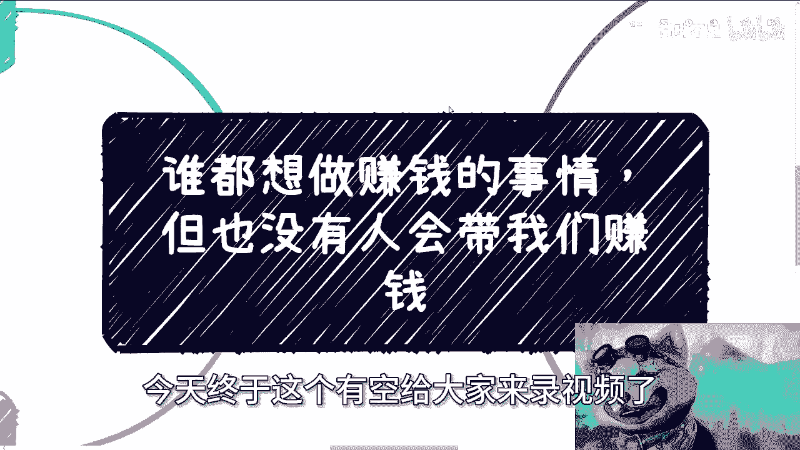
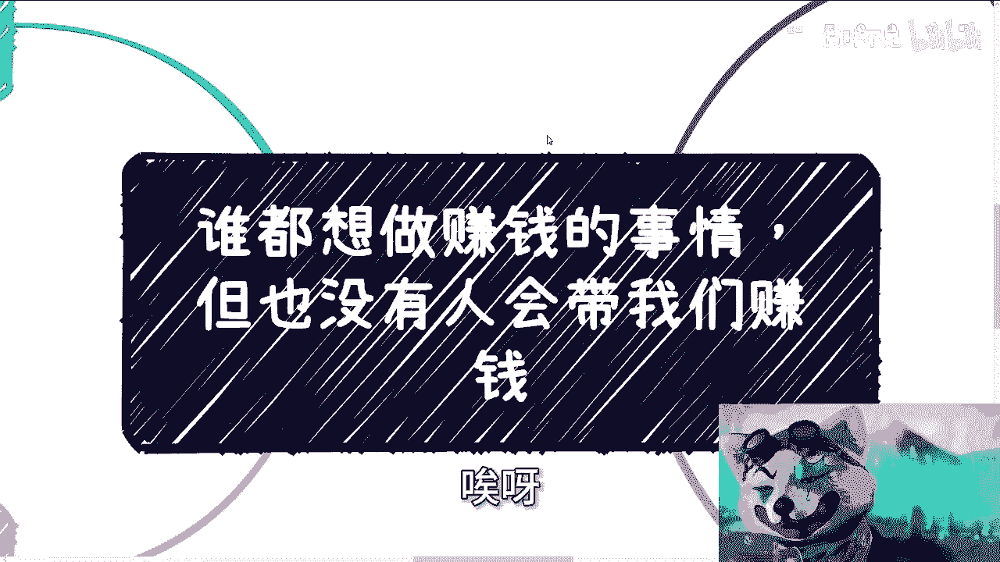
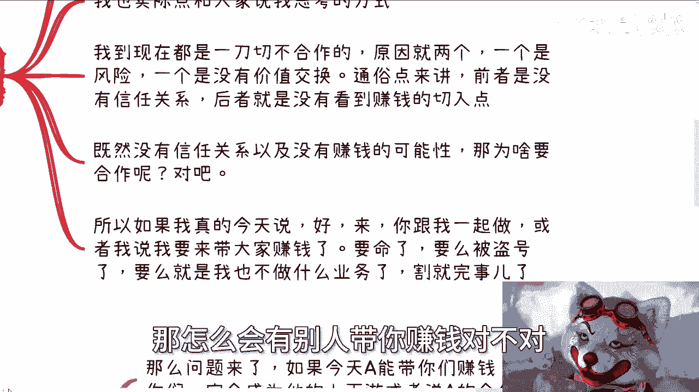
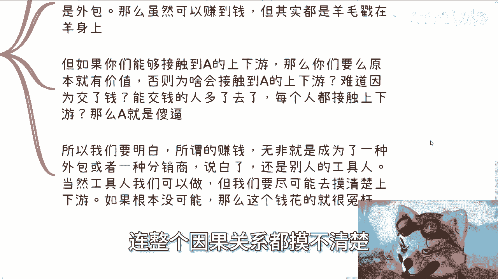
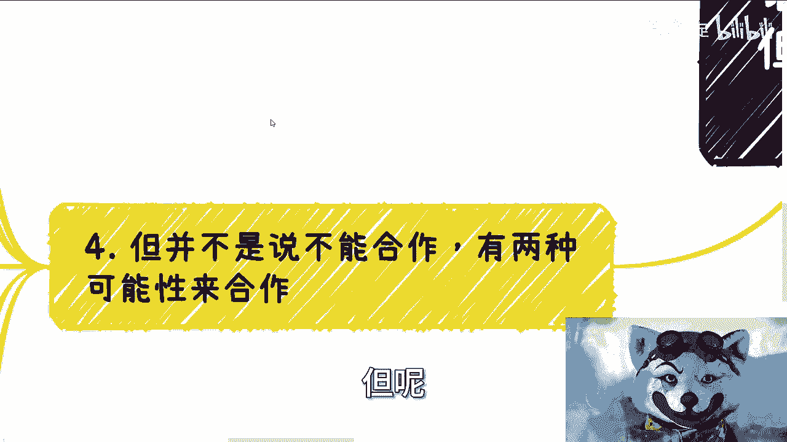
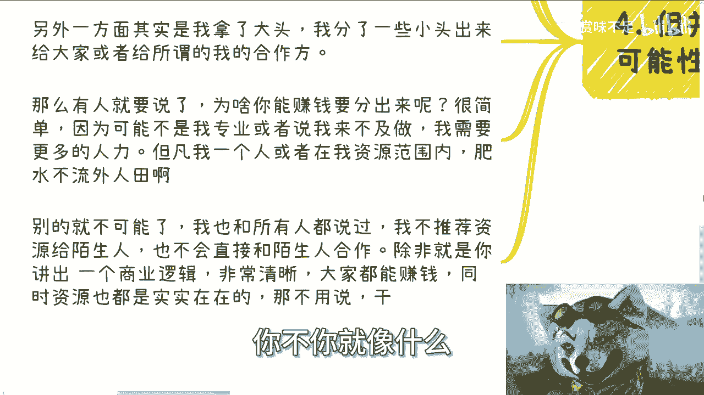
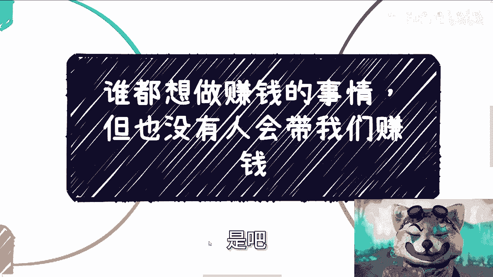
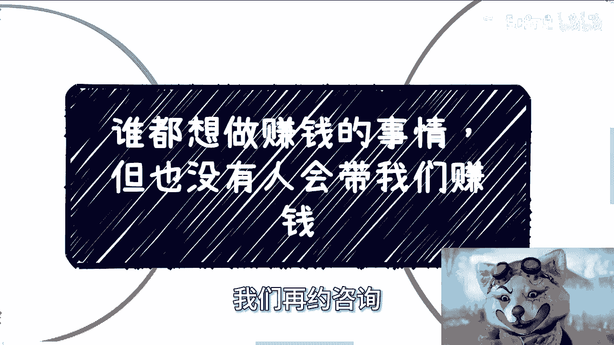

# 谁都想做赚钱的事儿-但的确也没人会带我们赚钱---P1---赏味不足---BV16W4y1F72b_

在本节课中，我们将要学习一个普遍存在的商业迷思：为什么没有人会“带”你赚钱。我们将通过分析商业合作的核心逻辑、风险与价值交换，来理解独立商业思维的重要性。

---

## 概述

每个人都想赚钱，也都希望有人能带自己赚钱。然而，现实情况是，这几乎不可能发生。本节课程将剖析其背后的根本原因，帮助你建立正确的商业认知。

---

## 核心矛盾：期望与现实

上一节我们概述了课程主题，本节中我们来看看问题的核心矛盾。

每个人都希望有人能带自己赚钱，这是一种非常正常的想法。然而，每个人内心其实都清楚，这几乎是不可能的。这只是一种自我安慰，就像买彩票一样，明知中奖概率极低，但依然会去购买。这源于人性，不存在绝对的理性。

---

## 为何无人带你赚钱：风险与价值

理解了期望与现实的矛盾后，我们来深入探讨无人带你赚钱的具体原因。

当有人提出合作或“带你赚钱”时，拒绝通常基于两个核心原因：**风险**和**缺乏价值交换**。这可以通俗地理解为：没有信任关系，或者看不到明确的赚钱切入点。

如果一个人有能力把控风险并确保合作方能赚钱，他自然会选择合作。反之，如果他没有这种能力，拒绝合作反而是负责任的表现。因此，当有人轻易承诺带你赚钱时，其逻辑本身就可能存在问题。

---

## 赚钱的本质：生态与工具人

上一节我们介绍了拒绝合作的原因，本节中我们来看看赚钱的真正本质。

赚钱并非依靠个人能力，而是依靠整个**关系链**和**上下游生态**。个人只是这个庞大系统中的一块拼图。

如果有人（A）声称能带你赚钱，你通常会成为他的**上下游合作方**或**外包/分销商**。以下是几种可能的情况：

*   **成为外包/分销商**：你可能通过支付门槛费（如培训费）获得一个“赚钱机会”。但你所赚的钱，可能本质上是你自己预付费用的回流，并且你成为了吸引更多人的“标杆”。
*   **接触真实上下游**：这通常需要你本身具备独特的价值。如果仅凭付费就能进入，那么这些上下游要么是假的，要么A的商业模式本身就有问题。

因此，所谓的“被带赚钱”，往往只是成为系统中的一个“工具人”，获取有限的收益，而无法掌握核心的商业链路和因果关系。

---

## 合作的可能性前提

分析了常见的陷阱后，我们来看看真正有可能促成合作的条件。

合作并非完全不可能，但需要满足特定前提。核心是：**想让人救你，你得先自救**。

以下是两种可能的合作基础：

1.  **具备赚钱能力与清晰方案**：你能提出一个逻辑清晰、让双方都觉得“有搞头”的商业方案。即使缺乏信任基础，有价值的方案本身就能开启合作尝试。
2.  **成为生态补充工具人**：当赚钱项目需要额外人力或特定资源来完成时，合作方可能会分出部分利益。但这通常发生在**项目方自身无法独立完成**的前提下。如果他能独自搞定，通常不会选择合作，因为存在信任和利益分配的风险。

任何合作都伴随风险，但冒险的前提是对方案、资源、权责和收益有清晰的评估，而非一问三不知。

---

## 总结与警惕

本节课中我们一起学习了商业合作中的核心逻辑。

我们明白了“期待被带赚钱”是一种不切实际的幻想。真正的赚钱源于对**商业生态**的理解和自身**价值**的构建。合作的基础是**清晰的价值交换**与**可控的风险评估**，而非冲动消费或对“贵人”的幻想。

要警惕为模糊的“机会”支付高额费用（如45万、89万的课程），这往往是冲动消费。真正的价值在于能否让你看清商业的因果关系和资源链路。保持清醒，就事论事地分析每一个机会，才是避免被“割韭菜”的关键。

---

**有任何关于职业规划、商业案例、合同或创业想法的问题，欢迎交流。**