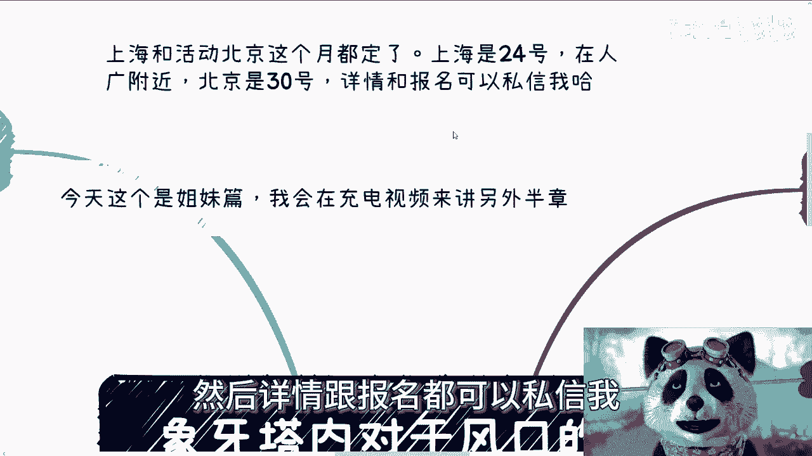
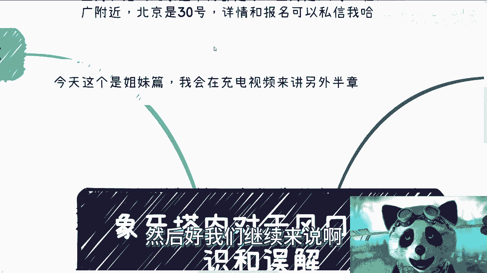
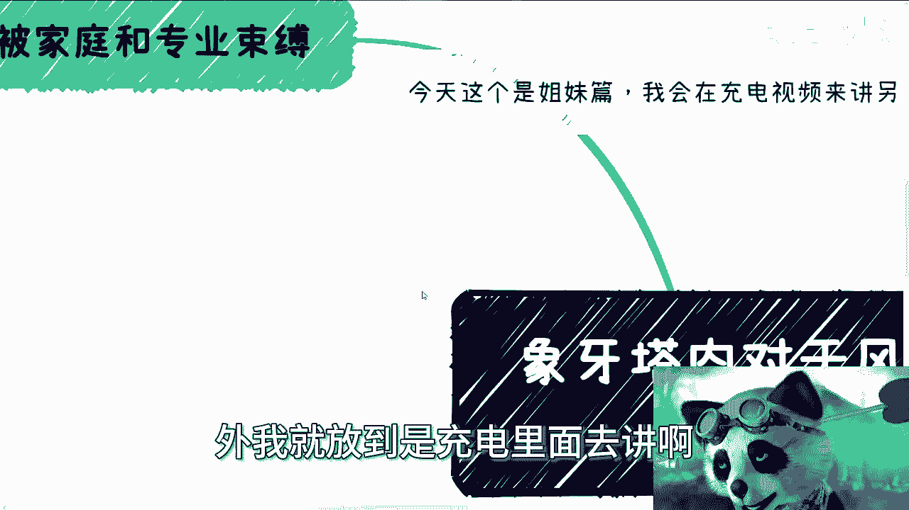
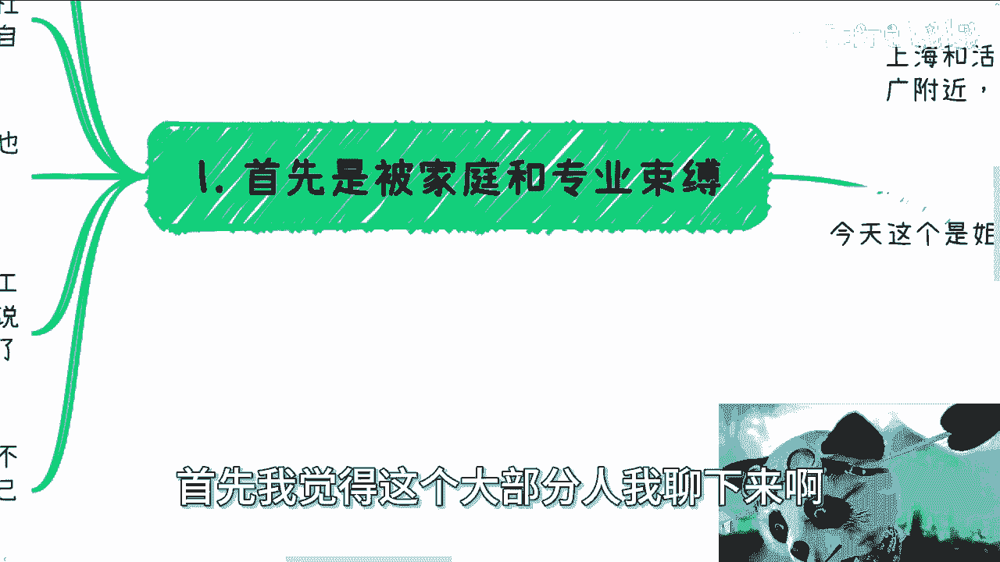
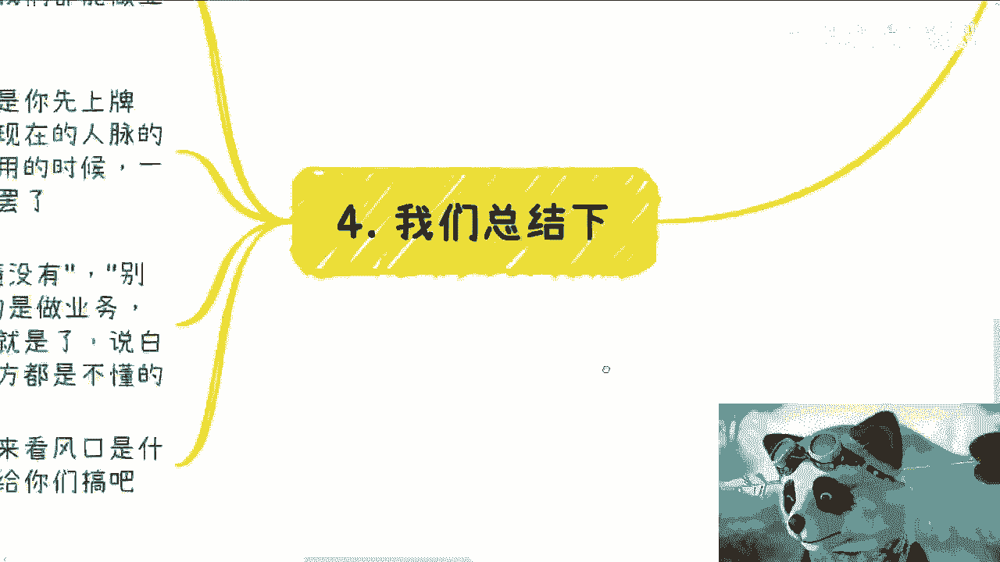
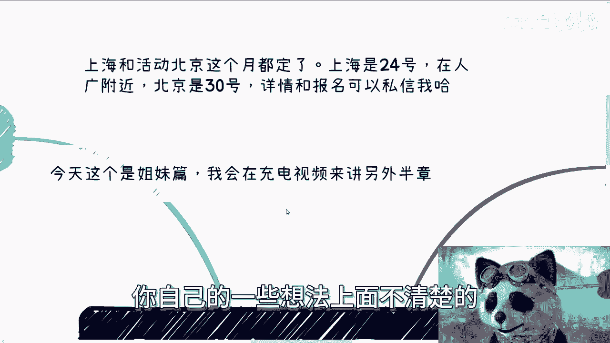

# 象牙塔内对于风口的认识和误解 - P1 - 赏味不足 - BV14K421x7G1

好大家好，这个我明天要早起，所以我今天本来打算弄搞两个人。

然后我又搞不动了，搞不动了，我只能搞一个啊哈首先是这样子的啊，上海跟北京啊，这个活动这个月都定了啊，然后上海场地也定了，在人广啊，在人民广场呃，北京就在微软啊，就在微软，然后详情跟报名都可以私信我。

上海是24号，北京是30号好吧，然后好，我们继续来说啊。

今天这个呢是个姐妹篇啊，我会在充电视频来讲另外半半张，但是来不及了啊，明天我再给你们搞啊，嘶嘶我们今天讲的话题啊，叫做那个象牙塔内外对于风口的认识跟误解。

所以我们今天只有半张，先讲内外，我就放到充电里面去讲。

呃首先我觉得这个大部分人我聊下来啊。

对风口这个误解啊，他首先是家庭跟专业带来的这个束缚啊，因为大部分人咨询我的时候，我问过去，我说你选择一个方向，因为你想要封口封口，大部分人关注的风口是什么，跟他的专业跟方向有关，那我问他。

我说你选择这个方向，以及当下要做出选择的这个原因的时候，这七八成的人跟我说，都是因为父母说的或者家里说的啊，比如说亲戚啊或者其他影响的啊，其实这就跟很多人一开始选择做商业，选方向是一样的。

就是你想想看啊，很你你们但凡咨询过我的人，你们会问我，比如说陈老师，你觉得这个什么方向比较好，我从来不给你们定方向的，为什么，因为你其实读书上学已经是别人帮你定的了哦，那进入社会，他妈做商业哎。

都已经是打算自己做做当家做主了，都打算就自己计划赚钱了，那你应该自己去做选择，你不应该让我或者别人再来做选择，就说不好听点，你已经错了一次，你为什么还要错，第二次对不对啊，那么专业束缚我跟你讲就更是了。

你就咱客观来讲啊，你想想看啊，大部分人本科毕业也就20出头啊，20出头你好像就是我这么说吧，你好像搞了20多多年，你好像就摸清楚你就是做这个专业一样，亦或者来说，好像你你就是觉得。

这辈子就被这个专业束缚死了一样，这无论是前者还是后者，这逻辑都不对啊对吧，因为大部分的人对专业他是不了解的，他就是稀里糊涂选了个专业啊，既不是说寻找到了自己的长处，也不是说就是棺材板盖上了对。

但是现在你会发现大部分人就是哎呀，我就读这个专业，然后你会发现吧，就是明明世界这么大，他说嗯我只关心这个专业，为什么呢，因为我只懂这个专业，大哥啊，大姐爷爷奶奶，亚瑟对吧，我就想问你们。

你们真的觉得你们懂这个专业吗，啊啊哼就我觉得你们要是就是束缚在这边吧，我反而又觉得你们就是说哎呀，好像目光太狭窄对吧，你自己束缚自己的发展，你要真的觉得你懂这个专业，我都觉得我反而觉得你又狂妄自大。

你明白吧啊所以当然你也可以说你说陈老师，那那我要生存对吧，我要我要我要我要生活啊，我先找份工作，是不是，我说对啊没错，但工作只不过是给你固定工资啊对吧，或者说给你窝囊废的一种对吧，大家现在都叫窝囊废嘛。

给你一种窝囊废的一种手段，并不是说把你钉死在某个行业或领域，这他妈两码事嘛，对不对，你不能做二极管的啊，当然啊虽然我不能说每个人都很有天赋，但也的确啊我们就客观来讲，但也的确有不少年轻人。

因为这种莫名其妙的外界因素。

从而浪费自己的天赋或者机会，就是在我看来，明明我不能说多吧。

明明肯定有这种年轻人，他是有有更好的发展，能够给为社会，为国家带来更多，甚至为老百姓做出更多的贡献，但是不好意思，他被浪费了，对吧啊，那么第二点，其次呢就是关于这个风口的认识。

也就是今天我们这个主要的这个话题啊，那么大部分人对于这种风口的理解呢，是一种周期，或者说是一种所谓的内部消息链，或者说是一种圈子啊，或者说是一种可能看得见摸得着，但是可能跟自己并没有什么卵关系的东西。

大部分人是这么理解的，但简而言之是什么意思，就是他总结下来，就是说OK所谓的风口跟普通人没有关系，OK好，那我给你讲，我就这么说啊，你去问他，你做过吗，没有，你抓住过什么风口吗，没有，那你尝试过吗。

没有，那怎么得出这个结论呢，你妈奇了怪了，对不对，我跟你讲，就这个样子的，就你问他一问三不知，然后他会给你个结论，哎这个东西跟普通人没关系，怎么就他妈没关系对吧，我们之前说过，在风口上猪都能飞。

但问题是并不是所有的猪都能飞，对不对，好，那么也就是说是不是跟你有关系，就看你做不做，就像以前老罗说的，你上不上牌桌，你不上，那你谈个屁对吧，你不上，你连猪都不是啊，当然我觉得这有点侮辱猪，对吧哈。

但我们来说一个逻辑，如果有风口，我们假设啊今天有风口，你要赚钱，你也是为自己赚钱嘛，对不对，那什么叫为自己赚钱，你得有你自己公司吗，你得有积累吧，你得有合作方吧，对吧哦，你说我一天到晚就作为打工人。

我他妈就在里面干啊，我他妈从一个junior干到senior，从一个senior干到从一个manager看到VP，然后呢，你连这只猪都不如对吧，因为你什么都没有啊，跟你关系，你还是个打工人，对不对。

你平时不积累，你哪来的，你哪来的资本啊，所以说你不做，你不积累，你不做，你说啊，陈老师，风口跟普通人没关系，尼玛那你就批我，还是那句话，这种话你就批评你自己，你不要讲出来对吧。

你讲出来别人你你经得住别人问吗，你别人问你一些细节，你知道啥对吧，而且我顺便提一嘴，顺便提一嘴啊，你就是我们刚刚一就是第一点就是第一大点，我们刚刚提到这个家庭跟专业的这个束缚啊。

你就按照G1的这种专业跟束缚的路线，你就是走独木桥的路线，那他妈就更跟你没关系了，你说这个风口跟你没关系，怪谁啊，怪你自己啊啊你不能说因为我不努力，因为我走了独木桥。

所以跟所以我认为这东西跟普通人没关系，那不好意思，你不代表普通人好吗好，OK好那么第三我觉得最大的误解在于哪里啊，最大的误解在于两个，第一个就是大家守着自己的领域跟行业啊，呃然后开始等守株待兔啊。

这时候分开来讲，比如说你今天想做的事门槛很高，成本很大，投入又很重，然后这个风口里面你想赚到钱，整个的这个这个投入时间跟跟精力又很大，对吧好，那的确，我觉得你今天所有的积累它是有垂直领域。

就是有这种呃垂直等属性的，你不可能说你今天比打比方，你今天做这个东西是在土木建筑的，你说好，我立马切到什么生物医疗可能吗，不可能对你的确没法去做，没有问题，但问题是什么，问题是什么叫封口。

风口往往都是快钱或者风口，往往就是一个上升趋势的一个行业啊，但是你们想想看风口上有慢钱吗，就是有那种周期长的吗，有的，但是真正你会发现那种珍稀场的，跟你我有关系吗，对吧。

就是这个时候就真的跟普通人没关系，就是他只会跟那种有关系的，而且就是就我们说有政治地位，是有社会地位，有这种血亲关系的对吧，或者说以前已经有拥有过很长合作，比如说5年十年关系的才有关系，才有机会。

那跟所谓的普通人，那是真的就没关系了，那也就是说慢前概率不大，那么我们就来说快钱，那既然说快钱，我们为什么要守着一亩自己的一亩三分地呢，你都已经是快钱了对吧，你还管他什么专业，什么领域啊。

啊也就是说你大部分的人，他的思考逻辑从一开始就不对，就是我们就应该是风口在哪，往哪冲，这他妈才叫抓住机会啊，你明白吧啊当然啊，我还是这里我要提一嘴，我发现很多人就是这个脑子太过僵化啊，就是我曾经说过啊。

我告诉你们，我曾经说过，你做事情不要老是变对吧，比如说你在医疗行业，你就一直在医疗行业，你在数字经济，你就一直在数字经济，但是这跟风口在哪，你往哪冲，这他妈不冲突啊，什么意思，你是一个人类。

你是一个高等生物，高等的动物，对不对，你必须要掌握多条线，多线程去做事情，你不是一个单细胞生物，你懂吗对吧，你就像我对吧，我我我我以前到现在啊，我既要打工，我还要做那个政企咨询，我还要去这个呃。

做区块链，我还去做做，可能要去关注web3对吧，我还要关注一些高效的东西，我可能之前还关注这些TIKTOK的东西，那怎么地啊，按照按照这个逻辑，就是说OK啊，那哪哪就是我只做我的东西，风口在哪。

我不管这这这这这不有毛病吗，对不对啊，你要明白你集中核心的这个主要的方向在哪里，就是我说白了你的主线任务在哪里，但是你也有支线任务的呀，对不对，你把人家打游戏都他妈知道主主线任务，支线任务。

那你说我们日常难道没有吗，你灵活一点嘛，对不对啊，第二个就是说风口其实大部分的时间啊，你只要在领域内或者相关领域，你其实都看得到的，你没有什么你抓不住的啊，就像我们说，比如说GPT或者以前的大数据。

或者什么云云计算，我跟你讲，你但凡只要参有有一些互联网群，或者说有一些互联网的这些人的朋友圈，你多多少少都是能看到这些信息的，但是你你你你绝对不会因为你看不到，而是说你抓不住的原因。

是因为你害怕你执行力不行，你犹豫不决，你你你你左思右想对吧，你你你你这个思前想后对吧，各种各样的对吧，而不是说就你真的是抓不住，不会的哦，你要今天真的是什么信息都没有，那就说明你连基础的社交都没有去做。

你懂吗，那么第四点我们总结一下风口，之所以叫风口，就是谁都可以做的，赚钱的方式很多很多，你可以靠风口做，真正的符合这个风口的业务去赚钱，就像我们说GPT对吧，你可以帮别人去部署。

你也可以帮帮这个帮助政府，帮助企业去做，那当然你说我没有这个能力做行行不行行啊，那你靠卖水卖周边啊，又怎么不行呢对吧，你不可能每个风口我们都能啊，你说不可能今天来个封号切中我的专业。

明天来个封号也切中我的专业哦，每个风口都切中你专业怎么可能不来，对不对，不现实的呀，但是并不代表别的东西你不能做呀对吧，你想想有什么不能做的呢，我就跟他们，我曾经就跟他们说了。

我说当年GBT去年3月份的时候对吧，当年GBT出来，你弄个知识星球，你我我不想来跟你讨论割不割，因为在商业上面没有对跟错，我不想讨论割不割对吧，你弄个知识星球，你就在里面发现信息，你看看在烽火的时候。

他们有没有人进来，你不用去考虑考虑啥玩意儿啊对吧，你不要觉得自己搭不上风口，搭上的前提就是你先上牌桌，上牌桌的前提就是你在日常在平时在每天这种，就是现在的这个呃，在每天平时的时候，你就得去积累你的人脉。

积累你的关系，积累你的合作方，你等到要用的时候，一呼百应直接干，无非就是大家怎么分润罢了，对吧哦，你平时不积累，然后你就到风口说，陈老师，我抓不住风口，他妈屁话，对啊。

然后最后就是即兴义千万就像我刚刚说的，不要去想说，哎呀这个东西我看懂了没有，他能不能赚钱，哎呀别人为什么会买，我跟你讲，你这种婆婆妈妈你就赚不了钱，就这么简单啊，你要记住我曾经说过来，什么叫风口啊。

当然我这地方提一句啊，我这里所说的风口指的是做业务，指的是正常的商业行为，不是说投资啊，有很多人就觉得我的，这个风口就all in是吧，梭哈不是的啊，我我不说投资啊，你不要把我这个东西理解成投资。

你理解成投资就废了，我跟你讲啊，那么做业务你不需要懂，你要做的是什么，说白了你想想看啊，风口卖业务，风口当中卖业务的人，买业务的人，我跟你讲，两边都不懂的，搞笑了对吧，我告诉你为什么很简单。

懂的人他不会去做这个东西，为什么，因为他不屑一顾，因为他会觉得这个东西很low，你懂吗啊，就是这就是我们一直说的，你懂得越多，你会觉得自己越无知，就这么简单一件事，但是从商业上，我还是那句话。

我不care我不关心，就是我就告诉你，这个方式就是中国到现在为止，一直以来正常的商业模式有什么问题呢，对吧，你要觉得人家low，你要觉得不做，OK那你不做对不对，你不做，你不要抱怨你，这就是你不做。

你也同时不要去抱怨说哎我手踩不上风口，那怎么地啊，哦你卖卖水，卖周边嘛也不做啊，你正常的嘛，你也没有积累，然后你还要抱怨哎呀，说我这我我我我我我那个跟不上风口，那么怪谁啊，我妈奇了怪了对吧，好好啊。

那么接下来充电视频里面，我会从象牙塔外啊来给你们来解析啊，怎么来看待风口这个东西，但今天来不及了好吧。

明天我再来给你们搞啊，呃我为什么会今天会有这个主题啊，是因为咨询的太多的人，然后呢他们会有他们的很多的一些固有思维啊，这就好像我问他你想干嘛呢，他说我想赚钱，然后呢。

他就开始用他的专业跟他的领域开始给我分析，我说大哥你20多岁，你就开始把你自己框死了，你分析分析个屁啊，你分析啊。

他妈奇了怪了，真的是好，那行啊，就这么着吧啊，上海活动24号，北京活动30号好吧，然后详情那个报名都可以私信我啊，嗯然后剩下的也是一样的，就是你的职业发展，因为我发现非常多的小伙伴呃。

他在选择那个职业上面，选择商业上面，选择合作上面，包括未来的一些规划，他从源头就是错的啊，真的从原著的就是错的，你们很多人咨询过我的人，他知道的就是他给我定的东西，很多东西被我全盘否定的。

因为他原著就不对啊好吧，然后你们要是觉得有哪些不清楚的，就商业上啊，职业上啊，合同上啊，融资上啊，或者在各个方面啊对吧，你自己的一些想法上面不清楚的。

你整理好问题好吧。