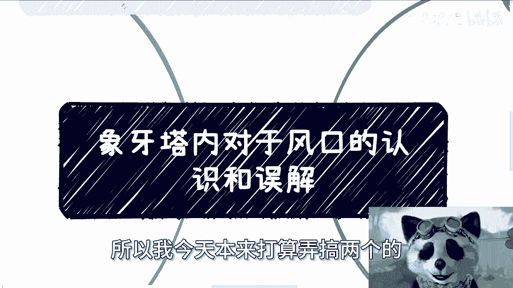
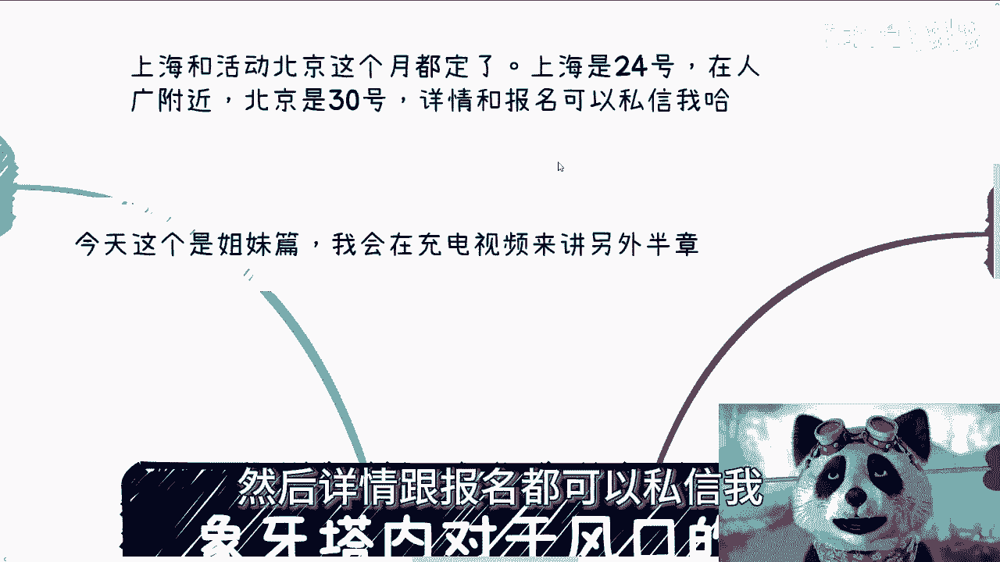
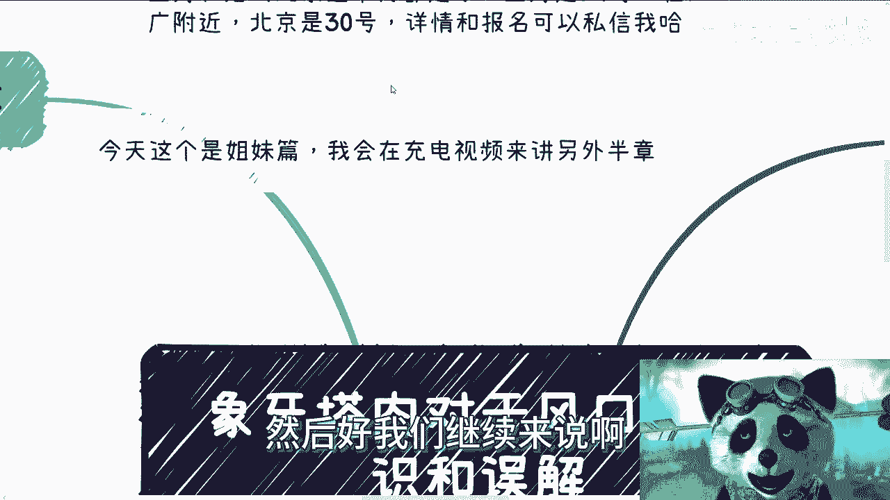
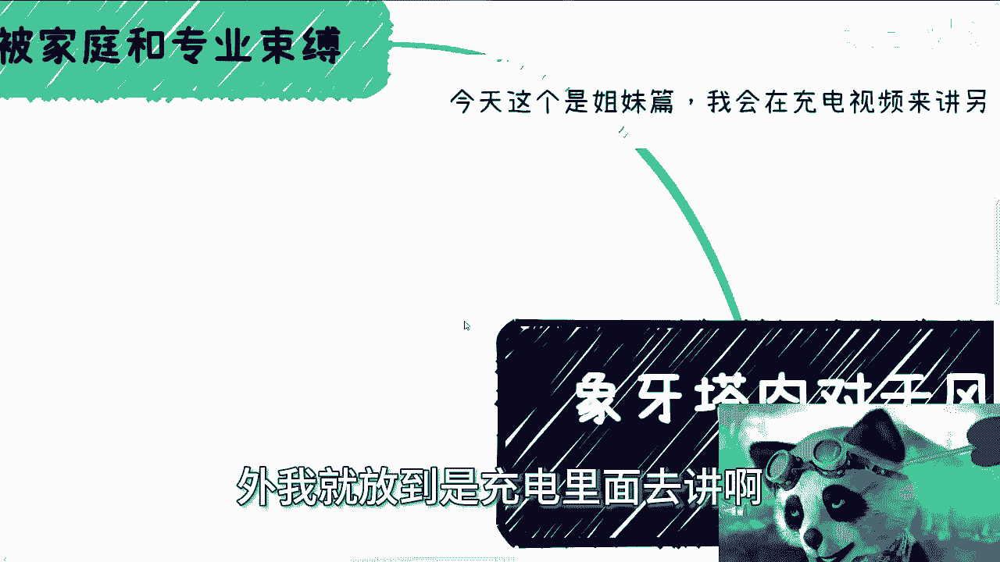
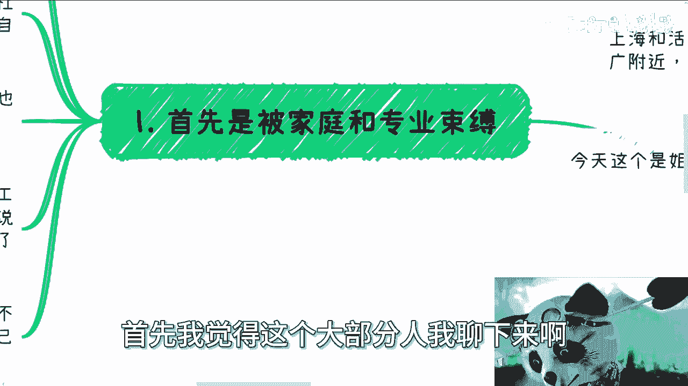
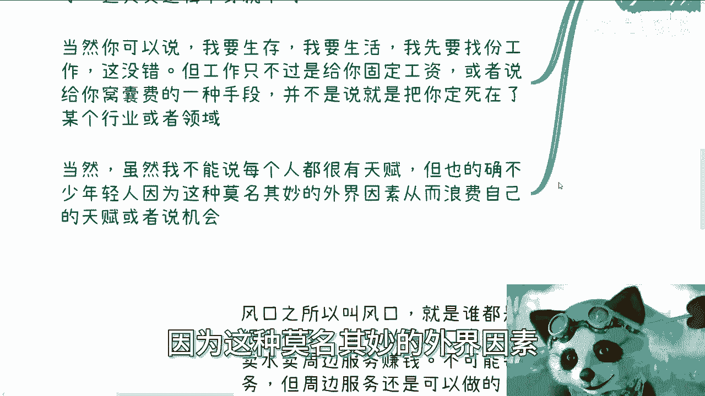
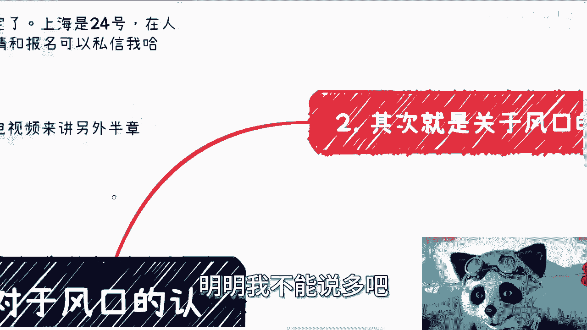
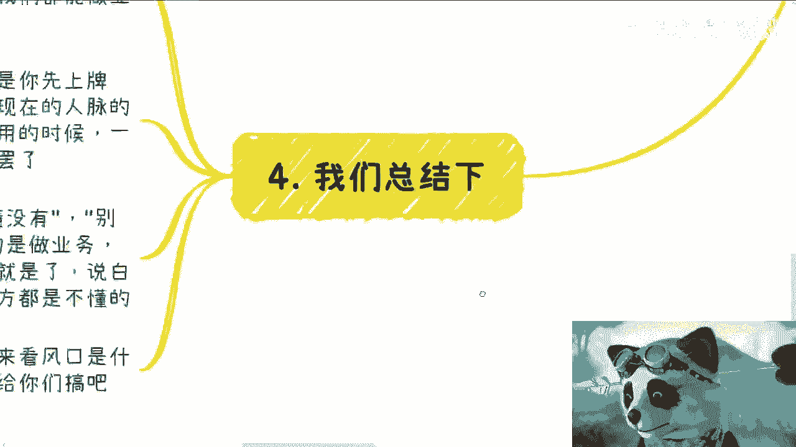
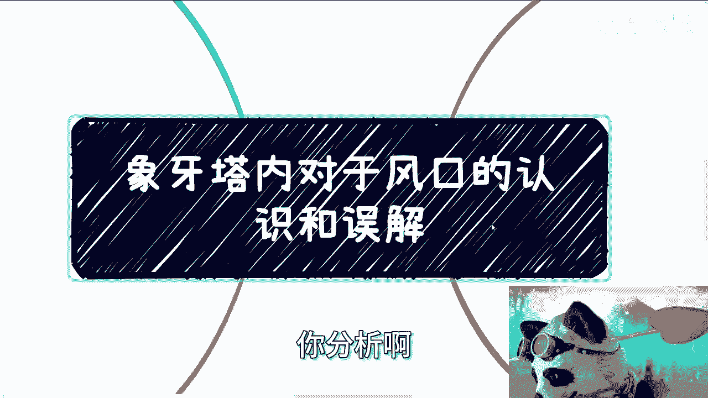
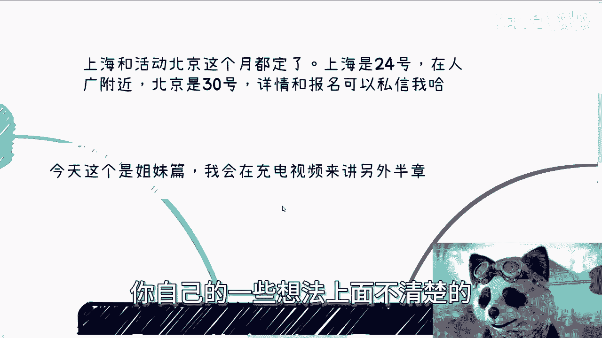

# 象牙塔内对于风口的认识和误解---P1---赏味不足---BV14K421x7G1

在本节课中，我们将探讨一个常见但常被误解的话题：如何正确认识“风口”。许多身处“象牙塔”（如校园或特定专业领域）内的人，对风口存在诸多固有认知偏差，这往往限制了他们的视野和机会。我们将逐一分析这些误解，并提供更清晰的思考框架。

---

## 活动通知 📅

以下是近期的线下活动信息：

*   **上海场**：24号，地点在人民广场。
*   **北京场**：30号，地点在微软。

活动详情与报名请通过私信咨询。

---

## 误解一：家庭与专业的束缚 🔗

上一节我们预告了课程主题，本节首先来看看阻碍我们认识风口的第一道枷锁：家庭影响与专业限制。

许多人在选择方向时，并非基于个人兴趣或市场判断，而是深受外界影响。以下是两种典型表现：

1.  **家庭意志主导**：约七八成咨询者表示，其选择源于父母或亲戚的建议。这类似于许多人最初选择专业或职业道路的方式——由他人代为决定。
2.  **专业身份固化**：许多人将本科专业视为终身标签，认为自己“只懂这个”或“只能做这个”。这种思维存在逻辑漏洞：首先，二十出头的年纪未必真正精通所学专业；其次，世界广阔，自我设限会阻碍更多可能。

**核心逻辑**：工作是为了获取固定收入与生存资本，公式可表示为：`工作 ≈ 稳定收入`。但这绝不等于将个人永久绑定在某个行业。在商业世界中，你应主动为自己做出选择。

---

## 误解二：风口与普通人无关 🚫

在分析了自我设限的问题后，我们来看看对风口本身最普遍的误解：认为它与普通人无关。

许多人将风口理解为一种周期、内部消息或小圈子游戏，并总结出“风口与普通人无关”的结论。然而，这个结论常源于“三无”状态：没做过、没抓过、没试过。

**核心概念**：风口意味着上升趋势和机会。能否抓住风口，关键在于行动与积累。逻辑如下：

*   如果 `风口 = 机会`，那么 `抓住机会 = 行动 + 前期积累`。
*   如果 `不行动 + 零积累 = 0`，那么自然 `机会相关性 ≈ 0`。

单纯作为打工人，按部就班地晋升，积累的更多是职级而非能用于捕捉风口的资本（如人脉、合作方、商业嗅觉）。因此，问题不在于风口本身，而在于个人是否为此做了准备。

---

## 误解三：守株待兔与思维僵化 🐇

明确了行动的重要性后，我们深入探讨行动中的两大思维误区。

最大的误解在于：守着自己的一亩三分地，等待风口降临。这需要分情况讨论：

1.  **慢钱风口**：这类风口周期长、门槛高、投入重，往往需要深厚的行业积累或特殊资源。它们确实可能与普通人关系不大。
2.  **快钱风口**：这才是大多数人有机会参与的。既然追求快钱，就不应被原有专业或领域束缚。逻辑应该是：`风口方向 → 行动方向`。

许多人思维僵化，误将“专注一个领域”与“多线探索机会”对立起来。实际上，这如同游戏中的主线任务与支线任务，可以并行不悖。你需要：

*   明确并深耕你的 **主线任务**（核心专业/事业）。
*   同时积极关注并尝试 **支线任务**（新兴风口/机会）。

此外，大部分风口信息在相关领域内是可见的。抓不住的原因通常是 **执行力不足** 或 **犹豫不决**，而非信息闭塞。如果完全看不到信息，则说明基础的社交与信息网络尚未建立。

---

## 如何正确抓住风口？ 🎯

前面我们剖析了各种误解，现在我们来总结一下，面对风口应有的正确姿态。

风口之所以称为风口，就在于参与方式的多样性。赚钱的途径很多：

1.  **直接参与**：从事与风口核心相关的业务。例如，在AI风口帮企业部署模型。
2.  **提供支持**：“卖水”或提供周边服务。例如，围绕风口做信息整合、社群运营、工具开发等。

**核心行动纲领**：
*   **先上牌桌**：参与是第一步。不要纠结于是否完全看懂或能否百分百成功。
*   **日常积累**：在平时就积累人脉、关系和潜在合作方。公式为：`抓住风口的能力 = 日常积累 × 行动速度`。
*   **摒弃完美主义**：在商业行动中，过度思考“为什么能成”可能导致错失良机。很多时候，风口中的买卖双方都未必是“完全懂行”的专家，但这并不妨碍交易发生。

**重要区分**：本节讨论的“抓风口”主要指 **商业行为与业务机会**，而非高风险的投资或All-in赌博。

---

## 总结与下期预告 📚

本节课我们一起学习了关于“风口”的常见误解与正确认知：

1.  打破了 **家庭与专业** 带来的自我设限。
2.  纠正了 **“风口与普通人无关”** 的被动心态，强调行动与积累的关键性。
3.  分析了 **守株待兔** 与 **思维僵化** 的问题，提倡主线与支线并行的多线程发展模式。
4.  总结了抓住风口的实用方法：**先参与、重积累、快执行**。

许多咨询者的问题根源在于，用固有的、受限的思维框架去分析充满变数的商业机会，这无异于自我设限。在接下来的充电视频中，我们将从 **“象牙塔外”** 的视角，进一步解析如何更透彻地理解和捕捉风口。敬请期待。

---

## 课后支持 💡

如果你在职业发展、商业选择、合作规划或任何相关方面存在困惑，建议系统性地整理好你的问题。许多根本性的决策错误源于起点的认知偏差，厘清问题是迈向正确方向的第一步。