# 貌似很多人觉得自己有选择似的 - P1 - 赏味不足 - BV1n142167pW

好大家好啊，咳咳咳，那个武汉活动定了啊，在本周日，本周日本来是定本周六的，本周六他妈上班啊，那调休，是啊，5月12号下午的01：30到六点左右好吧，详情报名你们可以私信我啊，然后今天讲的这个主题呢。

其实很多我在跟他们聊的时候呢。

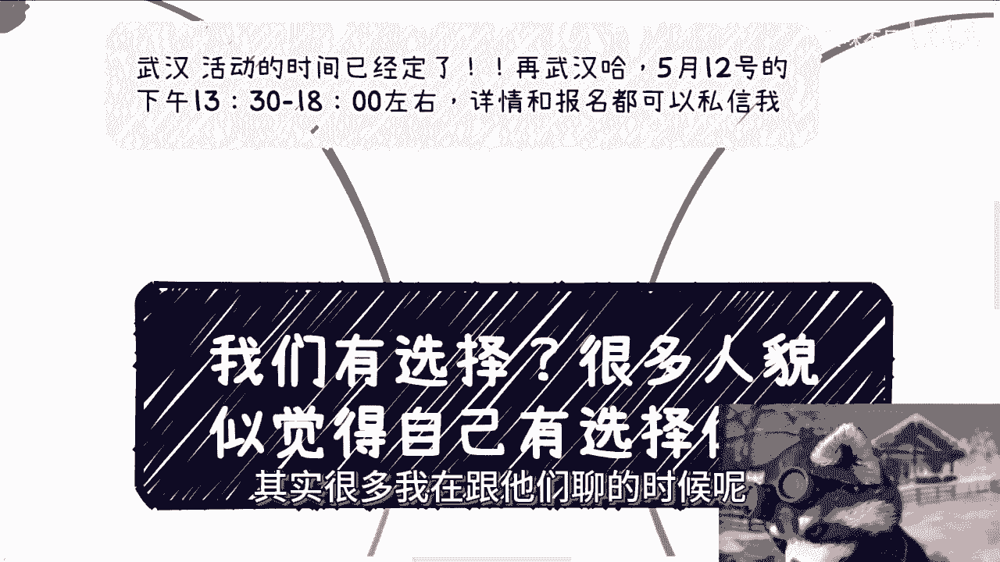

我也每次都跟他们讲过是什么呢，就是不要来跟我谈选择，你明白吗，就是你不要来跟我标榜，你是老百姓对吧，谁不是老百姓，对不对，你不要来跟我标榜你，你你家里怎么样，你有没有背景或者怎么样子，你有没有什么选择。

我跟你讲，你没什么好选的，你不要搞得好像你有选择一样的。

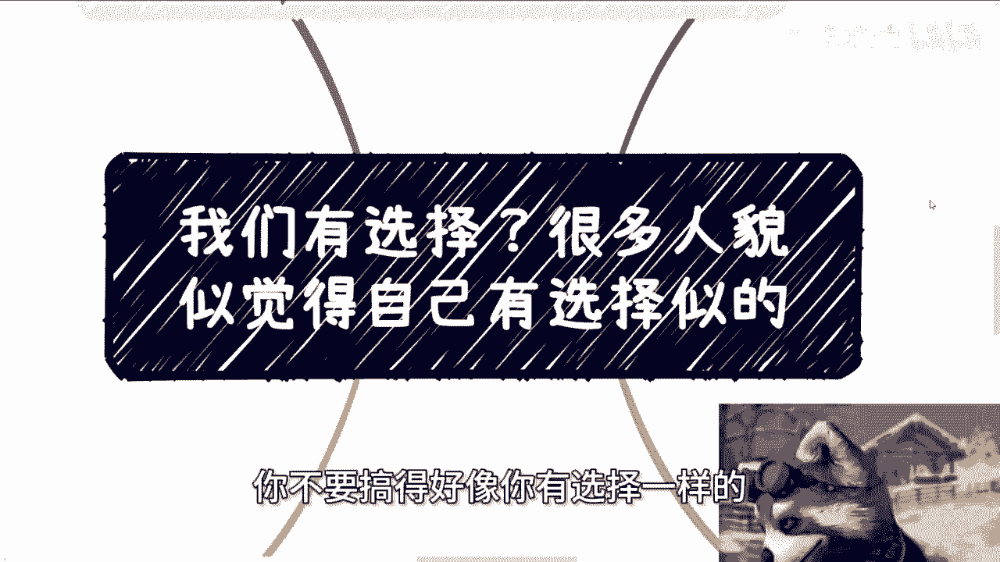

你你你有资格选吗，你想想看啊，是不是啊，我跟你讲真的很好玩啊。

就是其实不是一两个人这样问我，你要但凡很少人问我，我也不说了，你知道吗，他很多人都会跟我讲，他说爱创20，我父母是个普通人啊，我们也没有信息差，也没有资源，是不是呃不适合创业或者是不适合创业。

哎我跟你讲，好好。

就这个话说的真的是，这话看似啊就是个普通的问题啊，但暗藏玄机是吧。

暗藏玄机啊，什么意思呢，就是普通父母是普通人，然后呢，然后呢，虽然我知道他们可能没有怪父母的意思，但是他这句话的意思好像就是说，父母因为是普通人，所以呢我就是父母也没有留下什么东西啊，然后呢，就导致呢。

自己好像也输在所谓的起跑线上面了啊，导致现在好像没什么机会，那我就这么问吧，啊你你你这么想，你下一代也这么想，你父母也这么想，你父母的上一代也这么想好了，那怎么办呢，怎么弄呢，你告诉我是什么意思呢。

到底几个意思呢，是吧哦那也许他们会说啊，我们没有这个意思啊，那行啊，那我就这么说啊，所有的人都这么想，每一代都这么想，那你就躺平啊，对不对，你每一代都这么想，就躺平啊，你你又想改变又想躺平啊。

你你又想改变天上掉下来的躺平，然后你就各种找借口，你还想要啥呢，你妈你咋啥都，你咋不说你每个月给你100万呢，对不对啊，然后再说没有信息差，没有资源，我跟你讲，老百姓不都是没有信息差，没有资源的吗对吧。

那当然这里指的没有信息差，是指他他的意思是你要有信息差的那种资源啊，对吧，或者要有信息那种信息啊对吧，那么他意思就是说呃，就本质上就是说老百姓对于老百姓来讲，大部分都是信息差，对不对。

然后也是没有资源的，那按照这么个说法啊，所有老百姓只要上一代不从政不从商，而且你要从政从商，那也不叫老百姓来说，不叫普通的老百姓是吧，那么那按照这么个说法，只要上一代不从政不从商，然后呢就死路了对吧。

或者说上每一代都说上一代没有，那就死循环了，那这个话问的是什么意思呢对吧，然后最后再来说创业，真的我跟你们讲啊，大哥大姐啊，这个爷爷奶奶啊，你我就这么问你们，你们几个人啊，你们能有几个人对社会有了解。

能有几个人知道社会上怎么赚钱呢，看几个短视频，或者说啊就就现在好像搞得嗯啊GBT对吧，能能能那个什么啊，写网文啊对吧，然后能直播带货了，就知道怎么赚钱了，这他妈才多少事情啊。

啊这他妈才占商业的百分之多少啊，你整个社会规则，底层规则你什么都不了解对吧，什么运作模式你都不知道，一天到晚用创业两个字来概括，有什么意义呢，对不对，我就问你，你说创业，那你懂什么叫创业吗。

你知道什么叫创业吗。

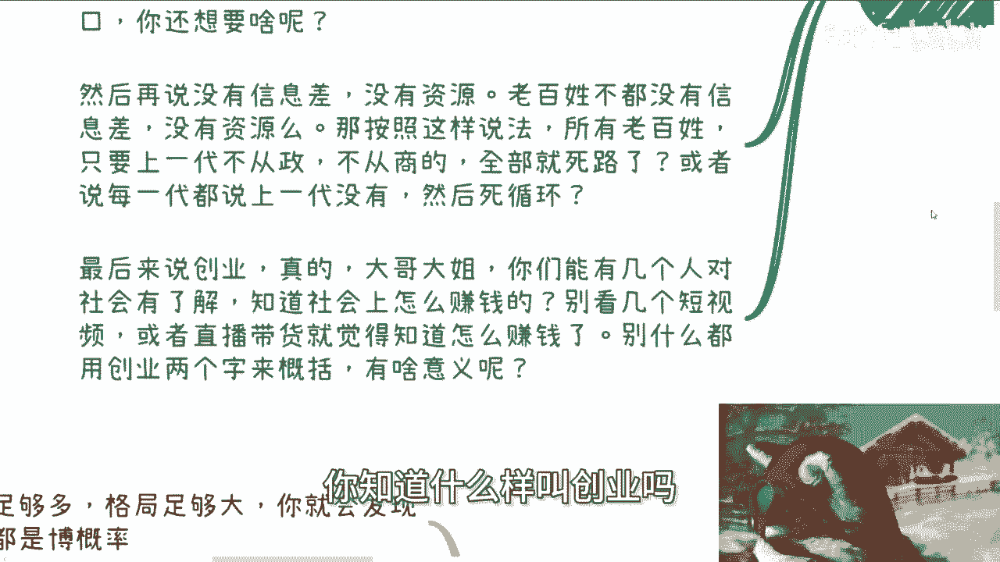

啊有em了没有的呀。

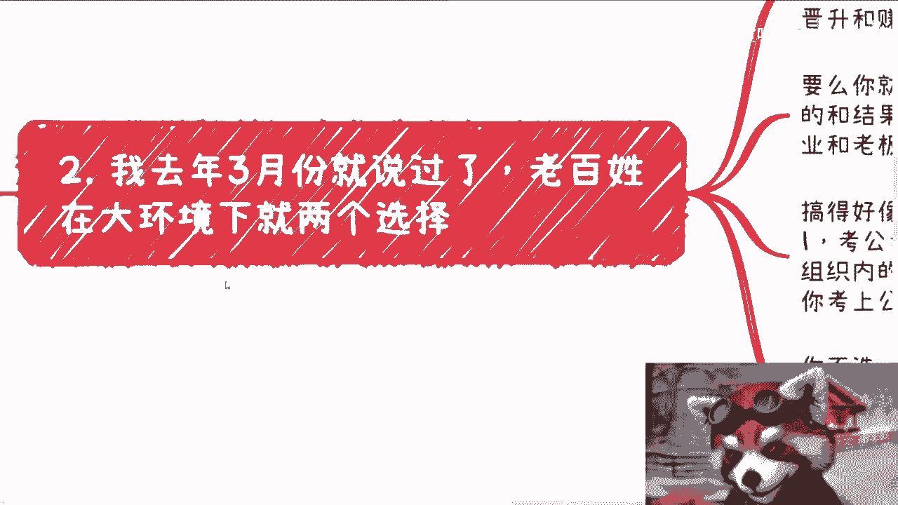

啊然后哎我跟你讲啊，这种就像他们问我什么时，陈老师，我现在选一个计算机专业怎么样。

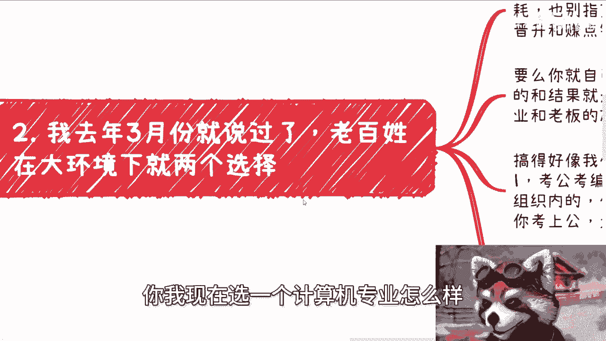

不是你选计算机专业怎么样，跟你有关系啊，啊这这种问题问出来就这种感觉，你知道吗啊，然后呃第二个就是我去年3月份就说过了，就老百姓在当下这种经济情况啊，就是全球的情况也好，中国的情况也好啊。

就当下这种大环境下面就两个选择，你看似这两个选择其实就没得选择，什么意思呢，你现在大环境你要么就躺平，什么都别想，别内耗啊，你也别指望什么晋升，所谓的赚钱温饱就可以了啊，未来温饱可能都都都困难对吧。

就像很多人说我想躺平的，躺不平了是吧，那我也一样的躺不平啊对吧，那你能晋升能赚点钱，但是你命好啊。

那么你要么呢你就自己去折腾，去社会上，随便你怎么折腾，我不管啊，随便你怎么折腾，目的和结果就是你自己能赚到钱，不要看老板脸色，不要看hr脸色，而不是说靠打工，靠企业，靠老板的施舍，结束了就是要选一啊。

你还有什么好选的，对不对，我不管你什么专业，什么学校，我也不管你到底做什么业务，反正就是二选一，我就这么问你，你现在手上有没有哪些东西赚钱，是你自己有掌控的，有吗，没有，你们说个屁对吧，你别来跟我说。

的在什么公司打什么工，你只要打工的都没有，你说个屁啊对吧，还有什么呢，你搞得好像就是大家有的选一样的，你想想看啊，你选择独木桥，你选择就是说打工，这跟独木桥考公考考编是一样的呀，你逼逼什么呢。

你考察你不是在一个组织内啊，你在一个组织里面不就是命在别人手上吗，有什么区别的，你不是搞笑吗，你不是在你，你你跟我说掌控权，你有什么掌控权，你考上公务费只有两条命，然后呢，然后呢又怎么样呢，奇了怪了。

你有主导权吗，你能赚到钱吗，不能你跟我说什么了对了，另外一方面，你要不选，那就是走一这根独木桥，然后呢年龄大了，你也是慢慢会被淘汰的，没有了呀，还有什么结果呢，没有结果了呀。

殊途同归啊，都一样的呀，对不了啊，然后然后然后来说创业啊。

我就这么跟你讲，现在这种环境以及往后啊长的我不敢说，2030年之前对吧，你但凡想改变生活，改变自己现状的，你只有突破原本的道路啊，你只有突破上一代，上上一代，整个循规蹈矩这条道路你才有可能改变呀。

你一天到晚抱着就说哎呀，我家里没关系，没有资源，巴拉巴拉巴拉，你改变个屁呀。

啊对吧，另外一方面，时代不同了，你别指望什么融资，什么IPO，妈的人家他妈的贾老板都没有考虑IPO，都没有考虑他妈的再继续融资或者怎么样的，考虑对吧，你特斯拉都已经裁员两轮了，你在想什么东西啊啊。

对吧你你你包括现在还有很多人很天真的说，我要做产品做服务，你妈在搞笑吗，你能做出什么产品，做出什么服务啊，大哥那我不明白了啊，觉得你自己是个人是吧，你你能做出个产品做服务，别人还还愿意为你花钱啊。

我跟你讲啊，你就算做出来，它并不代表就是你做不出来这些产品跟服务，或者说你不能融资，不能IPO，并不代表你不能赚钱啊，你社会层面赚钱的方式多了去了对吧。

怎么了呢，哦照这么个说法，只有融资跟打工才能赚钱对吧。

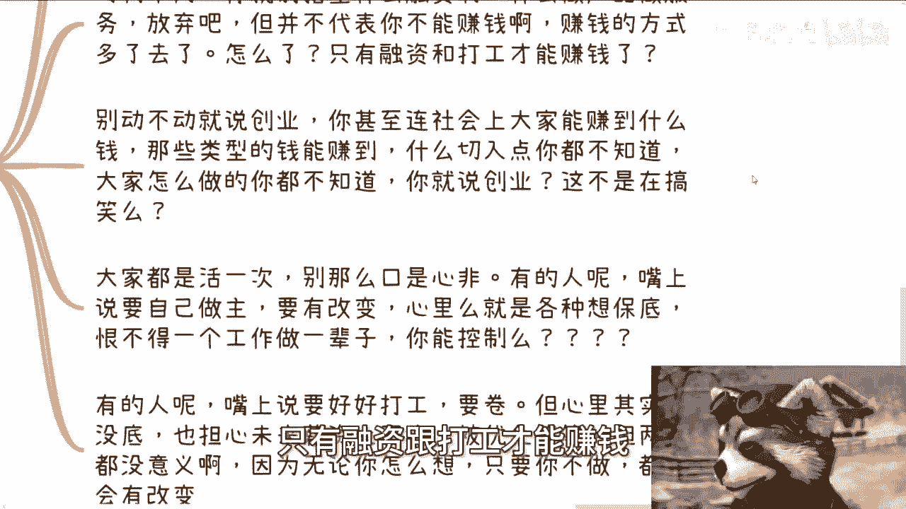

而且另外一方面别动不动就跟我说创业，你甚至连社会上大家能赚到什么钱，哪些类型的钱能赚到，有哪些76年可以赚到，你都不知道大家怎么做的，你都不知道你妈说什么创业，你不在搞笑吗啊，听到听到几个词。

哎好像觉得自己了不起来啊，我就这么跟你讲啊，大家都是活一次的，你要标包标榜老百姓，你自己往前去看，看，到现在为止，所有在社会上赚钱的，我不管他公司成功也好，公司不成功也好，只要到今天赚到钱呢。

哪些人往前数10年，20年不是老百姓这么搞笑嘞，你别说往前数20年，要是你往前再数哪些人不是老百姓啊，你标榜你老百姓，你了不起啊，真的我跟你讲，有时候那句话怎么说，就是我跟你们一直说的。

可怜之人必有可恨之处，你标榜自己干嘛呢，有什么好处呢，对吧，你不要往自己无非就是找个借口，哎我不行，那你不行就不行吧，你你妈说个说个屁啊对吧，我跟你讲啊，有的人嘴上说要自己做，主要改变。

心里就是各种想保底，恨不得找一个工作做一辈子，那你想什么东西，说什么东西啊，口嗨谁不会啊对吧，那还有的人呢嘴上说要好好工作，要卷的，但心里其实没底，也担心未来，比如说薪资上不去或者被优化，我跟你讲。

无论前者还是后者都一样，有什么意义呢，没有意义的，你除了那个号没有任何意义，你除了我给你们这么说，这两类人其实才是真正散播焦虑的人对吧，你除了散播无用的焦虑有什么用呢，倒是去做啊，啊你你去做了。

粉身碎骨也比在那边想来来着强啊。

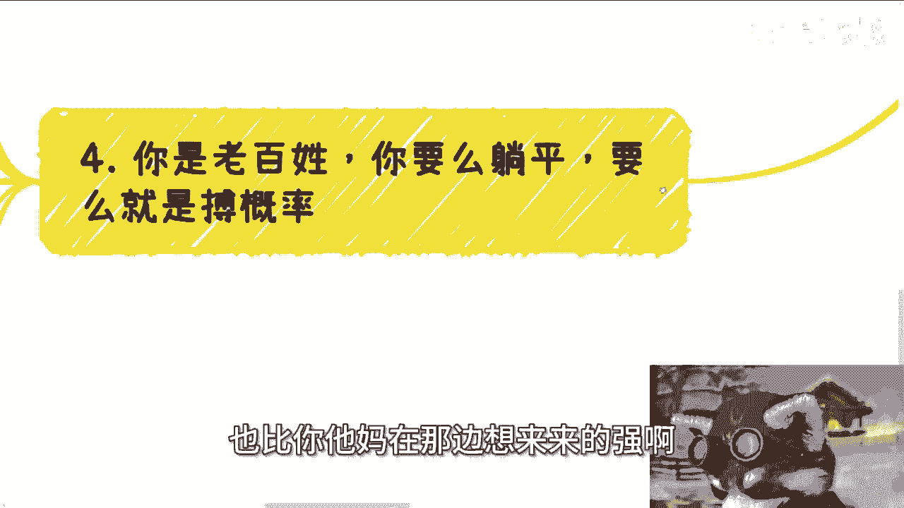

一天到晚标榜老百姓，你妈搞笑的，谁不是老百姓啊对吧。

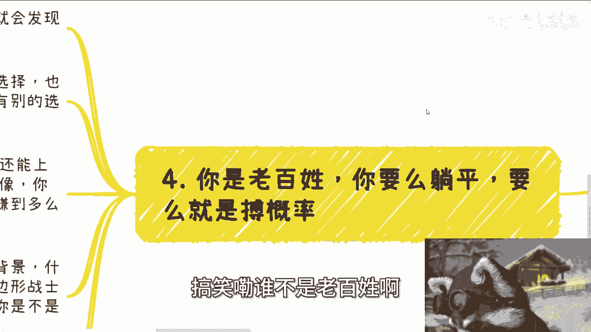

我跟你讲啊，你无论我们说的两个选择，你选其前者和后者，你都是博概率，你仔细想是不是都是博概率对吧，怎么滴了，工作里面也有佼佼者，也有做得好的，没错对吧，那商业里面也有赚到钱的也没错，但多大比例呢。

你就别去想什么选不选择了，也不要以偏概全，说什么老百姓只能工作，没有别的选择，别的有啊，你们不知道不代表没有啊，这就好像你能去上一个不错的班，而且我相信有的人可能还能上一辈子。

就哪怕现在往后都能上一辈子对啊，但是能有多大比例呢，这就好像你在社会上也能赚到钱，但是请问能赚到钱的，能赚到稳定的钱的，能赚到比较高性价比的投入，产出比钱的能有多少比例呢，这才是最大的问题啊。

你拿出一个案例说哎我身边这个人对吧，而且最搞笑的是什么，就是他们拿出来的案例，连35岁都还没到，就开始跟我说，哎陈老师，你看他们就能找到工作，是的呀，你们等到35岁，你们看看找呗。

我看你们找你到时候找吧，我跟你们讲，等到你们35岁，哼哼更更他妈的蛋疼，我跟你说啊，然后呢我跟你讲，还有呢也是一样的，别来说你性格好不好，口才好不好，背景好不好，资源好不好，我跟你讲，大家都一样的呀。

啊你作为大家做一个老百姓，谁生下来六边形战士的，有文案没有的呀，那说白了你为什么要去博概率，博概率就是为了要去改变，就是为了你不想虚过这一虚度这一辈子，对不对，你能不能挖掘放大你擅长的点。

这些都是博概率的，都是要看过程当中天时地利人和的，怎么了呢啊，难道说你今天选择一条路就一定成功了，哪来这种路啊对吧，但是你有没有发现核心的点在哪里啊，核心的点不是在于我们有没有选择。

而是在于我们没有选择的情况下，你并且还要去博，就是我说的你得去做，你不去做，你每天在网络上打嘴炮，你不去做又不去，是有屁用啊。

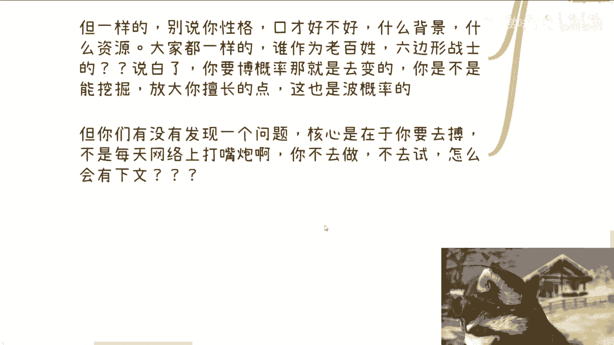

哎我真的我跟你们讲就奇了怪了，这些人啊，每天在小红书上对吧，B站，然后微博评论区在那问问，哎我行不行啊对吧，我这种你看我这种背景人行不行，怎么滴来着，人家说行，怎么了不行怎么了，哎我奇了怪了。

这是你是你活着，他们为你活着对吧。

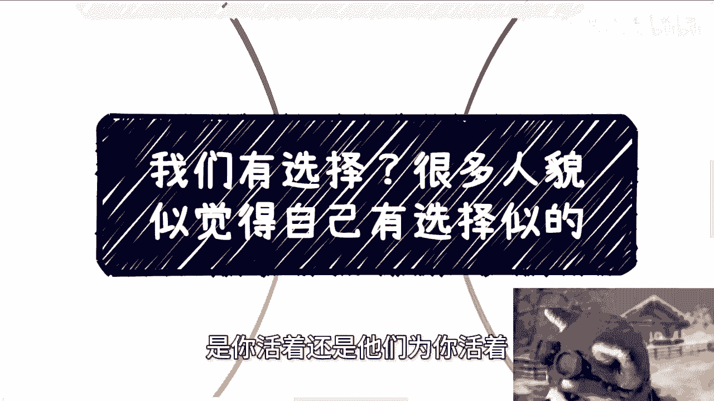

我跟你们讲之前那句话说的很对，哎之前是谁说来着的对吧，他说你父母都对你那个保证不了，或者说都负责不了，你指望什么网络上人给你负责，这不是在搞笑吗。

对吧，你所有的东西你都是去试了，去做了，去踩坑了，你才有了解的，你指望你，我发现现在很多人指望什么指望爱陈老师，有没有什么地方总结一下的，有没有什么什么什么视频可以看一下的，我就这么说。

老百姓是什么定位，老百姓定位就是工人，你明白吗，就是电池就是消耗品诶，你跟我谈说，哎我们作为一个消耗品，我们能不能在什么地方看到一个啊，这个能够帮助我们突破我们瓶颈的，怎么地啊，想造反是吧。

真的就唉好笑真的好笑啊。

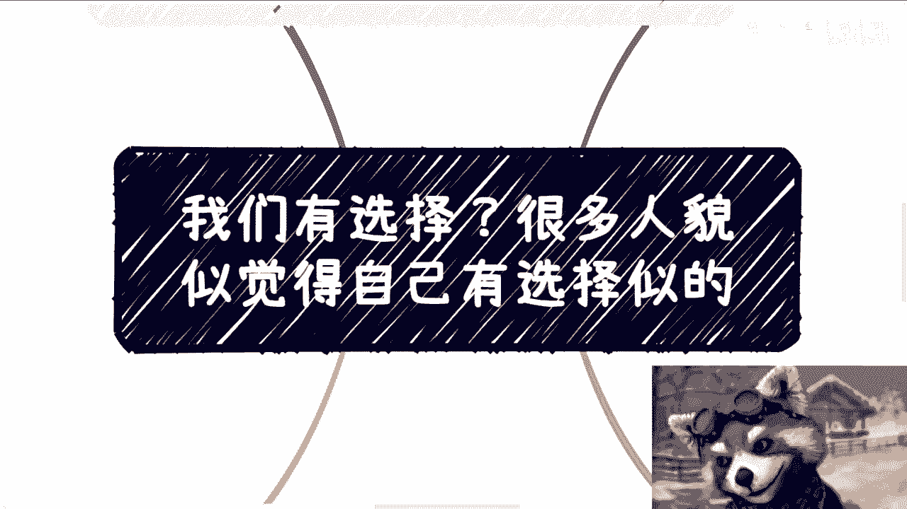

嗯好吧，然后武汉活动已经定了啊，已经定了，然后大家报名的还继续来报名，然后剩下的话就直接规划商业规划啊，嗯融资股权啊，或者商业计划书啊，或者说什么分红啊，啊包括你们觉得你们手上有什么牌啊。

或者说你们手上没有牌啊，那希望通过我的一些观点啊，或者我们通过我们相互的聊啊，能够摸索出来一些方向啊，或者摸索出来一些规划，摸索出来一些这个未来的道路好吧，那么这样的话。

你们可以总结好你们的背景跟问题啊，然后再来找我咨询好吧。

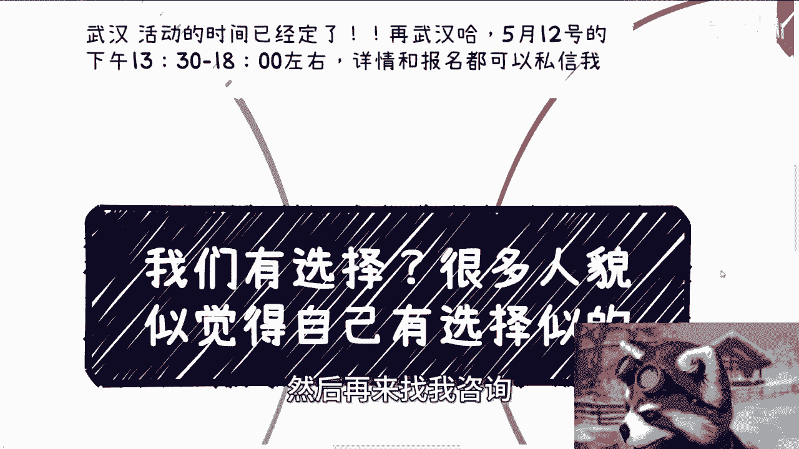