# 贷款买房好呢-还是先投入工作或者商业中去呢-本质上并不是只有2选1---P1---赏味不足---BV

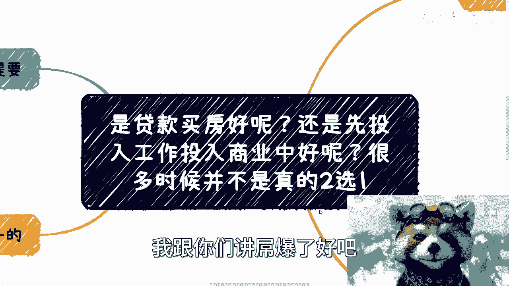

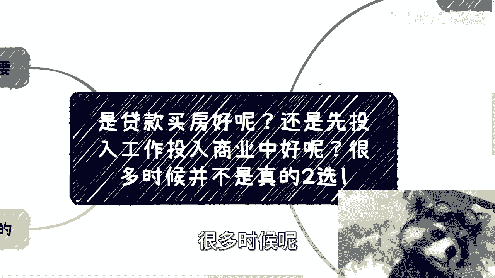

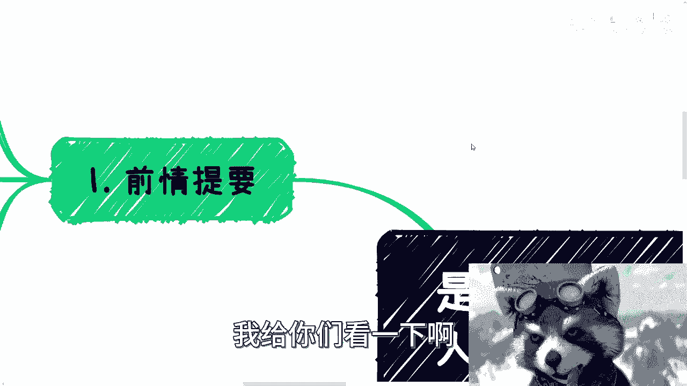

在本节课中，我们将探讨一个常见的困惑：是应该贷款买房，还是将资金优先投入工作或商业发展？我们将分析这个问题的本质，并指出它通常并非一个简单的二元选择。

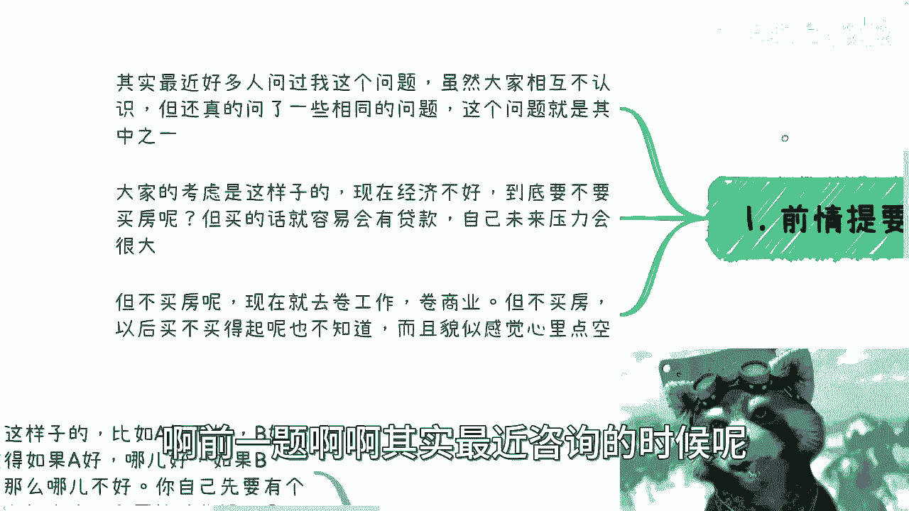

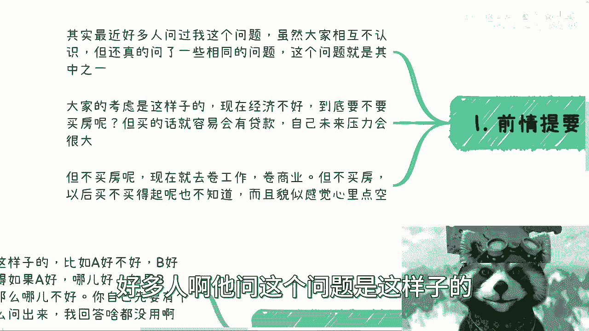

---

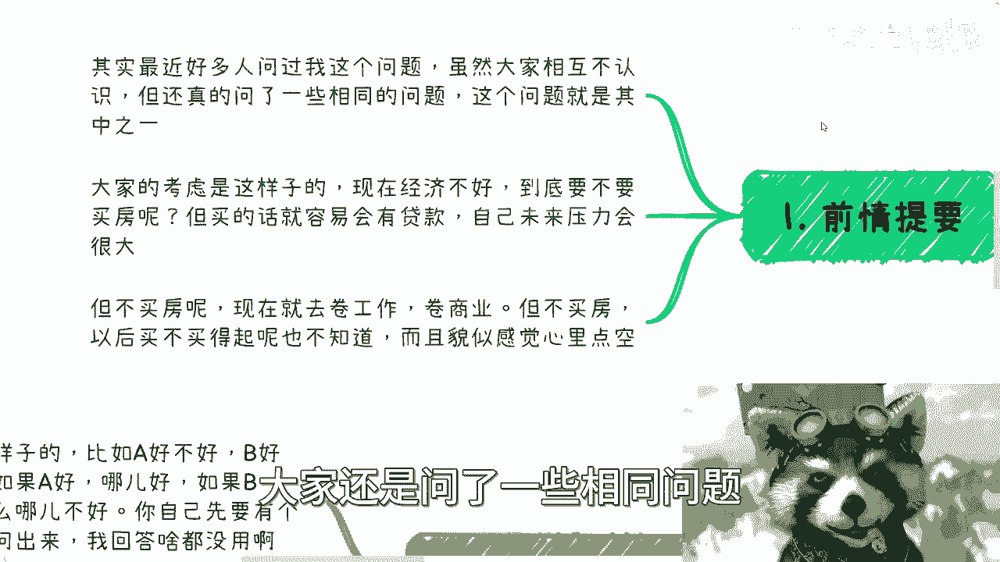

## 概述

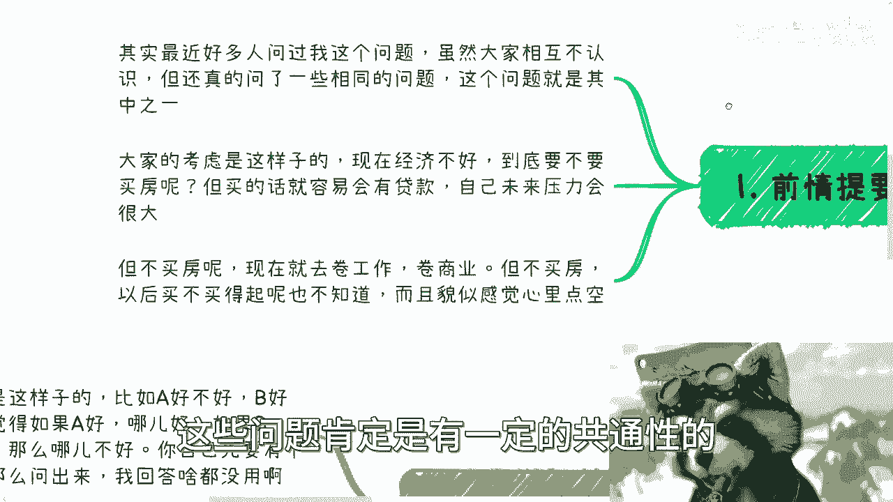

很多人面临一个看似两难的抉择：在经济形势不明朗的当下，是应该背上贷款购买房产，还是应该将资金和精力投入到提升工作能力或商业机会中？本节课程将揭示，这个问题的核心往往不在于选择A或B，而在于审视自身的真实需求、目标和格局。

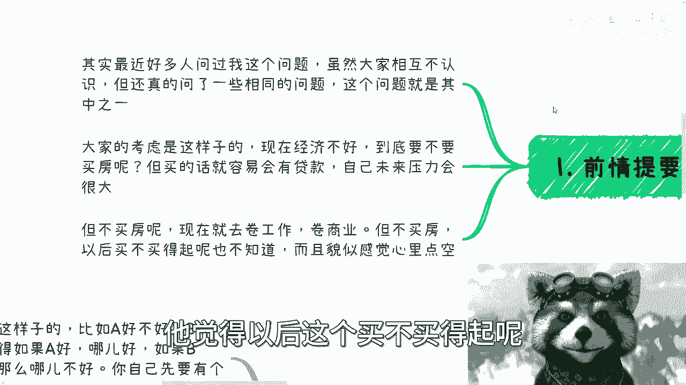

---

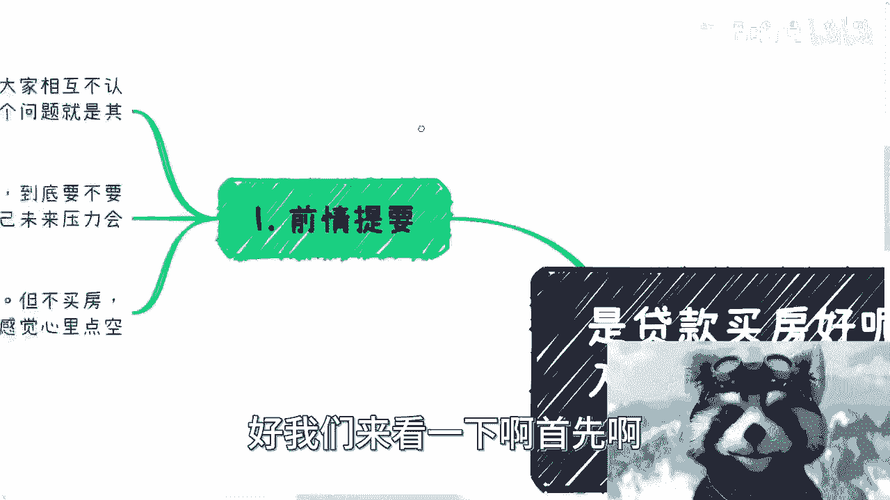

## 问题的普遍性

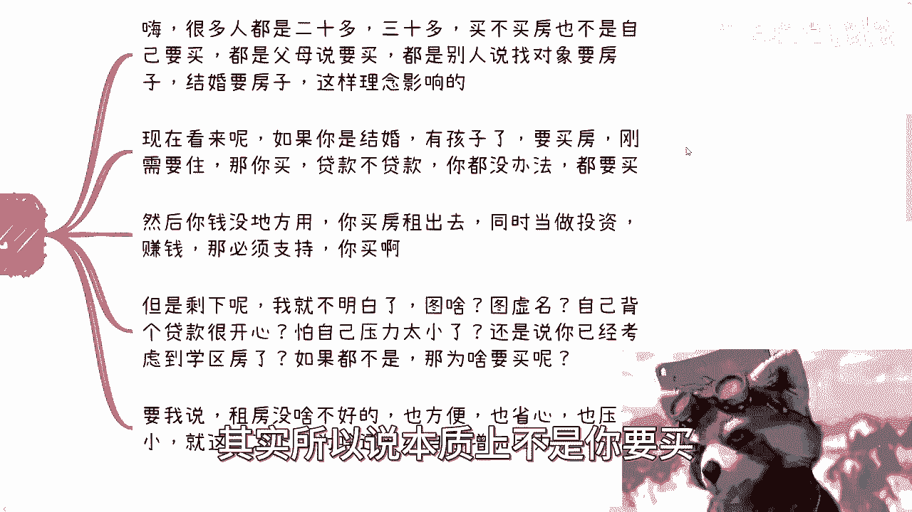

在最近的咨询中，我发现许多人都在询问相似的问题。既然问题具有共通性，说明这背后反映了一种普遍存在的焦虑和迷茫。


以下是咨询者常见的纠结心态：
*   他们担心现在经济不好，犹豫是否要买房。
*   如果买房，又害怕背负长期贷款，未来压力巨大。
*   如果不买房，转而全力投入工作和商业竞争，又觉得可能错失机会，担心未来更买不起房。
*   这种摇摆不定导致内心缺乏底气，感到空虚。

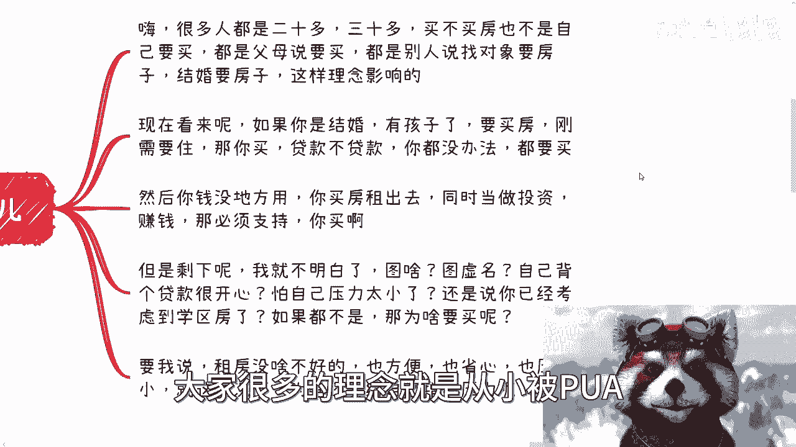

---

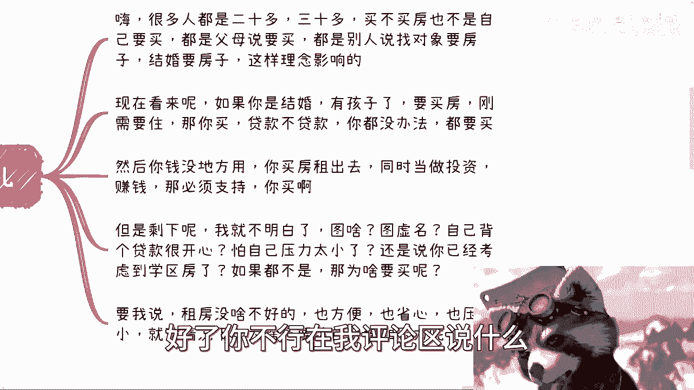

## 深入分析“买房”决策


上一节我们看到了问题的普遍表现，本节我们来深入分析“买房”这个选项。很多人，尤其是二三十岁的年轻人，对于是否买房、如何买房其实并不清楚。

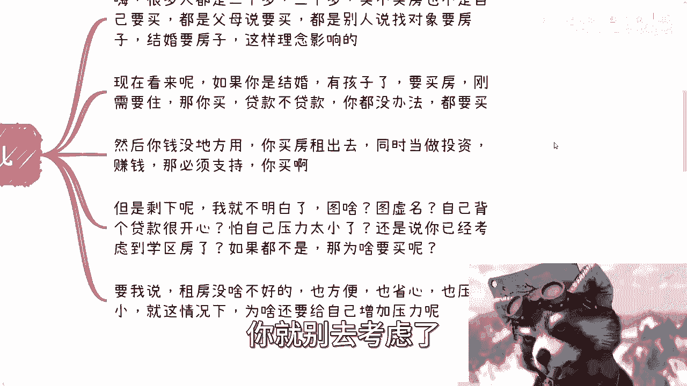

关于买房，我认为需要分情况讨论：


**以下是几种合理的购房动机：**
1.  **家庭刚需**：如果你计划结婚生子，需要更大的空间或考虑学区房，那么买房是满足家庭需求的必要步骤。在这种情况下，贷款与否是次要考虑，因为需求本身是刚性的。
2.  **明确的投资**：如果你有闲置资金，计划通过购房出租、未来置换来获取收益，并且对此有清晰的规划和计算，那么支持购房。

**然而，对于不属于以上情况的人，购房动机往往值得商榷：**
*   动机可能是来自父母、社会观念（如“结婚必须买房”）的压力，而非自身真实需求。
*   可能是为了追求一个“有房”的虚名。
*   可能没有认真考虑过背负长期贷款的实际压力和生活影响。

如果购房动机不清晰，仅仅因为“别人都买”或“感觉应该买”而行动，这个决策本身就缺乏逻辑。相比之下，租房可以提供便利、省心和小得多的压力，在当前经济环境下，不失为一种理性的选择。

一个矛盾的现象是：许多人在担忧未来失业、收入不稳定时，却在做买房决策时自动假设自己未来收入持续走高，足以承担30年贷款。这种思维上的不一致值得警惕。


---

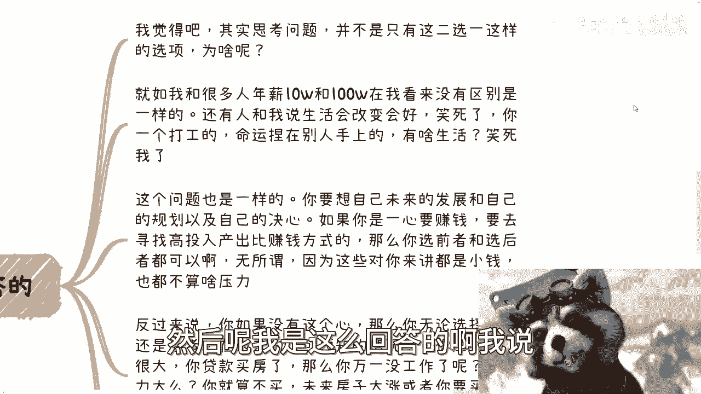

## 格局决定选择，而非选择决定命运

我们分析了盲目买房的潜在问题。那么，是否选择另一条路——投入事业——就万事大吉了呢？并非如此。本节我们将跳出“二选一”的框架，从更高维度思考。

我的核心观点是：**这个问题的答案不取决于你选A还是选B，而取决于你自身的格局、规划和决心。**

我们可以用一个简单的逻辑来推演：

*   **如果你有强烈的进取心和明确的赚钱目标**，决心要突破现状、寻找高回报的机会。那么，无论是买房的首付还是创业的启动资金，对你而言都可能是“小钱”。你不会过度纠结于这个选择，因为你的焦点在创造更大的价值上。公式可以简化为：
    `决策压力 ∝ 1 / 未来收入预期`
    即，对未来创造价值的信心越大，当前决策的压力就越小。

*   **反之，如果你缺乏这种决心和规划**，那么无论选哪条路，在未来都可能面临巨大压力。
    *   选择**贷款买房**：万一失业，还贷压力巨大。
    *   选择**投入事业**：如果未来房价上涨或你需要买房时资金不足，同样要面临贷款压力，且那时年龄增长，可能负担更重。

所以，关键在于提升自己的格局和能力。当你专注于如何提升自身价值、创造更多财富时，眼前的“二选一”困境就会显得不再那么尖锐。未来充满不确定性，但正因为如此，我们才更应该追求成长，而不是在两条看似都不完美的路上反复纠结。

---

## 方法论：如何面对人生中的“选择题”

上一节我们谈到，提升格局能化解选择焦虑。本节我们提供一个具体的方法论，来处理生活中类似的两难问题。

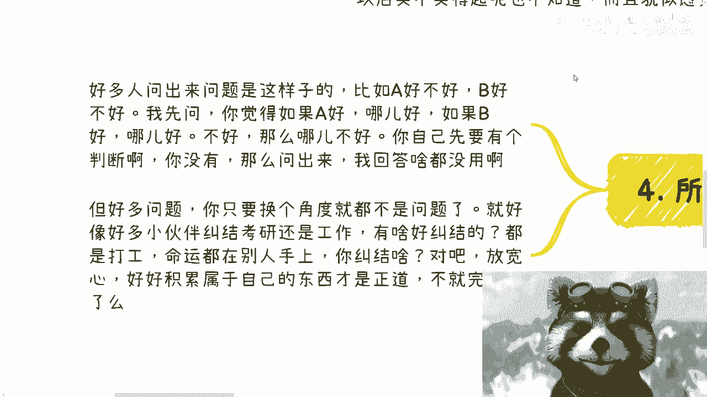

很多人提问的方式是：“A好还是B好？” 而我通常会先反问：“你自己觉得呢？A好在哪里？B不好在哪里？” 如果提问者自己都毫无判断，说明他并未真正了解过选项，只是希望外界给他一个答案。


**以下是面对选择时的思考步骤：**
1.  **自我调研**：对每个选项进行基础了解，形成自己的初步判断。不要未经思考就直接寻求答案。
2.  **转换视角**：很多问题，当你跳出非此即彼的框架，从更高维度（如长期成长、能力提升）去看时，它可能就不再是问题。例如，纠结“考研还是工作”，对于决心摆脱打工命运、构建自己事业的人来说，这个纠结本身意义不大。
3.  **聚焦核心**：将时间和精力从“纠结选择”转移到“积累自身价值”上。这才是解决问题的根本之道。代码可以象征性地表示为：
    ```python
    # 低效模式
    while 纠结于(选项A, 选项B):
        时间流逝()
        焦虑增加()

    # 高效模式
    def 做出选择(选项, 自身条件):
        return 基于分析的决定

    选择 = 做出选择([A, B], 自身能力)
    执行(选择)
    同时持续进行(自我提升) # 核心动作
    ```

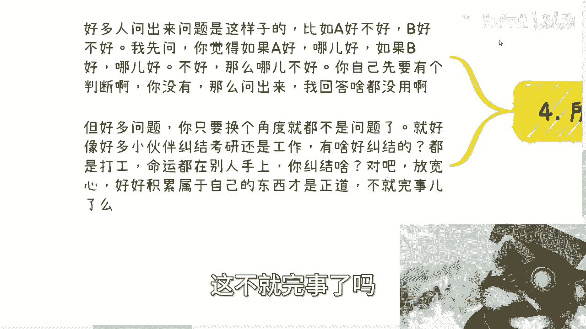

生活中许多小事（如朋友间谁请客）的纠结，也反映了类似的格局问题。总是计较付出、抱怨外界，不如反思如何提升自己创造价值的能力。市场好坏是外因，能否赚到钱最终取决于内因——你自己的能力。

---

## 总结

本节课我们一起学习了如何分析“贷款买房还是投入事业”这一经典难题。

我们首先认识到这个问题具有普遍性，源于人们对未来的焦虑。接着，我们拆解了“买房”决策，指出其应有清晰的动机（刚需或投资），而非盲从压力。然后，我们突破了“二选一”的思维局限，指出真正的关键不在于选择哪条路，而在于**提升自身格局和创造价值的能力**。一个有决心、有目标的人，不会过度纠结于初始路径。最后，我们给出了面对人生选择题的方法论：先自我了解，再转换视角，最终将焦点锁定在**持续的自我成长**上。

记住，很多问题的答案，不在A或B之中，而在你构建选项C的能力里。