# 贷款买房好呢？还是先投入工作或者商业中去呢？本质上并不是只有2选1 - P1 - 赏味不足 - BV1994y157Wp

好大家好，是不是很赛博朋克，卧槽这个bug真的哈哈笑死我了，真的我跟你们讲爆了好吗。

呃我们这一期的内容呢叫做是贷款买房好呢，还是说先投入工作，投入商业中好啊，我在这个地方先给大家一个结论啊，很多时候并不是真的只有二选一啊。

前情提要啊，我给你们看一下。

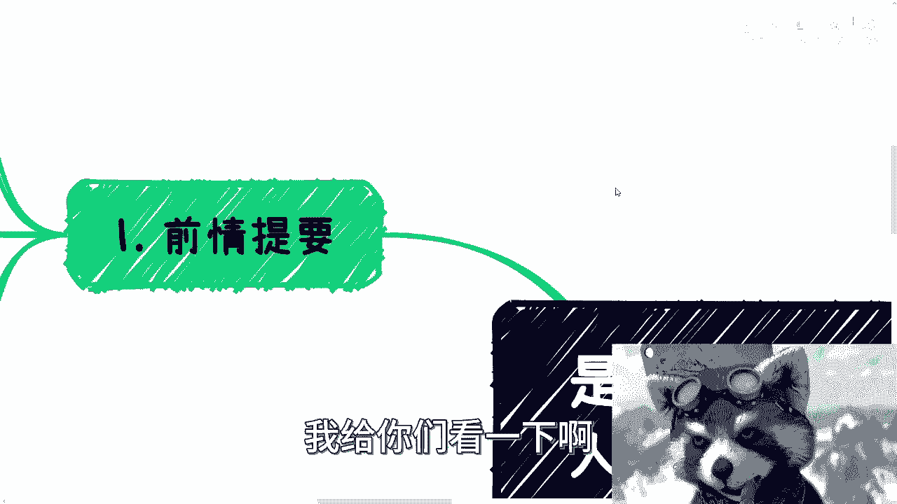

啊啊前提啊啊其实最近咨询的时候呢。

好多人啊，他问这个问题是这样子的。

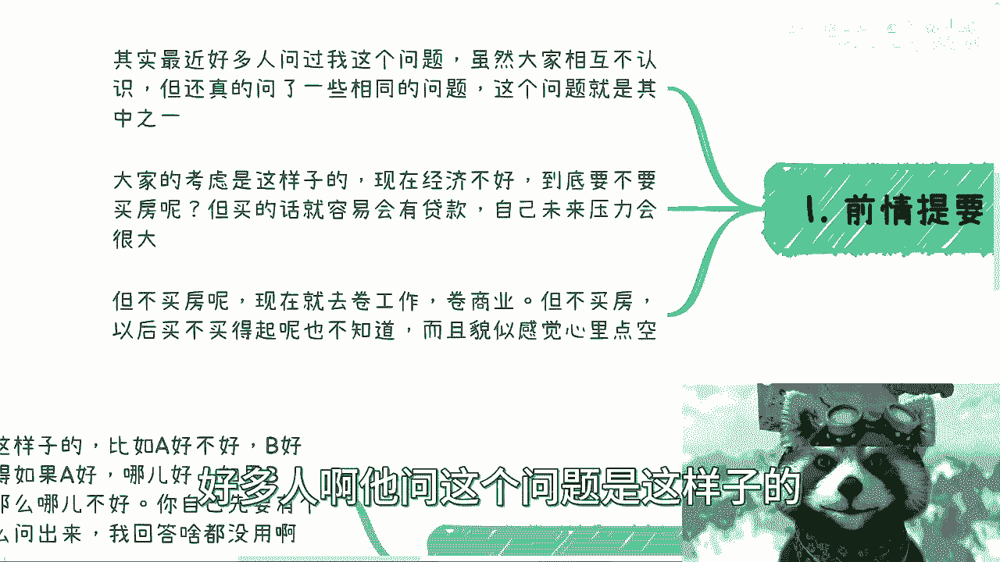

他说嗯虽然大家互不认识啊，但是我觉得大家还是问了一些相同问题。

那么既然大家问了相同问题，也就意味着这些问题肯定是有一定的共通性的。

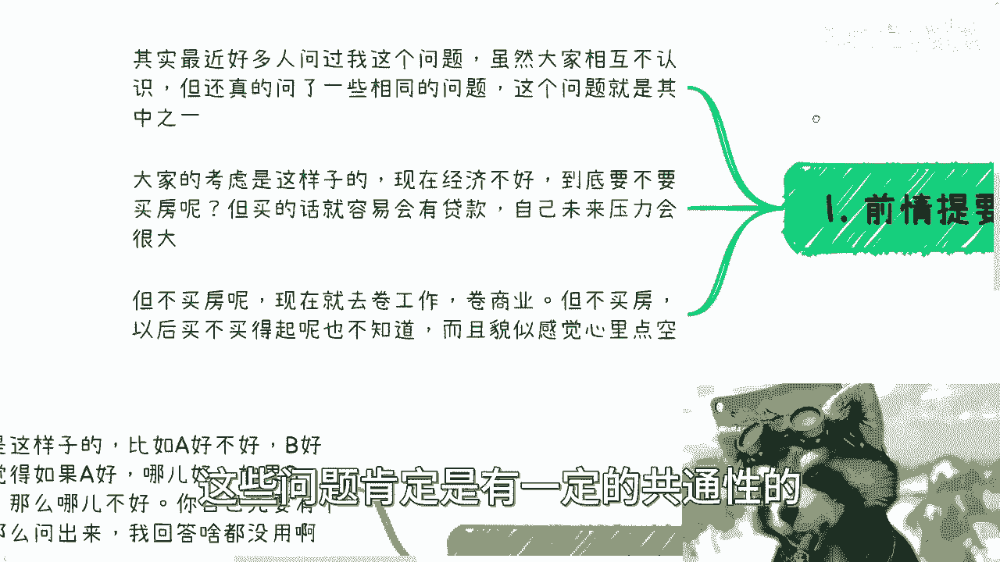

所以我把它们拿出来啊，那么大家呢关于这个问题考虑是这样子的，他说现在经济不好啊，到底要不要买房呃，但是呢他买呢就要说啊，买呢又很容易有贷款啊，自己未来压力会很大啊，那么近现在有点纠结对吧。

就是摇摆不定啊，但是不买房呢，现在去卷工作卷商业呢，他就会觉得亏啊，他又会觉得现在经济不好对吧，那买房可能是这个下跌的啊，但是呢同样的他现在不买呢，他又又又觉得啊，他觉得以后这个买不买得起也不知道啊。

而且呢他心里没有个没有个底啊，有点空虚啊，好我们来看一下啊。

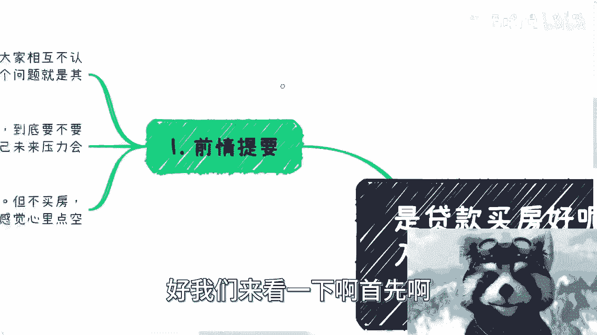

首先啊我先来跟你们说一下买房这个事啊，呃其实呢很多人都是20多30多岁啊，买不买房呢，我觉得说我这么说呃，我不敢打保票，但是99%的人啊，在我看来就是你们买不买房，你们自己都不知道对吧。

怎么买呢啊买的过程当中怎么跟中介沟通呢，对吧，怎么买划算呢对吧，买什么地方呢对吧，买怎么样的，朝南朝北，朝东朝西呢对吧，你什么都不知道，就他妈要买对吧，其实所以说本质上不是你要买。

是你父母说要买，或者别人说找对象要买对吧。

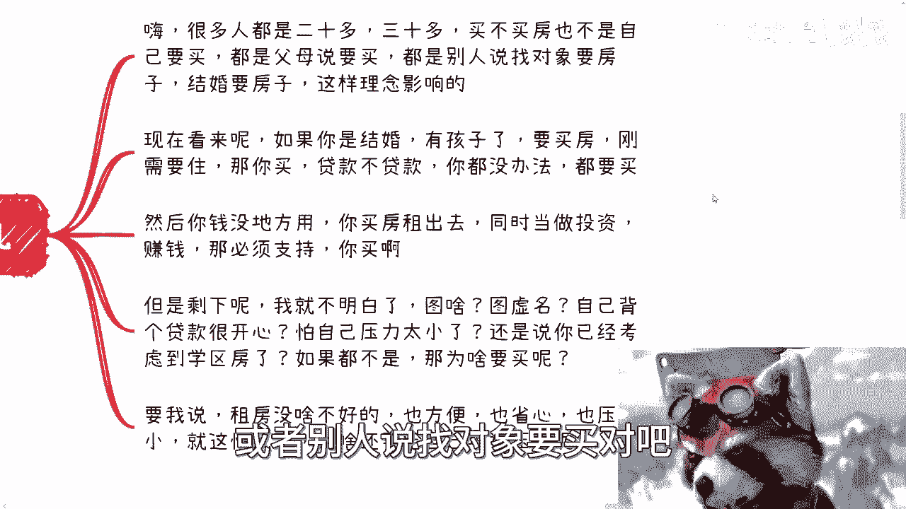

结婚要买无非就是从小被PUA的，我早就说过了，大家很多人的理念就是从小被PUA。

还他妈的不信啊，真的我跟你们讲啊，这就像这就像很搞笑的，这就像最近又要来，又要很多人跟我说来普通人，那怎么来定义普通人，那他妈搞笑了，那我也是普通人啊，是不是啊，你你老是PUA自己是普通人。

然后就在那边说哎呀我们普通人不行，那你去不行好了，你不行，在我评论区说什么。

说了你不行，那是你的事情，对不对啊，现在看来呢就是如果你结婚啊，有孩子呢，在我看来啊，在我看来啊，就如果你要结婚，有孩子了，要买房对吧，你说孩子还小对吧。

然后以后孩子长大了对吧，需要这个大一点的空间对吧，要刚需要要学区房。

那你买对吧，那这种刚需你贷款不贷款无所谓，你就别去考虑了。

因为你没办法，你都要买，你买呗，对不对啊，然后呢还有一种呢，就是我觉得你钱没地方用对吧，你说我买房租出去啊，同时呢当做投资对吧，然后比如说一边租一边，比如说未来去置换对吧，去这个叫什么赚钱。

那必须支持啊，你买啊对吧，但是剩下的我跟你讲。

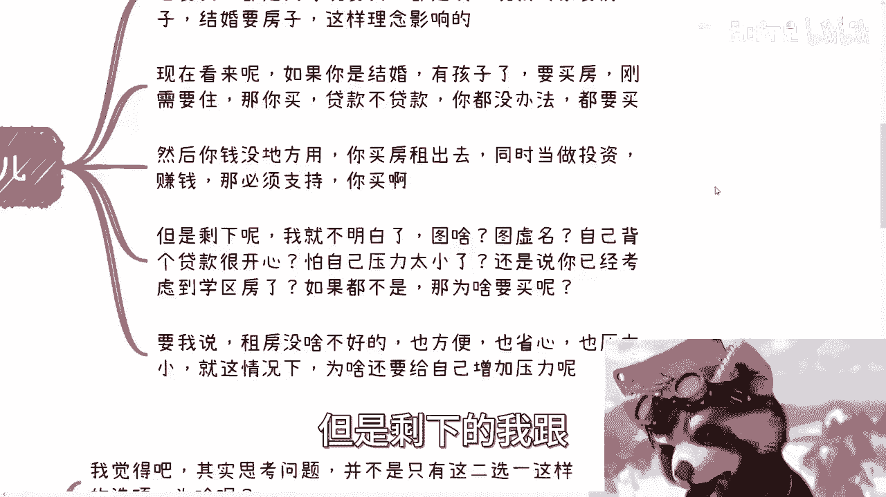

我就不明白了啊，剩下的就是说你说你图啥呢，图个虚名，你说钱钱太多是吧，用用用个几百万去图虚名啊，还是说你是觉得自己压力太小对吧，非要背个贷款开心，我其实不明白，就很多人其实真的就是我是为你们考虑。

你知道吗，就你们可能不知道背个贷款是什么样子的，以后有的苦了啊，还是说你已经考虑到，比如说这个就是学区房对吧，就如果我觉得如果你不是刚刚我上面说的这些，你去买它干嘛呢对吧。

你是图一个户口还是图一个什么东西，就是就是你很多人的选择，他连自己涂什么都没想好，他就要买，你买啥，你告诉我，我真不明白，真的就是明明大家都是一个就是高材生对吧，都是大学生对吧，做事情毫无逻辑性。

非要拍脑袋，那你要拍我劝还劝不住啊，好要我说呢，租房呢其实没啥不好的，为什么，因为也方便也省心，压力也小对吧，而且就现在这种经济情况，你为啥要给自己增加压力呢，为啥呢对吧，你就我跟你讲。

很多时候就很搞笑，就是我跟他们讲事情啊，他们就说哎呀我未来不确定的，我压我压力很大的未来，我未来万一我未来失业怎么办对吧，然后当他们跟我说买房的时候，他就没这个顾虑了，就就感觉我未来我牛逼。

我牛逼大发了，我他妈现在就必须买啊，哪怕贷30年我也得买。

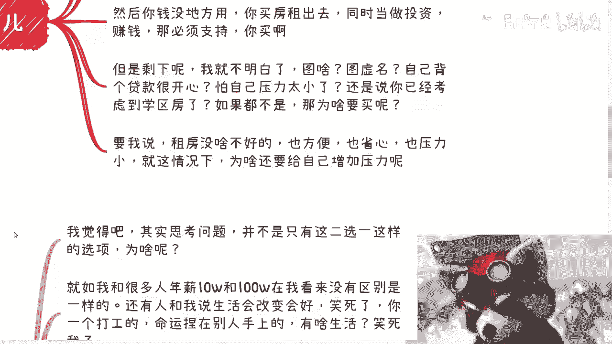

唉我就不明白啊，然后呢我是这么回答的啊，我说。

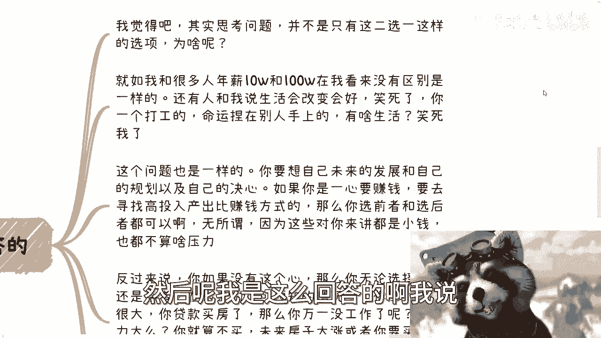

啊我说我觉得吧其实思考这个问题啊，并不是说只有二选一，怎么选项，为啥啊，你就如我跟很多人说的，我说年薪10万跟100万在我看来没有什么区别，对吧啊好，那么这两天呢还有人在评论区跟我说什么，他说哎呀。

100万和你比10万生活要改善的更好啊对吧，生活品质更好啊，妈也笑死了，你同样都是个打工的，命运捏在别人手上，你100万还不算稳定，能赚多少年对吧，你又说不定今天做了，明天明天他妈的公司就跟你说。

你给我滚蛋，就是你根本就没有任何自己的东西，你跟我谈生活品质啊，你跟我谈生活变好，你有生活吗，是个人吗，我笑死了，我真的是啊对吧，这个问题也是一样的，你要想自己未来的发展，跟自己的规划以及自己的决心。

你知道吗，就是说如果你一心告诉我，你现在就是要赚钱的啊，你就是要突破现在的这个社会的，这种这种莫名其妙的PUA，或者突破这种打工人的现状，你就要去寻找，通过各种机会寻找高投入产出比的赚钱的方式。

那么你想想看，你选择前者和后者都可以啊，你随便怎么选好了，因为什么，因为无所谓，因为这些钱对你来说都是小钱，你明白吗，这算毛压力啊，对不对，没有什么好纠结的对吧，那同样的反过来说，如果你连这个心都没有。

那么你无论选择前者还是后者，在未来这种不可预知的情况下，你压力都会很大，比如说你贷款买房了，那么我就问你，万一你未来没工作呢，你压力大吗对吧，那么回过头来你就算不买，你选择后者，你说啊我就不买对吧。

我去卷商业跟卷这个工作了，好，没问题啊，那么我就问你，未来如果房子大涨，或者你要买的时候，你没有足够的钱呢对吧，那么你要去贷款买，那不一样，压力很大吗，而且到时候你还年龄变大了，你可能要操心的事情更多。

你爸妈年龄也变大了，何必呢，你明白吗，就是你真的仔仔细去思考这个问题的时候，你会发现这是一个二选一的事情吗，这他妈两条路都是死路啊，为什么，因为你格局没有打开，你自己的想法就不对，对吧哦，那好了。

小伙伴又要说了，那刘老师啊，你这话就不对了，他说那你这么说都是小钱，那你怎么知道未来能不能赚到大钱呢，是我是不知道唉，没毛病，我是不知道，但是你要明白，事情是人做出来的，你要有这个目标，有这个决心。

那么很多时候你现在面临的问题就不是烦恼，你就不用去纠结，你就可以空出更多时间去努力去抓紧赚钱，对吧啊，那同样的你说未来不确定对吧，是所有东西都不确定，那我就问你，你确定什么东西呢。

你也没有任何东西确定啊对吧，既然都不确定，那为什么我们不去往更高的方向去走呢是吧，而且如果你要跟我谈任何事情稳妥对吧好，那么在我看来，如果真的要稳妥，那最不应该做的就是打工，那他妈为什么大家都还在做。

我也我也搞不懂了，你从我角度来讲，我就觉得我他妈搞不懂了，对不对哦，明明自己手上没有任何竞争力，明明命运握在别人手上，那为什么大家要去卷呢，我就搞不懂了啊好吧，然后第四点啊。

所以其实很多时候问题都是这样子的，你看啊，很多人问出来的问题是这样的，他说比如说A好不好，B好不好对吧，是选A还是选B啊，我呢一般都不回答啊，我先问我说你觉得A好还是B好，如果A好好在哪。

如果B不好不好在哪好了，我一般问题是对方都不知道，我说你问出来一个问题，咱不说你懂不懂啊，你总归自己得有个判断吧对吧，我说你自己都没有判断，意味着你根本就不是没有去了解过，我不说懂不懂。

就是你没有去了解过对吧，你没有去了解过，就是就是就是我你只是来咨询我，我不是你父母，我甚至不是我，不是你朋友，我甚至不是你父母，就就就你你是指望或者你是真的就相信我，是就是一定会为你好嘛对吧。

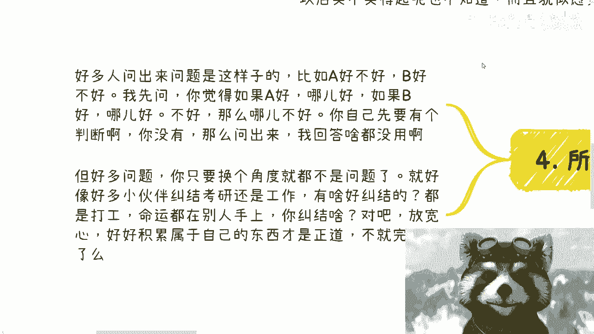

就是就我觉得也很奇怪，就大家做事情得要自己先了解嘛，对不对啊。

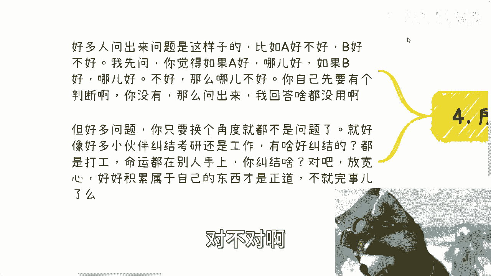

但是很多问题呢你你发现你只要换个角度看，他可能不是问题，或者他可能就不是二选一三选一的问题啊，这就好像你看很多小伙伴也也只跟我说，他纠结考研还是工作，你有啥好纠结的呢，对不对，我告诉你们了。

你都是打工人，命运都在别人手上，你纠结个屁，对不对，你放宽心，你有纠结这点时间，你有去卷工作，这段时间你不如好好积累自己的东西，你不如好好自己积累的，自己积累自己的一亩三分地，这才是正道啊。

这不就完事了嘛。

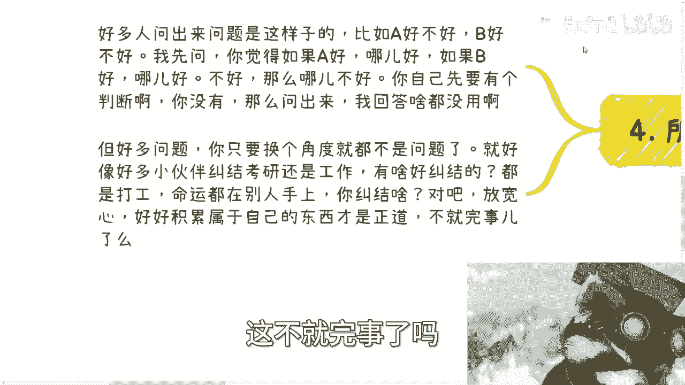

对不对，就是就是我跟你们说啊，就是举一反三，你懂吗，就是不要去想着说哎，今天就是这个问题，其实很多问题都是一样的，你们比如说你们现在听完，你们自己回过头去想想看，有很多问题是不是对吧吧，包括什么哎呀。

女朋友要我上交我的钱，什么出去吃个饭，我请不请客哎呀，什么什么出去，比如说什么什么要干嘛了，买什么东西，或者我要不要垫这事问题不大，你觉得啊不是说你就要做冤大头啊，就是大家有来有往没问题。

但是你不要去纠结这件事情，有什么好纠结的呢，对吧，你你说我跟我朋友出去吃饭，真的有时候比如说连续三次我请客，后面三次他请客对吧，那比如说大家付个几百块，甚至两个人可能吃个1000多块，我从来不会想他。

想他干嘛呢，因为我会如果我这么去想，那就说明我太low，我的格局太小，那说明我赚不到钱，那我赚不到钱，我得反思我自己啊，对不对啊，我赚不到钱，然后我在那边扣啊，我还说我的，你个。

你一天到晚他妈的让我请客，不要老是看别人问题，真的你知道吗，当然啊，就又有时我听到这就想到说到这句话，我就想到李佳琪，你知道吗，但是你们要想想看啊，这个当中这是一个这是一件事情，不是一件事情，你知道吗。

啊就是自己如果来说把这个问题老是指向别人，你要先去想自己，你知道吧，不要所有的问题都抱怨外界，抱怨外界没有用的，无论市场好不好，你能赚到钱，你终究能赚到钱，你赚不到钱是终究赚不到钱，好吧啊行呃。

双休日快乐好吧，先这么着啊，唉我这个头像真的很很开心啊，呃好吧，大家反正有什么，就是比如说商业上面合同啊啊或者idea啊对吧，或者未来的发展方向啊，或者发展规划啊，或者希望我帮你们能挖掘挖掘你们的特点。

擅长点啊等等等，好吧，你们都可以整理好问题。