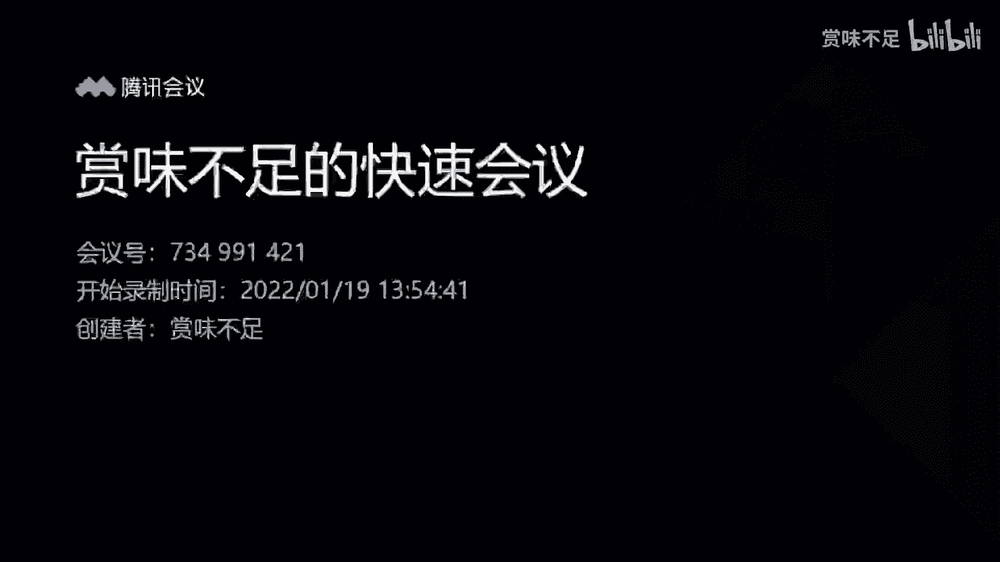
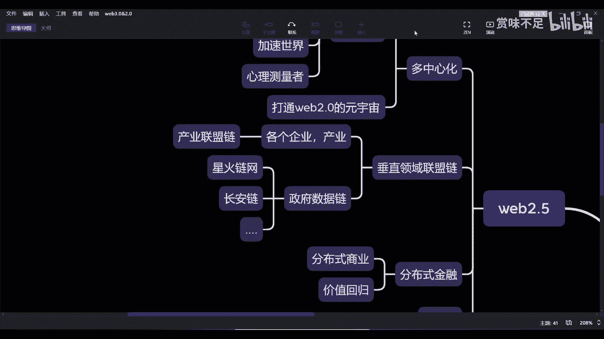

# 赏味--元宇宙中的web2-5官方联盟链---P1-web2-5中的官方联盟链---赏味不足---B

## 概述

在本节课中，我们将探讨Web2.5概念下的官方联盟链，特别是其在垂直领域（如产业和政府数据）的现状、面临的挑战以及未来的可能性。我们将分析其与Web3.0的区别，并理解当前联盟链发展的阶段与困境。

---

## 垂直领域联盟链的现状

上一节我们介绍了Web2.5的整体框架，本节中我们来看看其中的一个重要组成部分：垂直领域的官方联盟链。目前，这类联盟链主要在两个方向进行探索。

以下是两个主要方向：

1.  **产业领域**：例如金融、供应链等行业的联盟链，旨在成为该领域的基础设施。
2.  **政府数据领域**：例如星火链网、长安链、人民链等，用于存储和管理特定的政府或公共数据。

## 产业联盟链的挑战

对于产业联盟链而言，其核心目标是先将区块链技术变为该领域的基础建设。然而，这一过程面临巨大阻碍。

根本问题在于，企业对于采用区块链技术的动力不足。他们普遍存在一个疑问：**使用了区块链和没使用有什么区别？** 这个区别或许存在，但对企业而言，其价值和必要性目前并不明显。

相比之下，为什么Web3.0概念更吸引人？一个关键原因是Web3.0缺乏严格监管，从而创造了巨大的投机和盈利空间。但这并不意味着有监管的Web2.5就不能创造价值。问题在于，当前连最底层的区块链基建都尚未完善，更不用说在此基础上构建成熟的商业生态和商业模式了。加之当前Web2.0互联网竞争已非常激烈，除非有强大的外部推力或明确的利益点，否则企业主动拥抱联盟链的意愿有限。

## 政府数据链的探索与困境

除了产业领域，政府主导的数据链也在推进中。这些链有明确的目的性，例如人民链可能用于存储党务数据，长安链用于特定政务数据，天平链用于司法数据等。

然而，这些政府数据链同样处于早期阶段，面临几个问题：

1.  **对公众不透明**：许多C端用户和B端企业可能并不知道这些链的存在。
2.  **目标与路径不清晰**：虽然建设节点、发展生态（如NFT、链改、教育培训）等目标被提出，但具体如何实现、节点方有何权益、链的实际用途是什么，这些关键问题可能尚未完全理清。
3.  **尚未形成生态闭环**：目前链的掌控权主要在政府手中，尚未与广大中小企业形成有效的连接，未能创造出让参与者获益的商业闭环，因此显得“高高在上，不接地气”。

## Web2.5与Web3.0的对称关系

从宏观格局看，Web2.5与Web3.0存在一种对称关系。Web2.5中的所有业务理论上都可以迁移到Web3.0上，两者的核心区别在于治理模式和监管程度。

我们可以用以下公式概括其核心区别：

*   **治理模式**：Web2.5 ≈ 中心化推进；Web3.0 ≈ (去中心化) 社区治理
*   **监管环境**：Web2.5 ≈ 强监管；Web3.0 ≈ 弱监管
*   **资本效应**：Web2.5 ≈ 弱吸金效应；Web3.0 ≈ 强吸金效应

对于大多数企业而言，他们更可能选择在Web2.5的框架内进行探索，并融合部分Web3.0的功能，而非完全转向Web3.0。这类似于推特支持将以太坊上的NFT设为头像——平台自身未必是Web3.0，但可以接入Web3.0的资产。

这种融合会促进生态发展。中心化产业可以成为公链上的应用，丰富公链生态。当然，这也会带来新问题，例如跨链资产唯一性等，但在一家公链（如以太坊）占据主导的时期，这些问题尚不突出。

## 当前阶段：如同初设的区块链专业

垂直领域联盟链的现状，可以类比于国内高校新开设的“区块链专业”。

以下是一个类比列表：

*   **有框架**：专业获批设立，联盟链的架子搭起来了。
*   **无内容**：缺乏师资、教材、课程、实验平台。联盟链缺乏杀手级应用和清晰的使用场景。
*   **效果未知**：毕业生就业前景不明。联盟链如何赋能企业、如何创造1+1>2的价值、未来如何发展，都是未知数。

目前，我们更多地看到“某城市设立节点”这类新闻，但从区块链本质来看，其核心目的和长远规划并不清晰。如果仅仅是为了铺设节点，那使用任何技术都可以做到，区块链的优势并未体现。

## 总结

本节课我们一起学习了Web2.5中官方联盟链的现状。我们看到，无论是产业还是政府数据领域，联盟链都处于非常早期的探索阶段，面临着生态不完善、应用场景模糊、商业价值不明确等挑战。它们拥有良好的愿景和基础框架，但通往成熟、可用的基础设施之路仍很漫长。未来，我们期待这些联盟链能够建立更广泛的共识，吸引更多节点参与，并真正构建起能赋能B端和C端、创造实际价值的生态。