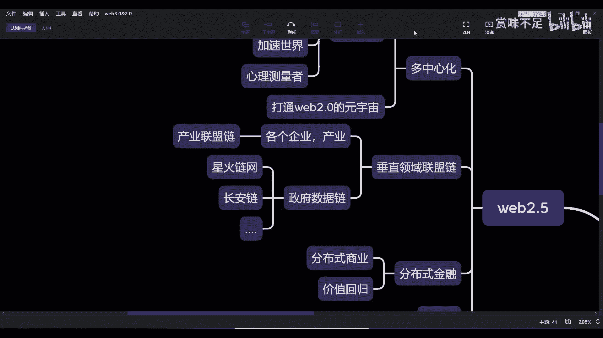

# 赏味——元宇宙中的web2.5官方联盟链 - P1：web2.5中的官方联盟链 - 赏味不足 - BV1i34y1i7Vz

好啊，那又是熟悉的页面对吧，呃我们继续看一下这个声音还可以啊，OK然后昨天晚上就是那个消息，大家都刷了半天了对吧，就说呃呃微软收购这是暴雪对吧，然后呢我看到就是有蛮多人学士见面输出嘛。

就说这个这个上帝给暴雪关闭了一扇门，又给他开了一个一扇windows是吧，对然后然后那个我看到还有很多人在说什么啊，暴雪死在了，也不是死在了，就是暴雪呃，好像是说停滞在了元宇宙崛起的时间，就黎明前。

这个呢我觉得其实这句话并不准确，为什么呢，因为从目前整个形式上来看，大家都知道对吧，这个呃OW对吧，屁股，然后那个大菠萝啊，然后星际魔兽对吧，就整个其实大家看嘛，到目前为止，除了那个炉石以外对吧。

就国内好说呃，除了炉石以外，剩余的基本上就是全部走向没落，尤其是大部落对吧，然后那个呃大菠萝重制版的，二二的重制版就是照抄对啊，虽然我也玩了很久了，但超超对吧，虽然马上开天梯了，但是我感觉被微软收购。

他就开天梯的时间，就不知道拖到什么时候了对吧，首先这是第一个，这是第一个问题，然后第二个呢就是说那个暗黑三，已经是被很多人骂成狗了对吧，然后安菲斯呢，虽然那个在风格上面是回顾了一些MV2。

但是它更像一个二和三的结合体，但不管怎么样呢，你说呃如果微软不收购价，从目前整个暴雪的情况来看，他不太会往好的方向走对吧，就是他他只能走向末路末路这一条对吧，所以说其实你说他是不是死在元宇宙的。

这个黎明之前，这句话不太贴切，因为他就算不被收购，他有个元宇宙没什么太大关系，因为他的创造力现在是这个样子对吧，那我觉得首先是第一个问题，那第二个呢就是说呃，微软是不是以后能给他带来比较大的希望。

或者说一些这个加持，这个我不知道对吧，但是有一点我是知道的，就是从目前来看，整个就微软花了将近700个亿去做这件事情的，本质上的这个这个目的，就是说他肯定是要进军游戏世界的，至于你说是不是叫元宇宙。

我觉得这个并不重要对吧，反正就是他一定是会希望通过游戏的方式，可能比如说呃是实现社交也好，或者实现这个这个这个这个它的生态也好对吧，这都可能啊，那么嗯OK我们还是回到这里啊，啊那么在上一期之后呢。

我在这地方加了又加了一些东西，首先我们先来说这个垂直领域的这么一个，联盟链对吧，那么目前来看主要是两个方面对吧，一个是产业方面的，哎也也也对吧，那么我们说这个这个怎么说呢，这个叫做产业链点，对不对啊。

然后呢数这个政府数据，比如说像星火链网，对对吧，还有什么长安列，对你好啦啦啦，让人民练啊，我就不写了，那倒了好吧，然后呢是这样子，就是我们说好金融产业这个角度来讲，就是目前来讲呢，它能就是就目前来看啊。

就是垂直领域做的联盟链，它要做的是什么呢，就是它在某一个领域，至少得要先把链变成他的那个基础建设，那目前来讲阻碍非常大，为什么阻碍非常大呢，还是那几个问题对吧，就是这些核心问题。

就是企业表示我用了跟没用有什么区别对吧，那我觉得这个呢可能就是就是怎么说呢，就是它的确是有区别的，但是你说他是不是能理解，我觉得实在是不能理解对吧，那么那么你说为什么web3。0，因为我们在web2。

5这里，后面不是有web3。0嘛对吧，那为什么你说web3。0这个能赚钱，那很简单，web3没有监管，对不对，那你告诉我跟你讲，你要天天web2。5，没有监管，他照样赚钱，这就保证你赚的对吧。

被割的什么都不是，是不是对吧，就这个没办法，你说是吧，当然你说并不是，我们并不是说它有了监管就就不能赚钱，对不对，只不过呢就是说现在的整个的那个第一步，你连整个底层的这个基建啊，区块链都还没做对吧。

那你更不要说商业生态和什么商业模式啊，什么乱七八糟的，这就没有了，对不对，好，那么再加上现在这个web2。0这么卷啊，那么你说很多企业，除非是你这个，哎有人问了一个问题吧，区块链是不是元宇宙核心技术。

你好问题，我待会就可能对吧，然后你说这个呃底层啊，他现在是还没有打通了，打通之后，那么对于各个企业呢，它能够有一个比较大的一个一个，一个数据上共享，包括这个利益就是商业化的一种提升对吧，那么这个是。

一方面啊，那么除了这个以外呢，我们说还有就是政府的那个数据链对吧，那么政府数据里面从目前来看，除了毕业生，因为毕业生是当中的protocol，就有一层协议嘛对吧，那我在这边就不多写了对吧。

比如星火链网长安店，人民店巴拉巴拉巴拉，有很多点点点点点吧，免得回头又有人说啊，你怎么不写的吧，没有骑一骑士，人家你好，除去S啊，然后呢我们说啊，就是这个呢目前来看也都是刚刚在做。

因为对于很多C端和B端，他可能都不知道这个东西对吧，而且我觉得从政府现在角度来讲呢，我觉得也是那样一个问题，就是你做联盟链没有问题对吧，然后但是你做联盟链是不需要节点对吧好，那我们就看到铺天盖地的新闻。

就在说他们在各个城市不用节点对吧好，那接下来的问题在哪里呢，问题在于就是如果我是一个用户，或者我是你的一个节点方对吧，那你从我的角度来讲，我先不说赚不赚钱，这个赚钱是必然的对吧，我先不说这么尖锐的问题。

我就先说一个问题是，你先告诉我这个店现在有什么用对吧，然后呢我做节点我有什么优势，或者我有什么好处对吧，然后呢做了节点之后呢，我需要做什么对吧好，那整个这些事情呢，我都觉得。

可能这个政府现在的这些数据链的团队，自己都还没想清楚对吧，他们就觉得什么呢，他们就觉得是那什么都要做对吧，比如说哎你看啊功能有节点好也得有，对不对，你看联盟链，联盟链啊，你看这个联盟链。

所以要产业赋能对吧，有链改好的也要有，对不对，那那个现在说我们要有NFTT好，那我们也要有，对不对，然后往后呢他就说这个，啊对他说我们要有教育培训对吧，因为呃这就跟我们产业第一是一样的。

就是说你说啊我们需要有有开发者生态对吧，好那有开发者生态，那你人不能凭空变出来对吧，那那他就说好，我们要培训教育对吧哈，就是就是我从我的这个角度来看呢，就是其实大家走的都是差不多的对吧。

但是呢就是可能从产品层面，他们还没有想清楚说到底做成什么样子啊，当然了你说目的性肯定是有的对吧，比如说人民网，人民链就是用来存那个什么，什么党管数据的对吧，然后长安链比如说就是存一些别的东西啊。

还有天秤天秤链对吧，可能就是从那个司法数据对吧，就这个就是说每一个不同的领域，他的确国家在推一些链是没有错啊，但是呢就是说嗯就是从目前来看几方面，就像我们刚刚说的一个奶。

我觉得他们可能从这个目标上是OK的，但过程上面可能讲的不是很清楚，第二呢就是说目前来说，整个这个东西还是掌管在掌管，掌管在政府受伤的，就他还没有说跟广广大的中小型企业能够，比如说用起来。

或者能让大家在这上面比如赚到钱对吧，或者能够有一些这个商业商业闭环，目前还没有，那这样的话呢就有点高高在上，不接地气啊，所以说从目前来看，其实属于这么一个阶段，当然了我们把这一块。

如果我们把这块往后去看的话，就是放到新基建跟区块链产业这边来看对吧，那当然就是说这边呢可能是垂直领域的对吧，那么产业可能就是属于各个不同的呃，那个那个业务线，这个回头再说啊，然后就到这个分布式商业。

分布式商业呢就是其实我们来看，其实我们从整个一个大局上来看，就是这里跟这里它是一个对称关系，就是这里的所有的业务，web2。5的所有都可以直接搬到web3。0上，他只不过就是一个多中心化。

和一个完全去中心化的这么一个状态，或者说web3。0整明更多的他需要有道德治理，而这边需要这边是需要中心化的推进对吧，然后呢web3。0这边是相对没有监管，这边相对有点监管对吧，那web3。

0现在是很有这个吸金效应，那这边没有对吧，其实无非就这些，但是话又说回来，就是对于广大中小型企业对吧，包括甚至大的企业，他可能做呢，他还只能在这个地方做，那当然在这个地方做呢。

可能更多的就是会融合部分web3。0的功能，它不是说我全做web3。0啊，这就好像昨天晚上那个有朋友问问，他就说那你看啊这个这个微软对吧，受够了对吧好，然后他就问他说，那那比如说因为我之前提到过一点啊。

我之前提到过就是web2。5的占有比例，可能打个比方在未来是80%对吧，我们3。0乘以比例可能20%对吧，好，然后呢我朋友就问我就说，那你觉得比如说像现在就拿微软角度来讲，那微软未来的这个如果来说。

他就直接冲着原著去了吧，花700亿个，花几百个亿干预之后，对不对，对吧然后我就跟他说嘛，我说其实本质上这件事情他还是个二等于对吧，你说你说微软是不会去做3。0，我个人觉得不太会，但是他会接3。0的东西。

这就好像前两天推特说啊，我的头像可以接那个公链上的NT是一个道理，就是我可以不做，但我可以这样对吧，但是不管怎么样，就是这种模式在目前看来多少二点啊，那么我们说其实从这样来看，其实工业的发展会越来越好。

因为呃中心化的东西跟供电是打不通的，它并不是打的对吧，而而中心化的这个这个这个使用，是能够愿意信任供应的，或者是供电量数据更值得被信，而与此同时，中心化的产业就会变成那个公链上的应用。

会成为供应商生态的一部分对吧，那你说twitter今天要可以啊，这特今天头像可以用以太坊上的NT，那对于以太坊本身就是一个很大的加持啊对吧，那当然这个问题在未来过程当中，其实还会就还是会碰到一些问题。

这个问题就在于什么呢，就是说啊如果有多套工业多个生产，那大家到底之间是怎个这个这个平衡，怎么个融合法对吧，那同样的，我今天这个NFT在TF上面是有唯一标识的，那我在别的店商业有唯一标识。

那请问我的唯一标识到底是什么，对吧等等等等等，反正就有很多问题，就是肯定会有些问题，但是从目前来看呢，就在以太坊一家独大的城市，其实这种问题也也无所谓对吧，或者说就相当于我就多个嘛。

也没有说多个不行嘛对吧，那你NT你说唯一标识，那我在每一个链上唯一标识对不对，有谁非要说是全世界全宇宙唯一标识，那也不见得啊，所以我觉得这个事情就看未来怎么去解释啊，那么。

啊那么我们我们我觉得每次讲一个点好吧，那还是回到这个地方，就是这个垂直领域的联盟链，从目前来看呢，我个人是只看到目前的一个呃，怎么说呢，只看到一个一个一个起步啊，就相当于说这就哦我给大家举个例子。

这就好像现在这个国内开区块链专业是一样，就是啊你看啊这个高校对吧，开了本科专科专业，然后我们会发现一个很很很奇特的问题是什么，就是就是专业开不开对吧，申请一下，然后呢他就会跟你讲啊，你看啊我们是啊。

老师也没有对吧，教材也没有，那个课程也没有啊，然后实验室也没有对吧，培训平台就那种实操平台也没有，就是你什么都没有对吧，那当然我觉得这个也没有问题啊，也没有问题，那么我们说那个整个垂直领域的联盟链啊。

就是目前来看他就处于这个状态，就是我你说我有没有这个底子，有没有这个架子，我有对吧，但是这个架子上面到底搭了哪些应用，不知道你说应用能不能赚钱，不知道对吧，然后你说那个别的中小型企业怎么用。

你这个东西能够把自己的生态，就就大家做事情，一定是1+1等于大于大于二的嘛对吧，你不可能做一个1+1=1的事情对吧，那么你如何赋能于多企业，不知道啊对吧，然后你往下面说那个政府数据联系。

就是哎你做了之后，那跟中心化的这个，目前来讲有一个很本质上的区别啊，然后是不是有了呃，那个那个是不是说未来支持智能合约之后，能够有更大的发展，不知道对吧，就反正就什么都不知道啊。

但是呢就是呃这个嗯这个愿景会很好对吧，但是从目前来看呢，并没有看到太多的这种场景逻辑啊，反而更多的会看到就是说啊，今天这个城市有个节点，那个城市有节点，你从我们就你从一个就是怎么说啊，就是做区块链的人。

或者这个比如说人家是币圈练拳的人，回回过头来看就会发现这大家没看懂，就是你们要做什么，你知道吗，就包括我都没看懂到底要做什么对吧，你说你要是全国散节点，那你是不足，区块链根本不重要啊，那你就撒了。

你随便卖个什么东西都能撒，对不对啊，所以我觉得目前来讲是这样子，那这块呢我就没法再往下讲了，因为这块他当前就这么个状态啊，你说未来怎么样子，我们就只能拭目以待啊，只能拭目以待了，那从我角度来讲。

我自然而然是希望他能够把共识做的好一点，对吧，把节点引入各个各种各样的企业，然后在这些链上呢能够真正的把生态做起来，然后能够去C对吧，然后C端和B端都能都能，你在在你这个链上获取一些。

这个生态上的加持啊，或者说一些一些一些业务上的加持，或者收入上的加持对吧，这个才是本质啊，当然现在是没了啊，OK啊那我还是每次讲一块吧，好吧OK那我们这次要不就先聊到这吧，嗯对我最后再补充一句吧。

大家要是这个对元宇宙啊，对其他各种东西有一些这个想法呢，反正随时可以微博或者其他地方私信。

