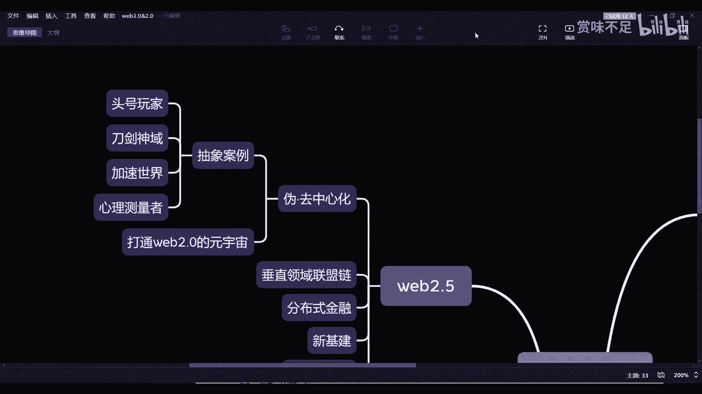

# 赏味--元宇宙中的伪去中心化场景---P1-伪去中心化---赏味不足---BV15f4y1F7jM_

在本节课中，我们将要学习“伪去中心化”这一概念。我们将探讨它如何作为Web2.0与Web3.0之间的过渡形态，理解其核心运作模式，并通过几个影视案例来具体感知其应用场景。

## 概述：从Web2.0到Web2.5的演进

上一节我们介绍了Web2.0时代中心化元宇宙的局限性。本节中，我们来看看一种改良方案——Web2.5，即“伪去中心化”模式。

Web2.5模式更多地是基于Web2.0的基础之上打造的。正如上节课所分享的，Web2.0的元宇宙往往是纯中心化的，就像腾讯、阿里、百度等公司所构建的那样。纯中心化的元宇宙面临的问题是个人身份、个人数据、个人资产等各类要素的归属与控制。

随着元宇宙的发展，我们相信未来的理想状态可能包括资产交易、学习、工作等多种活动都在其中进行。最理想的状态是，用户的所有活动都在元宇宙中完成。但是，Web2.5中的伪去中心化模式是：虽然每一个元宇宙都是独立的，但它们在底层会通过区块链技术实现某种程度的“打通”。

## 伪去中心化的核心：身份与资产的链上绑定

这种“打通”并非指将不同的元宇宙场景直接连接，而是指将用户的核心身份与资产数据在区块链上实现绑定与互通。

如果不通过区块链，技术上也能实现打通，但商业层面难以实现。根本原因在于中心化商业公司之间的壁垒，例如微信和淘宝的数据无法互通。因此，打通的瓶颈不在于技术，而在于商业化的运作方式。

伪去中心化模式的核心是：虽然各个元宇宙的运营仍是中心化的，但用户的数字身份（DID）、数据资产、货币资产等可以与一个链上身份绑定。这个身份可以在多个元宇宙中被识别和关联。

这并非意味着用户可以用A平台的账号直接登录B平台。它更像是底层通过区块链技术，将用户在多个平台的身份进行关联绑定。对于用户而言，在不同元宇宙间穿梭时，违和感会降低。随着与身份绑定的资产和数据（如浏览历史、游戏记录、工作打卡记录）越来越多，这些数据应该是被打通的，而不是被孤立在各个独立的元宇宙中。

## 区块链上的“数据共享”：隐私保护与结果验证

关于数据共享，需要强调一个关键点：区块链上所讲的数据共享，并非指原始数据的完全公开。

它更多指的是数据在链上完成“上链”过程，并且链上的参与方能够对数据的某些状态或验证结果有所感知。这种感知通常是知道一个“结果”，而非知晓数据的全部细节。

**核心概念可以这样描述：**
*   **目标：** 证明用户拥有某项数据或权利，而不泄露数据本身。
*   **方法：** 通过密码学技术（如零知识证明）进行验证。
*   **结果：** 验证方只知道“证明有效”这个结果，而不知道具体细节。

例如，用户证明自己拥有一把特定门的钥匙。验证者看到的是“门被成功打开”这个结果，但并不知道钥匙的具体形状，也不知道开锁的具体步骤（如左转三圈、右转三圈）。这种方式在保障数据安全的前提下，达到了可信验证和有限共享的目的。

因此，Web2.5模式通过区块链技术，在底层实现了身份与关键数据的可信互通，但上层的各个元宇宙应用仍由中心化企业运营。所以我们将其归类为“伪去中心化”。

## 伪去中心化的应用案例

以下是几个有助于理解伪去中心化理念的影视作品案例，它们都体现了中心化架构与去中心化思想的结合。

### 1. 《头号玩家》中的“绿洲”
“绿洲”所展现的是用户在不同游戏（可视为不同元宇宙）中穿梭时，身份、资产和数据保持连贯。然而，整个“绿洲”元宇宙仍由一个中心化公司运营。电影中反派无法直接篡改游戏核心数据的情节，暗示其底层可能采用了类似区块链的分布式或去中心化技术来保证公平性。这非常符合当下对Web2.5元宇宙的设想。

### 2. 《刀剑神域》与潜行技术
这部作品更多地探讨了元宇宙的接入方式，从VR头盔到深度潜行（甚至影响现实世界肉体）。其世界观发展到后期，出现了通过虚拟世界影响现实物理介质（如脑细胞）的设定。这指向了元宇宙与物理世界深度融合的未来方向，其背后的系统虽然强大，但仍可能存在中心化的控制力量。

### 3. 《心理测量者》与分布式治理
这部作品描绘了一个通过名为“西比拉”的系统来预防犯罪的社会。“西比拉”系统的核心是集合了大量天才大脑，以分布式的方式共同对个人的犯罪倾向（“色相”）进行判定。这本质上是一个**分布式、多节点参与决策**的治理系统，虽然其决策集合体（众多大脑）本身构成了一个中心化的权威，但其运作模式充满了去中心化的思想，类似于区块链通过共识机制进行裁决。

这些案例的共同点在于，其世界观或系统背后仍有中心化的力量存在，但都融入了区块链或分布式技术的思维。它们可以帮助我们更直观地理解，区块链技术真正落地后可能解决的问题及其展现出的潜力。

## 总结

本节课我们一起学习了元宇宙中的“伪去中心化”（Web2.5）模式。我们了解到，它是在保留中心化企业运营效率的前提下，利用区块链技术打通身份与资产数据的一种过渡形态。它解决了纯中心化平台的数据孤岛问题，通过隐私保护技术实现有限度的可信数据共享。通过分析《头号玩家》、《刀剑神域》和《心理测量者》等案例，我们看到了这种模式在游戏、人机交互和社会治理等多个领域的想象空间。伪去中心化很可能是在迈向完全去中心化Web3.0过程中，一个占据主要市场份额的务实发展阶段。

