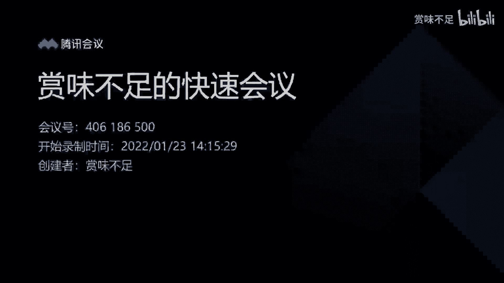
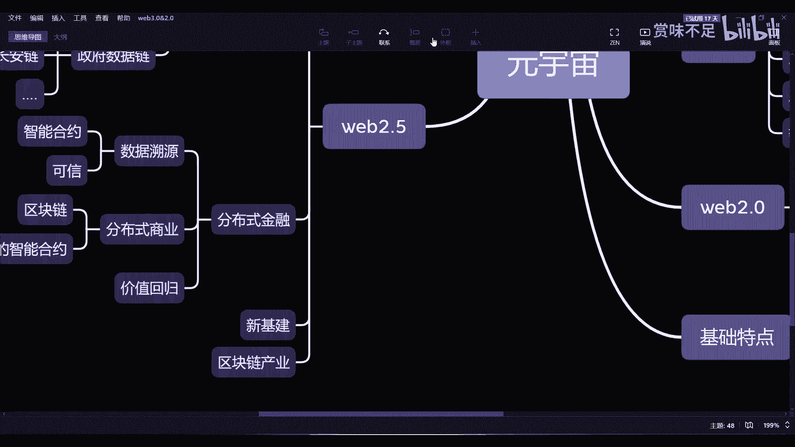

# 元宇宙系列课程 - P1：分布式金融 🏦

在本节课中，我们将要学习元宇宙中的一个核心概念——分布式金融。我们将探讨它如何通过区块链等技术，在Web2.5的世界里解决数据可信、商业激励和价值分配等问题。

---

## 课程概述

本系列课程聚焦于元宇宙。分布式金融是元宇宙在Web2.5阶段的重要扩展。Web2.5是Web2.0与区块链等技术融合后的产物。本节课不会从具体项目（如DEX）入手，而是从元宇宙的发展方向和现状来解析分布式金融。

分布式金融并非全新概念，但在Web2.5的语境下，它主要围绕三个核心点展开：**数据溯源**、**分布商业**和**价值回归**。

---

## 一、数据溯源 🔍

上一节我们介绍了课程的整体框架，本节中我们来看看分布式金融的第一个支柱：数据溯源。

数据溯源旨在追踪产品从源头到终端的全过程。目前，许多中心化系统（如盒马商品的二维码）也能实现溯源功能。用户扫描后，可以查看原产地、流经的加工厂和商户等信息。

那么，区块链溯源与中心化溯源的区别是什么？

从用户（C端）的直接体验看，两者似乎没有本质区别。区块链溯源同样展示一条产品链路，其核心差异在于**技术底层**。

对于供应链上的各个参与方（如加工厂、经销商），区别则至关重要。在未来的元宇宙中，数据溯源需要两个关键支撑：

1.  **可信性**：数据上链并不意味着数据本身绝对真实，但意味着**篡改数据的成本极高**。因此，链上数据的可信度高于中心化数据库。随着时间推移，无论是C端用户还是供应链上的商家，都会认识到这一点。
2.  **智能合约**：在分布式金融的范畴内，智能合约能实现供应链上下游的**自动结算**。例如，一包咖啡豆从产地到消费者手中，可能经历十个环节。智能合约可以确保每一笔交易在条件达成时自动、无误地完成支付，避免了中心化结算中可能出现的拖欠、扯皮等问题。

因此，数据溯源本身是一个“结果”，而区块链和智能合约提供了更稳定、可信的“底座”。这构成了Web2.5世界中元宇宙应用的一个基础。

---

## 二、分布商业 🤝

理解了数据如何被可信地记录后，我们来看看如何构建一个更公平的商业体系，即分布商业。

分布商业的核心是建立一个**正向的、可持续的激励模型**。它需要确保每一个参与方（用户、商户、平台等）都拥有一定的**控制权**和**收益权**，而不仅仅是积分或小额优惠。

以下是传统中心化模式与理想分布式商业模式的对比：

*   **传统中心化模式（如早期滴滴、美团）**：
    *   **模式**：通过烧钱补贴（如发20亿红包）吸引用户，培养消费习惯。
    *   **问题**：补贴停止后，价格可能回升，甚至开始挤压用户、司机或商家的利润（“割韭菜”）。激励规则完全由中心化平台制定，可以随时更改。
*   **理想的分布式商业模式**：
    *   **模式**：用户或参与方为生态做出贡献（如消费、推广）后，能获得可持续的、真正的利益**分润**。
    *   **实现关键**：将商业规则和激励逻辑写入**链上的智能合约**。例如，约定每完成一笔交易，收入按预设比例自动分配给用户、商家、平台等各方。
    *   **优势**：即使平台运营方更迭或出现问题，只要智能合约和资金池存在，激励就能继续执行。这建立了一种不依赖于单一企业信誉的、**基于代码的信任**。

因此，分布式商业需要一个良好的区块链和智能合约作为基础设施，来保障激励规则的公正与透明执行。

---

## 三、价值回归 💎

在建立了可信的数据和商业规则后，价值的分配将如何变革？这就是价值回归要探讨的问题。

价值回归指创造者应公平地获得其作品产生的收益。以出版和音乐行业为例：
*   作者通常只能获得图书售价的约8%作为版税，音乐人的比例可能更低。
*   **核心问题**：创造者**无法确知作品的实际销售数量**。出版社说卖了多少就是多少，数据可能造假，创造者没有可靠的验证手段。

在未来的商业环境中，信任不能仅仅基于“我相信你的名头大”，更需要**技术保障**。价值回归的解决方案是：

1.  **资产上链**：将作品（如图书、音乐）转化为链上的数字资产（如NFT），其流转记录公开可查。
2.  **规则上链**：将分销和分润的商业模式写入**智能合约**。

对于创造者而言，一旦这套体系建立：
*   他们不再需要关心下游如何销售、做何种促销活动。
*   他们只需确信：**只要产生一笔销售，智能合约就会自动将约定比例的收益分配给自己**。销售数据在链上透明，无法篡改。

价值回归的核心，就是通过**区块链（保证资产与数据可信）** 和**智能合约（保证规则自动执行）**，确保价值能够穿透复杂的中间环节，直接、准确地回归到创造者手中。这需要物联网、AI等其他技术辅助实现复杂的业务逻辑。

---

## 总结与展望

本节课中我们一起学习了Web2.5阶段元宇宙分布式金融的三大支柱：

1.  **数据溯源**：利用区块链的不可篡改性，为产品流通信息提供比中心化系统更高的**可信度**，并通过智能合约实现自动结算。
2.  **分布商业**：通过链上智能合约定义并执行激励规则，构建**可持续、可信的正向商业模型**，替代依赖烧钱和中心化承诺的传统模式。
3.  **价值回归**：将资产（NFT）与分润规则（智能合约）同时上链，确保创造者的收益能**透明、自动地兑现**，实现价值的公平回归。

总而言之，分布式金融的逻辑在于，当**数据可信性**、**商业规则**和**价值分配机制**都构建在区块链与智能合约之上时，就会催生出独立于现有Web2.0中心化模式的新商业模式。这类似于早先“通证经济”的理念，但其重点不是炒作代币，而是将真正的激励融入现有的B端和C端经济活动中。

当这一逻辑得以实现并规模化应用时，我们将看到元宇宙中涌现出真正以参与者为中心的经济体系。

---
**课程名称**：赏味——元宇宙中的分布式金融
**课程编号**：P1
**视频标识**：BV1sq4y1C77B