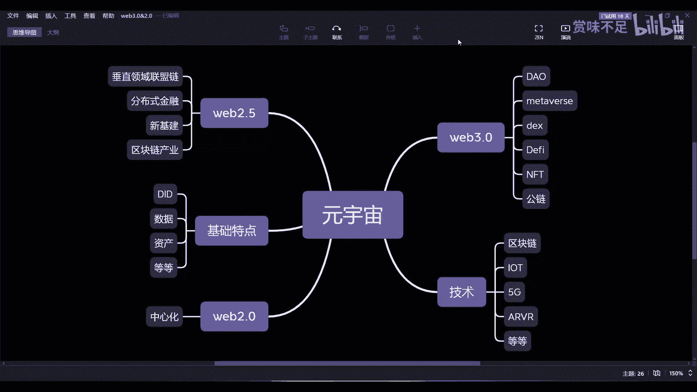

# 赏味--来谈谈实际的元宇宙-web2-0和web3-0的融合----P1-meeting_01---


## 概述

在本节课中，我们将探讨元宇宙的实际落地形态，特别是Web2.0与Web3.0如何相互融合与影响。我们将分析当前元宇宙概念的局限性，并深入理解中心化与去中心化技术在其中的角色与未来趋势。

---

## 元宇宙概念的现状与问题

当前，大部分关于元宇宙的讨论都比较笼统和概念化。另一种常见的理解是将其对标为游戏，例如某公司推出的、允许用户拥有虚拟形象（Avatar）并进行活动的平台。这算不算元宇宙？它算，但似乎又不完全贴切。

最主要的原因在于“元宇宙”这个概念本身比较宽泛。它无法精准描述任何一个具体的细分业务。因此，我们更应关注的是它如何落地，而名称本身并不重要。

---

## 技术层面的划分：中心化与去中心化

从技术角度看，元宇宙涉及多种技术。我本人更关注区块链技术。原因在于，除了区块链，其他技术基本都是中心化的。而区块链无论在何处落地，都会产生去中心化的效果。

以下是技术层面的一个简单划分：

*   **Web2.0（中心化元宇宙）**：例如Meta（Facebook）、腾讯、百度曾推出的元宇宙平台。它们由中心化公司控制和运营。

---

## 如何判断一个“元宇宙”？

我们可以通过几个基础特点来判断：

*   **去中心化身份（DID）**：用户拥有自主控制的身份。
*   **数据主权**：用户拥有自己的数据。
*   **资产所有权**：用户真正拥有自己的虚拟资产。

一个简单的判断方法是：你在A公司的元宇宙中创建的身份、积累的资产和数据，能否在B公司的元宇宙中通用？如果答案是否定的，那么它是否符合元宇宙的核心理念，就值得商榷。

---

## 中心化元宇宙（Web2.0）的必然性

中心化的元宇宙未来必定会继续存在。这就如同当下的互联网产品，即使有人不喜欢或不用滴滴、抖音，但这些平台依然拥有庞大的用户群体。在中国乃至全球，中心化模式本身就有巨大的市场基础，这是无法忽视的现实。

---

## 去中心化元宇宙（Web3.0）的现状与挑战

2022年被称为“DAO（去中心化自治组织）元年”。然而，目前DAO的实际运转仍比较薄弱。核心问题在于参与者的意识和主动性不足，真正参与链上治理投票的人极少。

此外，Web3.0还面临一个“先有鸡还是先有蛋”的困境。传统金融从业者认可DeFi的理念，但他们担忧去中心化治理的风险：如果一个业务的社群失去活力或停止运作，整个生态可能陷入停滞，用户的资产也可能被锁定。这种“失控”的风险是他们认为与中心化模式最大的不同。

尽管如此，Web3.0生态正在蓬勃发展：
*   **NFT**：吸引了如周杰伦、LV、保时捷等众多顶级IP。
*   **DeFi**：稳定币、预言机、借贷、保险等生态已非常完善。
*   **DEX**：如Uniswap等去中心化交易所。
*   **交易市场**：如OpenSea（虽中心化运营）支撑起了NFT交易生态。

Web3.0的特点很明确：
1.  它原生具备元宇宙的基础特点（DID、数据主权、资产所有权）。
2.  其生态（如DEX、DeFi、NFT、DAO）是互联网的原生资产和体系，自成一体，不太受现实世界（如疫情）影响。
3.  未来可能会诞生原生于Web3.0的强势品牌，并与传统Web2.0品牌竞争。

---

## 融合的关键：Web2.5

在我看来，Web2.0、Web2.5和Web3.0是一个相互侵蚀和融合的过程，而非谁取代谁。极端地认为去中心化将完全取代中心化是不现实的。

**Web2.0对Web3.0的侵蚀**：
现有的大型品牌和流量会涌入Web3.0世界。目前最大的门槛是用户需要管理钱包和私钥/助记词。

**Web3.0对Web2.0的侵蚀**：
这更多是技术上的侵蚀。Web2.5将是未来很长一段时间（可能10-15年）的主流形态，占比可能高达80%。Web2.5的核心是：**用区块链技术赋能传统产业**。

---

## 为什么会出现Web2.5？

主要有以下几点原因：

**1. Web2.0内卷寻求新增长**
传统互联网领域已非常“卷”，需要新的技术（区块链、元宇宙、NFT）来创造新的商业模式和增长点。

**2. 分布式商业需要可信激励**
未来的分布式商业需要对所有参与者进行激励。这种激励必须通过**智能合约**来保障可信度。例如，一个中心化公司发行的积分，其规则可以随意更改，价值无法保证。而基于区块链的Token，其分发和分红规则由代码约定，更加透明可信。
```solidity
// 简化的智能合约概念：自动执行的分红规则
contract Dividend {
    mapping(address => uint256) public tokenBalance;
    function distributeProfit() public {
        // 根据tokenBalance自动计算并分发利润
    }
}
```

**3. 新基建需要增加可信度与资产数字化**
在供应链、数据协作等领域，区块链可以用于在保护隐私的前提下实现数据共享，增加合作方之间的可信度。更进一步，企业可以基于区块链发行数字化资产（股权、产权等），将其分割以提高流动性，并通过智能合约管理相关权益（如分红），这比中心化方式更可靠。

**4. 合规化交易与全球示范**
中心化数字资产交易所是未来趋势。其目的，一是创造新的商业价值，二是在全球范围内树立一种通过中国战略与市场获得新商业机会的典范，吸引全球项目。

主权国家在可预见的未来仍将以中心化治理为主，因此，符合监管、连接传统与创新的Web2.5模式将拥有巨大的发展空间和建设性。

---

## 总结

本节课我们一起学习了：
1.  **元宇宙的现状**：概念宽泛，需关注实际落地。
2.  **Web2.0与Web3.0的对比**：中心化与去中心化模式各有其存在基础和挑战。
3.  **关键的融合地带——Web2.5**：这是未来多年的发展重点，核心是用区块链技术赋能传统产业，创造可信的激励和数字化资产。
4.  **元宇宙的本质**：不在于虚幻的远景描绘，而在于当下**Web2.5和Web3.0**所带来的、切实的新商业机会与建设性。与其在极度内卷的Web2.0中挣扎，不如关注这两个更具潜力的方向。



希望本节能帮助你更清晰地理解元宇宙发展的实际图景。