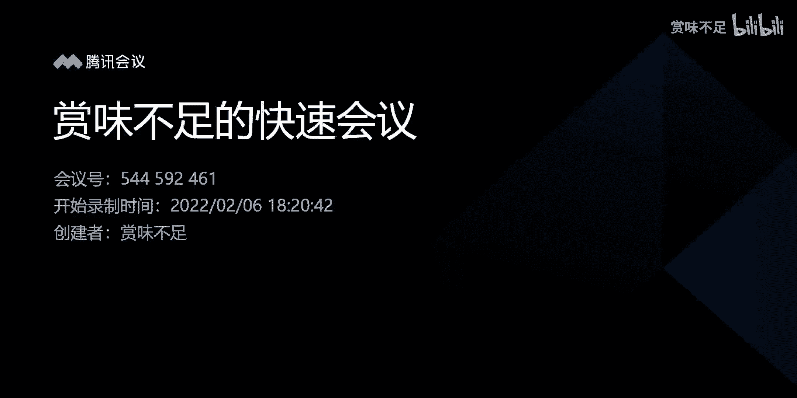
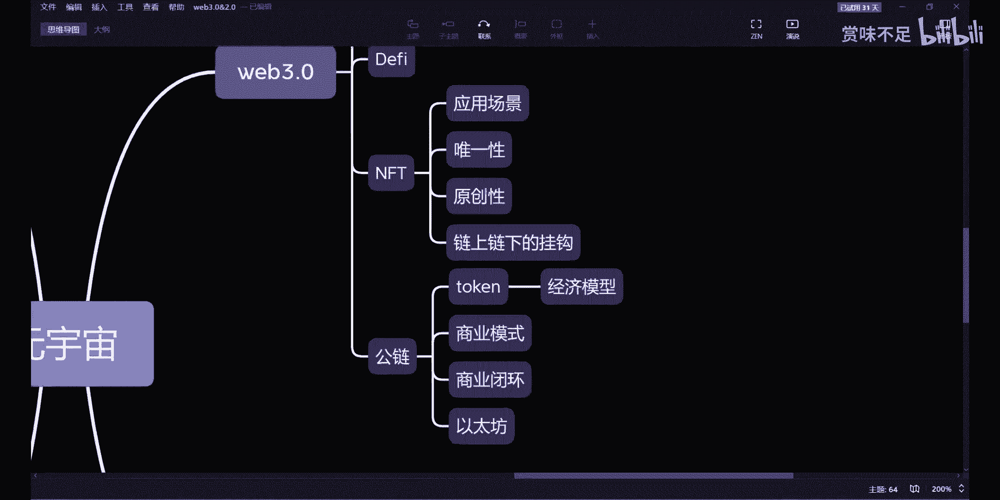
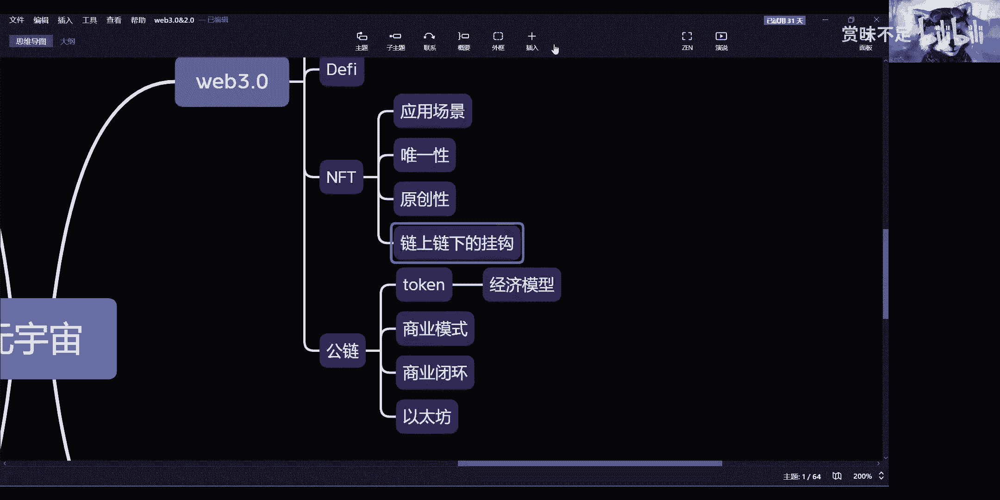

# 赏味—Web3.0之公链 - P1：公链 🧱

在本节课中，我们将要学习公链的基本概念、当前面临的挑战以及对其未来发展的探讨。我们将分析公链的商业模式、应用现状以及存在的核心问题。

---

上一节我们介绍了Web3.0的宏观背景，本节中我们来看看公链这一具体领域。公链是Web3.0生态的基础设施，但其发展现状与未来方向存在诸多争议。

公链目前处于一个比较尴尬的阶段。其根本原因在于，公链的商业模式至今仍比较单一，主要依赖于发行数字货币和二级市场买卖。这种模式难以被定义为成熟的商业模式。

以下是公链当前面临的主要问题：

1.  **商业模式单一**：公链尚未探索出可持续的商业模式，主要依赖代币发行与交易。
2.  **应用生态小众且问题多**：DeFi（去中心化金融）和NFT（非同质化代币）是目前公链上的主要应用方向，但它们仍属小众，且自身存在大量问题。
3.  **问题缺乏终极解决方案**：当DeFi协议出现漏洞、资产被盗或团队跑路时，在Web3.0的框架内缺乏有效的解决机制。
4.  **NFT面临多重挑战**：NFT作为重要的商业变现模式，其发展面临应用场景、唯一性、原创性及链上链下资产挂钩等多重难题。

---

上一节我们列举了公链的普遍问题，本节中我们具体分析NFT面临的挑战。NFT虽然前景广阔，但其在公链上的实践存在诸多根本性缺陷。

以下是NFT在公链上需要解决的几个核心问题：

*   **应用场景**：目前NFT缺乏明确且广泛的应用场景，其价值主要体现在交易和投机层面。
*   **唯一性**：同一数字资产（如“冰墩墩”）可以在多条公链上被铸造为NFT，无法保证资产的唯一性。
*   **原创性**：难以证明某个NFT是原创作品。仅凭上传后生成的哈希值不足以构成有效证明。
*   **链上链下挂钩**：若NFT对应线下实体资产或Web2.0时代的数字资产（如数字纪念章、电子藏品），当这些链下资产损毁、丢失或数据库被清空时，无法有效反馈到链上，导致链上资产价值悬空。

---

上一节我们讨论了NFT的具体问题，本节中我们回到公链的整体定位。公链的核心优势在于其节点众多、共识机制完善，从而保证了数据的难以篡改性和公正性。

因此，公链的价值应在于发挥其数据可信的长处，为现有生态赋能，而非试图构建一个完全独立并取代现有体系的新生态。Web3.0技术更可能的方向是赋能Web2.0，实现“Web2.0+”，而非彻底替代Web2.0。

此外，当前公链的用户体验存在巨大障碍。每一次交互都需要钱包签名、支付Gas费，过程繁琐、速度慢、成本高。这种反人类的设计和高昂的使用成本，将绝大多数普通用户拒之门外，使其沦为小众的“富人游戏”，阻碍了大规模普及。

---

本节课中我们一起学习了公链的现状与挑战。我们分析了公链商业模式单一、DeFi与NFT应用存在缺陷、问题解决机制缺失等核心问题。同时，我们也探讨了公链应发挥其数据可信优势赋能现有生态的定位，以及当前用户体验差、成本高阻碍普及的现实困境。总体而言，公链的未来发展更可能走向与中心化元素结合、为现有世界赋能的技术融合方向，而非创造一个完全去中心化的替代世界。