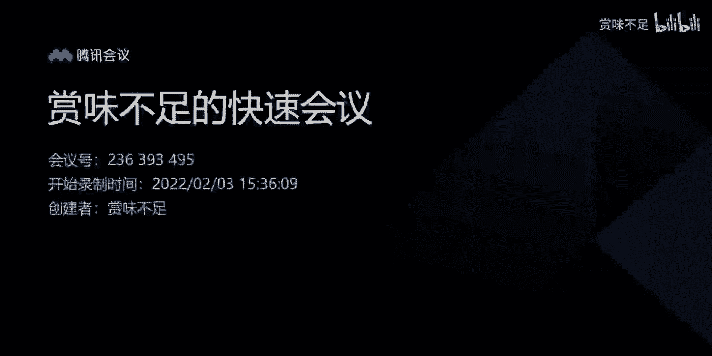
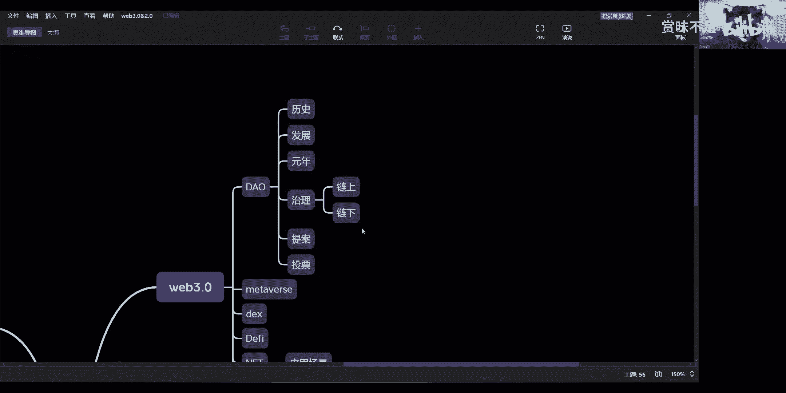

# 课程一：初识DAO 🏛️

在本节课中，我们将要学习Web3世界中的一个核心概念——去中心化自治组织（DAO）。我们将探讨它的基本定义、运作逻辑、面临的挑战以及未来的可能性。

---

## 什么是DAO？

上一节我们介绍了课程主题，本节中我们来看看DAO究竟是什么。

DAO，即去中心化自治组织。从纯粹的角度理解，许多人认为它是一个自治性社区或组织。所谓“自治性”，核心在于“治理”。它推崇一种没有公司、没有企业主体、没有创始人的组织形式。这与Web3世界所倡导的“去中心化”理念一脉相承。

目前，DAO的理念仍在发展中，并没有一个像百度百科那样标准化的定义。我们只能通过历史上的一些项目来理解DAO到底是什么。

---

## DAO的核心运作逻辑

理解了基本概念后，我们来看看DAO是如何实际运作的。

无论是公链项目、去中心化金融（DeFi），还是去中心化交易所（DEX）或NFT项目，其中的DAO通常包含两个核心组成部分：**提案** 和 **投票**。

以下是DAO运作的基本流程：

1.  **制定规则**：首先，DAO会制定一套治理规则。例如，一个拥有100名持币成员的项目，可能规定当超过50%的投票权重支持时，一个提案即被通过。
2.  **发起提案**：任何符合条件的成员（通常是持币者）都可以发起一个提案。例如，一位持有大量代币的成员可以提议“改革项目明年的奖励机制”。
3.  **进行投票**：其他持币者会在特定的平台上看到这个提案，并进行投票。投票权通常与持币数量、持币时间等因素挂钩，形成不同的投票权重。
4.  **执行结果**：在规定的投票期内，如果支持该提案的投票权重达到了预设的通过标准（如50%），则该提案通过并执行；否则，提案失败。

你会发现，这本质上是一个通过投票来决定提案是否通过的民主过程。

---

## DAO面临的现实挑战

了解了理想化的运作模式后，我们必须面对现实中的挑战。为什么DAO的实践如此复杂？

因为DAO是去中心化的，缺乏中心化的控制。提案的发起、投票的参与都依赖成员的自发性。最终结果完全取决于预设的规则和成员的参与度。从目前人类的协作习惯来看，完全“散养”的模式很难让DAO高效运转。

DAO的实践可能走向两种极端：

*   **理想化的“乌托邦”**：所有成员都具有极高的精神境界和自我约束能力，完全为了组织的共同利益无私参与治理。这是一个理想状态，但实现难度极大。
*   **作恶的“寡头统治”**：部分成员联合起来，只提出和投票支持对自身有利的提案，打压其他提案。这看似是去中心化治理，实则形成了比中心化更恶劣的垄断。

然而，当前最常见的情况并非这两种极端，而是一种**中间状态**：既没有大规模的组织化作恶，也缺乏高涨的自治热情。根据过往数据，许多DAO中，实际参与提案和投票的成员比例极低。大部分持币者的关注点在于代币价格，而非项目治理。

造成这种现象的原因很多，可能是治理机制设计不佳，也可能是成员参与动力不足。但无论如何，这是DAO发展初期必须面对的现实。

---

## DAO的未来：可能性与框架

基于以上挑战，我们应如何辩证地看待DAO的未来？

有人认为DAO是未来，将替代国家和公司的统治。但从人类历史发展来看，完全去中心化、无任何约束的自治体系是很难稳定存在的。DAO所体现的自主、民主、公平精神非常可贵，但**这些价值的实现，往往需要一个稳定的基础框架来约束**。

这就像现实社会中的法律体系。善与恶、对与错，都需要在一个公认的法律框架下进行界定和裁决。如果没有这个框架，任何决策都可能陷入“50%的人赞成，50%的人反对”的无休止争论中，无法形成真正的共识和行动。

因此，DAO最有可能实现的形态，或许不是纯粹的去中心化，而是在**一定的中心化指导或框架约束下运行的去中心化治理**。例如，由一个核心团队设定初始规则和边界，在此之上开放社区治理。这可能是DAO走向成熟和可持续的发展方向。

---

## 总结

本节课中我们一起学习了DAO的基础知识。我们了解到DAO是一种去中心化自治组织，核心运作依赖于提案和投票机制。然而，在完全自发的环境下，DAO面临参与度低、可能走向极端等现实挑战。因此，DAO的未来发展，可能需要探索在合理框架下平衡中心化指导与去中心化治理的模式，从而实现其民主与效率的初衷。