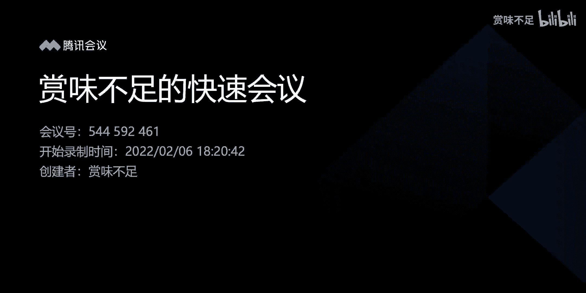
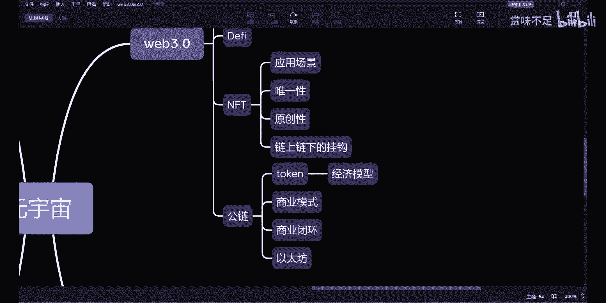

# 赏味—web3.0之公链 - P1：公链 - 赏味不足 - BV1k34y1y7dB

嗯，好，我们继续来讲web3啊。然后这一节的话呢，我打算来讲攻略。呃，因为其实上面这些内容呢都是基于攻略的，我也得好好想了一下啊。呃，然后之前的话呢，我跟。嗯我之前的话跟那个国内外的一些朋友聊下来呢。

其实呃哪怕到现在我还是比较坚持我的一个观点。就是我还是觉得呃未来走向大概率还是会往联盟链。那当然啊就是这个联盟链可能未必一定是现在我们大家认知道的那种联盟链。但是呃或者这么来说吧，叫做有一定约束力的。

或者来说有这种中心化介入的供链。哦，然后这是我到目前为止还是这么个观点。然后也有蛮多人当时跟我聊的时候，他们认为只有宫链是未来啊，就是宫恋会达成一个非常未来的一个世界。那嗯。我觉得我不去想。

就是如果就是比如说那个几百年后，那也不也不是没可能，对吧？但是我觉得在我的这个有生之年啊，我去看的话呢，我觉得不太可能。所以我不想往这方面去讲。那么呃但是反过来说呢，就是攻链本身还是要去讲一下。

那宫链现在呢我们说呃在2021年年底的时候，其实我看到就非常多的媒体啊，其实就在那边会提到啊，就是说。啊，这个江才郎静对吧？然后说呃攻略没有什么很大的一个起色，或者呢说一个一个一个突破。

那事实上呢也的确是如此啊，因为我们来看一下，其实本质上啊因为攻链现在我们说呃大部分的这些这个基础应用或者说创新性应用都是在以太坊上面。对吧那我觉得这个地方我们把以太方肯定要单独拎出来。あ。有点。啊。

那么比特币就不要说比特币因为它本身只是一个点对点的支付系统，对吧？它没有一个应所谓的这种创造性应用而可言。那以贷款我们说它的本身的价值是在哪里呢？本本身价值在于说创造了智能合约。

对吧就创造了一个可应用性的智能合约，然后让更多的人在这上面去做他的这个产品。那其实这个产品。我们能够看到像meterverse deck对吧？就就就区中化金融呃，区中区中化金融dedefine啊。

这个是区中趋势中心化的交易所，对吧？包括OFT。那其实呃从目前来看呢，其实供链的确就处于一个比较尴尬的一个阶阶阶段啊，为什么呢？因为。我们来看这么几点啊，第一点就是。供链到目前为止。

不管它到底有哪些优点啊，也不管它打的是怎么样的旗号。我们说它本身的商业模式是什么，它的商业模式到目前为止还是比较单一单一的，就是发行数字货币，然后二级市场的买卖，对吧？

但是你甚至可以认为这都不能称之为商业模式。因为你随便放到一个。这种投资机构或者投资人的角度或者一个金融分析的角度去看它这个东西它可以作为一个赚钱的方式，但是它根本就不能称之为商业模式，对吧？

那么如果来说最终他摸索不出来它的商业模式，那么他最终注定他就是个小重担，对吧？你不要来跟我说，工链以后能改变世界能改变怎么样子，甚至甚至还有人跟我说，1年内对吧？工链能够替代这个中心化的政府。

你简直就是buushsh it。对不对？所以说我觉得这个就是非常扯淡的一个地方。啊，当然我们回过头来说，就是商业模式本身的确没有啊看到一个很好的一个一个模式。因为。到目前为止啊。

就是可能呃你说上面的define啊有了很多一些应用，这个的确是一个不错的方向啊，方向NFT的确是一个不同不错的方向。但是这些到目前来讲，它还是一个很小众的一个一个一个。呃，一个切入点。首先这第一个问题。

第二个问题是这上面的问题，这deefine也好，NFT所有的这个拥有自身的这种问题一大堆啊，那么也有很多人说。我们也没看到这里面有多大的问题。

是这里面之所以没有太大的问题的原因是第一个原因是啊的确很小众，对吧？他问题不见得暴露出来。2。碰到问题之后，终极的终极的解决方案就是什么？不管。对你比如说dX也好，那个deeffin也好。

上面有多少的漏洞，多少的黑客攻击，多少的问题，包括以前攻链也是一样。最终怎么解决的？没有解决。就是不管。对吧那如果你从。你从defi角度，我们说有哪些问题。那比如说。那比如说他的这个资产被盗了。

比如说他的预言机预言价格不准啊，比如说它里面有一些小动作，对吧？比如说甚至那个那个团队跑路了，那请问你怎么办？对吧？虽然我们说你在一个web3。0的世界，你你身份自主，你的数据自主，那请问你怎么办？

你不要来跟我说，你去报警。因为你已经是一个we3。03。0的人，你不要来跟我扯we2。0的行为，对不对？那这个时候你肯定就跟我说。

那不行的那我还是活在世界里面的还是有法制世界的那你现在就不要来跟我扯法制世界，对不对？那所以说呢其实这个就是一个很大的一个漏洞啊，很大的一个问题，这是第一个问题，第二个问题是NFT对吧？

那NFT我们说他的确是一个很好的一个商业变现的模式，但是NFT本身在we3。0或者在供链上面，它的一个目前来讲碰到的问题基本是非常多非常非常多的啊，那么我们随便列几个在这个地方。

比如说我们说应用场景在这个地方提了，对吧？应用场景，这是第一个有吗没有，对吧？那你你你你你NFT的买那个。拍卖OMT的涨价，那那不能算应用场景嘛，对不对？第二个叫做就是嗯唯性。

对吧那NFT现在在供业上我一定能保证吗？不难，为什么不能呢？很简单啊，你今天在以太坊上面有有1个NFT，比如说叫冰墩墩，对吧？有个NFT，我也可以在索上面有个嗯有个冰墩墩。

我也可以在BS上面BSC上面有个冰墩墩。那请问哪个并墩墩是NNFT对吧？那你也可以跟我讲，你说好，三个都是嗯那个那个NFT还行，那我我也认了，对吧？那么第三个问题是什么？叫做原创性。啊，我原创对不对？

好，那原创性的问题你怎么解决呢？你跟我说哦，我三个冰墩墩都在三条共链上面。那请问我怎么证明这个冰墩墩是你原创的呢？对不对？你有办法证明吗？没有你只能跟我说哦，因为我上传了，对吧？我我有了一个哈希值。

那这不也在跟我扯淡。对不对？好，那么呃第四个还有问题是什么？就是叫做。这个物品就是叫做链上链下的这挂钩。啊，那么你做1个NT如果你要我们说啊就是说如果你要长远的发展，你要大力的去发展。

你一定是会有线下的一些实体资产的，或者说原本的一些数字资产，对吧？那么好。那么我们说你线下实体资产一定是有实物对应的。呃，如果你说我要用原本的一些数据资产，那么原本数据资产就是由we82。

0互联网技术所产生的对吧？那么我们我举个例，我想想看啊，我举个例子，比如说嗯。

啊，就比如说我们以前啊在这个互联网上面所发行的很多的一些呃纪念徽章，或者来说一些纪念币或者纪念的手册，或者有些反正有些就是比如说国家也好，图书馆也好，博物馆也好，反正涉及一些电子类的产品啊。

那么说这个东西。你只要不是维博3原生出来的，那么你一定是有对应物的对吧？那么好，那么我们说如果一个链下的一个对应的资产毁掉了，对吧？丢了或者被偷了，亦或者来说我们刚刚说的这个互联网里面的这个资产。

就像我们说的设计的这种邮票啊呃设计的这种这种这种这种博物馆东西啊，或者图书馆东西啊，如果这个数据库被黑了，对吧？这数据库一一下子清空了，对吧？不小心烧掉了。对吧那请问这些东西你如何反馈到链上能吗？不能。

对吧？就目前来讲，就是我们说应用场景里面有唯一性不能保证，原创性不能保证的，挂钩也不能保证，就所有的东西都是不能保证的，对吧？你跟我说哈，这个东西就开始买卖了。那你说你能怪得了这么多人觉得这是个骗局吗？

那么这不那的确这个从某种角度来讲，他的确是个骗局。对不对？那那我们再回过这边来讲，这个问题供链有解决吗？没有。对吧所以说我们一直在说，就是说攻链它的一个点呢是在于说呃。节点够多啊。

共识在节点够多以及共识比较完善的情况下面，它的数据是难以篡改的。那么既然如此，我们就要发挥它的长处，也就是说把它的数据很难篡改数据公正性的这个特点发挥出来，而不是说让供链就是承载一个生态。

而不是说让供链就是变成一个生态。所以我觉得这个呢是在我看来，很多的人跟我有歧义的这个地方。就是。我一直认为的是维保3。0是去赋能与维保2。0啊，然后是能够去做维82。0加。但是呢有非常多的人会告诉我说。

他们觉得维82。0会毁灭掉，然后维博3。0会替代维保2。0。然后这件事情就让我很匪夷所思。啊，所以我觉得在目前当下这个情况下面，我根本就看不出we83。0是如何会替代为82。0的。

而且另外一方面是什么呢？就是嗯。那当然啊就是另外一方面是什么呢？就是关于攻链的这个定义，就是目前的这么一个供链，也可能并不是未来的一个发展方向。就跟我说的，一开始说的联盟链并不是一个发展方向是一个道理。

因为目前从那个那个那个切入点来看啊，matter mask也好，那个那个呃密钥也好，包括身份自主性也好，它的整个操作实在太过反人类了啊，你说我想让。那个地球上大部分的人像运用Y82。0一样。

如此去呃广泛性的运用目前攻链的这套东西，你觉得可能吗？我觉得几乎是不可能，对吧？你每一次登录啊，每一次每一次的连接，你需要有个对你需要唯一的钱包属性，这没有错。但是你每一次都需要签名。

每一次都要guess飞，每一次而且速度很慢，而且怎么样怎么样怎么样很多很多所有的行为，每一次行为都需要去去签次名，都需要去消耗次ge费等等等等等等等。这个东西就是。

就是就是可能现在我觉得很多人的这个想法是对的，就是他觉得就是变成了一个富人的一个游戏。其实事实就这样子的，就在这个游戏里面只有。为什么他小众，不单单是因为门槛，他的成本也吓跑了很大一批人啊。

我我前两天跟我一个朋友在那说，我说我说你想因为他想了解we博3，我就跟他说，我说你想了解，你总要去用一下，对不对？那他他他就问我到底花多少钱，我说这个事情呢，得要看你想怎么用，想怎么了解。

我说这个东西他没有一个定论呢。对吧不是说让你一天到晚投资，而是说你在用的过程当中，他就在消耗你的那个那个那个数字货币，对吧？这没有办法的这个事情，然后他就觉得很匪夷所思，对吧？

那所以我觉得呢就是说这个事情本身它目前是有悖轮的。哦，那么。总总体来讲呢，我是目前来看啊，就是呃我相信宫链它一定是能够是未来的一个方向。我也相信联盟链是未来的方向。

而且就算宫链呃跟联盟链不是现在这个样子，我也更偏向于。呃，不一定联盟联嘛，我也更偏向于有中心化介入的，或者说我更偏向于以维博三的技术来赋能维博2的这种方向。因为世界本身就这么运转的。

你跟我说这个这个这个中心化呃。就是住就是。一我不管他是一档制还是多档制自主性呃管理的啊，然后一一下子会啪跳到一个完全趋中心化的这个这个阶段。同时跟我说，整个国家和世界都会跳到这个阶段。

我觉得呃呃我不是不太信。啊，所以说基本上就是这么个这么一个结论啊这么一结论。

ok。诶，我的头还在弄。