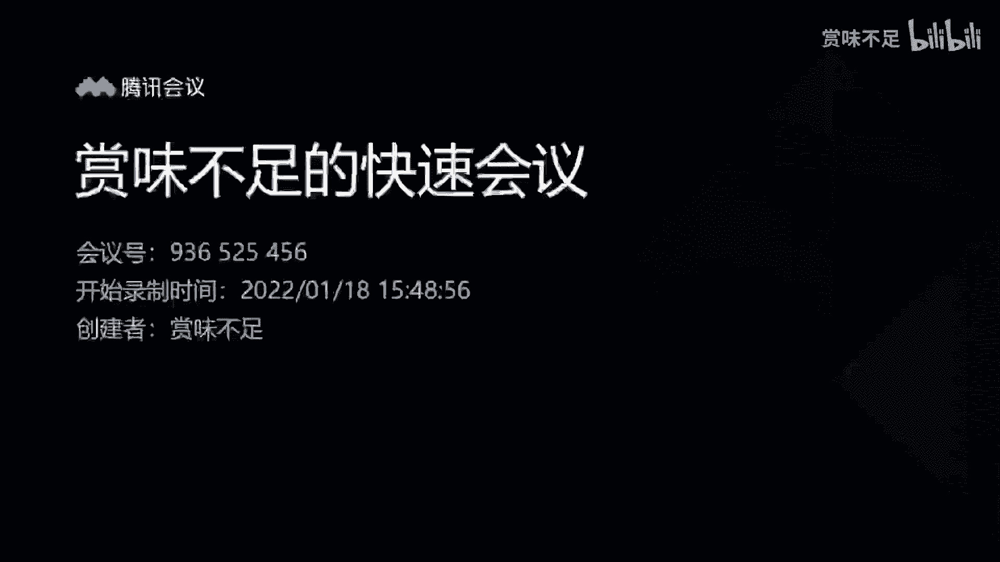
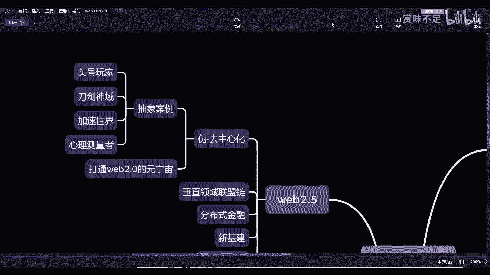

# 赏味——元宇宙中的伪去中心化场景 - P1：伪去中心化 - 赏味不足 - BV15f4y1F7jM

好那么根据上一期啊，我把这个图再扩展一下，那么这一次呢，我觉得我们可以先从就是web2。5这边开始讲，因为web2。0这边呢其实就我这个这个地方，其实可啊对这个地方其实有web2。0的，他怎么到这里来。

对吧，就V80，其实这里有个中心化的元宇宙，那我们接下来就把它拆开来，一个个来说啊，就这次的话我们主要是说这一块把它放大，就web2。5，Web2。5，这边呢，其实更多的是基于web2。

0的这么一个状态啊，这么一个基础之上去打造的，那么就像我们上节课分享所说的，就是web2。0啊，web2。0这边的元宇宙，他做的往往是一个纯中心化的元宇宙，就像我们上次说呃，腾讯也好，蚂蚁也好。

阿里也好，百度也好，做的对吧，那么纯中心化元宇宙，我们说他面临的问题就是这个地方，就是我们说的，dd个人身份，个人数据，个人资产等等等各种各样的一些东西，就是你在元宇宙里面。

因为我们说有很多人觉得元宇宙一开始，比如说什么开会啊啊玩游戏啊，对其他功能不一样的，但是呢你随着元宇宙的发展，我们相信对吧，包括你的资产的交易啊，包括你的这个学习对吧。

包括你的这个上班可能都会在里面对吧，你就是我们说对未来的理想状态，比如说你就躺在那边输营养液对吧，然后呢，你所有的活动都是在元宇宙里面做的对吧，这个就是我们今天待会会讲的对吧。

就是你你就是最理想的一个状态，但是呢我们说呃2。5里面的这个尾曲，中心化的这么一个模式是什么呢，就是你虽然每一个元宇宙都是独立的，但是呢它在底层会通过区块链的技术给它打通，那么这个打通呢。

就像我们比如说啊这个讲到很多场景啊，就是比如说你今天在原A原著里面是这个大，就是打怪物的，打个比方打怪物，你在B元宇宙里面是开会的对吧，C语元宇宙里面也是上班的对吧。

打个比方这样子我们说这个区块链打通呢，它并不是说把你这个场景打通啊，而只不过是说我们把你的一些核心东西，比如说这些这些东西去打通对吧，那么这些东西我们说如果你不通过区块链，它能不能打通，其实也可以。

但是他打不通的主要原因是，因为本来在商业化层面，大家都是中心化的一个运营方式对吧，这就好像你今天不要就是不元宇宙不重要啊，你今天说我希望把微信呃，这个是腾讯的产品对吧，和淘宝的数据去打通。

你觉得可能吗对吧，你不要说数据打通，他们之前都连外外链分享链接都是屏蔽的，你更不要说数据打通嗯，那是不现实对吧，所以说你会发现打通的本质并不在于技术，它的门槛，它的瓶颈并不在于技术对吧。

是在于本身商业化的这种运作方式，就大家是两家公司，你有你的商业机密，我有我的商业机密，这个是不打通的根本原因对吧，那么我们说那个尾句中文化的这个模式是什么，就是虽然我们的元宇宙还是中心化的。

但是呢我们的那个数字身份，主要就DID我们的那个那个数据资产对吧，或者说呃那个资产本身就比如说是货币资产，数据资产等等等，那么这些东西应该跟我的身份去绑定，而我的身份可以在多个元宇宙里面是互通的啊。

但是这个互通呢他不是真的说啊，鲁迪好像我们在举那个那个，淘宝跟微信的例子啊，就是今天它所谓的打通，并不是说你今天用淘宝的账号能登录微信，也不是说用微信账号能登录淘宝对吧，你还是各个平台用各个账号。

这是一样的，只不过呢就是在底层通过区块链方式，我们把这两个那个身份所对应的，就是这两个身份能够绑定在一起，就是至少比如说今天淘宝上面知道哦，微信的这个账号也是你对吧，他跟淘宝某个账号是有关联。

有绑定关系对吧，那么同样的在淘宝上面是一样的，他们看到哦，微信上面这个人是这个账号对吧，微信上能看到哦，淘宝是这个账号对吧，就这两者是绑定的，那么这样的话，至少对于你来讲。

你在各个不同元宇宙之间穿梭的时候，你不会有很大的一个违和感，而且随着你手上，就是跟你这个id所绑定的资产也好，数据也好，比如说你的浏览历史啊对吧，你什么打怪的历史啊，你你你上班的历史啦，打卡历史对吧。

你各种各样的历史越来越多，你的数据应该是被打通的对吧，而不是说而不是说哦，我是你说在不在元宇宙在的啊，但是呢我在这个元宇宙，我只能看到我打怪的信息，我在那个元宇宙我只能看到我上班的信息。

那这个很不元宇宙，对不对，好那么所以说我们说打通2。0的这么一个点，那么呃我再强调一下啊，就是那个啊关于这个数据共享的问题，就是因为有非常多的人，他每次讲的数据共享都会提到一个观点。

就是说企业是不愿意数据共享对暗号，那这个事情呢，我在几乎所有的地方我都会强调一下，那我觉得今天在我们这个内容上面再强调一遍，就是呃我们在区块链上面所讲的，这个数据共享的，它并不是说真的数据共享啊。

那么它更多指的是什么呢，指的是数据在链上能够去做一，就首先要做落练，首先它有个落单的过程，其次呢就是链上的参与方，能够对这个数据有所感知，当然这个感知的意思，更多的其实是知道一个结果。

而不是说知道这个数据到底是什，这就好像什么呢，我们举一个例子啊，或者举几个例子来讲，这就好像我说我今天把我的数据放到链上，对吧，好然后呢，这个链上有很多参与方法，主要有很多个参与方好。

这个时候呢这个电商参与方知道几个结果，第一个结果是哦，我这个人商量哦，我的数据在练什么对吧，这是第一点，第二点是哦知道了，我是一个男性，对不对，好，但是你说这个恋上的人，是不是能知道我所有信息。

他肯定不知道，而且他也不能知道对吧，但是呢他知道了我刚刚说的那几个金啊，这个对他来讲解金很有用对吧好，那么我们说回过头来说，那个在区块链上的这个数据共享更像什么呢，更像是啊一种隐私保护的一种数据共享。

或者一种隐私保护的数据结果的一种展示，那么举一个最最直白的例子是什么，就是嗯今天我跟你说啊，比如说我昨天跟你讲，我有扇门对吧好，然后呢呃我告诉你我有把钥匙，我我是拥有这把这扇门的钥匙。

但是呢你并不能知道这个钥匙长什么样子，你也不能知道我是怎么通过这把钥匙去开审的，就比如说我可能是左转三圈，右转三圈，就你不知道是吧，好，但是呢这个时候你就会问了，那你告诉我我怎么知道你就你怎么证明对吧。

就是因为在链上最大的问题是在于，你怎么证明你是真的，或者就像我刚刚说的，你怎么证明你拥有这把钥匙，OK那我怎么证明呢，我证明的就是哎你你你在对面啊，你看到了诶，我通过这把钥匙，我能把这扇门打开了。

那就是我证明，但是同样的你看到的是一个结果，你并不知道我手上这把钥匙长什么样子，你也不知道我到底是左转三圈，右转四圈还是怎么操作，对不对好，那么这个就是我们叫做隔离的一种方式，来做的数据共享啊。

那么这种情况下面就是说我们能够保障，或者说区块链从技术层面的底层上面，它就已经保障了你数据的安全性，但是呢你同样的又能够做达到，就是达到我们说共享数据的一种一种，一种一种一种结果，一种目的，对吧好。

那么这个事我们称之为就是呃2。0，就是打通整个2。0的这么一个方式，那么但是呢我们还是刚刚那句话，就是你说他是不是完全去中心化的，那肯定不是对吧，因为每一个元宇宙，每一个生态上面。

都是用这个中心化的运作方式的啊，中心化企业的运作，那当然这个我们就把它归类在2。5里面啊，所以我们称之为它是一个尾，去中心化的这个模式，但是呢就像我们说的，就像我们上节上一期讲的就是web2。5。

在未来它会是一个比较大的一个市场啊，我们说可能这个市场会占70%到80啊，然后像那个3。0，正面可能会占20%到30，当然我觉得20差不多了，可能20都不一定有啊，但是看未来它的一个发展趋势，看趋势好。

那么在那个委屈真心话这边呢，我在这个地方给出举了几个例子，然后回头有兴趣的同学，因为这个是部电影嘛对吧，然后下面两个是动画片，那回头有兴趣的朋友可以去了解一下啊，可以去看一下，我觉得还是很有帮助的。

那我在这个地方可以根据，通过这三个东西可以跟大家来解释一下，其实很简单，就是首先头号玩家，它里面所讲的神态焦虑洲对吧，那么绿洲他所讲的你们去看过电影你就知道了，就是他所讲的。

就是说哎我今天在不同的游戏当中穿梭，但是呢我的身份还是我对吧，我的资产可能是能够直接直接挪用对吧，比如说我在那边有1万块钱，我在这个地方也有1万块钱，对不对，就是说我的资产，我的身份，我的数据。

我的很多东西我应该是一样的，只不过呢就是说有些每一个元宇宙里面，特定的东西，它可能会有些差异化对吧，那么这个呢就是我们称之为它的一个一个，核心的一个一个web2。5的中文模式。

那为什么它会规定在委委屈中文化里面呢，那就是在这个电影里面，大家也看到他最后是有最大反派对吧，反派就是相当于是呃这个元宇宙，就整个那个绿洲的一个元宇宙的运营公司是吧。

但是呢你会发现这里面有个很奇怪的地方，就是虽然它是它的运营公司，但是他其实也不能给出据对吧，他也不能改数据，所以说呢你会发现他可能就没有讲清楚啊，但是我的猜测呃，同行玩家的底层。

他可能更多的用的是一种那个区块链的模式啊，不一定是区块链无所谓啊，他肯定用的是一种这个去中心化或者，分布式的这种模式，否则的话最大的反派人家公司，他就直接改数据嘛，他说我就拿到三把钥匙对吧。

那你说为什么所有的人都是非常公平的，去参加游戏，去解谜，正是因为他们没有，没有任何一个人有权利去拿到了360，对吧好，那这个是我们说的第一种啊，那么这种的话也是在我们看来，最最符合当下的一种。

这个嗯常见的中元宇宙对吧，这是第一种啊，那么心理测量者这个放下换，第二个叫刀剑神域，刀剑神域这变量它讲的更多的是一个怎么说呢，叫做呃潜行啊，叫做元宇宙的潜行，那么它指的是什么呢。

就是你简单去看你就会知道，当然当中有些片段我就不去说了对吧，就你从大框架上面来看，它是这样子的，他先讲的是那个VR，而且是叫做沉浸式VR，就是你是啊就是不是说输营养一样，你是叫做催眠。

催眠之后进入你的潜意啊，就进就进入他的那个那个潜行状态，然后呢你你能够那个模拟，就这个东西能够模拟你的位置啊，触觉啊对吧，包括包括包括这个无感对吧好，那这个是他第一部分，然后到第二部分呢。

他就到了A2对吧，就是说一样的，就是啊我通过这个也是戴头盔的方式，然后通过AI的方式能够让你身临其境对吧，那么最终他到第三个阶段，就进入了一种就是呃精神力状态，什么意思呢。

就是它所展现的元宇宙的形式是我在虚拟世界，因为现在的呃，我无论我们说是不是元宇宙的不重要啊，现在的虚拟世界或者互联网，它跟真实世界它是没有直接物理干涉性，也就是说我今天在虚拟世界里面。

比如说我给你做了个手术对吧，你说在真实世界里面能不能影响到你的身体，能不能影响到你的物理介质，它是不能影响，但是在刀剑神域的这个那个那个世界观，第三部的世界观里面，你就会发现它通过一个东西叫摇篮啊。

摇篮就是它的整个的比亚的一个proper prototype，就是一个原型机啊，然后姚澜这边他就能做到的是什么呢，就是通过虚拟世界的潜行，从而影响你真实世界的这个这个脑细胞的恢复。

或者说一种物理介质的一种影响，那这个我觉得可能在未来也是一种很大的一个，发展方向啊，那么在这个地方呢，肯定还得提到一个叫做加速世界对吧，那加速世界描述呢其实是就刀剑神，刀剑神域的一个姐妹篇嘛对吧。

那家族世界是被描述的一个一个世界是什么，它是这样子的，它是完全进入了，就是你会发现它是通过一个软件，然后通过一种人脑连接的方式，就是之前马斯克其实也提到过吗，就是那个胡子连着一个人脑。

然后在那边打游戏嘛对吧，大家可以到网上查一下，然后加速世界上所讲的其实是更多，像一个人脑连接的方式，然后呢嗯它通过人脑联机，能够让你无缝的在真实世界和虚拟世界与切换。

然后呢在虚拟世界里面的最高level的人，就最高等级人，它还能通过虚拟世界里面，就像我们刚刚说的刀剑神域，第三部分是一样，就是它能够用虚拟世界里面的力量，去影响物理世界啊，那么从本质上来讲。

我们说它可行性怎么样，我们先不去说它对吧，但是我们说在理念上面，它很接近于，或者说他很很超越于，目前元宇宙的这么一个状态好，那么这个是第三部分，那么第四部分呢其实心理测量者指明所讲的呢。

它更像一个区块链的世界，那么有兴趣的朋友可以去看，但是我总结一下它的核心，心理测量者的核心是什么呢，就是在世界上有很多的罪犯啊，我们称之为在他的世界观里面，称之为潜在犯罪者，但是问题是按正常的道理来讲。

这个人在不作恶之前，你是无法定他的罪对吧，你不能说啊，因为我看着他像坏人就抓他，那肯定不行，对不对，但是在心理村庄这里面，他建立了一个社会制度，这个社会制度是什么，就是每一个人他会有一个色相啊。

在他的关关键在他的那个名字里面叫做色相，色相呢就相当于是一个有点像那种PH值一样，就是你在某个值范围内是正常的，你如果超出某个值，你就是一个潜在犯啊，叫做潜在犯罪者，如果你某个值但突破了潜在犯罪者。

那你就是一个真实犯罪者，那么他对于每一个不同的等级的犯罪者，会实行不同的一种抓捕行动哦，有的就可能直接是枪毙了对吧或者怎么样子，但是呢我们关心的是什么呢，就是你说这个人是潜在犯。

你说这个人是犯罪的犯罪人，你是怎么判断对吧，你你你说无论是今天是警方来判断，还是说是政府来判断，还是你个人的判断，其实无论谁来判断，他都是没有说服性的对吧，因为我还什么都没做了，你你凭什么说我犯罪者。

对不对好，那么在心理测量者里面，它的核心是什么呢，就是他做了一套系统，这套系统里面的收容呢应该是全世界还是全球，我不知道啊，不是全世界还是全国，我不知道啊，就是他应该是收容了所有的那种。

就是天才的那个大脑，然后以那种活性的方式放在里面，然后呢他用他的众多的大脑，会以这种我们称之为，有点像区块链这种分布式的方式，它通过众多的大脑，分布式的同一时间一起来做判断，这个人到底是不是犯罪罪啊。

它相当于是一个叫做什么呢，叫做多方来评估的这么一个那个那个那个系统，只不过他用的是人的大脑，而且是很多天才来打好，那么他最终通过这个这个中心化的系统，其实这个中心化系统，里面是一个那个分布式系统对吧。

因为里面有很多个大脑，对不对，它通过这个很多个大脑的这个系统，通过摄像机，通过各种各样的分析，可能他可能有一套算法啊，通过个人的分析，然后看这个人是色相是多少，然后来定他的罪啊。

那么这个就是它的整个的一个世界观，那其实本质上来讲呢，我们为什么在网上会有很多的人啊，会提到头号玩家和刀剑神域，还有心理测量者，是因为有非常多的人认为在元宇宙概念之前啊，未来的世界发展。

它很容易往这方向去走啊，而且是肉眼可见的对吧，当然你说人机也好，像这种这个这个潜在犯也好，你说是不是很科幻，其实也未必啊，现实生活当中有很多的情况，其实只不过是这种，就是就是他不一定说制定的制度。

它可能是嗯师事是这种制度的一种抽象性，或者一种一种原始形态，其实都是存在的，都是有苗头的，对吧好，那么我们回到那个web2。0这边，其实为什么把这些列出来呢，其实因为这些东西啊，其实我们会发现更多的。

它的背后还是有中心化的力量存在的，但是呢在它的整个世界观和系统里面，都拥有着区块链，或者类似于区块链的这种趋势文化的思想啊，那么所以说呢在这个里面，无论是那个潜行啊，还是A2，还是说是完全的人脑联机。

还是说是那种分布式社会治理对吧，大家会发现这个东西呢，更接近于我们现在所说的道啊啊，接近于我们所说的公链啊，电信我们所说的区块链啊，都要这些东西啊，那所以说我觉得啊，其实更多的朋友如果你们想要去。

因为我接下来会把下面每一个都分开来讲，我们每一个都分开讲一期吧好吧，然后就是我觉得更多的朋友如果想要去了解，你要给元宇宙呢，可以把这些东西看一下啊，因为这些呢看完之后大家思考一下。

我觉得还是非常有帮助的好吧，然后我觉得通过这些呢，大家也可以去完全的了解，就是说可能可能区块链如果这个真正落地之后，他能够展现出的一个一个一个一个解，就展现出来的一种魅力，或者是解决的问题是什么，好吧。

那么OK那这一节我就先讲到这吧。

