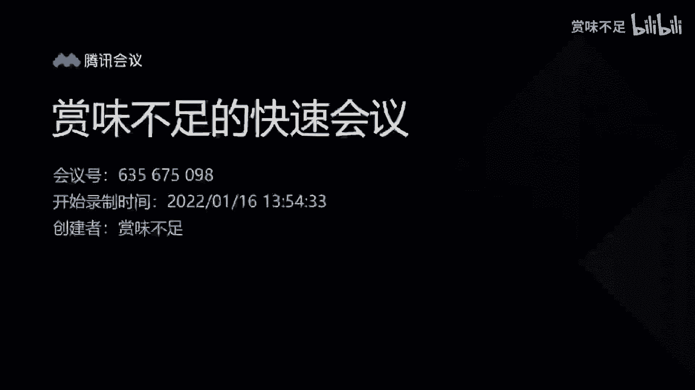
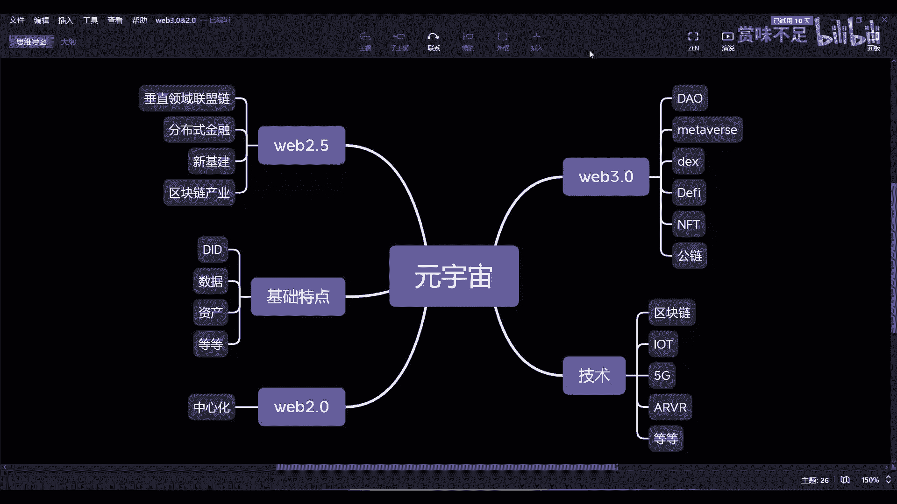

# 赏味——来谈谈实际的元宇宙（web2.0和web3.0的融合） - P1：meeting_01 - 赏味不足 - BV1Uu41127jR

嗯好大家好啊，我正好在最近正好在做这个图啊，然后做到一半想着跟大家正好分享分享啊，讲一下，就是说我我我们现在对于元宇宙的这个理解啊，其实在这个里面呢，首先啊，我觉得目前呢大部分的这种这个元宇宙呢。

其实讲的时候比较的怎么说呢，比较笼统或者比较概念化，这是一种啊，还有一种就是基本上就是说啊我们这个对吧，就对标游戏啊，然后现在说某某某公司做了一个游戏出来啊，然后这个游戏呢大家可以在里面说啊。

我有一个AVA对吧，就我有个虚拟头像啊，然后呢我这个在里面可以学习啊，在里面干嘛对吧，那我觉得你说它不是元宇宙吧，那他也算啊，你要他说是吧，好像又不是那么贴切，这最主要的原因是什么呢。

最主要的原因是在于整个这个这个概念啊，它比较笼统，因为你你总不能说哦，我我就仨字对吧，这三个字我对于这个某一个具体的业务，已经非常就描述的非常清晰了，因为基本上是不可能的啊，那么首先我们来讲啊。

从我们的角度来讲啊，就元宇宙本身，因为它只是个概念对吧，那这个概念我们套到任何一个细分领域，其实都不合适啊，所以说呢我们可能更关注的是，他如果落怎么落法啊，是不是叫元宇宙这个东西并不重要啊。

那首先呢我们来看啊，首先有那么几种啊，我在这个地方也列啊，那么关于技术相关的呢，我可能更多的只关心区块链，又为什么呢，因为呃我们来看哦，在这个技术层面，除了除了区块链以外。

剩下的其实中心都是中心化的技术，那么区块链呢，在整个五元宇宙的落地过程当中啊，就是呃不管它是什么，那比如说我们称之为国内落地还是国外落地啊，还是web2。0，web3。0落地，这不重要。

重要的是区块链无论在什么地方落地呢，它都会产生它的去中心化的这么一个效果啊，这个我们待会儿会来讲一下啊，稍微讲一下，那这个是技术层面，我们来看啊，首先是那个web2。0啊。

这个地方的一个中心化的一个东西，那中心化现在呢其实做的东西，元宇宙大家也看到了，就像那个matter对吧，就FACEBOOK做的，然后像那个腾讯之前也做过，百度之前也做过对吧。

那其实在我们以往的这个分享当中呢，我们之前在厦门那边上课的时候，其实有同学就问了，就说这个老师啊，我们这个腾讯最近推出了一些元宇宙啊，百度腾讯推出一些元宇宙，你怎么看这个东西呃，我觉得这个东西比较简单。

就是我们啊就是这么来讲吧，就从我角度而言啊，你说我说他适合不适，其实没有说服力啊，那我说我说你可以这么理解，就是元宇宙本身很大的一个特点是什么啊，我在这个地方没有写啊，我可以把它写一下。

就元宇宙这边很大的一个基础特点啊，基础特点是什么呢，哎呀对吧，一个是dd啊，一个是那个那个数据啊，这个还有什么啊，身份身份就DID一个数据，一个是啊资产对资产啊，然后还有可能其他的啊各种各样的东西啊。

这个等等对吧好，那么我们在这个地方来看啊，就是我说你怎么来判断这个东西呢，很简单，就是你你你认为的这个元宇宙啊，跟现在腾讯跟百度展现给你的东西呢，有个很大的区别在哪里呢，就是你今天在腾讯里的元宇宙里面。

你去玩了，对不对，你说我有我的身份，我有我的资产，我有我的别的东西，那我就问你是不是到百度这边，你还需要重新注册个身份，你的资产其实是不不互通的，你的dd也不互通，数据不互通，你的anyway。

任何一个东西都是不互通的，对不对，好，那么这个东西你认为是不是属元宇宙对吧，那这个大家自己去判断对吧，我我自己，我在这个地方说它适合不是没有太大意义，对不对，好，那么这个首先是第一点，第二点是中心化的。

元宇宙早晚都是会存在的啊，这就好像我们说这个这个人群啊，我们说啊无论这个东西怎么发展，往后我们相信啊，就是你中心化的这部分的内容，它总归会有一大批的这个受众啊，这就好像什么呢。

这就好像你比如说现在那个那个滴滴对吧，或者快手啊，抖音啊，这些就是就是你说他有很多人，他说我不用对吧，我什么我也不，我也不做滴滴司机对吧，我也不用拼多多，我也不用抖音对吧，有很多人就不屑一顾对吧。

但是问题是你会发现很多人都不屑一顾的，这个背后，它依然还是有非常庞大的群体在使用，这意味着什么，意味着就是你无论是中心化也好，还是说相对，就可能很多人这个呃嗤之以鼻的一些东西也好，其实至少在中国啊。

或者在全球范围里面，它原本就有非常大的一个受众，这个东西你是避不掉的对吧，因为不能因为说啊我不用对吧，我不喜欢，我很讨厌这个东西，就就就就就就这个否认这个东西，对吧好，那这选人是第一块。

那么我们来看这个呃，先看web3。0啊，就是就在这个地方，其实我写了一个web2。5，对不对，这个我们待会再来讲，再看一下web3。0，Web3。0，这边呢我们说啊，2022年被很多人称之为道的元年。

对不对，那道呢在整个过程当中呢，其实我们说啊我在2020年吧，年底吧我看过一份这个全球的报告，其实本身目前来讲道的运转还是比较弱的啊，因为什么呢，因为这个跟人的意识有关系，就是你倒在里面，我们说啊。

不管链上治理还是练下治理对吧，总归会有所谓的投票对吧，总归会有整个的一个治理方式，那其实从你整个人的一个这个意识角度，意识形态角度来讲的话，其实目前能够懂得到的，或者能主观去参与到里面的人很少。

很少有更多的人说啊，我就要参与这个东西，但你问他参不参与，他不参与的，他就是嘴上说说啊，或者去买个B对不对，但是你真的会到这么一个社区，或者你某一个到的这么一个治理做过贡献吗，极少数极少数。

这也是为什么，2020年那份报告里面所提到的，或者一年有多少人那个投票，那个那个通过已经是非常非常非常呃，就是就是排名靠前的了啊，大部分的到呢你说他有吧有的，但是真的体验呢很少啊，然后投票的人也很少。

那这个可能是目前所面临的一个问题，那么呃3。0这边，其实还面临着一个很大的问题是什么呢，就是我们说的这个呃先有鸡先有蛋的问题，因为我曾经用就是DEFI的这种思想，跟跟很多传统金融的人交流过。

就他们觉得他们是认可的，但是他们最大的一个一个呃就是叫做风，他们认为的风险点吧，就他们的认为风险点吧，就是说中心化的东西呢其实要么就有对吧，就比如说中心化的一个金融业务，要么他就能做，要么他就不能做。

但是他能不能做，其实还是能够有中心化去控制对吧，就比如说我这个业务对吧，我做了我，我比如说能够善始善终对吧，这个是他关心的，但是在道德层面呢，他就觉得这个事情有一有一点很尴尬的地方，就是你目前来讲。

无论是区块链还是define还是oracle对啊，他认为你道德治理呢，他其实是，就或者说你一个去中心化的一个治理呢，他首先是要有受众的对吧，也就是说你不是我说了算，你是一个整个群体说了算。

但是如果这个业务非已经做的很好了，非常庞大了对吧，那么到某一天我们打个比方呃，这个业务里面的社群的人不做了对吧，那你说这个社群整个道他就不work了对吧，那博物的情况下。

可能是不是说这个业务这个功能就没有了，或者说这里面的人资产，就就就就比如说呃这个流通不了了，或者说是拿不出来了，或者说就就锁在里面对吧，就是他认为的是就是在这个里面不是说到不好。

而是说在整个肢体过程当中会有这种风险，就是说啊我就比如说没有没有人群对吧，当我整个受众很少很少的时候，那么自然而然它的一个呃，比如说像流通性，流通性挖矿啊，或者说像那个啊AA啊。

不是AA那个mm或者其他各种各样的一些东西，其实就等于是不工作了，或者说其他工作效率就变得很低啊，那么这件事情其实本质上对那个呃，这个这个用户的资产也好过，对整个生态也好，其实是比较大的影响。

那也有人会说吗，那你web2。0这边也有很多企业会跑路啊对吧，那其实不是一个道理对，那这当中呢其实还有一点点不一样，就是他认为中心化的东西就算跑路了啊，它是可控的对吧，经跑路了。

可控的同时就是说善始善终，大家是可以有意识的去做的，但是你在到这边呢，就是你可能就会发现你要可控它的，可就是他作恶成本会变高，但它的可控成本也会变高对吧，那么这个可能是他们觉得最大的一个风险点。

因为我们把道，或者我们把DEFI去引入到某一个产业里面去，的时候，怎么样，他最终都希望这个东西是可控的，而不是说就好像天女散花散给社区了对吧，那么这个是啊一一方面啊，那么web3。

0现在还是比较旺盛的对吧，我们知道像周杰伦啊，LV啊啊，然后像那个这个这个嗯玛莎拉蒂啊，保保时捷啊对吧，各个各种各样，包括哥斯拉对吧，各种各样的IP都在往那个那个那个meta，就是往往FT这边方面走好。

那么DEFI现在也已经经过了这么多年，DEFI像现在稳定币也好啊，啊像一些oracle也好啊，像一些这个小额借贷啊，小额的呃，这个这个保险啊对吧等等等啊，就很多的生态也已经非常完善了，好那么同样的啊。

这个地方还少了一个，就那个DEX，对吧，那包括unit swap对吧，包括其他的，包括像现在呃NFT的那个open c，虽然open c是中心化的，但是不管怎么样嘛。

它整个还是撑起了整个NFT的一个一个，交易市场，对，那么web3现在呢整个来讲啊，其实它的一个未来特点就比较明显，就是首先呢它会拥有元宇宙的基础特点，就是所谓的DID呃，DID是自己的数据。

是自己的资产，是自己的，对，那首先是第一点，第二点是整个web3这边它的一个原始生态，它就是从那个网上出现的，也就是说是我们可以认为是比如说互联网资产，或者说是元宇宙资产，它是原住民好。

那么在这个地方呢，我们要说就web3它有什么好处呢，第一它是不不太受疫情影响的，对不对，第二呢他会有自己的一套体系，就像我们在这边看到的DEX也好，DEFI也和NFT也好，matter as也好。

道也好，它就会自己的一套体系，他其实根本就不care，就是这边的，比如说Y2。0的世界，或中心化的世界是怎么样的，但是同样的就是web3的，很多的那个人参与人群呢，他其实也不care什么呢。

就是比如说什么你是玛莎拉蒂啊，你是宝马啊，你是什么LV啊，就他不关心他，可能更多的就是我们从未来来看，更多的一些驰名名那个大名的品牌，我相信这个大众的品牌，它会从圆圆就是web3。0原声去产出啊。

我们称之为原web3。0的原生品牌，那么这种可能会更多的把把把一些现有的，比如像耐克乔丹啊对吧，各种各样的一些啊，这个这个2。0的品牌把它挤出去啊，这个是有可能的啊，这个是完全可能，因为毕竟3。

0是个新世界对吧好，那么接下来其实最大的这个争议点或者最大的，我认为最大的一个关键点在哪里呢，就是在于，最大的一个关键点是什么呢，就是这个2。5啊，那么在我看来呢，其实2。05和2。0和3。0。

它是一个互相侵蚀的一个过程，就是嗯我我当然就是，我相信有点脑子的人都会明白，就是不存在，就是说2。0和3。0只存在一个对吧，不存在说2。0以后啊，就3。0越发展越小对吧，你说2。0永远就会取代3。

0或3。0，越发展越大，把2。0取代掉，它都不可能对吧，这就好像有很多这个投资人碰到我就跟我说啊，你们格局太小对吧，那我相信5年内10年内对吧，整个这个去中心化会把中心化替代掉。

我就虽然我这个尊重你的意见，但是你这个想法过于极端对吧，那我们认为2。5，2。0跟3。0它是一个相互侵蚀的一个过程，那什么概念呢，就是首先先说3。0啊，就2。0T3。0的侵蚀在于2。0里面。

就现有的世界还是有非常多的品牌，非常大型的一些资源流量啊，它可以引导这些流量，这些品牌去前往3。0，但是3。0现在最大的门槛在哪里呢，就是他必须要有自己的钱包，必须保管密钥，必须保管助其词。

那这些可能是对于现在所有的人来讲，最大的一个问题，对吧好，那首先这是第一个啊，那么3。0里面呢，接下来会有非常多的2。0的品牌，或者2。0的流量会流流进去，这个是毫无疑问的啊。

毫无疑问的必然会发生的事情，而且3。0毕竟没有2。0这么卷，就现在2。0的世界，大家都知道，无论是to c to b to g啊，还是too to to任何的东西，他的都很卷，那么3。0对2。

0的侵蚀呢，我们更多的认为是一种技术上的侵蚀，因为呃无论是3。0还是2。5，它的基础建设都是区块链啊，包括也会都有IOTI5，GAIVR这些技术都会有，但是呢就是2。5的这个状态呢。

其实我认为是比较占占大头的，就比如说可能2。5的状态占80%，3。0状态占20%，这可能是这么一个划分，那么2。5是什么概念呢，就是说用区块链去赋能与产业好，用区块链赋能产业。

用区块链赋能与传统金融科技，金融，运用区块链去赋能于现在的很多的一些呃，这个商业模式啊，包括我们在这个企业的分分布式金融，分布式商业啊，包括像垂直领域的一些联盟链好，那么这个是2。0，接下来肯定啊，2。

5肯定会做的，而且这个时间会比较长，可能会有10年到15年的这么一个概念啊，但是在这个里面呢，我们说他为什么23。0会轻12。0，主要有那么几个点啊，第一个点是2。0，实在太卷了。

它再往下剪辑卷不出东西来哦，所以他一定会谋求新的发展，那么区块链也好，METAVERSE也好，NFT也好，这就是它的最新发展啊，就是从技术本身，从业务本身这个东西完全一点问题都没有的啊。

那么他可以去他可以去做哦，所以大家未来会发现很多中心化的企业，包括政府啊，会去发行自己的NFT啊，这毫无疑问是吧，那首先这第一点，第二点是什么呢，就是呃分布式商业，那从分布式商业来讲呢。

就是呃其实通说说通俗点来讲，就是对大众，对所有人都要有个激励机制，但这个激励机制呢，它其实更多的是需要通过智能合约来保障，因为这种激励机制很简单，就比如说我今天去吃海底捞，海底捞说哎你每吃一顿对吧。

我打个比方啊，我分给你这个呃这个这个这个月的对吧，你按照你迟迟token的数量嘛，比如说我发给你积分啊，这个积分就token，那他说我根据你值token数量，我来给你做每个月的这个分类对吧，或者分红啊。

给你有价值的一些反馈对吧，这个这个很正常啊，或者实在不行，海底捞说我回购对吧，那总可以吧对吧，但是呢你会发现这种逻辑，这种激励，它背后一定是需要区块链和智能合约来做的，为什么呢。

因为中心化的东西它是不可行对吧，这就好像今天还得要跟我说啊，你有200个那个这个捞B对吧，然后呢你说啊，我第一个月我能分你100块钱对吧，那你特别开心哦，我以后每天都去吃海底捞，对不对。

但是呢你会发现诶等你有了2000个落地的时候，可能你就说哎，海底捞一个月只分你不是100块钱了，就变成十块钱了，缩水了，你币涨了十倍对吧，你的你币的数量涨了十倍，你的你的价值缩水了十倍，为什么呢对吧。

这个原因就是因为说他就这个东西是中心化，说了算的对吧，当然你说整个海底捞业绩不好对吧，或者说这个流水不行对吧，或者它要倒闭了，这个都是可以理解的，但是这些事情是不是都在链上可查。

或者说都是通过智能合约来保障的，这个用户是不知道的对吧，那当然回过头来讲，用户的确不用知道，但是你背后的技术不用区块链，那你是不太可信的啊，你没有可行性，那么这个事情呢。

是未来分布式商业的一个一个很重要的一个点，一个点，那这个是第二点，那么第三点是什么呢，就是我们在这个地方所说的这个新基建啊，那么新基建这个地方呢，主要用区块链要做的是什么呢，就是增加可信度啊。

无论是它的横向那个合作方，还是正向的供应链的合作方，那么你都会发现，需要通过区块链去做一些数据隔离啊，就是在数据隐私保证的情况下，去做一些数据共享啊，我们称之为是这种方式，那同样的这是第一步。

第二步的话呢就是会基于新基建，也就是基于区块链去发行他的企业资产好，那么我们称之为是2。5的企业资产，那这就好像什么呢，这就好像你今天有套房啊，这套房你说打个比方2000万对吧，你往往外去挂啊。

这个时候呢，你会发现它在经济好或经济差的各种，各样情况下，它的流通性并不高啊，并不高，但是呢我们试想一下，就像现在有些城市啊，我不方便讲，有些城市他把这个房子划，比如说2000万啊，划成2000份好。

花了2000份，那这个时候每人就出1万块钱，那你说它的流畅性高不高对吧，其实是一个道理，只不过呢就是中心化的这种方式，还是那句话，就是它的可操作性太少哦，同时它的风险性太高，这个就是最大的问题。

那我们试想一下，如果来说未来的这种，这个房子的这种也不叫股权吧，就是产权产权啊，然后它的这个这个销售价格啊，通过智能合约来做分润，那其实我们相当于业务可以同样的做，但是呢我们背后的逻辑。

可以通过智能合约来做一定的这个约束对吧，那这个就是非常合理合情合理的一件事情，那再往后其实我们说2。5这边要的是什么，要的就是资产跟那个那个数字，人民币的一个交易对吧，那么我们说中心化区开交易所。

是是就是呃趋势所趋，就是未来一定会开，你说他什么时候开不知道啊，但他一定会开，那你说他开的这个目的是什么，很简单对吧，一还是那句话，现在太卷了，我们需要创造新的商业价值和新的商业模式，和新的商业行为。

已经卷的不行了啊，真的卷的不行了，而且已经让这个卷加速了对吧，这是第一点，二就是说我们需要在全球做出比较大的榜样，这个榜样呢并不是说好像我们就啊，这个做的比比别人比别人好，告诉大家啊。

你们看我们多牛逼对吧，并不是，而是说我们会告诉全球，通过中国的这个战略啊，通过中国的一些业务发展，你可以得到更多的商业机会，那这种更多的商业机会就是你可以到中国来IPO，那当然我们不一定叫IPO。

可以叫A什么的，O对不对，那你可以到中国来做你想做的，web2。5的这个事情，那当然你说web3。0他怎么做，因为他已经没有国界划分了，所以他怎么做都可以啊，但是web2。5从目前来看。

的确是一个很大的一个发展趋势，因为毕竟啊我们说毕竟大部分的主权限，主权国家，不管它是几党制啊，就主权国家他还是说中心化啊，他不可能说完全你说一个政府倒换，那是不可能的，就就很多投资方跟我说啊。

以后这个对吧，DESCHIZ统治世界，我只能保持抱抱抱有这个态度对吧，你说是不是过几百年，再过个一两百年会不会这样，我我也许认同，但是至少在我们有生之年，我觉得嗯对吧，不太不太不太不太可能啊，不太可能。

但是不管怎么样呢，我觉得有一点就是，就是今天我本来想讲的核心的原因是什么呢，就是啊这些都称之为元宇宙啊，我认为都这些都称之为元宇宙，而且与此同时呢，2。5会有新的商机啊。

就是我希望大家能够更多地投入到嗯，web2。5和web3。0的这种建设当中，因为web2。0太卷了，再卷下去就就就真的卷卷的很苦很苦，卷没了啊，卷没了啊，但是呢2。5有非常大的建设性，可建设性，3。

0拥有更大的建设性啊，所以我觉得这些才是元宇宙的本质，而不是我们现在啊，这我又要吐槽了对吧，就就不是现在有很多人，什么什么和商业来说元宇宙啊对吧，什么某某某院士啊，教授啊，然后给你给你说啊。

我们以后就把有一个很幻想的一个世界，这个不重要，这个不重要，就是这这这这对我来说，这就好像什么，这就好像你跟我讲，你说未来人是可以永生的，你说我认不认同，我可以认同，但是你跟我画这个饼对我来讲没有意义。

因为我相信我也活不到那个点，是不是对吧，所以我觉得就是说这个当下啊，这些内容可能比较比较关键好吧，我就先讲这些吧，就后面再有一些扩展的，我会慢慢再给大家扩充好吧，谢谢大家，欢迎这个有有有需要的哦。

有需求的可以找我沟通啊，找我沟通。

