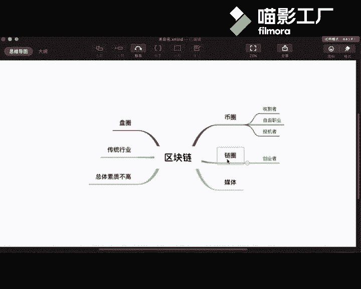

# 赏味不足--区块链人群-试听----P1-区块链人群试听---赏味不足---BV1ME411M7zS

在本节课中，我们将要学习区块链生态系统中存在的主要人群类型。了解这些不同类型的参与者，有助于我们更好地理解整个行业的构成与现状。

上一节我们介绍了课程的整体目标，本节中我们来看看区块链领域具体有哪些人群。

首先需要说明的是，左侧所列出的特点是目前行业中普遍存在的现象，这些现象在右侧的各类人群中都有所体现。无论是在币圈、链圈还是媒体圈，这些情况都很常见。

以下是当前区块链行业的几个普遍特点：

*   **盘圈遗留**：此群体源自传统的传销资金盘，特点是参与人数众多，且存在多级分销体系。其中许多人在传统行业已取得相当成就（如身家数亿或数十亿的商家）。这类人群目前大量进入了区块链行业，从事交易所或发币等项目，并将原有的受众直接迁移过来。
*   **传统行业转型者**：越来越多来自传统行业的人士进入区块链领域。他们根据自身背景选择方向，例如媒体人做区块链媒体，技术人员可能从事链或币的开发，培训从业者则继续做区块链培训。总体而言，这类转型的跨度有时并不大。
*   **整体素质有待提高**：这是一个比较直白的观察。行业中相当一部分人，无论其具体从事币、链还是媒体工作，在为人处事、谈吐修养方面表现出的综合素质并不高。这体现在许多方面。

那么，这些“整体素质”问题具体体现在哪里呢？

*   **言行失范**：例如，动辄辱骂、造谣、互相攻击。这确实是当前行业的一个现状。
*   **案例说明**：昨晚发生了一个例子，行业内一位较知名的CEO，其公众号因包含敏感词汇被举报。对此，他的应对方式是在群内辱骂，并宣称要将其他同行企业的公众号也一一举报回去。这种行为模式反映了部分从业者的素养。

以上我们分析了行业的普遍背景，接下来我们具体看看右侧的几个核心圈子。

## 币圈（Coin Circle）🪙

币圈主要包含以下几类人群：

*   **收割机/跑路者**：指那些发行并无实际用途的代币，随后卷款跑路的项目方。
*   **自由职业者**：这类人将炒币作为重要收入来源，但并非严格意义上的全职工作，也没有其他固定职业，因此暂称为自由职业者。他们在币圈中占有相当大的比例。
*   **投机者**：包括散户和机构投资者。在2017年及前后，投机行为尤为盛行。但进入2018、2019年后，市场行情变化，许多投机者的收益回吐，目前投机市场的规模已不如前。

币圈的现状也充满变数。例如，此前某家规模较大的交易所及其创始人，尽管在行业中被视为“大佬”，但最终也出现了跑路事件。这个行业中的许多事情难以简单定论。

---

本节课中我们一起学习了区块链生态中的主要人群分类，包括普遍存在的行业现象以及币圈内的具体参与者类型。理解这些是认识复杂区块链世界的第一步。