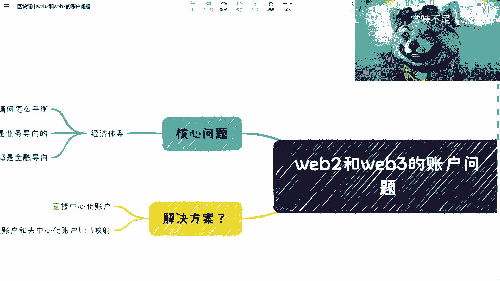

# 赏味区块链——web2和web3的账户问题 - P1 - 赏味不足 - BV1z14y187M5

嗯好大家好啊，我这个继续来讲我们的这个内容啊，所以大家接下来这个内容呢只能在微博上，我小号上看到啊，然后其他各个平台我该同步还是同步啊，呃然后是这样子的，就是同样的我这边啊给大家还是叫什么。

就是再说一下这个群的问题，就是也欢迎大家有兴趣的可以加群啊，然后就是呃纯炒作或者炒币的，大家就算了好吧，然后有什么问题可以私下来问我，然后大家想在就是呃维巴尔的区块链或。

web 3的区块链这边想要做些事情的啊，或者来说就一起讨论探讨的，那我欢迎大家加群好吧。

ok那这个我就先讲这么多，然后关掉，ok嗯然后这一次的这个内容呢主要是讲，我想讲一下，这个y82 跟web 3的这个账户的问题，是这样子的，就是我看一下啊，放大再放大一点，就是wifi 3大家都知道吗。

也就是说简单来讲，就是说web 3这边我昨天在微博上也说了，就是呃我们举例子，就比如说那我们举例子，比如说那个腾腾讯对吧，比如说呃b a t吧，b a t j对吧，或者说像那个呀呀呀啊什么鬼什么鬼。

啊你比如说嗯b a t j对吧，然后字节对吧，吧吧吧吧等等等啊，那你比如说这些平台啊，他们给我们现在做的是什么呢，就是呃它既给我们创作了功能对吧，创造了功能，创造了业务，创造了整个的产品啊流程啊。

同时呢也是创造了就是复杂的账户体系，对吧，复杂的生物体系，那么呢就是对于用户来讲呢，但是呢就是这个账户本身，我们是没有一个就是可控权的对吧，所以你看你这，为什么我这个账户说封就封对吧，说禁言就禁言啊。

那这个是第一个问题，那第二个问题呢，那么web 3这边呢是什么呢，web 3这边的这个点就在于说这个产品啊，就是这个项目方或者说这个公司啊，或者这个这个这个这个组织啊，他做的是什么呢。

他做的就是一个平台，就比如说啊这个微信对吧，或者其他的一些产品，我们就拿微信来讲啊，就是说在word 3里面，就相当于他只做了功能啊，只做了流程，只做了业务，但是呢它是没有账户体系的。

那用户用的时候怎么用呢，直接跟这个平台或者跟这个系统，或者跟这个合约对吧，做对接，那么这个时候呢就相当于说啊，它两者是很剥离的，也就是说对方啊，我不管他是一个公司还是也好，组织也好。

他是无法获取到我们的这么一个这个用户，用户的这个叫做账户相关的信息啊，或者说他能获取到，但是呢他没有办法控制这件事情啊，那么呃就算啊今天某一个合约说诶，我不允许某一个这个产品啊，那没有关系啊。

因为在微博三里面，反正我们的账户都是匿名的啊，我一个人其实可以有五，那而且作为这个平台方或者项目方，他也不知道我到底是谁啊，所以说它其实整个一个一个web 3生态，在这上面就是非常有价值的。

就是说呃用户对自己的这个账户，我的资金对吧，我的这个很多信息，那么我对我自己的这个信息非常有保障权，同时我也有我的可控权啊，不是说你今天想把我账号删掉，就删掉了对吧，那么这个是web 3。

那么wifi 2呢，现在的问题在哪呢，那么我要去连接啊，比如说区块链或者说其他一些东西的话，那其实是很麻烦的啊，所以说为八二目前就是一个啊，这个叫做呃纯中心化的这么一个生态哦，我这个地方顺便说一句啊。

因为我现在整个的这个内容呢，我是多平台发布的，就如果你是在呃这个一些音频的，这个平台上面看到的话，那那你可以到b站或者微博上搜索，因为本身我的这个内容是有视频的，好吧。

就是可能大家看视频的时候会更这个通俗，直接一点啊，然后我们就来说呢，现在也有很多人会跟我说，他说哎那你看啊，呃既然你现在说这个问题，那我们说web 2和web 3，有一个很好的解决方案。

那当然这个地方你们会看到我解决方案，后面打了个问号，对不对，那他说我有个很好的解决方案是什么呢，就是我也我可以直接做中心化的账户对吧，就是我用v82 的模式，去让用户接入v83 ，那与此同时呢。

我可以直接用中心化的账户的模式，可不可以可以啊，可以，那么直接中心化账户的模式意味着什么呢，和去中心化账户的一比一的一个映射，那么这个逻辑的背后是什么呢，这个逻辑的背后就是简单来讲。

就是说我们对于用户来讲，用户是不需要知道，就是我们会看这里啊，就是如果我们这么做的话，也就意味着我通过中心化的技术，那么再深层次来讲，就是我们做了用户的私钥的托管对吧，但是这个问题在哪里呢。

就是你既然要，让这个用户去进入web 3，但是你等于抹杀了web 3最大的一个价值，核心价值点就是它的一个这个账户啊，这个用户信息的一个自主对吧，那么这个时候你虽然做了一个一比一映射。

但其实等于说所有这些web 21，web 2的这个用户手上的死药，等于都在你的中心化的系统里面做托管，那么换言之，也就是说他们的资金，他们的身份，他们里面所有的一些信息，都是被你所掌控的。

那么我们说今天如果来说你要作恶啊，我不管是你是要比如说作恶啊对吧，还是倒，嗯这个倒闭了还是还是怎么样对吧，就我们不管我们不管你是什么原因啊，就是最终你会发现你要去作恶呃，你要去就是倒闭了或者怎么样。

其实对用户来讲，用户一点办法都没有，虽然你说啊你是一个啊，虽然你说你是一个就是啊，想让vivo的用户进来对吧，然后呢这个进入到web 3，然后呢想了一个这么好的方法对吧，但是问题是，问题是。

这个模式本身也具有非常大的风险性对吧，用户等于托管了，托管了他所有的这个这个信息啊，那么这个时候也有人说，他说现在的web 2世界也是这样，子的他说也没有，我们也没见到说用户啊，因为这个自己的信息呃。

那个那个那个这个受到了侵犯对吧，或者来说是不可控的，而不去用微博，微信对吧，或者其他的各个软件打dd啊，或者其他平台，但是也没有进行用户反抗对吧，那其实这个逻辑是对的啊，但是呢现在的问题在哪呢。

就是说我们既然要让等，我们的目的，是为了让web 2的用户更多进入web 3，那么我们就不应该去抹杀web 3的，这么一个逻辑，那如果来说要抹杀web 3的逻辑的话，那其实本质上这件事情就不用去做了。

那你何必去，做什么中心化账户和去中，去中心化账户的一比一呢，你直接做中心化账户嘛，算了，用户反正也不知道它背后到底是，比如说用户，也不知道我背后到底是去中心化的练，还是中心化的系统，反正你也不知道。

而且你本来是打算欺骗他，对吧好，那么其实呃说到这儿呢，就是我们要说的并不是这个核心的问题，就是这个问题并不是最核心的，其实最核心的问题还是在于经济体系啊，就是我这个地方也写了经济体系，什么意思呢。

因为尾巴尔现在是由义务导向的，我们举个例子，比如说滴滴啊，饿了么美团啊，他是有所谓的业务闭环的，那么它的业务闭环就说ok，比如说我我美团啊，我的产品，我这个公司，每个月都是需要花巨大的这个金额。

来养活我的这个公司，整个公司的，那与此同时呢我也是有收入的，什么收入呢，你比如说滴滴打车对吧，美团饿了么也好，各个平台也好，用户平时都是用的，有大量的用户，海量的用户去用。

那么同时呢我是拥有整个商业闭环的对吧，那么这个叫做v8 是以业务为导向的，那web 3，现在我们都知道web 3现在就是它可，能处于一个初级阶段对吧，在之前的视频里面我也提到过，正因为他现在是。

同时非常早期的一个阶段，所以web 3本身不管它到底是define也好，game fine也好，还是其他的n f t也好，就是我们说啊，不管它业务是什么逻辑，它的根本其实是没有业务逻辑的。

它的根本就是金融导向，就是你把皮剥掉，它的本质就是金融导向啊，我们说可能是一级市场，可能是二级市场，可能是拍卖对吧，可能是其他的一些东西，但是不管怎么样，业务导向的，那么这个时候就有个很大的问题，就是。

虽然我们可以做中心化账户，和去中心化账户一比一的映射啊，我们也可以说ok我相信你你不会作恶对吧，你是能够真正把尾巴的用户引入到web 3的，但其实如果你这么做了之后，你会发现最大的问题在哪。

因为web 2的用户进来，同时就算你有收入，你是一个法币收入对吧，你是个法币收入，更何况你可能一开始没有收录，那么web 3的这个那个那个生态，它其实本质就是需要，有一个金融的一个一个一个支撑的。

或者经济体系的支撑对吧，那么这个时候你就会发现，如果你你就是同时希望有wb 2的用户，和web 3的用户进来的时候，那么你等于要平衡这两个生态，那么我们说微博二的业务导向，可能是没有收入的对吧。

那web 3的金融导向，是需要大量的资金去做托底或者去做宣传，或者去做这个拉盘对吧，那么这个时候你就会发现，你如何去平衡这两者，其实最大的问题就是，我们说你整个的一个闭环，就是你有赚钱有投入嘛对吧。

那么你钱从哪里赚对吧，这是，个问题对吧，你投入web 3是固定投入的，web 2的本身可能运营什么，你也是也需要投入，那么这个上面你又是如何去平衡两者，这个可能才是最大的问题啊，然后我跟大家分享一下。

就之前有呃这个有朋友咨询，跟我咨询的时候，他也提到过一点，他希望什么呢，他说呃我可以在web 3的事件啊，web 2的事件呢，用这个以前滴滴这种烧钱的方式，去激励用户对吧，就是他说我可以让用户去赚钱啊。

比如说用户你做了什么行为，拿了多少积分对吧，然后去赚钱，然后这个钱哪里来呢，这个钱呢就让web，然后web 3用户呢在整个5b3 生态里面呢，我们再去做一些，比如说这个平台价差套利的方式去做。

但是其实最终啊我们说呃，有一个很大的关键点在哪呢，就是你会发现微博三，现在最大的问题是在于，如果你的这个产品，我不管你是一个哦game fine也好，还是social发也好，还是什么东西也好。

只要你这个产品带token，那么这个时候你这个token的价格，就一定是会牵扯到你的整个产品生态，那么这个token本身它一定是要拉盘的，你不可能说我摆烂对吧，我不拉盘，那这个那也不是，不行。

但是你这就不是一个尾巴，那与此同时呢，如果你要拉盘，那么这件事情本身它就是不make sense啊，虽然来说就是你可能觉得唉整个生态逻辑，我能够这个做得天衣无缝，但是最终你会发现就是金钱的。

整个天平两边一定是平衡的对吧，你不可能说哦，你发现诶这个生态蛮好的不错，但最终总总有一个地方你是需要投入的啊，我不管你是为了拉盘也好，为了吸引更多散热用户也好，还吸引微博，的用户也好。

所以说呢其实本质上目前最大一点就是说，我们很难找到这两者平衡，或者甚至没有平衡点，因为目前并不是一个很健康的一个，发展生态啊，那么我们说从整个账户体系上面来讲呢，其实这个是他背后最最根本的一个原因啊。

那如果说我们说未来有嗯，哪些业务模式或者产品，能够很好地解决这一点的话，我觉得就很好，那就大有可期啊，大有可期，而且另外一方面就是说呃我就在想嘛，有没有可能就是说呃他带头坑。

但是呢他能够有个健康的一个生态，并不是说呃所有人，来对吧，就指望着说我这个拖更十倍，20倍1000倍对吧，而是说就是说诶他真正也愿意很觉得诶，我我想去用，我也不在这个产品。

而通过中心化账户和去中心化账户，一比一的映射，能降低更多的门槛，让更多的唯唯八的用户能够进来玩对吧，那也是可以，但这个嗯好像就就就比较难吧好吧，然后ok那这一期正好15分钟没到，就先讲到这。

这个是一个核心的这个账户体系的问题，嗯，我大号要封两个月好吧。

我先跟大家说一下。